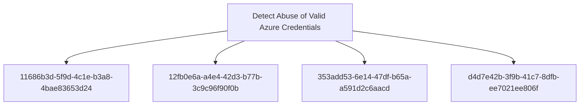

# Detect Abuse of Valid Azure Credentials

## Metadata

- **UUID**: `f4a8b3c2-7e5d-4f1a-bc8e-9d2a6e7c8f0b`
- **Schema**: `objective::1.0`
- **TLP**: clear

## Description
Detect when adversaries abuse valid Azure AD/Entra ID credentials to gain 
unauthorized access to cloud resources. This detection objective focuses on 
identifying anomalous authentication patterns, suspicious access behaviors, 
and privilege abuse that indicate compromised credentials are being used 
for malicious purposes.

Attackers obtain credentials through various means (phishing, password spraying, 
credential leaks) and use them to authenticate legitimately to Azure services, 
making detection challenging as the authentication itself appears valid. This 
objective aims to identify the contextual anomalies and behavioral indicators 
that differentiate legitimate use from credential abuse.

Key focus areas include:
- Anomalous sign-in patterns (location, device, time, velocity)
- Privilege escalation attempts post-authentication
- Unusual resource access patterns
- Service principal and application credential abuse
- Cross-tenant authentication anomalies

### Anomalous Azure AD Sign-In Patterns
Detects authentication activities to Azure AD/Entra ID that deviate from 
established baseline patterns for user accounts. This includes monitoring 
for impossible travel scenarios, sign-ins from unusual geographic locations, 
unfamiliar devices, anonymous IP addresses, or suspicious ISPs.

Key detection indicators:
- Sign-in from a geographic location where the user has never authenticated before
- Impossible travel: authentication from two distant locations within an 
  unrealistic timeframe
- Authentication from TOR exit nodes, VPN services, or anonymizing proxies
- Sign-in from a device that doesn't match the user's typical device profile
- Authentication outside normal business hours for privileged accounts
- Multiple failed authentication attempts followed by a successful login
- Sign-ins with legacy authentication protocols (bypassing MFA)

Particular attention should be paid to privileged accounts (Global Administrators, 
Security Administrators, Application Administrators) as these represent high-value 
targets for attackers.

**Methodology**: Anomaly

### Service Principal Credential Abuse
Detects suspicious activities involving Azure service principal credentials 
(client secrets, certificates). Service principals are non-human identities 
that applications use to authenticate, making them prime targets for attackers 
seeking persistent, stealthy access to Azure resources.

Detection focuses on:
- Service principal authentication from unexpected IP addresses or geographic locations
- Service principal used to access resources outside its typical scope
- Rapid enumeration of resources or permissions by a service principal
- Service principal credentials used after being added to an existing application
- Authentication using service principal secrets that were recently created or modified
- Service principal accessing multiple subscriptions or tenants (if not expected)
- High volume of API calls from a service principal in a short time period
- Service principal making privileged changes (role assignments, policy modifications)

Attackers who compromise service principal credentials can maintain long-term 
access while evading user-focused security controls like MFA. These credentials 
are often stored in code repositories, configuration files, or automation scripts 
where they can be harvested.

**Methodology**: Pattern Matching

### Privilege Escalation After Initial Access
Detects attempts to escalate privileges within Azure following successful 
authentication with valid credentials. This signal identifies when an attacker, 
after gaining initial access with compromised credentials, attempts to expand 
their privileges through role assignments, PIM activations, or exploitation 
of misconfigured permissions.

Key detection patterns:
- User account assigned to a privileged role (Global Admin, Security Admin, etc.) 
  shortly after a suspicious sign-in event
- Activation of Privileged Identity Management (PIM) roles from unusual locations 
  or devices
- User granted permissions to sensitive resources (Key Vaults, Storage Accounts) 
  that they've never accessed before
- Addition of credentials to existing applications or service principals
- Changes to Conditional Access policies that weaken security controls
- Modification of MFA settings for privileged accounts
- Creation of new service principals or applications with elevated permissions
- Assignment of directory roles that allow further privilege escalation

Temporal correlation is critical: privilege changes occurring within minutes 
to hours of anomalous authentication events represent high-confidence indicators 
of compromise. Attackers often move quickly to escalate privileges before 
defenders can respond to initial access alerts.

**Methodology**: Behavioural

### Suspicious Resource Enumeration and Access Patterns
Detects unusual patterns of resource enumeration and access that indicate 
an attacker is exploring the Azure environment to identify high-value targets 
after gaining access with valid credentials. This includes broad reconnaissance 
activities across subscriptions, resource groups, and sensitive assets.

Detection indicators:
- Rapid succession of read operations across multiple Azure resource types 
  (VMs, storage accounts, databases, key vaults) within a short timeframe
- User accessing resources they have never accessed historically
- Enumeration of all subscriptions, resource groups, or management groups 
  accessible to the compromised account
- PowerShell or Azure CLI commands used for systematic resource discovery 
  (Get-AzResource, az resource list, etc.)
- Microsoft Graph API queries to enumerate users, groups, applications, 
  service principals, or role assignments
- Access to sensitive resources (Key Vault secrets, storage account keys, 
  database connection strings) following initial authentication
- Cross-subscription resource access patterns that deviate from normal behavior
- Failed access attempts to resources followed by successful permission modifications

Attackers performing post-compromise reconnaissance typically exhibit scanning 
behaviors distinct from normal administrative activities: broader scope, higher 
velocity, and less targeted access patterns. Correlation with earlier authentication 
anomalies significantly increases detection confidence.

**Methodology**: Anomaly

## Relations

