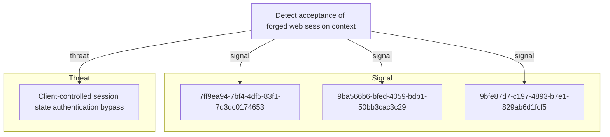

# Detect acceptance of forged web session context

## Metadata

- **UUID**: `d4c509d7-f9ab-452a-a91d-4da040095414`
- **Schema**: `objective::1.0`
- **Version**: `3`
- **Created**: `2026-05-04`
- **Modified**: `2026-05-04`
- **TLP**: clear (`TLP:CLEAR`)
- **Contributors**: Hold Security Threat Research
- **Organisation**: EC DIGIT CSOC (`56b0a0f0-b0bc-47d9-bb46-02f80ae2065a`)

## References
### Public
- **1**: [https://owasp.org/Top10/A01_2021-Broken_Access_Control/](https://owasp.org/Top10/A01_2021-Broken_Access_Control/)
- **2**: [https://owasp.org/Top10/A07_2021-Identification_and_Authentication_Failures/](https://owasp.org/Top10/A07_2021-Identification_and_Authentication_Failures/)
- **3**: [https://cwe.mitre.org/data/definitions/565.html](https://cwe.mitre.org/data/definitions/565.html)

## Description
Detect cases where an application accepts caller-supplied state as an authentication or privilege
context. The detection capability focuses on evidence that fabricated cookies, headers, or request
variables change the server-side decision from unauthenticated to authenticated or from lower to
higher privilege. It intentionally abstracts away from the exact TVM wording and frames what SOC,
application security, and continuous assurance controls need to observe.

## Objective metadata

- **Priority**: High
- **Type**: Threat
- **Investment**: Moderate
- **Composition**: Combined
- **Composition rationale**: Combine controlled validation findings with production telemetry. A single crafted-value success
can confirm exposure during testing, while production monitoring should focus on suspicious state
names, repeated state probing, and mismatches between claimed client attributes and server-side
principal resolution. Correlate by source IP, route, cookie/header name, session, claimed identity,
and resolved server-side account.

## Signals
### Fabricated session value grants protected access
Alert when controlled validation shows a protected endpoint returning successful access after a
fabricated cookie, Authorization header, or request variable is supplied. Required comparison
fields include request path, method, injected state name, response status, response size or body
fingerprint, and authentication outcome for both baseline and injected-state requests. Store
state values only as masked labels or approved test artefacts.
Triage by confirming there is no corresponding server-issued session, signed token, or login
event that legitimately explains the successful response.

- **Severity**: High
- **Methodology**: Heuristic
- **Effort**: 5
#### Data

- **Availability**: Partial
- **Requirements**: Requires an approved DAST, synthetic validation, or application security test harness capable
of replaying requests with and without selected cookies or headers. Production logs should
provide request path, response status, authentication outcome, and cookie/header names; raw
values should be masked or omitted unless explicitly approved.
- **Entities**: IP Address, URL, Session, API Call
### Client-side role or identity claim changes authorisation outcome
Alert when modifying a client-controlled identity, username, role, or feature flag changes the
authorisation decision for the same route and source context. Required fields include claimed
client attribute name, resolved server-side principal, route, response status, access decision,
and timestamp. Tune by allow-listing expected signed token claims and focusing on unsigned
cookies, plain-text headers, or application variables that should never control privilege.
Triage by comparing the claimed client-side identity or role against the server-side resolved
principal and expected authorisation policy for the route.

- **Severity**: Critical
- **Methodology**: Behavioural
- **Effort**: 6
#### Data

- **Availability**: Partial
- **Requirements**: Requires application logs that expose both claimed client-side attributes and resolved
server-side identity/role, or controlled validation records that capture the same comparison.
Cookie and header values should be redacted; retain field names, decision changes, and
non-sensitive fingerprints.
- **Entities**: Session, Authentication, Account, URL
### Session variable probing across protected routes
Alert on repeated attempts to discover accepted session variables by trying many cookie or
header names and simple values across protected routes. Useful fields include source IP, URL,
cookie/header names, response status, user-agent, and time window. Tune out legitimate browsers
by focusing on high counts of distinct state names, tooling user-agents, and repeated 401/403 to
200 response transitions without a corresponding login event.
As a starting point, investigate sources that try multiple authentication-like cookie or header
names across protected routes in a short window, especially when followed by successful access.

- **Severity**: Medium
- **Methodology**: Frequency Analysis
- **Effort**: 4
#### Data

- **Availability**: Partial
- **Requirements**: Requires request header and cookie names, source IP, URL path, response status, user-agent,
and timestamps from WAF, proxy, API gateway, or application logs. Header values can be masked;
field names and response outcomes are sufficient for this signal.
- **Entities**: IP Address, URL, Session, API Call

## Signal MDR coverage
| Signal | Downstream MDR rules |
| --- | --- |
| Fabricated session value grants protected access | _None_ |
| Client-side role or identity claim changes authorisation outcome | _None_ |
| Session variable probing across protected routes | _None_ |

## Relations

