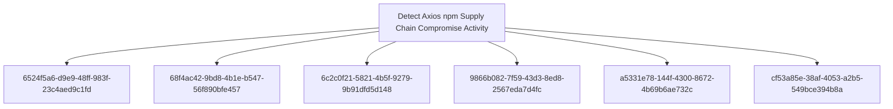

# Detect Axios npm Supply Chain Compromise Activity

## Metadata

- **UUID**: `f45b9b82-a3c5-4643-932b-debfd8739bd8`
- **Schema**: `objective::1.0`
- **TLP**: clear

## Description
This Detection Objective addresses the 31 March 2026 supply chain
compromise of the `axios` npm package, in which a hijacked
maintainer account published `axios@1.14.1` and `axios@0.30.4`
carrying a malicious transitive dependency (`plain-crypto-js@4.2.1`)
whose npm `postinstall` hook deployed a cross-platform Remote
Access Trojan tracked as `WAVESHAPER.V2` on Windows, macOS, and
Linux hosts. Google Threat Intelligence Group attributes the
activity to the DPRK-nexus actor `UNC1069`.

Detection coverage is required across three time horizons:

- **Retrospective**: identifying any developer workstation, CI
  runner, or build artefact that resolved a compromised version
  during the ~3-hour exposure window (2026-03-31 ~00:21 - ~03:20
  UTC), so that credentials and hosts can be triaged for rotation
  and reimaging.
- **Live response**: detecting active stage-2 RAT behaviour on
  hosts where the postinstall dropper executed - on-disk
  artefacts, renamed system utilities, transient script loaders,
  and outbound C2 communications to `sfrclak[.]com`.
- **Preventive**: surfacing future occurrences of the same class
  of attack (maintainer account takeover -> direct CLI publish
  bypassing OIDC / SLSA Trusted Publishing -> postinstall-based
  RAT delivery) so that npm registry telemetry and SBOM tooling
  catch the next instance, not just this one.

Critical priority is justified by the population at risk
(~100M weekly downloads on the 1.x branch alone), the named
state-nexus attribution, the cross-platform RAT capability, and
the fact that the attack does not rely on any vulnerability in
axios source code - it lives entirely in the npm publish trust
boundary, which is shared by every Node.js ecosystem consumer.

### Compromised Axios / plain-crypto-js Versions Resolved in Dependency Manifests
Inventory-level detection that any project, lockfile, SBOM,
or build artefact ever resolved a compromised version of
`axios` or any version of `plain-crypto-js`. This is the
primary signal for retrospective triage of the 3-hour
exposure window and for ongoing assurance that compromised
versions do not re-enter the supply chain (e.g. via pinned
legacy lockfiles or internal package mirrors that cached
the malicious version before takedown).

Detection criteria:

- Strings in `package-lock.json`, `yarn.lock`,
  `pnpm-lock.yaml`, `npm-shrinkwrap.json`, or generated
  SBOM (CycloneDX / SPDX) feeds matching:
    * `axios@1.14.1`
    * `axios@0.30.4`
    * any version of `plain-crypto-js`
      (the package was created solely to host the dropper
      and has no legitimate downstream use)
- Package shasum / integrity matches:
    * axios `2553649f2322049666871cea80a5d0d6adc700ca`
    * axios `d6f3f62fd3b9f5432f5782b62d8cfd5247d5ee71`
    * plain-crypto-js `07d889e2dadce6f3910dcbc253317d28ca61c766`
- Presence of `node_modules/plain-crypto-js/` on any disk
  (developer laptop, CI runner, container image layer) -
  the dropper self-deletes `setup.js` and replaces
  `package.json` with a clean stub, but the directory
  itself remains and is, on its own, a strong indicator
  that the dropper ran.

Coverage should be pushed all the way left into source
control (lockfile scanning at PR time), CI (pre-build
gating against malicious-package feeds such as OpenSSF
Malicious Packages, Aikido Intel, Socket, StepSecurity),
and into the runtime estate (file inventory across
developer endpoints).

**Methodology**: Artifacts

### Suspicious npm Postinstall Lifecycle Execution Spawning Unexpected Interpreters
Behavioural detection of the npm `postinstall` hook
executing the `setup.js` dropper. The dropper is launched
by the package manager (`npm`, `pnpm`, or `yarn` -
ultimately resolving to `node`) and then immediately
spawns OS-specific stage-1 commands to fetch and execute
the platform-appropriate stage-2 RAT.

Detection criteria:

- Process tree where the parent process is a Node.js
  binary or package manager (`node`, `node.exe`, `npm`,
  `npm.cmd`, `pnpm`, `pnpm.cmd`, `yarn`, `yarn.cmd`,
  `npx`, `corepack`) and the child process is one of:
    * `powershell.exe` (Windows stage-2)
    * `cscript.exe` / `wscript.exe`
      (Windows VBScript loader)
    * `python` / `python3` launched via `nohup` /
      `/bin/bash -c` / `/bin/sh -c` (Linux stage-2)
    * `curl` or `wget` piping into a shell or saving
      executables under `/Library/Caches/`, `/tmp/`, or
      `%PROGRAMDATA%`
    * `chmod` + `nohup` chained in a single command line
      (macOS / Linux dropper)
- Outbound HTTP POST issued from a Node.js process to a
  non-registry host within seconds of an `npm install`
  (or equivalent) command, with body containing the
  decoy markers `packages.npm.org/product0`,
  `packages.npm.org/product1`, or
  `packages.npm.org/product2`.
- File-write events from a Node.js process tree creating
  executables outside `node_modules/` and outside the
  project working directory - particularly in
  `/Library/Caches/`, `/tmp/`, or `%PROGRAMDATA%`.

This signal generalises beyond the axios incident: any
future npm supply-chain attack using the postinstall
lifecycle to deliver native payloads will exhibit the
same parent / child / file-write pattern.

**Methodology**: Behavioural

### WAVESHAPER.V2 Cross-Platform RAT On-Disk Artefacts
High-specificity file-event detection for the platform-
specific stage-2 RAT artefacts dropped by the
plain-crypto-js postinstall chain. Each branch of the
dropper writes a fixed, well-known path on its target
OS, masquerading as a legitimate system component.

### macOS
- File creation at `/Library/Caches/com.apple.act.mond`
  (Mach-O binary, masquerading as an Apple system daemon
  per `T1036.005`).
- SHA-256:
  `92ff08773995ebc8d55ec4b8e1a225d0d1e51efa4ef88b8849d0071230c9645a`
- Any new executable under `/Library/Caches/` named to
  look like an Apple-signed cache daemon should be
  treated as suspicious by default.

### Windows
- File creation at `%PROGRAMDATA%\wt.exe`. The file
  content matches `powershell.exe` byte-for-byte (the
  dropper copies the system PowerShell binary into a
  new location to defeat naive name-based detection -
  per `T1036.003`).
- Transient files in `%TEMP%`:
  `%TEMP%\6202033.vbs`, `%TEMP%\6202033.ps1`.
- PowerShell stage-2 SHA-256:
  `617b67a8e1210e4fc87c92d1d1da45a2f311c08d26e89b12307cf583c900d101`

### Linux
- File creation at `/tmp/ld.py`.
- SHA-256:
  `fcb81618bb15edfdedfb638b4c08a2af9cac9ecfa551af135a8402bf980375cf`

### Cross-platform
- Presence of the `node_modules/plain-crypto-js/`
  directory (the dropper self-deletes `setup.js` and
  rewrites `package.json` to a clean stub, but the
  directory itself persists).

Detection should fire on file creation, not only on
file presence, so that hosts which received but later
cleaned the artefact are still surfaced.

**Methodology**: Artifacts

### Renamed PowerShell + Transient VBScript Loader from Node.js Process Tree (Windows)
Windows-specific behavioural detection for the
distinctive stage-2 chain used by `WAVESHAPER.V2`. The
dropper:

1. Locates `powershell.exe` and copies it to
   `%PROGRAMDATA%\wt.exe` (masquerade as Windows
   Terminal).
2. Writes `%TEMP%\6202033.vbs` (the VBScript loader).
3. Executes the VBScript via the renamed PowerShell
   with hidden / bypass flags (`-w h`, `-ep bypass`,
   `-enc`, etc.).
4. The VBScript fetches a PowerShell-based RAT script
   from `sfrclak[.]com:8000/6202033`, executes it
   in-memory with `[scriptblock]::Create([Encoding]::UTF8.GetString(...))`,
   and self-deletes.

Detection criteria:

- `wt.exe` running from `%PROGRAMDATA%\` whose parent
  process belongs to the npm process tree (`node.exe`,
  `npm.cmd`, `pnpm.cmd`, `yarn.cmd`).
- `wt.exe` whose file content / SHA-256 matches that
  of `powershell.exe` on the same host (high-fidelity
  masquerade indicator).
- `cscript.exe` or `wscript.exe` invoked on a path
  matching `%TEMP%\6202033.vbs` or any
  `%TEMP%\<digits>.vbs` from a Node.js process tree.
- PowerShell command lines combining
  `Invoke-WebRequest -UseBasicParsing`,
  `-Method POST -Body`, and the literal string
  `packages.npm.org/product1` (the Windows stage-2
  marker), particularly when launched with hidden
  window / encoded-command flags.
- `start /min powershell -w h` patterns spawned by
  Node-tree processes.

These patterns directly correspond to GTIG's
`G_Hunting_Downloader_suspected_UNC1069_PS_1` YARA
signal logic.

**Methodology**: Behavioural

### WAVESHAPER.V2 C2 Communication to sfrclak[.]com
Network-level detection of the `WAVESHAPER.V2` command-
and-control channel. All three OS-specific RAT
implementations share the same C2 protocol, host, and
beacon characteristics, so a single network signal
covers Windows, macOS, and Linux infections.

Detection indicators:

- DNS queries for `sfrclak[.]com` (or any subdomain).
- Outbound TCP connections to `142.11.206.73:8000`.
- HTTP POSTs to
  `http://sfrclak[.]com:8000/6202033` (campaign ID
  `6202033`) or to any path on `sfrclak[.]com`.
- Distinctive User-Agent header
  `mozilla/4.0 (compatible; msie 8.0; windows nt 5.1; trident/4.0)`
  (deliberately anachronistic) - high fidelity, low
  false-positive rate even outside this campaign.
- HTTP POST body containing decoy markers
  `packages.npm.org/product0`,
  `packages.npm.org/product1`, or
  `packages.npm.org/product2` leaving any process
  other than a legitimate npm client.
- Beacon-pattern traffic at ~60-second intervals with
  Base64-encoded JSON bodies.
- Suspected adjacent UNC1069 infrastructure on the
  same ASN: `23.254.167.216` (lower-confidence
  enrichment indicator).

This is the highest-fidelity confirmation of an
active RAT and should be treated as Critical
regardless of host-side signals.

**Methodology**: Pattern Matching

### NPM Publisher Email or SLSA Provenance Regression on Critical Packages
Preventive detection that surfaces the registry-side
precondition exploited in the axios attack: the
legitimate maintainer's account was hijacked, the
registered email was silently changed to
`ifstap@proton.me`, and the malicious releases were
published from a CLI without GitHub Actions OIDC and
without SLSA provenance, even though all prior
legitimate releases on the same package had OIDC +
provenance attestations going back to 2023.

Detection criteria, evaluated per package against npm
registry metadata (`registry.npmjs.org/<pkg>`):

- Maintainer email change on a critical package
  between two consecutive published versions.
- New version published without SLSA provenance
  attestation when the previous N versions on the
  same dist-tag had provenance.
- New version published via direct CLI (`_npmUser`
  present, no `_attestations` field) when the
  publishing workflow is supposed to use OIDC
  Trusted Publishing.
- Sudden tag flip (`latest`, `legacy`) to a version
  with materially different maintainer / provenance
  metadata than the previous tagged version.
- Optional enrichment: cross-reference with the
  OpenSSF Malicious Packages feed
  (the axios incident was flagged as
  `MAL-2026-2307`).

This signal is medium severity in isolation (false
positives include legitimate maintenance handovers
and CI workflow changes) but high value when
compounded across the dependency tree of an
organisation's "critical" packages list.

It also enables enforcing a configurable minimum
package age (e.g. `npm config set min-release-age 3`)
that would have prevented `plain-crypto-js@4.2.1`
from being pulled into builds during the 18-hour
window in which it was the most recent published
version.

**Methodology**: Anomaly

## Relations

