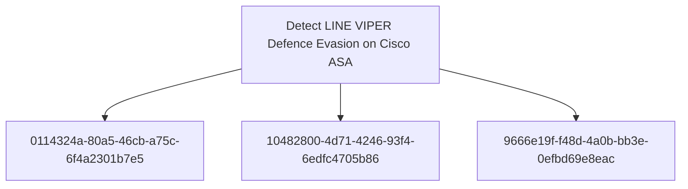

# Detect LINE VIPER Defence Evasion on Cisco ASA

## Metadata

- **UUID**: `7c0f2788-690e-4d34-b9eb-5f76e7363ccc`
- **Schema**: `objective::1.0`
- **TLP**: clear

## Description
This detection objective addresses the defence evasion and anti-
forensic capabilities of the LINE VIPER implant on Cisco ASA devices,
specifically the AAA authentication bypass, syslog message
suppression, and system integrity check manipulation.

LINE VIPER operates as a memory-resident implant within the lina
binary and hooks multiple subsystems to suppress evidence of its
presence and operations. These capabilities collectively reduce the
security telemetry available from a compromised ASA device, making
detection through conventional log analysis unreliable.

Detection must therefore focus on identifying the ABSENCE of expected
telemetry (authentication logs for established connections, expected
syslog messages) as well as inconsistencies in Cisco ASA integrity
check outputs compared to out-of-band verification.

This is a high-investment objective requiring collection of Cisco
ASA syslog at high fidelity, establishment of behavioural baselines,
and integration of out-of-band integrity verification processes.

### Cisco ASA Authentication Log Gap for Established Network Connections
Detects the absence of expected Cisco ASA AAA authentication
syslog events for network connections that are otherwise visible
in traffic logs, indicating LINE VIPER's AAA bypass capability
is suppressing authentication records [1].

LINE VIPER hooks AAA processing in lina to allow actor-
controlled devices to connect without generating authentication
logs. In normal operation, all connections requiring
authentication generate syslog events (e.g., `%ASA-6-113015`,
`%ASA-6-113005`, `%ASA-6-713228` for VPN authentication).

Detection approach (negative signal / log gap):
- Establish baseline of expected authentication syslog message
  types and volumes per Cisco ASA device
- Correlate established VPN sessions or management connections
  (visible in `%ASA-6-602303` ISAKMP or NetFlow) against
  corresponding authentication syslog events
- Alert when connections are established or sustained without
  corresponding AAA authentication success or failure events
- Monitor for sustained periods (>10 minutes) of network
  activity from an external IP to the ASA without any
  associated authentication log entries

This is a statistical/absence-based signal. Tuning requires
a well-established baseline. Note that some connections (e.g.,
pre-shared key VPNs configured without AAA) may legitimately
lack authentication logs — these must be documented and
excluded.

**Methodology**: Anomaly

### Anomalous Reduction in Cisco ASA Syslog Message Volume
Detects statistical anomalies in Cisco ASA syslog output volume
or message type distribution that may indicate LINE VIPER's
syslog suppression capability is filtering specific message
categories to conceal malicious activity [1].

LINE VIPER suppresses specific syslog messages on the
compromised ASA device. This manifests as an unexpected drop
in the volume of particular syslog message types (e.g.,
authentication events, connection events, crypto events) while
the device continues to process traffic.

Detection criteria:
- Statistical baseline deviation: syslog message volume for
  specific facility/severity combinations drops below a defined
  threshold relative to observed traffic volume on the device
- Absence of expected recurring syslog message types during
  periods of known device activity (e.g., no `%ASA-6-302013`
  TCP connection events during periods with confirmed TCP flows)
- Sudden reduction in aggregate syslog event rate from an ASA
  device without a corresponding reduction in handled traffic
  or known maintenance window
- Disappearance of specific message IDs that were previously
  consistently present in the syslog stream

This signal requires a well-established baseline syslog profile
per device. Syslog gaps caused by network issues between the
ASA and syslog server must be distinguished from in-device
suppression through cross-validation with alternative telemetry.

**Methodology**: Statistical

### Cisco ASA System Integrity Check Result Inconsistency
Detects divergence between Cisco ASA on-device system integrity
check results and out-of-band verification of device image
integrity, indicating LINE VIPER has patched the integrity
checking mechanism to return falsely clean results [1].

LINE VIPER patches Cisco ASA system integrity checks within
the lina binary to return results indicating the device is
uncompromised, even when malicious modifications are present
in memory or on disk. This means the standard `show
version` or Cisco's ROMMON integrity verification may report
a clean state on a compromised device.

Detection approach:
- Collect Cisco ASA integrity check results via standard
  management interfaces (`show version`, `verify /sha-512
  <image>`, Cisco Trust Anchor Technologies where available)
- Independently verify image integrity by extracting the boot
  image hash via out-of-band access (ROMMON/console) or
  comparing against Cisco Software Checker hashes for the
  specific firmware version
- Alert on any discrepancy between on-device integrity check
  output and independently computed reference hashes
- Monitor for changes in integrity check output format or
  unexpectedly clean results following known indicators of
  compromise on the device

Given that LINE VIPER targets firmware versions 9.12(4)67
and 9.14(4)24, these specific versions warrant priority
integrity verification when detected in the environment.

**Methodology**: Artifacts

## Relations

