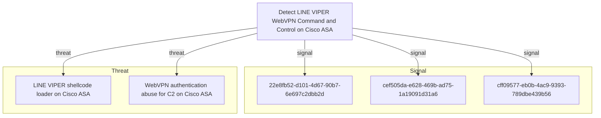

# Detect LINE VIPER WebVPN Command and Control on Cisco ASA

## Metadata

- **UUID**: `8546b0d8-c9e1-4a51-bf64-2b93c4159ebf`
- **Schema**: `objective::1.0`
- **Version**: `1`
- **Created**: `2026-06-18`
- **Modified**: `2026-06-18`
- **TLP**: clear (`TLP:CLEAR`)
- **Organisation**: EC DIGIT CSOC (`56b0a0f0-b0bc-47d9-bb46-02f80ae2065a`)

## References
### Public
- **1**: [https://www.ncsc.gov.uk/static-assets/documents/malware-analysis-reports/RayInitiator-LINE-VIPER/ncsc-mar-rayinitiator-line-viper.pdf](https://www.ncsc.gov.uk/static-assets/documents/malware-analysis-reports/RayInitiator-LINE-VIPER/ncsc-mar-rayinitiator-line-viper.pdf)

## Description
This detection objective targets the WebVPN-based command and control
channel used by the LINE VIPER implant on compromised Cisco ASA
devices. LINE VIPER abuses legitimate WebVPN client authentication
endpoints to deliver tasking payloads and receive exfiltrated data,
blending malicious traffic with expected VPN authentication flows.

The initial LINE VIPER shellcode delivery also exploits this same
WebVPN authentication mechanism: a crafted authentication request
embedding a partial PKCS7 certificate followed by shellcode triggers
the handler installed by the RayInitiator bootkit in the lina binary.

Detection is particularly challenging because the C2 channel uses
standard HTTPS on port 443 with valid WebVPN endpoint paths and
plausible XML request structures. Detection requires deep inspection
of WebVPN authentication traffic patterns, certificate artefact
analysis, and behavioural anomaly detection on the ASA device.

Detection investment is Major given the requirement for HTTPS
inspection capabilities, Cisco ASA syslog telemetry at the required
fidelity, and the need for network forensics tooling to analyse
encrypted traffic patterns against baseline WebVPN behaviour.

## Objective metadata

- **Priority**: Critical
- **Type**: Threat
- **Investment**: Major
- **Composition**: Combined
- **Composition rationale**: Detection strategy combines network-based inspection of WebVPN
authentication requests with host-based behavioural anomalies
observable via Cisco ASA syslog telemetry.

Primary approach focuses on three complementary angles:

1. **Certificate Artefact Detection**: WebVPN authentication
   requests from LINE VIPER include a partial PKCS7 certificate
   followed by shellcode. Network inspection should identify
   authentication requests where the certificate field is
   malformed, truncated, or does not constitute a valid X.509
   certificate chain. The presence of executable-like byte
   sequences following the certificate boundary is a strong
   indicator.

2. **XML Payload Anomaly Detection**: Tasking requests embed
   operator commands within device-type or related XML form
   elements. Baseline WebVPN authentication traffic carries
   short, predictable values in these fields. Statistically
   anomalous field lengths, encoding patterns, or encrypted
   blobs in these positions warrant investigation.

3. **Response Pattern Analysis**: LINE VIPER responses to WebVPN
   C2 queries return data embedded in the `message` XML element,
   which is atypical for legitimate authentication denials or
   success responses. Detection of non-standard content in WebVPN
   XML response message elements from the ASA device provides
   high-fidelity signal.

Signals should be correlated per source IP and per device to
distinguish individual attacker sessions from background noise.
Correlation with ICMP/TCP anomalies (see companion DOM) increases
confidence.

## Signals
### Malformed PKCS7 Certificate in WebVPN Authentication Request
Detects WebVPN client authentication requests to a Cisco ASA
device where the certificate field contains a malformed or
partial PKCS7 structure, consistent with the LINE VIPER initial
shellcode delivery mechanism [1].

LINE VIPER is loaded via a crafted authentication request that
embeds a partial PKCS7 certificate immediately followed by
shellcode. A valid PKCS7/CMS structure has well-defined ASN.1
DER boundaries; a partial or truncated structure followed by
non-DER bytes is structurally invalid.

Detection approach:
- Monitor HTTPS POST requests to Cisco ASA WebVPN endpoints
  (typically `/+webvpn+/index.html`, `/CACHE/`, or equivalent
  authentication paths)
- Inspect the body for `config-auth` XML elements containing
  certificate data in forms fields
- Flag certificate fields that begin with a valid PKCS7/CMS
  DER header (0x30 0x82 or 0x30 0x80) but are truncated or
  followed by non-DER byte sequences
- Alert on WebVPN auth requests where certificate payload size
  is anomalously large (shellcode appended after partial cert)

This signal requires TLS inspection or out-of-band network
visibility (e.g., mirrored traffic, firewall deep inspection).

- **Severity**: Critical
- **Methodology**: Pattern Matching
- **Effort**: 7
#### Data

- **Availability**: Partial
- **Requirements**: - HTTPS/TLS inspection or mirrored network traffic to Cisco
  ASA WebVPN interface
- Network-level packet capture or inline inspection capability
  with certificate field parsing
- Firewall or proxy logs with request body inspection enabled

Preferred log sources:
- NGFW/IDS with SSL inspection (Cisco FTD, Palo Alto, etc.)
- Network TAP or SPAN port capture feeding Suricata/Zeek
- Cisco ASA firewall logs with extended logging enabled
- **Entities**: IP Address, URL, Certificate, Network Connection
### Anomalous XML Payload in WebVPN Authentication Form Elements
Detects WebVPN authentication requests where standard XML form
elements carry anomalously large, encoded, or encrypted payloads
inconsistent with legitimate VPN client authentication [1].

LINE VIPER embeds operator tasking data within device-type or
similar XML form fields of the WebVPN authentication request.
Legitimate WebVPN clients send short, predictable values in
these fields (e.g., device type strings of 5-30 characters).
Attacker-controlled requests embed base64-encoded or encrypted
blobs of significantly larger size.

Detection criteria:
- WebVPN XML `config-auth` requests where `device-type`,
  `platform`, or `opaque` elements exceed a defined size
  threshold (e.g., >512 bytes) or contain high-entropy content
- Requests with `aggregate-auth-version="2"` header but
  device-type field values that do not match known VPN client
  vendor strings
- Repeated WebVPN authentication attempts from the same source
  IP with varying large payloads in form fields (C2 tasking
  sessions)
- Authentication requests with Content-Type set to
  `application/x-www-form-urlencoded` but body conforming to
  XML rather than URL-encoded format

Baseline of legitimate WebVPN authentication traffic is required
to tune thresholds and reduce false positives from non-standard
VPN clients.

- **Severity**: High
- **Methodology**: Anomaly
- **Effort**: 6
#### Data

- **Availability**: Partial
- **Requirements**: - HTTPS inspection with WebVPN request body parsing
- Cisco ASA WebVPN authentication logs (syslog facility)
- Baseline of legitimate WebVPN authentication traffic patterns
- Ability to inspect XML body content of HTTPS POST requests

Preferred log sources:
- Cisco ASA syslog (authentication events, WebVPN session logs)
- NGFW with application layer inspection for WebVPN traffic
- Zeek HTTP/TLS logs with body extraction enabled
- Intrusion Detection System with custom WebVPN signatures
- **Entities**: IP Address, URL, Network Connection, Authentication
### Non-Standard Content in Cisco ASA WebVPN Authentication Response
Detects Cisco ASA WebVPN authentication responses that embed
data in the XML `message` element in a manner inconsistent with
legitimate authentication outcomes [1].

LINE VIPER exfiltrates task results by returning them embedded
within the `message` element of the WebVPN XML authentication
response. Legitimate ASA authentication responses contain
human-readable error or status strings in this field (e.g.,
"Authentication failed", "Please enter credentials"). Attacker-
controlled responses will contain base64-encoded or encrypted
data blobs.

Detection criteria:
- WebVPN authentication responses (HTTP 200 OK) where the
  `message` XML element contains high-entropy, non-printable,
  or base64-like content
- Response `message` field length significantly exceeding
  baseline for authentication status messages (>200 bytes
  without expected authentication UI text)
- Responses including standard security headers
  (X-Frame-Options, Strict-Transport-Security) alongside an
  anomalous `message` element — legitimate denials typically
  include only basic HTML error pages
- Asymmetric session patterns: multiple auth requests from the
  same IP that generate non-standard XML responses rather than
  standard redirect or HTML authentication pages

Requires visibility into outbound ASA HTTPS responses, achievable
via inline inspection or traffic mirroring.

- **Severity**: High
- **Methodology**: Anomaly
- **Effort**: 7
#### Data

- **Availability**: Not Available
- **Requirements**: - Outbound HTTPS response inspection for Cisco ASA WebVPN
  traffic (requires TLS inspection or traffic mirroring)
- Ability to parse and analyse XML response bodies from ASA
- Baseline corpus of legitimate ASA WebVPN response patterns

Preferred log sources:
- Network TAP/SPAN with inline TLS inspection
- NGFW with SSL decryption and response body inspection
- Zeek SSL/TLS logs with response body extraction
- **Entities**: IP Address, Network Connection, URL, Hostname

## Signal MDR coverage
| Signal | Downstream MDR rules |
| --- | --- |
| Malformed PKCS7 Certificate in WebVPN Authentication Request | _None_ |
| Anomalous XML Payload in WebVPN Authentication Form Elements | _None_ |
| Non-Standard Content in Cisco ASA WebVPN Authentication Response | _None_ |

## Relations

