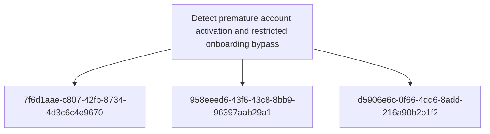

# Detect premature account activation and restricted onboarding bypass

## Metadata

- **UUID**: `3a73c153-abd7-40cd-86a5-4d57a42b9a44`
- **Schema**: `objective::1.0`
- **TLP**: clear

## Description
Detect account lifecycle control failures where an identity becomes usable before the intended
approval, invitation, or eligibility gate is complete. The capability is broader than a single
registration endpoint: it correlates account creation, approval state, password reset, token
issuance, and first resource access. This gives analysts a lifecycle view of onboarding bypass
rather than a simple route-hit alert.

### Account created without required invitation or approval context
Alert when a registration endpoint creates an account without a valid invitation, approved
domain, reviewer approval, or expected onboarding source. Required fields include account ID,
registration path, source IP, tenant/environment, invitation or approval identifier, account
state, and initial role. Tune out legitimate self-service flows by comparing with a maintained
list of public registration routes and approved domains.
Triage by confirming the expected onboarding policy for the tenant or application module and
verifying whether an invitation, reviewer action, or domain eligibility check existed.

**Methodology**: Event Search

### Authentication material issued while account approval is pending
Alert when password reset, login, session creation, or token issuance succeeds for an account
whose lifecycle state is pending, unapproved, unverified, pending invitation validation, or
otherwise not allowed to authenticate. Required fields include account ID, lifecycle state at
decision time, reset outcome, token/session identifier, source IP, and timestamp. This is the
principal signal that a provisioned but unapproved account has become usable.
Triage by preserving the account lifecycle state at decision time and confirming whether the
password reset, login, or token service incorrectly ignored that state.

**Methodology**: Event Search

### Pre-approval account accesses restricted application resources
Alert when a newly created account accesses UI pages or APIs before approval, invitation
validation, or domain eligibility checks are complete. Required fields include account ID,
account creation time, approval state, request path, response status, role, source IP, and
first-access timestamp. Prioritise access to restricted modules, internal data, administrative
paths, or endpoints that should require an established trusted account.
Triage by comparing first-access time with approval and activation timestamps, then assessing
which data or functions were exposed before the account became eligible.

**Methodology**: Behavioural

## Relations

