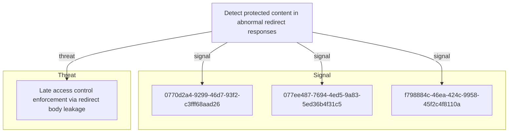

# Detect protected content in abnormal redirect responses

## Metadata

- **UUID**: `f8a95fcf-c5b0-4db0-bb8b-78e4edaa0544`
- **Schema**: `objective::1.0`
- **Version**: `3`
- **Created**: `2026-03-30`
- **Modified**: `2026-05-04`
- **TLP**: clear (`TLP:CLEAR`)
- **Contributors**: Hold Security Threat Research
- **Organisation**: EC DIGIT CSOC (`56b0a0f0-b0bc-47d9-bb46-02f80ae2065a`)

## References
### Public
- **1**: [https://owasp.org/Top10/A01_2021-Broken_Access_Control/](https://owasp.org/Top10/A01_2021-Broken_Access_Control/)
- **2**: [https://cwe.mitre.org/data/definitions/284.html](https://cwe.mitre.org/data/definitions/284.html)

## Description
Identify access-control defects where redirect responses carry more content than a redirect
should reasonably contain. This objective is not a one-to-one restatement of the upstream threat
vector; it defines the detection capability around abnormal HTTP response semantics, protected
route access patterns, and differential validation of unauthenticated requests. The capability is
useful for reverse proxies, WAFs, API gateways, and synthetic validation jobs that can observe
response status, size, headers, and route sensitivity.

## Objective metadata

- **Priority**: High
- **Type**: Threat
- **Investment**: Moderate
- **Composition**: Combined
- **Composition rationale**: Combine response-shape anomalies with request context. Oversized 302 responses are a strong
exposure indicator, but confidence increases when the same source repeatedly probes restricted
routes or when controlled validation confirms that body content differs materially from a normal
login redirect. Correlate on source IP, requested URL, route sensitivity, response status, body
byte count, and follow-up requests.

## Signals
### Large 302 response body on protected route
Alert when an HTTP 302 response from an authenticated or role-restricted route has an unusually
large response body. Required fields include request path, response status, response body bytes
or Content-Length, source IP, user/session state if present, and route classification. Tune the
threshold against known login redirects and application-specific templates; a practical starting
point is to alert on 302 responses whose body size is above the normal redirect baseline for the
same application or route family.
Triage by confirming route sensitivity, comparing against normal redirect templates, and
capturing minimal request/response evidence for the application owner without storing protected
body content.

- **Severity**: High
- **Methodology**: Anomaly
- **Effort**: 3
#### Data

- **Availability**: Partial
- **Requirements**: Requires web server, reverse proxy, WAF, API gateway, or load balancer logs that record status
code and response body size. Route sensitivity metadata or a maintained list of protected URL
patterns improves fidelity. Response bodies should not be logged in production unless a
controlled validation process explicitly permits capture.
- **Entities**: Network Connection, URL, IP Address
### Restricted route enumeration through repeated redirects
Alert when a source repeatedly requests distinct authenticated or role-restricted URLs and
receives 302 redirects without completing a normal authentication flow. Required fields include
source IP, request path, response status, user-agent, redirect Location, and timestamp. Tune out
normal unauthenticated browsing by requiring multiple distinct protected paths, no successful
login event for the same source/session, or abnormal tooling indicators.
As a non-normative starting point, investigate three or more distinct restricted routes from the
same source within a short window when no successful authentication event follows.

- **Severity**: Medium
- **Methodology**: Frequency Analysis
- **Effort**: 4
#### Data

- **Availability**: Partial
- **Requirements**: Requires web, WAF, or proxy logs that include client IP, URL path, response status, user-agent,
and timestamp. Authentication events or session telemetry improve tuning by distinguishing
legitimate login redirects from automated probing.
- **Entities**: IP Address, URL, Network Connection
### Redirect body differs from expected unauthenticated template
Use controlled synthetic checks to compare unauthenticated requests to protected routes against
a known-safe redirect template. Alert when the response body contains route-specific strings,
tables, user data markers, internal navigation elements, or other protected-page artefacts
rather than the expected minimal redirect body. This is a continuous assurance signal rather
than a production log-only signal.
Triage by comparing the body fingerprint against the approved unauthenticated redirect template
and validating that any exposed markers map to protected application content.

- **Severity**: High
- **Methodology**: Heuristic
- **Effort**: 5
#### Data

- **Availability**: Partial
- **Requirements**: Requires an approved synthetic testing harness or DAST process that can issue unauthenticated
requests without following redirects and compare status, headers, body length, and selected
non-sensitive content fingerprints. Store only hashes, fingerprints, or minimal excerpts needed
to prove exposure.
- **Entities**: URL, Session, API Call

## Signal MDR coverage
| Signal | Downstream MDR rules |
| --- | --- |
| Large 302 response body on protected route | _None_ |
| Restricted route enumeration through repeated redirects | _None_ |
| Redirect body differs from expected unauthenticated template | _None_ |

## Relations

