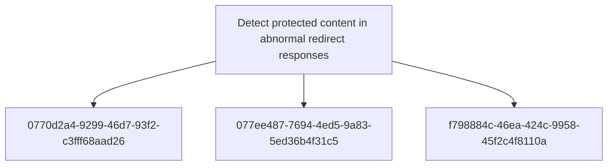

# Detect protected content in abnormal redirect responses

## Metadata

- **UUID**: `f8a95fcf-c5b0-4db0-bb8b-78e4edaa0544`
- **Schema**: `objective::1.0`
- **TLP**: clear

## Description
Identify access-control defects where redirect responses carry more content than a redirect
should reasonably contain. This objective is not a one-to-one restatement of the upstream threat
vector; it defines the detection capability around abnormal HTTP response semantics, protected
route access patterns, and differential validation of unauthenticated requests. The capability is
useful for reverse proxies, WAFs, API gateways, and synthetic validation jobs that can observe
response status, size, headers, and route sensitivity.

### Large 302 response body on protected route
Alert when an HTTP 302 response from an authenticated or role-restricted route has an unusually
large response body. Required fields include request path, response status, response body bytes
or Content-Length, source IP, user/session state if present, and route classification. Tune the
threshold against known login redirects and application-specific templates; a practical starting
point is to alert on 302 responses whose body size is above the normal redirect baseline for the
same application or route family.
Triage by confirming route sensitivity, comparing against normal redirect templates, and
capturing minimal request/response evidence for the application owner without storing protected
body content.

**Methodology**: Anomaly

### Restricted route enumeration through repeated redirects
Alert when a source repeatedly requests distinct authenticated or role-restricted URLs and
receives 302 redirects without completing a normal authentication flow. Required fields include
source IP, request path, response status, user-agent, redirect Location, and timestamp. Tune out
normal unauthenticated browsing by requiring multiple distinct protected paths, no successful
login event for the same source/session, or abnormal tooling indicators.
As a non-normative starting point, investigate three or more distinct restricted routes from the
same source within a short window when no successful authentication event follows.

**Methodology**: Frequency Analysis

### Redirect body differs from expected unauthenticated template
Use controlled synthetic checks to compare unauthenticated requests to protected routes against
a known-safe redirect template. Alert when the response body contains route-specific strings,
tables, user data markers, internal navigation elements, or other protected-page artefacts
rather than the expected minimal redirect body. This is a continuous assurance signal rather
than a production log-only signal.
Triage by comparing the body fingerprint against the approved unauthenticated redirect template
and validating that any exposed markers map to protected application content.

**Methodology**: Heuristic

## Relations

