# Detect Shai-Hulud npm and PyPI Supply Chain Compromise Activity

## Metadata

- **UUID**: `fb62e879-9e91-4c5b-aaa7-999b2b1b3897`
- **Schema**: `objective::1.0`
- **Version**: `1`
- **Created**: `2026-06-16`
- **Modified**: `2026-06-16`
- **TLP**: clear (`TLP:CLEAR`)
- **Organisation**: EC DIGIT CSOC (`56b0a0f0-b0bc-47d9-bb46-02f80ae2065a`)

## References
### Public
- **1**: [https://www.wiz.io/blog/mini-shai-hulud-strikes-again-tanstack-more-npm-packages-compromised](https://www.wiz.io/blog/mini-shai-hulud-strikes-again-tanstack-more-npm-packages-compromised)
- **2**: [https://www.aikido.dev/blog/mini-shai-hulud-is-back-tanstack-compromised](https://www.aikido.dev/blog/mini-shai-hulud-is-back-tanstack-compromised)
- **3**: [https://tanstack.com/blog/npm-supply-chain-compromise-postmortem](https://tanstack.com/blog/npm-supply-chain-compromise-postmortem)
- **4**: [https://www.stepsecurity.io/blog/mini-shai-hulud-is-back-a-self-spreading-supply-chain-attack-hits-the-npm-ecosystem](https://www.stepsecurity.io/blog/mini-shai-hulud-is-back-a-self-spreading-supply-chain-attack-hits-the-npm-ecosystem)

## Description
This Detection Objective addresses the May 2026 Shai-Hulud / mini
Shai-Hulud supply-chain campaign affecting npm and PyPI packages
including the `@tanstack/*`, `@uipath/*`, and `@mistralai/*`
namespaces and PyPI packages `guardrails-ai` and `mistralai`.

Malicious package versions execute during install lifecycle hooks,
harvest CI/CD, cloud, Vault, Kubernetes, and registry credentials,
exfiltrate over redundant channels (`git-tanstack[.]com`, Session
messenger, GitHub dead drops), and self-propagate by republishing
trojanised versions of other packages the victim maintains.

Detection coverage spans three time horizons:

- **Retrospective**: lockfile / SBOM / registry metadata proving an
  affected version was ever resolved, plus on-disk indicator files.
- **Live response**: install-time process anomalies, bulk secret-file
  access, outbound exfiltration, and `gh-token-monitor` persistence on
  developer endpoints.
- **Cloud / identity**: anomalous GitHub repository or workflow
  creation, package publishes outside baseline CI identities, and
  dead-drop repository markers in audit telemetry.

Critical priority reflects worm-like propagation, broad ecosystem
reach (TanStack Router alone ~12M weekly downloads), and destructive
token-revocation behaviour on compromised developer laptops.

## Objective metadata

- **Priority**: Critical
- **Type**: Threat
- **Investment**: Significant
- **Composition**: Combined
- **Composition rationale**: Signals span inventory, endpoint behavioural detection, cloud audit
anomalies, and high-fidelity IOC matching. Combine per host,
repository, or CI runner entity so that multiple signals firing in
the same time window escalate to a single incident.

Operational guidance:

1. **Indicator signal** (Signal 7) and **inventory checks** against
   advisories give the fastest confirmation of exposure.
2. **Install-time child process anomaly** (Signal 1) confirms the
   lifecycle hook actually executed in a given environment.
3. **Secret-file access followed by egress** (Signal 2) and **bulk
   credential scanning** (Signal 3) confirm post-install stealer
   behaviour.
4. **GitHub repo / workflow creation** (Signal 4) and **anomalous
   publish context** (Signal 5) surface worm propagation in cloud
   audit logs even when endpoint telemetry is incomplete.
5. **Large encoded outbound HTTP** (Signal 6) provides network-
   level corroboration for exfiltration channels.

Treat any host that resolved a listed compromised version during
the exposure window as potentially compromised: rotate all
reachable credentials, remove persistence before token revocation,
and regenerate lockfiles from a clean baseline.

## Signals
### Package Manager Install Spawning Unexpected Download or Scripting Child Processes
Behavioural detection of npm, pnpm, yarn, pip, or Bun install
processes spawning unexpected child processes consistent with
Shai-Hulud lifecycle-hook delivery (`preinstall`, `prepare`,
`postinstall`).

Detection criteria:

- Parent process is a package manager or Node runtime (`node`,
  `node.exe`, `npm`, `npm.cmd`, `pnpm`, `pnpm.cmd`, `yarn`,
  `yarn.cmd`, `npx`, `corepack`, `pip`, `pip3`, `python`,
  `python3`) with command line containing `install`, `ci`, `add`,
  or `update`.
- Child process within 120 seconds is one of:
    * `curl`, `wget`, `bash`, `sh`, `zsh` (download / pipe to
      shell patterns)
    * `bun`, `bun.exe` (UiPath wave downloads Bun runtime)
    * `python`, `python3` executing a remote `.pyz` (PyPI wave)
    * `powershell.exe` with hidden-window or bypass flags
- File-write from the install process tree creating
  `router_init.js`, `setup.mjs`, `router_runtime.js`, or
  `tanstack_runner.js` outside a transient cache directory.
- Command lines referencing orphan git dependency
  `github:tanstack/router#79ac49ee` or `git-tanstack`.

False positives: legitimate postinstall scripts (native module
compilation, `husky`, `esbuild` binary fetch). Tune with
allowlists for known-good packages and CI image baselines;
elevate when combined with secret-file access or IOC domains.

- **Severity**: High
- **Methodology**: Behavioural
- **Effort**: 4
#### Data

- **Availability**: Partial
- **Requirements**: - Process execution telemetry with parent-child relationships
  and full command lines
- File-create events attributable to initiating process
- Optional: EDR network module tied to process tree

Preferred log sources:
- Microsoft Defender for Endpoint `DeviceProcessEvents`,
  `DeviceFileEvents`
- Sysmon Event ID 1 and 11 (Windows)
- Linux auditd / macOS Endpoint Security framework
- **Entities**: Process, Command Line, File, Hostname
### Developer Secret-File Access Followed by Outbound Network Egress
Behavioural correlation detecting a process that reads common
developer secret locations and initiates outbound network
connections within a short window — the core stealer pattern
reported across npm and PyPI variants.

Detection criteria:

- File-read or open events on paths matching (case-insensitive):
    * `.npmrc`, `.env`, `.env.local`, `.env.production`
    * `.git-credentials`, `.gitconfig` (credential helpers)
    * `id_rsa`, `id_ed25519`, `*.pem` under `~/.ssh/`
    * `.aws/credentials`, `.azure/`, `.config/gcloud/`
    * Kubernetes `serviceaccount` token paths
    * Vault token files / `~/.vault-token`
    * `~/.docker/config.json`
- Followed within 5 minutes by outbound TCP/HTTP from the same
  process or its descendants to:
    * `git-tanstack[.]com` or `83.142.209[.]194`
    * `*.getsession.org` (Session exfiltration channel)
    * `api.github.com` creating repositories (dead-drop path)
- Initiating process tree rooted in `node`, `npm`, `pnpm`,
  `python`, or `bun` during or shortly after package install.

False positives: legitimate CI secret injection, cloud SDK
tooling, and developer utilities (e.g. `gh auth login`). Scope to
developer laptops and build agents; require multiple secret paths
or IOC destination for higher fidelity.

- **Severity**: High
- **Methodology**: Behavioural
- **Effort**: 5
#### Data

- **Availability**: Partial
- **Requirements**: - File-access telemetry with process attribution
- Outbound network connections with initiating process context
- Time-synchronised correlation capability (SIEM or Advanced
  Hunting joins)

Preferred log sources:
- Defender `DeviceFileEvents` + `DeviceNetworkEvents`
- Sysmon Event ID 11 / 23 and Event ID 3
- EDR combined process-network correlation
- **Entities**: Process, File, IP Address, URL, Network Connection, Hostname
### Bulk Credential-Candidate File Access on Developer or CI Hosts
Statistical / anomaly detection of a single process recursively
or iteratively accessing many credential-candidate files within
a short interval — indicative of automated secret harvesting
rather than normal development activity.

Detection criteria:

- One process (or tight process tree) touches ≥ 15 distinct
  file paths matching secret patterns within 10 minutes:
    * filenames `.npmrc`, `.env*`, `credentials`, `token`,
      `secrets`, `id_rsa`, `id_ed25519`, `config.json`
    * directories `.ssh`, `.aws`, `.azure`, `.kube`, `.vault`,
      `serviceaccount`
- Process ancestry includes package-manager or scripting runtime
  (`node`, `python`, `bun`) without an interactive user shell
  parent (TTY / explorer / Terminal).
- Optional enrichment: same host later exhibits outbound
  connections to Shai-Hulud IOC domains.

False positives: backup tools, DLP agents, secret scanners run
deliberately by security teams, and some IDE indexing. Exclude
known inventory / backup service accounts; lower threshold on
CI runners where breadth may be lower but paths more sensitive.

- **Severity**: Medium
- **Methodology**: Statistical
- **Effort**: 6
#### Data

- **Availability**: Partial
- **Requirements**: - High-volume file-access telemetry with paths and hashes
- Process attribution and parent-chain context
- Aggregation / thresholding in SIEM or scheduled hunting

Preferred log sources:
- Defender `DeviceFileEvents`
- Sysmon Event ID 11 with path filters
- OSQuery file_events snapshots
- **Entities**: Process, File, Hostname
### Unexpected GitHub Repository or Workflow Creation from Anomalous Context
Event-search detection in GitHub audit and cloud application
logs for worm propagation artefacts: dead-drop repositories,
workflow injection, and publish activity inconsistent with
baseline maintainer behaviour.

Detection criteria:

- `repo.create` or equivalent where repository description
  contains `Shai-Hulud: Here We Go Again` or `PUSH UR T3MPRR`.
- New workflow files (`.github/workflows/*.yml`) committed or
  created by a service account / token not historically used for
  CI on that repository.
- npm package publish events (`package.publish`) from GitHub
  Actions OIDC identities outside the organisation's approved
  release workflows (compare `workflow` / `job` claims if
  present in audit metadata).
- Commit messages containing
  `IfYouRevokeThisTokenItWillWipeTheComputerOfTheOwner`.
- Burst of new repositories with Dune-themed names from a single
  actor shortly after CI compromise (dead-drop pattern).

False positives: legitimate open-source contributors creating
forks and workflows; hobby repositories with unusual names.
Correlate with endpoint install anomalies or IOC network traffic
on linked CI runners.

- **Severity**: High
- **Methodology**: Event Search
- **Effort**: 5
#### Data

- **Availability**: Partial
- **Requirements**: - GitHub Enterprise audit log ingestion (GitHubAuditLog or
  equivalent connector table)
- Microsoft Sentinel `CloudAppEvents` / `OfficeActivity` for
  GitHub application activity
- Baseline of normal publish identities per critical repo

Preferred log sources:
- GitHub audit streaming to Sentinel
- `CloudAppEvents` where `Application == "GitHub"`
- npm registry audit / publish webhooks (if forwarded to SIEM)
- **Entities**: Account, User, API Call, Software
### Anomalous npm Package Publish from Non-Baseline Host or Identity
Anomaly detection surfacing package publishes that deviate from
established maintainer workflow, provenance, or source identity
— including OIDC publishes minted outside the expected GitHub
Actions job (TanStack pattern) and republication of packages the
victim maintains (worm propagation).

Detection criteria:

- New npm version published for a package on the organisation's
  critical list where:
    * publish authentication source differs from the prior N
      versions (CLI vs OIDC, different `workflow` claim)
    * version appears without a corresponding signed git tag /
      release asset in the linked repository
    * publish timestamp clusters with other unrelated packages
      sharing the same `_npmUser` or OIDC subject
    * manifest adds `optionalDependencies` git pointer to orphan
      commit or `preinstall` invoking `setup.mjs`
- Registry metadata diff alerts from OpenSSF Malicious Packages,
  Socket, StepSecurity, or Aikido feeds for known campaign
  versions.
- Sudden maintainer-scoped search activity on
  `registry.npmjs.org/-/v1/search?text=maintainer:` from CI
  egress IPs (precursor to worm spread).

False positives: emergency hotfix publishes, migration between
publish mechanisms, and monorepo bulk releases. Require manifest
fingerprint or feed enrichment for auto-escalation.

- **Severity**: Medium
- **Methodology**: Anomaly
- **Effort**: 6
#### Data

- **Availability**: Partial
- **Requirements**: - Continuous npm registry metadata monitoring for critical
  packages
- GitHub Actions / OIDC claim logging where available
- Integration with malicious-package intelligence feeds
- Historical publish provenance per package version

Preferred log sources:
- Custom registry-watcher pipelines
- GitHub Actions deployment logs
- Third-party supply-chain monitoring SaaS APIs
- **Entities**: Software, User, Token, API Call
### Large Encoded Payload in Outbound HTTP from Developer or Build Hosts
Pattern-matching detection for sizeable Base64 or otherwise
encoded HTTP request bodies leaving developer laptops or CI
runners shortly after package-manager activity — consistent with
credential-blob exfiltration to `git-tanstack[.]com`, Session
file servers, or GitHub API dead drops.

Detection criteria:

- HTTP POST or PUT from processes in `node`, `python`, `bun`,
  or `curl` child trees where:
    * request body length exceeds 50 KB AND matches Base64 alphabet
      density (≥ 85% `[A-Za-z0-9+/=]`)
    * OR `Content-Type` is `application/json` with large opaque
      string fields
- Destination host in (`git-tanstack.com`, `filev2.getsession.org`,
  `api.github.com`) or IP `83.142.209.194`.
- Temporal proximity (≤ 30 min) to `npm install` / `pip install`
  on the same host.

False positives: legitimate telemetry uploads, crash dumps,
artefact uploads to internal registries. Tune minimum body size
and require IOC destination or co-occurring secret-file reads.

- **Severity**: Medium
- **Methodology**: Pattern Matching
- **Effort**: 5
#### Data

- **Availability**: Partial
- **Requirements**: - HTTP proxy or TLS-inspection logs with request body sampling
- EDR HTTP inspection (`DeviceNetworkEvents` with
  `HttpConnectionInspected`)
- NetFlow with byte counts for coarse pre-filtering

Preferred log sources:
- Corporate web proxy (Zscaler, Bluecoat) with body logging
- Defender `DeviceNetworkEvents` AdditionalFields user_agent /
  request metadata
- Zeek HTTP logs on build-network egress
- **Entities**: URL, IP Address, Network Connection, Process, Hostname
### Known Shai-Hulud On-Disk and Network Indicator Match
High-specificity artefact and IOC matching for publicly reported
Shai-Hulud indicators — suitable for retrospective sweeps and
live IOC gates.

Detection criteria:

### File / hash indicators
- Presence of `router_init.js`, `setup.mjs`, `router_runtime.js`,
  `tanstack_runner.js` under `node_modules/`, package roots,
  `.claude/`, or `.vscode/` (persists after uninstall).
- SHA-256 matches for published samples (e.g. `router_init.js`
  `ab4fcadaec49c03278063dd269ea5eef82d24f2124a8e15d7b90f2fa8601266c`,
  `setup.mjs`
  `2ec78d556d696e208927cc503d48e4b5eb56b31abc2870c2ed2e98d6be27fc96`).
- Persistence files: `com.user.gh-token-monitor.plist`,
  `gh-token-monitor.service`, process name `gh-token-monitor`.

### Manifest / lockfile indicators
- Lockfiles resolving known-bad versions (e.g.
  `@tanstack/react-router@1.169.5`, `guardrails-ai@0.10.1`,
  `mistralai@2.4.6`) — consult Wiz advisory tables for full list.
- `optionalDependencies` entry
  `github:tanstack/router#79ac49eedf774dd4b0cfa308722bc463cfe5885c`.

### Network indicators
- DNS or HTTP to `git-tanstack[.]com`, `83.142.209[.]194`,
  `*.getsession.org`.
- Download of `git-tanstack[.]com/tmp/transformers.pyz`.

Treat any match on a build or developer host as strong evidence
of execution, not merely dependency declaration.

- **Severity**: Critical
- **Methodology**: Artifacts
- **Effort**: 2
#### Data

- **Availability**: Partial
- **Requirements**: - File inventory / hash telemetry on endpoints and CI runners
- Lockfile and SBOM scanning in source control and CI
- DNS and proxy logs for IOC domains
- Malicious-package feed integration for version-level matches

Preferred log sources:
- EDR file inventory and `DeviceFileEvents`
- Repository content scanning at PR time
- DNS server logs and web proxy URL filtering
- OpenSSF / vendor supply-chain feeds
- **Entities**: File, File Hash, Software, DNS Query, URL, Hostname

## Signal MDR coverage
| Signal | Downstream MDR rules |
| --- | --- |
| Package Manager Install Spawning Unexpected Download or Scripting Child Processes | _None_ |
| Developer Secret-File Access Followed by Outbound Network Egress | _None_ |
| Bulk Credential-Candidate File Access on Developer or CI Hosts | _None_ |
| Unexpected GitHub Repository or Workflow Creation from Anomalous Context | _None_ |
| Anomalous npm Package Publish from Non-Baseline Host or Identity | _None_ |
| Large Encoded Payload in Outbound HTTP from Developer or Build Hosts | _None_ |
| Known Shai-Hulud On-Disk and Network Indicator Match | _None_ |

## Relations

```mermaid
flowchart TB
subgraph "Signal"
21a527de_8635_4187_87d4_c9e5f5c1badc["21a527de-8635-4187-87d4-c9e5f5c1badc"]
287114bd_7d58_422d_9711_f5516900b9ce["287114bd-7d58-422d-9711-f5516900b9ce"]
365e23e8_0367_4adf_b18a_f1440cc66005["365e23e8-0367-4adf-b18a-f1440cc66005"]
678d0786_dfd7_40fb_ba90_3c368ed00342["678d0786-dfd7-40fb-ba90-3c368ed00342"]
9f3abdc4_7c6e_480e_b722_6d31ddd9b2d2["9f3abdc4-7c6e-480e-b722-6d31ddd9b2d2"]
a3f7d796_146c_44b0_8d22_7a08daa0d963["a3f7d796-146c-44b0-8d22-7a08daa0d963"]
b49d0a94_ae13_49b3_8ad8_6c035fa3d681["b49d0a94-ae13-49b3-8ad8-6c035fa3d681"]
end
subgraph "Rule"
0924c742_8fdb_4ee2_95fe_91d2e5725a90["Shai-Hulud Large Encoded Payload in Outbound HTTP from Developer or Build Hosts"]
2fe6575d_513c_4588_999f_19c13d0fa4f9["Shai-Hulud Known On-Disk and Network Indicator Match"]
7eb85d22_2e60_449f_b92c_8cecc28d34c6["Shai-Hulud Unexpected GitHub Repository or Workflow Creation"]
bfae62bb_7ce1_46cd_a131_39803832fa9d["Shai-Hulud Package Manager Install Spawning Suspicious Child Processes"]
c82cfa6b_066f_4ba3_ba07_d7eb642c8099["Shai-Hulud Bulk Credential-Candidate File Access on Developer Hosts"]
ecd096d2_7fc5_45e3_803f_82d13f940210["Shai-Hulud Developer Secret-File Access Followed by Outbound Egress"]
fae8ef2d_99e9_42f4_81ed_d40c515e8d3d["Shai-Hulud Anomalous npm Package Publish from Non-Baseline Identity"]
end
subgraph "Threat"
59548b96_9b01_414c_badd_c0bf2ab40d9a["Shai-Hulud npm and PyPI supply chain compromise"]
end
fb62e879_9e91_4c5b_aaa7_999b2b1b3897["Detect Shai-Hulud npm and PyPI Supply Chain Compromise Activity"]
fb62e879_9e91_4c5b_aaa7_999b2b1b3897 -->|signal| 21a527de_8635_4187_87d4_c9e5f5c1badc
fb62e879_9e91_4c5b_aaa7_999b2b1b3897 -->|signal| 287114bd_7d58_422d_9711_f5516900b9ce
fb62e879_9e91_4c5b_aaa7_999b2b1b3897 -->|signal| 365e23e8_0367_4adf_b18a_f1440cc66005
fb62e879_9e91_4c5b_aaa7_999b2b1b3897 -->|signal| 678d0786_dfd7_40fb_ba90_3c368ed00342
fb62e879_9e91_4c5b_aaa7_999b2b1b3897 -->|signal| 9f3abdc4_7c6e_480e_b722_6d31ddd9b2d2
fb62e879_9e91_4c5b_aaa7_999b2b1b3897 -->|signal| a3f7d796_146c_44b0_8d22_7a08daa0d963
fb62e879_9e91_4c5b_aaa7_999b2b1b3897 -->|signal| b49d0a94_ae13_49b3_8ad8_6c035fa3d681
fb62e879_9e91_4c5b_aaa7_999b2b1b3897 -->|rule| 0924c742_8fdb_4ee2_95fe_91d2e5725a90
fb62e879_9e91_4c5b_aaa7_999b2b1b3897 -->|rule| 2fe6575d_513c_4588_999f_19c13d0fa4f9
fb62e879_9e91_4c5b_aaa7_999b2b1b3897 -->|rule| 7eb85d22_2e60_449f_b92c_8cecc28d34c6
fb62e879_9e91_4c5b_aaa7_999b2b1b3897 -->|rule| bfae62bb_7ce1_46cd_a131_39803832fa9d
fb62e879_9e91_4c5b_aaa7_999b2b1b3897 -->|rule| c82cfa6b_066f_4ba3_ba07_d7eb642c8099
fb62e879_9e91_4c5b_aaa7_999b2b1b3897 -->|rule| ecd096d2_7fc5_45e3_803f_82d13f940210
fb62e879_9e91_4c5b_aaa7_999b2b1b3897 -->|rule| fae8ef2d_99e9_42f4_81ed_d40c515e8d3d
fb62e879_9e91_4c5b_aaa7_999b2b1b3897 -->|threat| 59548b96_9b01_414c_badd_c0bf2ab40d9a
```

