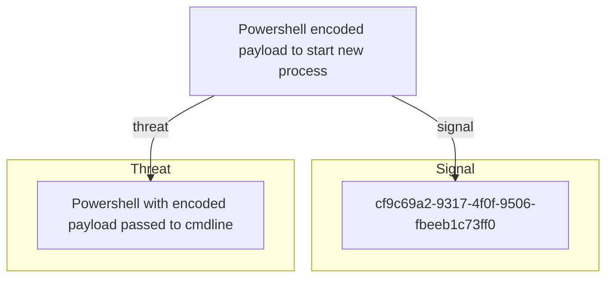

# Powershell encoded payload to start new process

## Metadata

- **UUID**: `bfeb24bf-8a17-4ccc-8aec-91721743153d`
- **Schema**: `objective::1.0`
- **Version**: `1`
- **Created**: `2026-03-24`
- **Modified**: `2026-03-24`
- **TLP**: clear (`TLP:CLEAR`)
- **Organisation**: EC DIGIT CSOC (`56b0a0f0-b0bc-47d9-bb46-02f80ae2065a`)

## References
### Public
- **1**: [https://www.leeholmes.com/searching-for-content-in-base-64-strings/](https://www.leeholmes.com/searching-for-content-in-base-64-strings/)
- **2**: [https://research.splunk.com/endpoint/c4db14d9-7909-48b4-a054-aa14d89dbb19/](https://research.splunk.com/endpoint/c4db14d9-7909-48b4-a054-aa14d89dbb19/)
- **3**: [https://www.gigasheet.com/post/powershell-threat-hunting-made-easy](https://www.gigasheet.com/post/powershell-threat-hunting-made-easy)
- **4**: [https://github.com/secprentice/PowerShellWatchlist/blob/master/badshell.txt](https://github.com/secprentice/PowerShellWatchlist/blob/master/badshell.txt)

## Description
Detect and alert on powershell encoded payload to start new process activity.

This detection objective was migrated from a Cyber Detection Model (CDM).

## Objective metadata

- **Priority**: High
- **Type**: Threat
- **Composition**: Independent
- **Composition rationale**: Each signal triggers independently, covering different detection approaches for the same objective.

## Signals
### Powershell encoded payload to start new process
Adversaries use PowerShell to execute local scripts and execute remote resources
after retrieving them using multiple network protocols. They can also encode payloads
using the command line and load PowerShell into other processes.

Here are some examples of encoded PowerShell payloads and how they can be detected:

### Base64-Encoded Payload

#### background

A common technique is to encode the entire PowerShell script in Base64 and execute it using
the -encodedcommand switch.

To detect this, look for:
- Execution of powershell.exe with encode arguments
- The presence of base64 string in the command line

#### detection strategies

to detect base64encoded string, you may use REGEX and then you may have the
option on the detection platform to decode the base64 encoded string to
confirm the actions done.

When focusing on specific keywords within the encoded string, a very good
approach is to precompute the base64 encoded version of the keyword and
search for that pattern in strings. To precompute the base64 string, 3
scenario have to be considered:
- the keyword is at a boundary of a 3-character block
- the keyword starts at second character of a 3-character block
- the keyword starts at the third character of 3-character block

Malicious payloads are often encoded and obfuscated, with PowerShell commands frequently
used to download them from the internet. To detect encoded and downloadable command line
arguments, it is essential to examine PowerShell logs, such as Sysmon or Windows PowerShell logs,
for the presence of specific keywords like "Net.WebClient," "DownloadFile," "Invoke-WebRequest,"
"Invoke-Shellcode," "http:," "-enc," "-encodedCommand," "-e," "-ec," "-en," "-encod," and "-enco".

Additionally, you can visit the following page to access a PowerShell Watchlist that helps with detection. [4]

For example, this CDM attemtps to detect the launch of a process
using the cmdlet "Start-Process". Preprocessing this keyword gives
the following search strings (without decoding base64 nor REGEX)

| Keyword | offset | string (with leading _ or *) | search string |
| --- | --- | --- | --- |
| Start-Process | 0 | U3RhcnQtUHJvY2Vzcw== | U3RhcnQtUHJvY2Vz |
| Start-Process | 1 | X1N0YXJ0LVByb2Nlc3M= / KlN0YXJ0LVByb2Nlc3M= | N0YXJ0LVByb2Nl |
| Start-Process | 2 | X19TdGFydC1Qcm9jZXNz / KipTdGFydC1Qcm9jZXNz | TdGFydC1Qcm9jZXNz |

### Obfuscated Payload with Special Characters

Adversaries may also obfuscate the PowerShell script using special characters.

To detect this, look for:
- Execution of powershell.exe with the -nop, -w hidden, and -c arguments
- High counts of obfuscation characters like `, `, and '

Useful telemetry will include:

- Windows Security Event ID 400: PowerShell command-line logging
- Windows Security Event IDs 800 and 4103: Module loading and Add-Type logging
- Windows Security Event ID 4688 : A new process has been created including process command-line
- Sysmon Event IDs 1 and 7: Process creation and Image loaded

Tuning considerations:
- Monitor for any attempts to enable scripts running on a system would be considered suspicious.
If scripts are not commonly used on a system, but enabled, scripts running out of cycle from patching
or other administrator functions are suspicious. Scripts should be captured from the file system when
possible to determine their actions and intent.
- Monitor for newly executed processes that may abuse PowerShell commands and scripts for execution.
PowerShell is a scripting environment included with Windows that is used by both attackers and administrators.
Execution of PowerShell scripts in most Windows versions is opaque and not typically secured by antivirus
which makes using PowerShell an easy way to circumvent security measures.
- Encoded PowerShell can be abused to avoid any complexity with special characters that can be difficult
to handle.

- **Severity**: High
- **Methodology**: Event Search
#### Data

- **Availability**: Unknown
- **Requirements**: Data collection: Carbon Black EDR Connectors, Sysmon Logs, Windows Security Logs.
Data sources: Command, File, Script, Module, Process.
- **Entities**: Process

## Signal MDR coverage
| Signal | Downstream MDR rules |
| --- | --- |
| Powershell encoded payload to start new process | _None_ |

## Relations

