# Shai-Hulud Anomalous npm Package Publish from Non-Baseline Identity

## Metadata
| Field | Value |
| --- | --- |
| UUID | `fae8ef2d-99e9-42f4-81ed-d40c515e8d3d` |
| Schema | `rule::1.0` |
| Version | `1` |
| Created | `2026-06-16` |
| Modified | `2026-06-22` |
| TLP | clear (`TLP:CLEAR`) |
| Organisation | EC DIGIT CSOC (`56b0a0f0-b0bc-47d9-bb46-02f80ae2065a`) |

## References
### Public
- **1**: [https://www.wiz.io/blog/mini-shai-hulud-strikes-again-tanstack-more-npm-packages-compromised](https://www.wiz.io/blog/mini-shai-hulud-strikes-again-tanstack-more-npm-packages-compromised)
- **2**: [https://www.aikido.dev/blog/mini-shai-hulud-is-back-tanstack-compromised](https://www.aikido.dev/blog/mini-shai-hulud-is-back-tanstack-compromised)
- **3**: [https://tanstack.com/blog/npm-supply-chain-compromise-postmortem](https://tanstack.com/blog/npm-supply-chain-compromise-postmortem)
- **4**: [https://www.stepsecurity.io/blog/mini-shai-hulud-is-back-a-self-spreading-supply-chain-attack-hits-the-npm-ecosystem](https://www.stepsecurity.io/blog/mini-shai-hulud-is-back-a-self-spreading-supply-chain-attack-hits-the-npm-ecosystem)

## Description
#### MDR Technical Details
Microsoft Sentinel scheduled analytic rule implementing DOM signal
`9f3abdc4-7c6e-480e-b722-6d31ddd9b2d2` (Anomalous npm Package Publish
from Non-Baseline Host or Identity). Detects burst npm package publish
activity from a single GitHub actor, publish events with campaign manifest
markers in audit metadata, and supply-chain feed matches for known
compromised versions via `ThreatIntelIndicators`.

#### Detection Criteria
- Burst threshold: ≥ 3 package publish actions per actor per hour in
  `GitHubAuditLog` (worm republication pattern).
- OR audit/commit metadata references `preinstall`, `setup.mjs`,
  `optionalDependencies`, or orphan TanStack git dependency.
- OR `ThreatIntelIndicators` match on known Shai-Hulud package versions.
- Frequency: 1 hour; severity Medium.

#### Exclusion Criteria
- Monorepo bulk releases and emergency hotfix publishes — compare against
  release calendar and require manifest markers for auto-escalation.
- Maintain per-organisation critical-package publish baseline via watchlist
  when registry-watcher pipelines are available.

## Status
| Field | Value |
| --- | --- |
| Status | `STAGING` |
| Severity | `Informational` |

## Detection model
- **Objective**: [Detect Shai-Hulud npm and PyPI Supply Chain Compromise Activity](../Objectives/detect-shai-hulud-npm-and-pypi-supply-chain-compromise-activity.md) (`fb62e879-9e91-4c5b-aaa7-999b2b1b3897`)

## Response

- **Alert severity**: Medium
### Procedure
- **Analysis**: 1. List packages published in the burst window.
2. Compare publish authentication source (CLI vs OIDC) to baseline.
3. Inspect manifest diffs for `preinstall` / `optionalDependencies` changes.
4. Cross-check versions against Wiz / OpenSSF malicious-package advisories.
- **Containment**: Deprecate worm-republished package versions, revoke the publishing token,
and audit all packages under the compromised maintainer scope.
#### Searches
- **Review all package publish actions for the actor** (sentinel)
```text
GitHubAuditLog
| where TimeGenerated > ago(24h)
| where Actor == "{{Actor}}"
| where Action has "packages."
| project TimeGenerated, Action, Repository, Data
```

## Platform configurations
<details><summary>sentinel</summary>

- **Enabled**: `True`
- **Status**: `DEVELOPMENT`
- **Alert title**: Shai-Hulud anomalous npm publish by {{Actor}}
- **Entity mapping**: Account: Name -> Actor

```sql
// Detection: Shai-Hulud anomalous npm package publish
// DOM signal: 9f3abdc4-7c6e-480e-b722-6d31ddd9b2d2
// MITRE ATT&CK: T1195.002, T1078
// Platform: SENTINEL
let BurstThreshold = 3;
let ManifestMarkers = dynamic([
    "preinstall", "setup.mjs", "optionalDependencies",
    "github:tanstack/router", "git+https://github.com/tanstack"
]);
let CompromisedPackages = dynamic([
    "@tanstack/react-router@1.169.5", "guardrails-ai@0.10.1",
    "mistralai@2.4.6", "@uipath/", "@mistralai/"
]);
let PublishBurst =
GitHubAuditLog
| where TimeGenerated > ago(1h)
| where Action has "packages." and Action has "publish"
| summarize PublishCount = count(),
    Packages = make_set(Repository, 20)
    by Actor, bin(TimeGenerated, 1h)
| where PublishCount >= BurstThreshold
| extend DetectionReason = strcat("publish_burst=", PublishCount),
    Repository = tostring(Packages[0]), DataStr = "";
let ManifestPublish =
GitHubAuditLog
| where TimeGenerated > ago(1h)
| where Action has_any ("packages.", "repo.", "git.")
| extend DataStr = tostring(Data)
| where DataStr has_any (ManifestMarkers)
| summarize arg_max(TimeGenerated, *) by Actor, Repository
| extend PublishCount = 1,
    DetectionReason = "manifest_marker",
    Packages = pack_array(Repository);
let TiPackageMatch =
ThreatIntelIndicators
| where TimeGenerated > ago(7d)
| where ExpirationDateTime > now() and Active == true
| where Description has_any ("Shai-Hulud", "tanstack", "mini-shai-hulud")
    or ExternalId has_any (CompromisedPackages)
| extend Actor = coalesce(tostring(AdditionalData.actor), "ti_feed"),
    Repository = coalesce(tostring(AdditionalData.package), Description),
    DetectionReason = "ti_feed_match", PublishCount = 1, DataStr = Description
| project TimeGenerated, Actor, Repository, DetectionReason, PublishCount, DataStr, Packages = pack_array(Repository);
union PublishBurst, ManifestPublish, TiPackageMatch
| project TimeGenerated, Actor, Repository, DetectionReason, PublishCount, DataStr
| order by TimeGenerated desc
```


</details>

## Coverage

```mermaid
flowchart TB
subgraph "Objectives"
fb62e879_9e91_4c5b_aaa7_999b2b1b3897(["Detect Shai-Hulud npm<br>and PyPI Supply Chain<br>Compromise Activity"])
end
subgraph "Threats"
59548b96_9b01_414c_badd_c0bf2ab40d9a{{"Shai-Hulud npm and PyPI<br>supply chain compromise"}}
end
subgraph "Signals"
a3f7d796_146c_44b0_8d22_7a08daa0d963(("Package Manager Install<br>Spawning Unexpected<br>Download or Scripting<br>Child Processes"))
365e23e8_0367_4adf_b18a_f1440cc66005(("Developer Secret-File<br>Access Followed by<br>Outbound Network Egress"))
b49d0a94_ae13_49b3_8ad8_6c035fa3d681(("Bulk<br>Credential-Candidate<br>File Access on Developer<br>or CI Hosts"))
287114bd_7d58_422d_9711_f5516900b9ce(("Unexpected GitHub<br>Repository or Workflow<br>Creation from Anomalous<br>Context"))
9f3abdc4_7c6e_480e_b722_6d31ddd9b2d2(("Anomalous npm Package<br>Publish from<br>Non-Baseline Host or<br>Identity"))
21a527de_8635_4187_87d4_c9e5f5c1badc(("Large Encoded Payload in<br>Outbound HTTP from<br>Developer or Build Hosts"))
678d0786_dfd7_40fb_ba90_3c368ed00342(("Known Shai-Hulud On-Disk<br>and Network Indicator<br>Match"))
end
subgraph "Rules"
c82cfa6b_066f_4ba3_ba07_d7eb642c8099["Shai-Hulud Bulk<br>Credential-Candidate<br>File Access on Developer<br>Hosts"]
ecd096d2_7fc5_45e3_803f_82d13f940210["Shai-Hulud Developer<br>Secret-File Access<br>Followed by Outbound<br>Egress"]
2fe6575d_513c_4588_999f_19c13d0fa4f9["Shai-Hulud Known On-Disk<br>and Network Indicator<br>Match"]
0924c742_8fdb_4ee2_95fe_91d2e5725a90["Shai-Hulud Large Encoded<br>Payload in Outbound HTTP<br>from Developer or Build<br>Hosts"]
bfae62bb_7ce1_46cd_a131_39803832fa9d["Shai-Hulud Package<br>Manager Install Spawning<br>Suspicious Child<br>Processes"]
7eb85d22_2e60_449f_b92c_8cecc28d34c6["Shai-Hulud Unexpected<br>GitHub Repository or<br>Workflow Creation"]
end
fae8ef2d_99e9_42f4_81ed_d40c515e8d3d["Shai-Hulud Anomalous npm<br>Package Publish from<br>Non-Baseline Identity"]
59548b96_9b01_414c_badd_c0bf2ab40d9a -->|covers| fb62e879_9e91_4c5b_aaa7_999b2b1b3897
fb62e879_9e91_4c5b_aaa7_999b2b1b3897 --> a3f7d796_146c_44b0_8d22_7a08daa0d963
fb62e879_9e91_4c5b_aaa7_999b2b1b3897 --> 365e23e8_0367_4adf_b18a_f1440cc66005
fb62e879_9e91_4c5b_aaa7_999b2b1b3897 --> b49d0a94_ae13_49b3_8ad8_6c035fa3d681
fb62e879_9e91_4c5b_aaa7_999b2b1b3897 --> 287114bd_7d58_422d_9711_f5516900b9ce
fb62e879_9e91_4c5b_aaa7_999b2b1b3897 --> 9f3abdc4_7c6e_480e_b722_6d31ddd9b2d2
fb62e879_9e91_4c5b_aaa7_999b2b1b3897 --> 21a527de_8635_4187_87d4_c9e5f5c1badc
fb62e879_9e91_4c5b_aaa7_999b2b1b3897 --> 678d0786_dfd7_40fb_ba90_3c368ed00342
fb62e879_9e91_4c5b_aaa7_999b2b1b3897 -->|implements| fae8ef2d_99e9_42f4_81ed_d40c515e8d3d
fb62e879_9e91_4c5b_aaa7_999b2b1b3897 -->|implements| c82cfa6b_066f_4ba3_ba07_d7eb642c8099
fb62e879_9e91_4c5b_aaa7_999b2b1b3897 -->|implements| ecd096d2_7fc5_45e3_803f_82d13f940210
fb62e879_9e91_4c5b_aaa7_999b2b1b3897 -->|implements| 2fe6575d_513c_4588_999f_19c13d0fa4f9
fb62e879_9e91_4c5b_aaa7_999b2b1b3897 -->|implements| 0924c742_8fdb_4ee2_95fe_91d2e5725a90
fb62e879_9e91_4c5b_aaa7_999b2b1b3897 -->|implements| bfae62bb_7ce1_46cd_a131_39803832fa9d
fb62e879_9e91_4c5b_aaa7_999b2b1b3897 -->|implements| 7eb85d22_2e60_449f_b92c_8cecc28d34c6
```

## Related objects
| Type | Name | Direction | Relation |
| --- | --- | --- | --- |
| Objective | [Detect Shai-Hulud npm and PyPI Supply Chain Compromise Activity](../Objectives/detect-shai-hulud-npm-and-pypi-supply-chain-compromise-activity.md) (`fb62e879-9e91-4c5b-aaa7-999b2b1b3897`) | Upstream | objective |
| Threat | [Shai-Hulud npm and PyPI supply chain compromise](../Threats/shai-hulud-npm-and-pypi-supply-chain-compromise.md) (`59548b96-9b01-414c-badd-c0bf2ab40d9a`) | Upstream | threat |
