# Shai-Hulud Bulk Credential-Candidate File Access on Developer Hosts

## Metadata
| Field | Value |
| --- | --- |
| UUID | `c82cfa6b-066f-4ba3-ba07-d7eb642c8099` |
| Schema | `rule::1.0` |
| Version | `1` |
| Created | `2026-06-16` |
| Modified | `2026-06-22` |
| TLP | clear (`TLP:CLEAR`) |
| Organisation | EC DIGIT CSOC (`56b0a0f0-b0bc-47d9-bb46-02f80ae2065a`) |

## References
### Public
- **1**: [https://www.wiz.io/blog/mini-shai-hulud-strikes-again-tanstack-more-npm-packages-compromised](https://www.wiz.io/blog/mini-shai-hulud-strikes-again-tanstack-more-npm-packages-compromised)
- **2**: [https://www.aikido.dev/blog/mini-shai-hulud-is-back-tanstack-compromised](https://www.aikido.dev/blog/mini-shai-hulud-is-back-tanstack-compromised)
- **3**: [https://tanstack.com/blog/npm-supply-chain-compromise-postmortem](https://tanstack.com/blog/npm-supply-chain-compromise-postmortem)
- **4**: [https://www.stepsecurity.io/blog/mini-shai-hulud-is-back-a-self-spreading-supply-chain-attack-hits-the-npm-ecosystem](https://www.stepsecurity.io/blog/mini-shai-hulud-is-back-a-self-spreading-supply-chain-attack-hits-the-npm-ecosystem)

## Description
#### MDR Technical Details
Microsoft Defender for Endpoint custom detection implementing DOM signal
`b49d0a94-ae13-49b3-8ad8-6c035fa3d681` (Bulk Credential-Candidate File
Access on Developer or CI Hosts). Aggregates `DeviceFileEvents` to flag
a single process tree touching ≥ 15 distinct secret-pattern paths within
a ten-minute window, filtered to non-interactive package-runtime parents.

#### Detection Criteria
- Threshold: `PathThreshold = 15` distinct credential-candidate paths per
  process per 10-minute bin (agreed with stakeholders for developer hosts).
- Initiating runtime is node, python, or bun without interactive shell parent.
- Frequency: 1 hour; severity Medium.

#### Exclusion Criteria
- Backup, DLP, and deliberate secret-scanner service accounts should be
  excluded via `InitiatingProcessFileName` allowlists per deployment.
- IDE indexing may touch multiple config files — tune threshold upward on
  developer workstations if noise persists.

## Status
| Field | Value |
| --- | --- |
| Status | `STAGING` |
| Severity | `Informational` |

## Detection model
- **Objective**: [Detect Shai-Hulud npm and PyPI Supply Chain Compromise Activity](../Objectives/detect-shai-hulud-npm-and-pypi-supply-chain-compromise-activity.md) (`fb62e879-9e91-4c5b-aaa7-999b2b1b3897`)

## Response

- **Alert severity**: Medium
### Procedure
- **Analysis**: 1. Review the sample paths list for breadth of secret stores accessed.
2. Confirm the initiating process is rooted in package-manager activity.
3. Hunt for outbound IOC connections on the same device.
4. Compare against known backup or security-scanning schedules.
- **Containment**: If bulk access coincides with IOC egress or install anomalies, isolate
the host and rotate all developer credentials.
#### Searches
- **Check for Shai-Hulud network IOC egress from the device** (defender_for_endpoint)
```text
DeviceNetworkEvents
| where DeviceId == "{{DeviceId}}"
| where RemoteUrl has_any ("git-tanstack", "getsession")
| project Timestamp, RemoteUrl, RemoteIP, InitiatingProcessFileName
```

## Platform configurations
<details><summary>defender_for_endpoint</summary>

- **Enabled**: `True`
- **Status**: `DEVELOPMENT`
- **Alert title**: Shai-Hulud bulk secret-file access on {{DeviceName}}

```sql
// Detection: Shai-Hulud bulk credential-candidate file access
// DOM signal: b49d0a94-ae13-49b3-8ad8-6c035fa3d681
// MITRE ATT&CK: T1552.001
// Platform: DEFENDER
let SecretPatterns = dynamic([
    ".npmrc", ".env", "credentials", "token", "secrets",
    "id_rsa", "id_ed25519", "config.json", ".ssh", ".aws",
    ".azure", ".kube", ".vault", "serviceaccount"
]);
let PathThreshold = 15;
let PackageRuntimes = dynamic([
    "node", "node.exe", "python", "python3", "python.exe", "bun", "bun.exe"
]);
let InteractiveParents = dynamic([
    "explorer.exe", "cmd.exe", "powershell.exe", "pwsh.exe",
    "WindowsTerminal.exe", "Terminal", "iTerm2", "bash", "zsh", "sh"
]);
DeviceFileEvents
| where ActionType in ("FileCreated", "FileModified") or ActionType has "Read"
| where FolderPath has_any (SecretPatterns) or FileName has_any (SecretPatterns)
| extend FullPath = strcat(FolderPath, "\\", FileName)
| summarize DistinctPaths = dcount(FullPath),
    SamplePaths = make_set(FullPath, 10)
    by DeviceId, InitiatingProcessId, InitiatingProcessFileName, bin(Timestamp, 10m)
| where DistinctPaths >= PathThreshold
| join kind=inner (
    DeviceProcessEvents
    | where InitiatingProcessFileName in~ (PackageRuntimes)
        or FileName in~ (PackageRuntimes)
    | where InitiatingProcessFileName !in~ (InteractiveParents)
    | distinct DeviceId, InitiatingProcessId
) on DeviceId, InitiatingProcessId
| join kind=inner (
    DeviceProcessEvents
    | summarize arg_max(Timestamp, *) by DeviceId, InitiatingProcessId
    | project DeviceId, InitiatingProcessId, ReportId, DeviceName,
        AccountName, AccountSid, Timestamp
) on DeviceId, InitiatingProcessId
| project Timestamp, DeviceId, ReportId, DeviceName, AccountName, AccountSid,
    InitiatingProcessFileName,
    InitiatingProcessCommandLine = strcat("distinct_paths=", tostring(DistinctPaths)),
    FileName = "", ProcessCommandLine = strcat_array(SamplePaths, ";"),
    DistinctPaths
```


</details>

## Coverage

```mermaid
flowchart TB
subgraph "Objectives"
fb62e879_9e91_4c5b_aaa7_999b2b1b3897(["Detect Shai-Hulud npm<br>and PyPI Supply Chain<br>Compromise Activity"])
end
subgraph "Threats"
59548b96_9b01_414c_badd_c0bf2ab40d9a{{"Shai-Hulud npm and PyPI<br>supply chain compromise"}}
end
subgraph "Signals"
a3f7d796_146c_44b0_8d22_7a08daa0d963(("Package Manager Install<br>Spawning Unexpected<br>Download or Scripting<br>Child Processes"))
365e23e8_0367_4adf_b18a_f1440cc66005(("Developer Secret-File<br>Access Followed by<br>Outbound Network Egress"))
b49d0a94_ae13_49b3_8ad8_6c035fa3d681(("Bulk<br>Credential-Candidate<br>File Access on Developer<br>or CI Hosts"))
287114bd_7d58_422d_9711_f5516900b9ce(("Unexpected GitHub<br>Repository or Workflow<br>Creation from Anomalous<br>Context"))
9f3abdc4_7c6e_480e_b722_6d31ddd9b2d2(("Anomalous npm Package<br>Publish from<br>Non-Baseline Host or<br>Identity"))
21a527de_8635_4187_87d4_c9e5f5c1badc(("Large Encoded Payload in<br>Outbound HTTP from<br>Developer or Build Hosts"))
678d0786_dfd7_40fb_ba90_3c368ed00342(("Known Shai-Hulud On-Disk<br>and Network Indicator<br>Match"))
end
subgraph "Rules"
fae8ef2d_99e9_42f4_81ed_d40c515e8d3d["Shai-Hulud Anomalous npm<br>Package Publish from<br>Non-Baseline Identity"]
ecd096d2_7fc5_45e3_803f_82d13f940210["Shai-Hulud Developer<br>Secret-File Access<br>Followed by Outbound<br>Egress"]
2fe6575d_513c_4588_999f_19c13d0fa4f9["Shai-Hulud Known On-Disk<br>and Network Indicator<br>Match"]
0924c742_8fdb_4ee2_95fe_91d2e5725a90["Shai-Hulud Large Encoded<br>Payload in Outbound HTTP<br>from Developer or Build<br>Hosts"]
bfae62bb_7ce1_46cd_a131_39803832fa9d["Shai-Hulud Package<br>Manager Install Spawning<br>Suspicious Child<br>Processes"]
7eb85d22_2e60_449f_b92c_8cecc28d34c6["Shai-Hulud Unexpected<br>GitHub Repository or<br>Workflow Creation"]
end
c82cfa6b_066f_4ba3_ba07_d7eb642c8099["Shai-Hulud Bulk<br>Credential-Candidate<br>File Access on Developer<br>Hosts"]
59548b96_9b01_414c_badd_c0bf2ab40d9a -->|covers| fb62e879_9e91_4c5b_aaa7_999b2b1b3897
fb62e879_9e91_4c5b_aaa7_999b2b1b3897 --> a3f7d796_146c_44b0_8d22_7a08daa0d963
fb62e879_9e91_4c5b_aaa7_999b2b1b3897 --> 365e23e8_0367_4adf_b18a_f1440cc66005
fb62e879_9e91_4c5b_aaa7_999b2b1b3897 --> b49d0a94_ae13_49b3_8ad8_6c035fa3d681
fb62e879_9e91_4c5b_aaa7_999b2b1b3897 --> 287114bd_7d58_422d_9711_f5516900b9ce
fb62e879_9e91_4c5b_aaa7_999b2b1b3897 --> 9f3abdc4_7c6e_480e_b722_6d31ddd9b2d2
fb62e879_9e91_4c5b_aaa7_999b2b1b3897 --> 21a527de_8635_4187_87d4_c9e5f5c1badc
fb62e879_9e91_4c5b_aaa7_999b2b1b3897 --> 678d0786_dfd7_40fb_ba90_3c368ed00342
fb62e879_9e91_4c5b_aaa7_999b2b1b3897 -->|implements| fae8ef2d_99e9_42f4_81ed_d40c515e8d3d
fb62e879_9e91_4c5b_aaa7_999b2b1b3897 -->|implements| c82cfa6b_066f_4ba3_ba07_d7eb642c8099
fb62e879_9e91_4c5b_aaa7_999b2b1b3897 -->|implements| ecd096d2_7fc5_45e3_803f_82d13f940210
fb62e879_9e91_4c5b_aaa7_999b2b1b3897 -->|implements| 2fe6575d_513c_4588_999f_19c13d0fa4f9
fb62e879_9e91_4c5b_aaa7_999b2b1b3897 -->|implements| 0924c742_8fdb_4ee2_95fe_91d2e5725a90
fb62e879_9e91_4c5b_aaa7_999b2b1b3897 -->|implements| bfae62bb_7ce1_46cd_a131_39803832fa9d
fb62e879_9e91_4c5b_aaa7_999b2b1b3897 -->|implements| 7eb85d22_2e60_449f_b92c_8cecc28d34c6
```

## Related objects
| Type | Name | Direction | Relation |
| --- | --- | --- | --- |
| Objective | [Detect Shai-Hulud npm and PyPI Supply Chain Compromise Activity](../Objectives/detect-shai-hulud-npm-and-pypi-supply-chain-compromise-activity.md) (`fb62e879-9e91-4c5b-aaa7-999b2b1b3897`) | Upstream | objective |
| Threat | [Shai-Hulud npm and PyPI supply chain compromise](../Threats/shai-hulud-npm-and-pypi-supply-chain-compromise.md) (`59548b96-9b01-414c-badd-c0bf2ab40d9a`) | Upstream | threat |
