# Shai-Hulud Known On-Disk and Network Indicator Match

## Metadata
| Field | Value |
| --- | --- |
| UUID | `2fe6575d-513c-4588-999f-19c13d0fa4f9` |
| Schema | `rule::1.0` |
| Version | `2` |
| Created | `2026-06-16` |
| Modified | `2026-06-22` |
| TLP | clear (`TLP:CLEAR`) |
| Organisation | EC DIGIT CSOC (`56b0a0f0-b0bc-47d9-bb46-02f80ae2065a`) |

## References
### Public
- **1**: [https://www.wiz.io/blog/mini-shai-hulud-strikes-again-tanstack-more-npm-packages-compromised](https://www.wiz.io/blog/mini-shai-hulud-strikes-again-tanstack-more-npm-packages-compromised)
- **2**: [https://www.aikido.dev/blog/mini-shai-hulud-is-back-tanstack-compromised](https://www.aikido.dev/blog/mini-shai-hulud-is-back-tanstack-compromised)
- **3**: [https://tanstack.com/blog/npm-supply-chain-compromise-postmortem](https://tanstack.com/blog/npm-supply-chain-compromise-postmortem)
- **4**: [https://www.stepsecurity.io/blog/mini-shai-hulud-is-back-a-self-spreading-supply-chain-attack-hits-the-npm-ecosystem](https://www.stepsecurity.io/blog/mini-shai-hulud-is-back-a-self-spreading-supply-chain-attack-hits-the-npm-ecosystem)

## Description
#### MDR Technical Details
Multi-platform detection rule implementing DOM signal
`678d0786-dfd7-40fb-ba90-3c368ed00342` (Known Shai-Hulud On-Disk and
Network Indicator Match). Microsoft Defender for Endpoint matches campaign
filenames, SHA-256 hashes, and package-runtime network connections in
`DeviceFileEvents` and `DeviceNetworkEvents`. Microsoft Sentinel correlates
DNS queries, proxy or firewall logs, and `ThreatIntelIndicators` for the same
campaign infrastructure and package indicators.

#### Detection Criteria
- On-disk: `router_init.js`, `setup.mjs`, `gh-token-monitor`, or published
  sample SHA-256 hashes (endpoint).
- Network: connections or DNS to `git-tanstack.com`, `*.getsession.org`, or
  `83.142.209.194` from package-runtime process trees (endpoint) or DNS,
  proxy, and threat-intel feeds (Sentinel).
- Frequency: 1 hour; severity Critical.

#### Exclusion Criteria
- None for hash and filename matches — treat as strong execution evidence.
- DNS-only matches on security-research sandboxes should be scoped to
  developer and CI network segments where possible.

## Status
| Field | Value |
| --- | --- |
| Status | `STAGING` |
| Severity | `Informational` |

## Detection model
- **Objective**: [Detect Shai-Hulud npm and PyPI Supply Chain Compromise Activity](../Objectives/detect-shai-hulud-npm-and-pypi-supply-chain-compromise-activity.md) (`fb62e879-9e91-4c5b-aaa7-999b2b1b3897`)

## Response

- **Alert severity**: High
### Procedure
- **Analysis**: 1. Treat any on-disk IOC match as confirmed execution, not mere dependency
   declaration.
2. Identify the source host or client IP for network IOC matches.
3. Search for `gh-token-monitor` persistence before revoking GitHub tokens.
4. Sweep lockfiles for compromised package versions and rotate credentials.
- **Containment**: Isolate affected endpoints immediately. Block IOC domains and IP at DNS
and proxy layers. Remove persistence and malicious packages before token
revocation.
#### Searches
- **Hunt persistence artefacts on the alerted device** (defender_for_endpoint)
```text
DeviceFileEvents
| where DeviceId == "{{DeviceId}}"
| where FileName has_any ("gh-token-monitor", "com.user.gh-token-monitor")
| project Timestamp, FolderPath, FileName, SHA256
```

## Platform configurations
<details><summary>sentinel</summary>

- **Enabled**: `True`
- **Status**: `DEVELOPMENT`
- **Alert title**: Shai-Hulud network IOC match — {{IndicatorValue}}
- **Entity mapping**: IP: Address -> ClientIP
- **Entity mapping**: DNS: DomainName -> IndicatorValue

```sql
// Detection: Shai-Hulud known network and IOC indicator match
// DOM signal: 678d0786-dfd7-40fb-ba90-3c368ed00342
// MITRE ATT&CK: T1071.001, T1195.002
// Platform: SENTINEL
let IocDomains = dynamic([
    "git-tanstack.com", "getsession.org", "filev2.getsession.org",
    "seed1.getsession.org", "seed2.getsession.org", "seed3.getsession.org"
]);
let ExfilIp = "83.142.209.194";
let DnsMatch =
DnsEvents
| where TimeGenerated > ago(1h)
| where Name has_any (IocDomains)
| project TimeGenerated, ClientIP = ClientIP, IndicatorValue = Name,
    MatchSource = "DnsEvents", IndicatorType = "domain";
let ProxyMatch =
CommonSecurityLog
| where TimeGenerated > ago(1h)
| where DestinationIP == ExfilIp
    or DestinationHostName has_any (IocDomains)
| project TimeGenerated, ClientIP = SourceIP,
    IndicatorValue = coalesce(DestinationHostName, DestinationIP),
    MatchSource = "CommonSecurityLog", IndicatorType = "network";
let TiMatch =
ThreatIntelIndicators
| where TimeGenerated > ago(7d)
| where ExpirationDateTime > now() and Active == true
| where Description has_any ("Shai-Hulud", "mini-shai-hulud", "git-tanstack")
    or DomainName has_any (IocDomains)
    or NetworkIP == ExfilIp
| extend IndicatorValue = coalesce(DomainName, NetworkIP, Description)
| project TimeGenerated, ClientIP = "", IndicatorValue,
    MatchSource = "ThreatIntelIndicators", IndicatorType = ThreatType;
union DnsMatch, ProxyMatch, TiMatch
| order by TimeGenerated desc
```


</details>

<details><summary>defender_for_endpoint</summary>

- **Enabled**: `True`
- **Status**: `DEVELOPMENT`
- **Alert title**: Shai-Hulud IOC match on {{DeviceName}} — {{DetectionType}}

```sql
// Detection: Shai-Hulud known on-disk and network IOC match
// DOM signal: 678d0786-dfd7-40fb-ba90-3c368ed00342
// MITRE ATT&CK: T1195.002, T1547
// Platform: DEFENDER
let PackageManagers = dynamic([
    "node", "node.exe", "npm", "npm.cmd", "pnpm", "pnpm.cmd",
    "yarn", "yarn.cmd", "npx", "corepack", "pip", "pip3",
    "python", "python3", "bun", "bun.exe"
]);
let IocDomains = dynamic([
    "git-tanstack.com", "getsession.org", "filev2.getsession.org",
    "seed1.getsession.org", "seed2.getsession.org", "seed3.getsession.org"
]);
let IocFiles = dynamic([
    "router_init.js", "setup.mjs", "router_runtime.js",
    "tanstack_runner.js", "gh-token-monitor",
    "com.user.gh-token-monitor.plist", "gh-token-monitor.service",
    "transformers.pyz"
]);
let IocHashes = dynamic([
    "ab4fcadaec49c03278063dd269ea5eef82d24f2124a8e15d7b90f2fa8601266c",
    "2ec78d556d696e208927cc503d48e4b5eb56b31abc2870c2ed2e98d6be27fc96",
    "2258284d65f63829bd67eaba01ef6f1ada2f593f9bbe41678b2df360bd90d3df"
]);
let FileMatch =
DeviceFileEvents
| where FileName in~ (IocFiles) or SHA256 in (IocHashes)
| project Timestamp, DeviceId, ReportId, DeviceName,
    AccountName = InitiatingProcessAccountName, AccountSid = "",
    InitiatingProcessFileName, InitiatingProcessCommandLine = FolderPath,
    FileName, ProcessCommandLine = SHA256,
    DetectionType = "file_ioc";
let NetworkMatch =
DeviceNetworkEvents
| where ActionType == "ConnectionSuccess"
| where RemoteUrl has_any (IocDomains) or RemoteIP == "83.142.209.194"
| where InitiatingProcessFileName in~ (PackageManagers)
    or InitiatingProcessCommandLine has_any (IocFiles)
| project Timestamp, DeviceId, ReportId, DeviceName,
    AccountName = InitiatingProcessAccountName, AccountSid = "",
    InitiatingProcessFileName, InitiatingProcessCommandLine,
    FileName = RemoteUrl, ProcessCommandLine = RemoteIP,
    DetectionType = "network_ioc";
union FileMatch, NetworkMatch
```


</details>

## Coverage

```mermaid
flowchart TB
subgraph "Objectives"
fb62e879_9e91_4c5b_aaa7_999b2b1b3897(["Detect Shai-Hulud npm<br>and PyPI Supply Chain<br>Compromise Activity"])
end
subgraph "Threats"
59548b96_9b01_414c_badd_c0bf2ab40d9a{{"Shai-Hulud npm and PyPI<br>supply chain compromise"}}
end
subgraph "Signals"
a3f7d796_146c_44b0_8d22_7a08daa0d963(("Package Manager Install<br>Spawning Unexpected<br>Download or Scripting<br>Child Processes"))
365e23e8_0367_4adf_b18a_f1440cc66005(("Developer Secret-File<br>Access Followed by<br>Outbound Network Egress"))
b49d0a94_ae13_49b3_8ad8_6c035fa3d681(("Bulk<br>Credential-Candidate<br>File Access on Developer<br>or CI Hosts"))
287114bd_7d58_422d_9711_f5516900b9ce(("Unexpected GitHub<br>Repository or Workflow<br>Creation from Anomalous<br>Context"))
9f3abdc4_7c6e_480e_b722_6d31ddd9b2d2(("Anomalous npm Package<br>Publish from<br>Non-Baseline Host or<br>Identity"))
21a527de_8635_4187_87d4_c9e5f5c1badc(("Large Encoded Payload in<br>Outbound HTTP from<br>Developer or Build Hosts"))
678d0786_dfd7_40fb_ba90_3c368ed00342(("Known Shai-Hulud On-Disk<br>and Network Indicator<br>Match"))
end
subgraph "Rules"
fae8ef2d_99e9_42f4_81ed_d40c515e8d3d["Shai-Hulud Anomalous npm<br>Package Publish from<br>Non-Baseline Identity"]
c82cfa6b_066f_4ba3_ba07_d7eb642c8099["Shai-Hulud Bulk<br>Credential-Candidate<br>File Access on Developer<br>Hosts"]
ecd096d2_7fc5_45e3_803f_82d13f940210["Shai-Hulud Developer<br>Secret-File Access<br>Followed by Outbound<br>Egress"]
0924c742_8fdb_4ee2_95fe_91d2e5725a90["Shai-Hulud Large Encoded<br>Payload in Outbound HTTP<br>from Developer or Build<br>Hosts"]
bfae62bb_7ce1_46cd_a131_39803832fa9d["Shai-Hulud Package<br>Manager Install Spawning<br>Suspicious Child<br>Processes"]
7eb85d22_2e60_449f_b92c_8cecc28d34c6["Shai-Hulud Unexpected<br>GitHub Repository or<br>Workflow Creation"]
end
2fe6575d_513c_4588_999f_19c13d0fa4f9["Shai-Hulud Known On-Disk<br>and Network Indicator<br>Match"]
59548b96_9b01_414c_badd_c0bf2ab40d9a -->|covers| fb62e879_9e91_4c5b_aaa7_999b2b1b3897
fb62e879_9e91_4c5b_aaa7_999b2b1b3897 --> a3f7d796_146c_44b0_8d22_7a08daa0d963
fb62e879_9e91_4c5b_aaa7_999b2b1b3897 --> 365e23e8_0367_4adf_b18a_f1440cc66005
fb62e879_9e91_4c5b_aaa7_999b2b1b3897 --> b49d0a94_ae13_49b3_8ad8_6c035fa3d681
fb62e879_9e91_4c5b_aaa7_999b2b1b3897 --> 287114bd_7d58_422d_9711_f5516900b9ce
fb62e879_9e91_4c5b_aaa7_999b2b1b3897 --> 9f3abdc4_7c6e_480e_b722_6d31ddd9b2d2
fb62e879_9e91_4c5b_aaa7_999b2b1b3897 --> 21a527de_8635_4187_87d4_c9e5f5c1badc
fb62e879_9e91_4c5b_aaa7_999b2b1b3897 --> 678d0786_dfd7_40fb_ba90_3c368ed00342
fb62e879_9e91_4c5b_aaa7_999b2b1b3897 -->|implements| fae8ef2d_99e9_42f4_81ed_d40c515e8d3d
fb62e879_9e91_4c5b_aaa7_999b2b1b3897 -->|implements| c82cfa6b_066f_4ba3_ba07_d7eb642c8099
fb62e879_9e91_4c5b_aaa7_999b2b1b3897 -->|implements| ecd096d2_7fc5_45e3_803f_82d13f940210
fb62e879_9e91_4c5b_aaa7_999b2b1b3897 -->|implements| 2fe6575d_513c_4588_999f_19c13d0fa4f9
fb62e879_9e91_4c5b_aaa7_999b2b1b3897 -->|implements| 0924c742_8fdb_4ee2_95fe_91d2e5725a90
fb62e879_9e91_4c5b_aaa7_999b2b1b3897 -->|implements| bfae62bb_7ce1_46cd_a131_39803832fa9d
fb62e879_9e91_4c5b_aaa7_999b2b1b3897 -->|implements| 7eb85d22_2e60_449f_b92c_8cecc28d34c6
```

## Related objects
| Type | Name | Direction | Relation |
| --- | --- | --- | --- |
| Objective | [Detect Shai-Hulud npm and PyPI Supply Chain Compromise Activity](../Objectives/detect-shai-hulud-npm-and-pypi-supply-chain-compromise-activity.md) (`fb62e879-9e91-4c5b-aaa7-999b2b1b3897`) | Upstream | objective |
| Threat | [Shai-Hulud npm and PyPI supply chain compromise](../Threats/shai-hulud-npm-and-pypi-supply-chain-compromise.md) (`59548b96-9b01-414c-badd-c0bf2ab40d9a`) | Upstream | threat |
