# Shai-Hulud Large Encoded Payload in Outbound HTTP from Developer or Build Hosts

## Metadata
| Field | Value |
| --- | --- |
| UUID | `0924c742-8fdb-4ee2-95fe-91d2e5725a90` |
| Schema | `rule::1.0` |
| Version | `2` |
| Created | `2026-06-16` |
| Modified | `2026-06-22` |
| TLP | clear (`TLP:CLEAR`) |
| Organisation | EC DIGIT CSOC (`56b0a0f0-b0bc-47d9-bb46-02f80ae2065a`) |

## References
### Public
- **1**: [https://www.wiz.io/blog/mini-shai-hulud-strikes-again-tanstack-more-npm-packages-compromised](https://www.wiz.io/blog/mini-shai-hulud-strikes-again-tanstack-more-npm-packages-compromised)
- **2**: [https://www.aikido.dev/blog/mini-shai-hulud-is-back-tanstack-compromised](https://www.aikido.dev/blog/mini-shai-hulud-is-back-tanstack-compromised)
- **3**: [https://tanstack.com/blog/npm-supply-chain-compromise-postmortem](https://tanstack.com/blog/npm-supply-chain-compromise-postmortem)
- **4**: [https://www.stepsecurity.io/blog/mini-shai-hulud-is-back-a-self-spreading-supply-chain-attack-hits-the-npm-ecosystem](https://www.stepsecurity.io/blog/mini-shai-hulud-is-back-a-self-spreading-supply-chain-attack-hits-the-npm-ecosystem)

## Description
#### MDR Technical Details
Multi-platform detection rule implementing DOM signal
`21a527de-8635-4187-87d4-c9e5f5c1badc` (Large Encoded Payload in Outbound
HTTP from Developer or Build Hosts). Microsoft Defender for Endpoint uses
`DeviceNetworkEvents` with `SentBytes` as a proxy for encoded credential
uploads; Microsoft Sentinel uses corporate web-proxy `CommonSecurityLog`
entries for large POST/PUT requests to the same Shai-Hulud IOC destinations.

#### Detection Criteria
- Outbound transfer ≥ 50 KB to `git-tanstack.com`, `filev2.getsession.org`,
  `api.github.com`, or `83.142.209.194`.
- Endpoint variant: initiating process is node, python, bun, curl, or npm family.
- Proxy variant: HTTP POST or PUT with byte-count fields where available.
- Frequency: 1 hour; severity Medium.

#### Exclusion Criteria
- Legitimate artefact uploads to internal registries — exclude corporate
  registry hostnames per deployment.
- Proxy variant requires a web-proxy connector with body-size or byte-count fields.

## Status
| Field | Value |
| --- | --- |
| Status | `STAGING` |
| Severity | `Informational` |

## Detection model
- **Objective**: [Detect Shai-Hulud npm and PyPI Supply Chain Compromise Activity](../Objectives/detect-shai-hulud-npm-and-pypi-supply-chain-compromise-activity.md) (`fb62e879-9e91-4c5b-aaa7-999b2b1b3897`)

## Response

- **Alert severity**: Medium
### Procedure
- **Analysis**: 1. Review bytes sent and destination host (endpoint or proxy telemetry).
2. Correlate source host with developer workstation or CI runner inventory.
3. Check for preceding bulk secret-file access signals.
4. Inspect proxy logs if available for request body encoding patterns.
- **Containment**: Block egress to campaign IOC domains and rotate credentials if
exfiltration coincides with secret-file access.

## Platform configurations
<details><summary>sentinel</summary>

- **Enabled**: `True`
- **Status**: `DEVELOPMENT`
- **Alert title**: Shai-Hulud large HTTP exfil to {{DestinationHostName}}
- **Entity mapping**: IP: Address -> SourceIP
- **Entity mapping**: URL: Url -> RequestURL

```sql
// Detection: Shai-Hulud large encoded outbound HTTP exfiltration (proxy)
// DOM signal: 21a527de-8635-4187-87d4-c9e5f5c1badc
// MITRE ATT&CK: T1567.002, T1071.001
// Platform: SENTINEL
let IocDomains = dynamic([
    "git-tanstack.com", "filev2.getsession.org"
]);
let MinBytes = 50000;
CommonSecurityLog
| where TimeGenerated > ago(1h)
| where RequestMethod in ("POST", "PUT")
| where DestinationHostName has_any (IocDomains)
    or DestinationIP == "83.142.209.194"
| where ReceivedBytes >= MinBytes or SentBytes >= MinBytes
| extend RequestURL = strcat(RequestMethod, " ", DestinationHostName, DestinationURL)
| project TimeGenerated, SourceIP, DestinationHostName, RequestURL,
    ReceivedBytes, SentBytes, DeviceVendor, DeviceProduct
```


</details>

<details><summary>defender_for_endpoint</summary>

- **Enabled**: `True`
- **Status**: `DEVELOPMENT`
- **Alert title**: Shai-Hulud large outbound transfer to {{FileName}} from {{DeviceName}}

```sql
// Detection: Shai-Hulud large encoded outbound HTTP exfiltration
// DOM signal: 21a527de-8635-4187-87d4-c9e5f5c1badc
// MITRE ATT&CK: T1567.002, T1071.001
// Platform: DEFENDER
let IocDomains = dynamic([
    "git-tanstack.com", "filev2.getsession.org", "api.github.com"
]);
let ExfilIp = "83.142.209.194";
let MinSentBytes = 50000;
let PackageRuntimes = dynamic([
    "node", "node.exe", "npm", "npm.cmd", "pnpm", "python", "python3",
    "bun", "bun.exe", "curl", "curl.exe"
]);
DeviceNetworkEvents
| where ActionType == "ConnectionSuccess"
| where RemoteUrl has_any (IocDomains) or RemoteIP == ExfilIp
| where SentBytes >= MinSentBytes
| where InitiatingProcessFileName in~ (PackageRuntimes)
| project Timestamp, DeviceId, ReportId, DeviceName,
    AccountName = InitiatingProcessAccountName, AccountSid = "",
    InitiatingProcessFileName, InitiatingProcessCommandLine,
    FileName = RemoteUrl, ProcessCommandLine = RemoteIP,
    SentBytes, RemotePort
```


</details>

## Coverage

```mermaid
flowchart TB
subgraph "Objectives"
fb62e879_9e91_4c5b_aaa7_999b2b1b3897(["Detect Shai-Hulud npm<br>and PyPI Supply Chain<br>Compromise Activity"])
end
subgraph "Threats"
59548b96_9b01_414c_badd_c0bf2ab40d9a{{"Shai-Hulud npm and PyPI<br>supply chain compromise"}}
end
subgraph "Signals"
a3f7d796_146c_44b0_8d22_7a08daa0d963(("Package Manager Install<br>Spawning Unexpected<br>Download or Scripting<br>Child Processes"))
365e23e8_0367_4adf_b18a_f1440cc66005(("Developer Secret-File<br>Access Followed by<br>Outbound Network Egress"))
b49d0a94_ae13_49b3_8ad8_6c035fa3d681(("Bulk<br>Credential-Candidate<br>File Access on Developer<br>or CI Hosts"))
287114bd_7d58_422d_9711_f5516900b9ce(("Unexpected GitHub<br>Repository or Workflow<br>Creation from Anomalous<br>Context"))
9f3abdc4_7c6e_480e_b722_6d31ddd9b2d2(("Anomalous npm Package<br>Publish from<br>Non-Baseline Host or<br>Identity"))
21a527de_8635_4187_87d4_c9e5f5c1badc(("Large Encoded Payload in<br>Outbound HTTP from<br>Developer or Build Hosts"))
678d0786_dfd7_40fb_ba90_3c368ed00342(("Known Shai-Hulud On-Disk<br>and Network Indicator<br>Match"))
end
subgraph "Rules"
fae8ef2d_99e9_42f4_81ed_d40c515e8d3d["Shai-Hulud Anomalous npm<br>Package Publish from<br>Non-Baseline Identity"]
c82cfa6b_066f_4ba3_ba07_d7eb642c8099["Shai-Hulud Bulk<br>Credential-Candidate<br>File Access on Developer<br>Hosts"]
ecd096d2_7fc5_45e3_803f_82d13f940210["Shai-Hulud Developer<br>Secret-File Access<br>Followed by Outbound<br>Egress"]
2fe6575d_513c_4588_999f_19c13d0fa4f9["Shai-Hulud Known On-Disk<br>and Network Indicator<br>Match"]
bfae62bb_7ce1_46cd_a131_39803832fa9d["Shai-Hulud Package<br>Manager Install Spawning<br>Suspicious Child<br>Processes"]
7eb85d22_2e60_449f_b92c_8cecc28d34c6["Shai-Hulud Unexpected<br>GitHub Repository or<br>Workflow Creation"]
end
0924c742_8fdb_4ee2_95fe_91d2e5725a90["Shai-Hulud Large Encoded<br>Payload in Outbound HTTP<br>from Developer or Build<br>Hosts"]
59548b96_9b01_414c_badd_c0bf2ab40d9a -->|covers| fb62e879_9e91_4c5b_aaa7_999b2b1b3897
fb62e879_9e91_4c5b_aaa7_999b2b1b3897 --> a3f7d796_146c_44b0_8d22_7a08daa0d963
fb62e879_9e91_4c5b_aaa7_999b2b1b3897 --> 365e23e8_0367_4adf_b18a_f1440cc66005
fb62e879_9e91_4c5b_aaa7_999b2b1b3897 --> b49d0a94_ae13_49b3_8ad8_6c035fa3d681
fb62e879_9e91_4c5b_aaa7_999b2b1b3897 --> 287114bd_7d58_422d_9711_f5516900b9ce
fb62e879_9e91_4c5b_aaa7_999b2b1b3897 --> 9f3abdc4_7c6e_480e_b722_6d31ddd9b2d2
fb62e879_9e91_4c5b_aaa7_999b2b1b3897 --> 21a527de_8635_4187_87d4_c9e5f5c1badc
fb62e879_9e91_4c5b_aaa7_999b2b1b3897 --> 678d0786_dfd7_40fb_ba90_3c368ed00342
fb62e879_9e91_4c5b_aaa7_999b2b1b3897 -->|implements| fae8ef2d_99e9_42f4_81ed_d40c515e8d3d
fb62e879_9e91_4c5b_aaa7_999b2b1b3897 -->|implements| c82cfa6b_066f_4ba3_ba07_d7eb642c8099
fb62e879_9e91_4c5b_aaa7_999b2b1b3897 -->|implements| ecd096d2_7fc5_45e3_803f_82d13f940210
fb62e879_9e91_4c5b_aaa7_999b2b1b3897 -->|implements| 2fe6575d_513c_4588_999f_19c13d0fa4f9
fb62e879_9e91_4c5b_aaa7_999b2b1b3897 -->|implements| 0924c742_8fdb_4ee2_95fe_91d2e5725a90
fb62e879_9e91_4c5b_aaa7_999b2b1b3897 -->|implements| bfae62bb_7ce1_46cd_a131_39803832fa9d
fb62e879_9e91_4c5b_aaa7_999b2b1b3897 -->|implements| 7eb85d22_2e60_449f_b92c_8cecc28d34c6
```

## Related objects
| Type | Name | Direction | Relation |
| --- | --- | --- | --- |
| Objective | [Detect Shai-Hulud npm and PyPI Supply Chain Compromise Activity](../Objectives/detect-shai-hulud-npm-and-pypi-supply-chain-compromise-activity.md) (`fb62e879-9e91-4c5b-aaa7-999b2b1b3897`) | Upstream | objective |
| Threat | [Shai-Hulud npm and PyPI supply chain compromise](../Threats/shai-hulud-npm-and-pypi-supply-chain-compromise.md) (`59548b96-9b01-414c-badd-c0bf2ab40d9a`) | Upstream | threat |
