# Shai-Hulud Package Manager Install Spawning Suspicious Child Processes

## Metadata
| Field | Value |
| --- | --- |
| UUID | `bfae62bb-7ce1-46cd-a131-39803832fa9d` |
| Schema | `rule::1.0` |
| Version | `1` |
| Created | `2026-06-16` |
| Modified | `2026-06-22` |
| TLP | clear (`TLP:CLEAR`) |
| Organisation | EC DIGIT CSOC (`56b0a0f0-b0bc-47d9-bb46-02f80ae2065a`) |

## References
### Public
- **1**: [https://www.wiz.io/blog/mini-shai-hulud-strikes-again-tanstack-more-npm-packages-compromised](https://www.wiz.io/blog/mini-shai-hulud-strikes-again-tanstack-more-npm-packages-compromised)
- **2**: [https://www.aikido.dev/blog/mini-shai-hulud-is-back-tanstack-compromised](https://www.aikido.dev/blog/mini-shai-hulud-is-back-tanstack-compromised)
- **3**: [https://tanstack.com/blog/npm-supply-chain-compromise-postmortem](https://tanstack.com/blog/npm-supply-chain-compromise-postmortem)
- **4**: [https://www.stepsecurity.io/blog/mini-shai-hulud-is-back-a-self-spreading-supply-chain-attack-hits-the-npm-ecosystem](https://www.stepsecurity.io/blog/mini-shai-hulud-is-back-a-self-spreading-supply-chain-attack-hits-the-npm-ecosystem)

## Description
#### MDR Technical Details
Microsoft Defender for Endpoint custom detection implementing DOM signal
`a3f7d796-146c-44b0-8d22-7a08daa0d963` (Package Manager Install Spawning
Unexpected Download or Scripting Child Processes). Correlates
`DeviceProcessEvents` for package-manager install trees spawning download
utilities, shells, Bun, or hidden-window PowerShell, and `DeviceFileEvents`
for campaign artefact drops (`router_init.js`, `setup.mjs`, etc.).

#### Detection Criteria
- Parent is npm, pnpm, yarn, pip, python, or node with install/ci/add/update
  in the command line.
- Child within the engine lookback is curl, wget, bash, sh, zsh, bun,
  powershell (hidden/bypass flags), or cscript/wscript.
- OR file create of known Shai-Hulud hook files outside npm cache paths.
- Frequency: 1 hour; severity High.

#### Exclusion Criteria
- Native module builds (`node-gyp`, `esbuild`) excluded by initiating process.
- Files under npm cache / temp paths excluded for artefact drops.
- Legitimate postinstall (husky, esbuild fetch) may fire — correlate with
  secret-file access or IOC signals before escalation.

## Status
| Field | Value |
| --- | --- |
| Status | `STAGING` |
| Severity | `Informational` |

## Detection model
- **Objective**: [Detect Shai-Hulud npm and PyPI Supply Chain Compromise Activity](../Objectives/detect-shai-hulud-npm-and-pypi-supply-chain-compromise-activity.md) (`fb62e879-9e91-4c5b-aaa7-999b2b1b3897`)

## Response

- **Alert severity**: High
### Procedure
- **Analysis**: 1. Confirm package manager parent command line references install, ci,
   add, or update.
2. Inspect child process command line for remote fetch or pipe-to-shell.
3. Search the device for `router_init.js`, `setup.mjs`, and lockfile
   entries for `@tanstack/*` compromised versions.
4. Correlate with other Shai-Hulud DOM signals on the same host.
- **Containment**: Isolate the endpoint if install-time child spawning coincides with IOC
file creation. Remove malicious packages and persistence before token
revocation.
#### Searches
- **Hunt related file and network IOC activity on the device** (defender_for_endpoint)
```text
let IocFiles = dynamic(["router_init.js", "setup.mjs", "gh-token-monitor"]);
union (
    DeviceFileEvents
    | where DeviceId == "{{DeviceId}}"
    | where FileName in~ (IocFiles)
), (
    DeviceNetworkEvents
    | where DeviceId == "{{DeviceId}}"
    | where RemoteUrl has "git-tanstack"
)
```

## Platform configurations
<details><summary>defender_for_endpoint</summary>

- **Enabled**: `True`
- **Status**: `DEVELOPMENT`
- **Alert title**: Shai-Hulud install hook spawned {{FileName}} on {{DeviceName}}

```sql
// Detection: Shai-Hulud package manager install child process anomaly
// DOM signal: a3f7d796-146c-44b0-8d22-7a08daa0d963
// MITRE ATT&CK: T1195.002, T1546.016
// Platform: DEFENDER
let PackageManagers = dynamic([
    "node", "node.exe", "npm", "npm.cmd", "pnpm", "pnpm.cmd",
    "yarn", "yarn.cmd", "npx", "corepack", "pip", "pip3",
    "python", "python3", "python.exe"
]);
let SuspiciousChildren = dynamic([
    "curl", "curl.exe", "wget", "wget.exe", "bash", "sh", "zsh",
    "bun", "bun.exe", "cscript.exe", "wscript.exe"
]);
let InstallVerbs = dynamic(["install", " ci", "add ", "update"]);
let MaliciousArtifacts = dynamic([
    "router_init.js", "setup.mjs", "router_runtime.js", "tanstack_runner.js"
]);
let ChildFromInstall =
DeviceProcessEvents
| where InitiatingProcessFileName in~ (PackageManagers)
    or FileName in~ (PackageManagers)
| where InitiatingProcessCommandLine has_any (InstallVerbs)
    or ProcessCommandLine has_any (InstallVerbs)
| where FileName in~ (SuspiciousChildren)
    or (FileName =~ "powershell.exe"
        and ProcessCommandLine has_any (
            "-w hidden", "-windowstyle hidden", "-ep bypass",
            "-executionpolicy bypass", "-EncodedCommand"))
| where not(InitiatingProcessFileName in~ ("node-gyp", "esbuild"))
| project Timestamp, DeviceId, ReportId, DeviceName, AccountName, AccountSid,
    InitiatingProcessFileName, InitiatingProcessCommandLine,
    FileName, ProcessCommandLine, DetectionPath = "child_process";
let ArtifactDrop =
DeviceFileEvents
| where ActionType == "FileCreated"
| where FileName in~ (MaliciousArtifacts)
| where not(FolderPath has_any ("\\npm\\cache\\", "/.npm/", "/tmp/npm-", "\\AppData\\Local\\npm-cache\\"))
| project Timestamp, DeviceId, ReportId, DeviceName,
    AccountName = InitiatingProcessAccountName, AccountSid = "",
    InitiatingProcessFileName, InitiatingProcessCommandLine = FolderPath,
    FileName, ProcessCommandLine = SHA256, DetectionPath = "artifact_drop";
union ChildFromInstall, ArtifactDrop
```


</details>

## Coverage

```mermaid
flowchart TB
subgraph "Objectives"
fb62e879_9e91_4c5b_aaa7_999b2b1b3897(["Detect Shai-Hulud npm<br>and PyPI Supply Chain<br>Compromise Activity"])
end
subgraph "Threats"
59548b96_9b01_414c_badd_c0bf2ab40d9a{{"Shai-Hulud npm and PyPI<br>supply chain compromise"}}
end
subgraph "Signals"
a3f7d796_146c_44b0_8d22_7a08daa0d963(("Package Manager Install<br>Spawning Unexpected<br>Download or Scripting<br>Child Processes"))
365e23e8_0367_4adf_b18a_f1440cc66005(("Developer Secret-File<br>Access Followed by<br>Outbound Network Egress"))
b49d0a94_ae13_49b3_8ad8_6c035fa3d681(("Bulk<br>Credential-Candidate<br>File Access on Developer<br>or CI Hosts"))
287114bd_7d58_422d_9711_f5516900b9ce(("Unexpected GitHub<br>Repository or Workflow<br>Creation from Anomalous<br>Context"))
9f3abdc4_7c6e_480e_b722_6d31ddd9b2d2(("Anomalous npm Package<br>Publish from<br>Non-Baseline Host or<br>Identity"))
21a527de_8635_4187_87d4_c9e5f5c1badc(("Large Encoded Payload in<br>Outbound HTTP from<br>Developer or Build Hosts"))
678d0786_dfd7_40fb_ba90_3c368ed00342(("Known Shai-Hulud On-Disk<br>and Network Indicator<br>Match"))
end
subgraph "Rules"
fae8ef2d_99e9_42f4_81ed_d40c515e8d3d["Shai-Hulud Anomalous npm<br>Package Publish from<br>Non-Baseline Identity"]
c82cfa6b_066f_4ba3_ba07_d7eb642c8099["Shai-Hulud Bulk<br>Credential-Candidate<br>File Access on Developer<br>Hosts"]
ecd096d2_7fc5_45e3_803f_82d13f940210["Shai-Hulud Developer<br>Secret-File Access<br>Followed by Outbound<br>Egress"]
2fe6575d_513c_4588_999f_19c13d0fa4f9["Shai-Hulud Known On-Disk<br>and Network Indicator<br>Match"]
0924c742_8fdb_4ee2_95fe_91d2e5725a90["Shai-Hulud Large Encoded<br>Payload in Outbound HTTP<br>from Developer or Build<br>Hosts"]
7eb85d22_2e60_449f_b92c_8cecc28d34c6["Shai-Hulud Unexpected<br>GitHub Repository or<br>Workflow Creation"]
end
bfae62bb_7ce1_46cd_a131_39803832fa9d["Shai-Hulud Package<br>Manager Install Spawning<br>Suspicious Child<br>Processes"]
59548b96_9b01_414c_badd_c0bf2ab40d9a -->|covers| fb62e879_9e91_4c5b_aaa7_999b2b1b3897
fb62e879_9e91_4c5b_aaa7_999b2b1b3897 --> a3f7d796_146c_44b0_8d22_7a08daa0d963
fb62e879_9e91_4c5b_aaa7_999b2b1b3897 --> 365e23e8_0367_4adf_b18a_f1440cc66005
fb62e879_9e91_4c5b_aaa7_999b2b1b3897 --> b49d0a94_ae13_49b3_8ad8_6c035fa3d681
fb62e879_9e91_4c5b_aaa7_999b2b1b3897 --> 287114bd_7d58_422d_9711_f5516900b9ce
fb62e879_9e91_4c5b_aaa7_999b2b1b3897 --> 9f3abdc4_7c6e_480e_b722_6d31ddd9b2d2
fb62e879_9e91_4c5b_aaa7_999b2b1b3897 --> 21a527de_8635_4187_87d4_c9e5f5c1badc
fb62e879_9e91_4c5b_aaa7_999b2b1b3897 --> 678d0786_dfd7_40fb_ba90_3c368ed00342
fb62e879_9e91_4c5b_aaa7_999b2b1b3897 -->|implements| fae8ef2d_99e9_42f4_81ed_d40c515e8d3d
fb62e879_9e91_4c5b_aaa7_999b2b1b3897 -->|implements| c82cfa6b_066f_4ba3_ba07_d7eb642c8099
fb62e879_9e91_4c5b_aaa7_999b2b1b3897 -->|implements| ecd096d2_7fc5_45e3_803f_82d13f940210
fb62e879_9e91_4c5b_aaa7_999b2b1b3897 -->|implements| 2fe6575d_513c_4588_999f_19c13d0fa4f9
fb62e879_9e91_4c5b_aaa7_999b2b1b3897 -->|implements| 0924c742_8fdb_4ee2_95fe_91d2e5725a90
fb62e879_9e91_4c5b_aaa7_999b2b1b3897 -->|implements| bfae62bb_7ce1_46cd_a131_39803832fa9d
fb62e879_9e91_4c5b_aaa7_999b2b1b3897 -->|implements| 7eb85d22_2e60_449f_b92c_8cecc28d34c6
```

## Related objects
| Type | Name | Direction | Relation |
| --- | --- | --- | --- |
| Objective | [Detect Shai-Hulud npm and PyPI Supply Chain Compromise Activity](../Objectives/detect-shai-hulud-npm-and-pypi-supply-chain-compromise-activity.md) (`fb62e879-9e91-4c5b-aaa7-999b2b1b3897`) | Upstream | objective |
| Threat | [Shai-Hulud npm and PyPI supply chain compromise](../Threats/shai-hulud-npm-and-pypi-supply-chain-compromise.md) (`59548b96-9b01-414c-badd-c0bf2ab40d9a`) | Upstream | threat |
