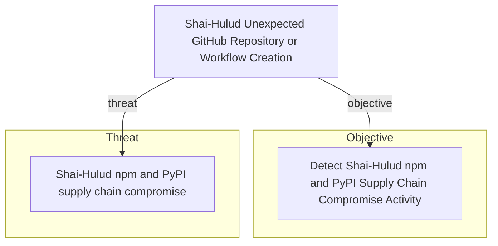

# Shai-Hulud Unexpected GitHub Repository or Workflow Creation

## Metadata

- **UUID**: `7eb85d22-2e60-449f-b92c-8cecc28d34c6`
- **Schema**: `rule::1.0`
- **Version**: `1`
- **Created**: `2026-06-16`
- **Modified**: `2026-06-22`
- **TLP**: clear (`TLP:CLEAR`)
- **Organisation**: EC DIGIT CSOC (`56b0a0f0-b0bc-47d9-bb46-02f80ae2065a`)

## References
### Public
- **1**: [https://www.wiz.io/blog/mini-shai-hulud-strikes-again-tanstack-more-npm-packages-compromised](https://www.wiz.io/blog/mini-shai-hulud-strikes-again-tanstack-more-npm-packages-compromised)
- **2**: [https://www.aikido.dev/blog/mini-shai-hulud-is-back-tanstack-compromised](https://www.aikido.dev/blog/mini-shai-hulud-is-back-tanstack-compromised)
- **3**: [https://tanstack.com/blog/npm-supply-chain-compromise-postmortem](https://tanstack.com/blog/npm-supply-chain-compromise-postmortem)
- **4**: [https://www.stepsecurity.io/blog/mini-shai-hulud-is-back-a-self-spreading-supply-chain-attack-hits-the-npm-ecosystem](https://www.stepsecurity.io/blog/mini-shai-hulud-is-back-a-self-spreading-supply-chain-attack-hits-the-npm-ecosystem)

## Description
#### MDR Technical Details
Microsoft Sentinel scheduled analytic rule implementing DOM signal
`287114bd-7d58-422d-9711-f5516900b9ce` (Unexpected GitHub Repository or
Workflow Creation from Anomalous Context). Searches `GitHubAuditLog` and
`CloudAppEvents` for dead-drop repository markers, suspicious workflow
commits, and package-related audit actions.

#### Detection Criteria
- GitHub audit `Data` or CloudApp `RawEventData` contains campaign strings:
  `Shai-Hulud: Here We Go Again`, `PUSH UR T3MPRR`, or the token-wipe
  commit message.
- OR repository/workflow actions involving `router_init.js`, `setup.mjs`,
  or `.github/workflows` from GitHub application telemetry.
- Time window: 1 hour lookback with 1 hour frequency.
- Severity: High.

#### Exclusion Criteria
- Legitimate open-source forks and hobby repositories — correlate with
  endpoint install anomalies on linked CI runners before escalation.
- Dune-themed repository names alone are insufficient; require marker
  strings or malicious workflow file references.

## Status

- **Status**: `STAGING`
- **Severity**: `Informational`

## Detection model
- **Objective**: [Detect Shai-Hulud npm and PyPI Supply Chain Compromise Activity](Objectives/fb62e879-9e91-4c5b-aaa7-999b2b1b3897.md) (`fb62e879-9e91-4c5b-aaa7-999b2b1b3897`)

## Response

- **Alert severity**: High
### Procedure
- **Analysis**: 1. Identify the GitHub actor and repositories affected.
2. Review repository description and commit messages for campaign markers.
3. Check whether the actor's token was used from a compromised CI runner.
4. Correlate with npm publish and endpoint IOC signals.
- **Containment**: Revoke the compromised GitHub token, delete dead-drop repositories,
and audit workflow files for malicious publish steps.
#### Searches
- **Expand GitHub audit activity for the alerted actor** (sentinel)
```text
GitHubAuditLog
| where TimeGenerated > ago(24h)
| where Actor == "{{Actor}}"
| project TimeGenerated, Action, Repository, Data
| order by TimeGenerated desc
```

## Platform configurations
<details><summary>sentinel</summary>

- **Enabled**: `True`
- **Status**: `DEVELOPMENT`
- **Alert title**: Shai-Hulud GitHub dead-drop activity by {{Actor}}
- **Entity mapping**: Account: Name -> Actor
- **Entity mapping**: IP: Address -> IPAddress

```sql
// Detection: Shai-Hulud unexpected GitHub repository or workflow creation
// DOM signal: 287114bd-7d58-422d-9711-f5516900b9ce
// MITRE ATT&CK: T1195.002, T1078
// Platform: SENTINEL
let ShaiHuludMarkers = dynamic([
    "Shai-Hulud: Here We Go Again",
    "PUSH UR T3MPRR",
    "IfYouRevokeThisTokenItWillWipeTheComputerOfTheOwner"
]);
let MaliciousPaths = dynamic([
    "router_init.js", "setup.mjs", ".github/workflows"
]);
let GitHubAudit =
GitHubAuditLog
| where TimeGenerated > ago(1h)
| extend DataStr = tostring(Data)
| where Action has_any ("repo.", "workflows.", "packages.")
| where DataStr has_any (ShaiHuludMarkers)
    or (Action has "repo.create" and DataStr has "dune")
| project TimeGenerated, Actor, Action, Repository, DataStr,
    IPAddress = "", Source = "GitHubAuditLog";
let CloudAppGitHub =
CloudAppEvents
| where TimeGenerated > ago(1h)
| where Application has "GitHub"
| where ActionType has_any ("Create", "Publish", "Push", "Commit")
| extend RawStr = tostring(RawEventData)
| where RawStr has_any (ShaiHuludMarkers)
    or ObjectName has_any (MaliciousPaths)
| project TimeGenerated, Actor = AccountDisplayName, Action = ActionType,
    Repository = ObjectName, DataStr = RawStr,
    IPAddress, Source = "CloudAppEvents";
union GitHubAudit, CloudAppGitHub
| order by TimeGenerated desc
```


</details>

## Relations

