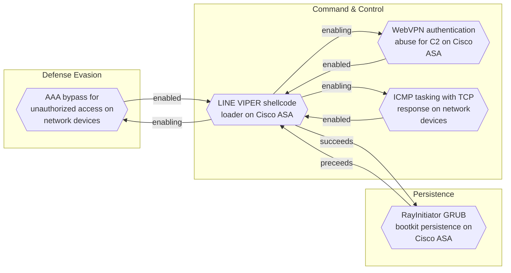
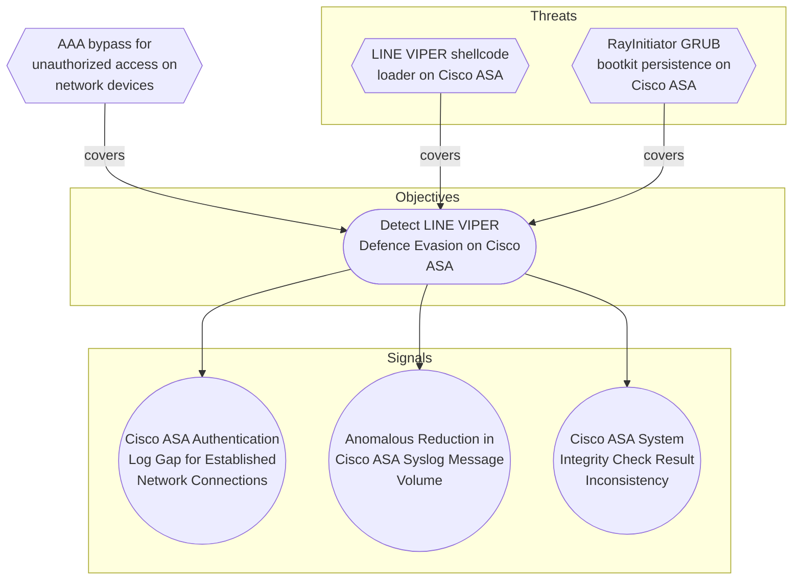

# AAA bypass for unauthorized access on network devices

## Metadata
| Field | Value |
| --- | --- |
| UUID | `53389577-fd8d-4ce6-9852-8365ed947c17` |
| Schema | `threat::1.0` |
| Version | `1` |
| Created | `2026-06-18` |
| Modified | `2026-06-18` |
| TLP | clear (`TLP:CLEAR`) |
| Organisation | EC DIGIT CSOC (`56b0a0f0-b0bc-47d9-bb46-02f80ae2065a`) |

## References
### Public
- **1**: [https://www.ncsc.gov.uk/static-assets/documents/malware-analysis-reports/RayInitiator-LINE-VIPER/ncsc-mar-rayinitiator-line-viper.pdf](https://www.ncsc.gov.uk/static-assets/documents/malware-analysis-reports/RayInitiator-LINE-VIPER/ncsc-mar-rayinitiator-line-viper.pdf)

## Description
LINE VIPER implements a critical capability to bypass
Authentication, Authorization, and Accounting (AAA) mechanisms on
compromised Cisco ASA devices [1]. This allows actor-controlled
devices to access the network infrastructure without proper
authentication and without generating audit logs that would normally
record access attempts.

#### AAA Mechanisms on Cisco ASA

Cisco ASA devices implement AAA as a fundamental security control
for managing access to network resources. The three components work
together to:

- **Authentication:** Verify the identity of users and devices
  attempting to access the network or device management interfaces.

- **Authorization:** Determine what authenticated users and devices
  are permitted to access, based on defined policies and access
  control lists.

- **Accounting:** Record access attempts, commands executed, and
  other activities for audit and compliance purposes.

Bypassing AAA effectively removes all three layers of this security
control, providing unfettered access to the network infrastructure.

#### Implementation and Impact

LINE VIPER's AAA bypass capability operates at the system level
within the compromised Cisco ASA device [1]. The malware modifies
authentication processing to recognise actor-controlled devices and
grant them access without proper validation.

**No Authentication Logs:** A critical aspect of this bypass is that
it prevents the generation of authentication logs for actor devices.
This provides significant operational security benefits:

- **Stealth Access:** Administrators reviewing authentication logs
  will not see any suspicious access attempts or successful logins
  from attacker infrastructure.

- **Audit Trail Evasion:** Compliance and security audits that rely
  on AAA logs will not detect unauthorised access.

- **Incident Response Blindness:** During incident response
  activities, investigators cannot rely on authentication logs to
  understand the scope of compromise or identify attacker
  infrastructure.

- **Forensic Analysis Degradation:** The lack of authentication logs
  significantly impairs forensic timeline construction and
  attribution efforts.

#### Operational Advantages

The AAA bypass provides multiple advantages for maintaining
persistent access to compromised network infrastructure [1]:

- **Persistent Administrative Access:** Actor-controlled devices can
  access management interfaces without authentication, enabling
  configuration changes, command execution, and data collection.

- **Network Pivoting:** Bypassing AAA on network security devices
  allows attackers to pivot through the network infrastructure
  without triggering authentication failures or alerts.

- **Policy Circumvention:** Authorisation policies that would
  normally restrict access to sensitive network segments or
  configurations can be completely bypassed.

- **Detection Evasion:** The absence of failed authentication
  attempts removes a common indicator of malicious activity that
  security monitoring systems typically alert on.

#### Context within LINE VIPER Capabilities

The AAA bypass capability is part of a broader set of defence
evasion and system tampering capabilities in LINE VIPER [1]:

- Works in conjunction with syslog suppression to prevent detection
  of unauthorised access and malicious activities.

- Complements the rootkit functionality that patches system
  integrity checks to hide the malware's presence.

- Enables the CLI command execution capability to operate with
  administrative privileges without authentication barriers.

The combination of AAA bypass with other LINE VIPER capabilities
creates a comprehensive compromise of the network security device,
effectively turning it into an attacker-controlled platform while
maintaining the appearance of normal operation to administrators and
security monitoring systems.

## Criticality
**Severe** - A Severe priority incident is likely to result in a significant impact to public health or safety, national security, economic security, foreign relations, or civil liberties.

## Terrain
Cisco ASA devices with LINE VIPER malware deployed that has memory-
resident hooks in the lina binary [1]. The malware operates with
sufficient privileges to modify AAA processing logic at runtime,
intercepting authentication requests before they reach legitimate
AAA validation routines. This requires prior compromise through
bootkit deployment that provides the necessary execution context and
privileges.

## Surface
> **Routers**
> Network routers

> **Switches**
> Network switches

> **Kerberos**
> Kerberos network authentication protocol

## Threat Assessment
| Dimension | Assessment | Description |
| --- | --- | --- |
| Severity | Substantial incident | A cyber attack which has a serious impact on a medium-sized organisation, or which poses a considerable risk to a large organisation or wider / local government. |
| Impact | Lose Capabilities National Security Reputational Damages Data Breach | Vector execution will remove key functions to the organization, which will not be easily circumvented. Most day-to-day is heavily impaired, but processes can reorganize at a loss. The vector execution will expose or destroy such sufficient critical information infrastructure that the country will have to intervene due to loss to key national  or international functions. Damages to the organization public view may be achieved by using directly the access gained, or indirectly with data gathered. Non-public information has been accessed from the outside, and successfully extracted. |
| Leverage | Elevation of privilege Repudiation Infrastructure Compromise Tampering | Capacity to augment leverage over the target system by upgrading the compromised access rights Threat action aimed at performing prohibited operations in a system that lacks the ability to trace the operations. The compromised target is likely to be used to further expand the sphere of influence of the attacker and allow more potent vectors to be executed. Threat action intending to maliciously change or modify persistent data, such as records in a database, and the alteration of data in transit between two computers over an open network, such as the Internet. |
| Viability | Likely | Probable (probably) - 55-80% |
| Kill Chain | Defense Evasion | Techniques an attacker may specifically use for evading detection or avoiding other defenses. |

## ATT&CK Techniques
| Technique | Name | Description |
| --- | --- | --- |
| `T1562.001` | [Impair Defenses: Disable or Modify Tools](https://attack.mitre.org/techniques/T1562/001) | Adversaries may modify and/or disable security tools to avoid possible detection of their malware/tools and activities. This may take many forms, such as killing security software processes or services, modifying / deleting Registry keys or configuration files so that tools do not operate properly, or other methods to interfere with security tools scanning or reporting information. Adversaries may also disable updates to prevent the latest security patches from reaching tools on victim systems.(Citation: SCADAfence_ransomware)  Adversaries may also tamper with artifacts deployed and utilized by security tools. Security tools may make dynamic changes to system components in order to maintain visibility into specific events. For example, security products may load their own modules and/or modify those loaded by processes to facilitate data collection. Similar to [Indicator Blocking](https://attack.mitre.org/techniques/T1562/006), adversaries may unhook or otherwise modify these features added by tools (especially those that exist in userland or are otherwise potentially accessible to adversaries) to avoid detection.(Citation: OutFlank System Calls)(Citation: MDSec System Calls) Alternatively, they may add new directories to an endpoint detection and response (EDR) tool’s exclusion list, enabling them to hide malicious files via [File/Path Exclusions](https://attack.mitre.org/techniques/T1564/012).(Citation: BlackBerry WhisperGate 2022)(Citation: Google Cloud Threat Intelligence FIN13 2021)  Adversaries may also focus on specific applications such as Sysmon. For example, the “Start” and “Enable” values in <code>HKEY_LOCAL_MACHINE\SYSTEM\CurrentControlSet\Control\WMI\Autologger\EventLog-Microsoft-Windows-Sysmon-Operational</code> may be modified to tamper with and potentially disable Sysmon logging.(Citation: disable_win_evt_logging)   On network devices, adversaries may attempt to skip digital signature verification checks by altering startup configuration files and effectively disabling firmware verification that typically occurs at boot.(Citation: Fortinet Zero-Day and Custom Malware Used by Suspected Chinese Actor in Espionage Operation)(Citation: Analysis of FG-IR-22-369)  In cloud environments, tools disabled by adversaries may include cloud monitoring agents that report back to services such as AWS CloudWatch or Google Cloud Monitor.  Furthermore, although defensive tools may have anti-tampering mechanisms, adversaries may abuse tools such as legitimate rootkit removal kits to impair and/or disable these tools.(Citation: chasing_avaddon_ransomware)(Citation: dharma_ransomware)(Citation: demystifying_ryuk)(Citation: doppelpaymer_crowdstrike) For example, adversaries have used tools such as GMER to find and shut down hidden processes and antivirus software on infected systems.(Citation: demystifying_ryuk)  Additionally, adversaries may exploit legitimate drivers from anti-virus software to gain access to kernel space (i.e. [Exploitation for Privilege Escalation](https://attack.mitre.org/techniques/T1068)), which may lead to bypassing anti-tampering features.(Citation: avoslocker_ransomware) |
| `T1562` | [Impair Defenses](https://attack.mitre.org/techniques/T1562) | Adversaries may maliciously modify components of a victim environment in order to hinder or disable defensive mechanisms. This not only involves impairing preventative defenses, such as firewalls and anti-virus, but also detection capabilities that defenders can use to audit activity and identify malicious behavior. This may also span both native defenses as well as supplemental capabilities installed by users and administrators.  Adversaries may also impair routine operations that contribute to defensive hygiene, such as blocking users from logging out, preventing a system from shutting down, or disabling or modifying the update process. Adversaries could also target event aggregation and analysis mechanisms, or otherwise disrupt these procedures by altering other system components. These restrictions can further enable malicious operations as well as the continued propagation of incidents.(Citation: Google Cloud Mandiant UNC3886 2024)(Citation: Emotet shutdown) |
| `T1556` | [Modify Authentication Process](https://attack.mitre.org/techniques/T1556) | Adversaries may modify authentication mechanisms and processes to access user credentials or enable otherwise unwarranted access to accounts. The authentication process is handled by mechanisms, such as the Local Security Authentication Server (LSASS) process and the Security Accounts Manager (SAM) on Windows, pluggable authentication modules (PAM) on Unix-based systems, and authorization plugins on MacOS systems, responsible for gathering, storing, and validating credentials. By modifying an authentication process, an adversary may be able to authenticate to a service or system without using [Valid Accounts](https://attack.mitre.org/techniques/T1078).  Adversaries may maliciously modify a part of this process to either reveal credentials or bypass authentication mechanisms. Compromised credentials or access may be used to bypass access controls placed on various resources on systems within the network and may even be used for persistent access to remote systems and externally available services, such as VPNs, Outlook Web Access and remote desktop. |
| `T1550` | [Use Alternate Authentication Material](https://attack.mitre.org/techniques/T1550) | Adversaries may use alternate authentication material, such as password hashes, Kerberos tickets, and application access tokens, in order to move laterally within an environment and bypass normal system access controls.   Authentication processes generally require a valid identity (e.g., username) along with one or more authentication factors (e.g., password, pin, physical smart card, token generator, etc.). Alternate authentication material is legitimately generated by systems after a user or application successfully authenticates by providing a valid identity and the required authentication factor(s). Alternate authentication material may also be generated during the identity creation process.(Citation: NIST Authentication)(Citation: NIST MFA)  Caching alternate authentication material allows the system to verify an identity has successfully authenticated without asking the user to reenter authentication factor(s). Because the alternate authentication must be maintained by the system—either in memory or on disk—it may be at risk of being stolen through [Credential Access](https://attack.mitre.org/tactics/TA0006) techniques. By stealing alternate authentication material, adversaries are able to bypass system access controls and authenticate to systems without knowing the plaintext password or any additional authentication factors. |

## Chaining

### Chaining details
#### enabled -> [LINE VIPER shellcode loader on Cisco ASA](line-viper-shellcode-loader-on-cisco-asa.md) (`b6175f16-2b61-4116-bd97-de54b02b197e`) (`support::enabled`)
The AAA bypass capability is enabled by LINE VIPER's memory-
resident hooks in the lina binary. The implant intercepts AAA
processing logic at runtime before authentication requests reach
legitimate AAA validation routines, granting actor-controlled
devices access without generating authentication logs [1].

- **Target UUID**: `b6175f16-2b61-4116-bd97-de54b02b197e`

## Coverage

## Related objects
| Type | Name | Direction | Relation |
| --- | --- | --- | --- |
| Objective | [Detect LINE VIPER Defence Evasion on Cisco ASA](../Objectives/detect-line-viper-defence-evasion-on-cisco-asa.md) (`7c0f2788-690e-4d34-b9eb-5f76e7363ccc`) | Downstream | objective |
| Signal | [Cisco ASA Authentication Log Gap for Established Network Connections](../Objectives/detect-line-viper-defence-evasion-on-cisco-asa.md#cisco-asa-authentication-log-gap-for-established-network-connections) (`0114324a-80a5-46cb-a75c-6f4a2301b7e5`) | Downstream | signal |
| Signal | [Anomalous Reduction in Cisco ASA Syslog Message Volume](../Objectives/detect-line-viper-defence-evasion-on-cisco-asa.md#anomalous-reduction-in-cisco-asa-syslog-message-volume) (`10482800-4d71-4246-93f4-6edfc4705b86`) | Downstream | signal |
| Signal | [Cisco ASA System Integrity Check Result Inconsistency](../Objectives/detect-line-viper-defence-evasion-on-cisco-asa.md#cisco-asa-system-integrity-check-result-inconsistency) (`9666e19f-f48d-4a0b-bb3e-0efbd69e8eac`) | Downstream | signal |
