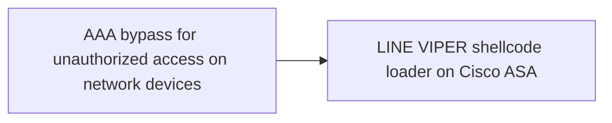
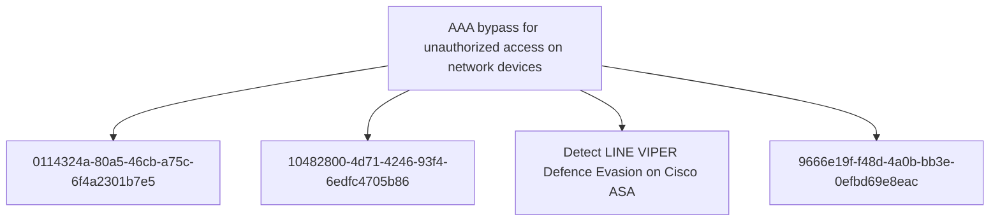

# AAA bypass for unauthorized access on network devices

## Metadata

- **UUID**: `53389577-fd8d-4ce6-9852-8365ed947c17`
- **Schema**: `threat::1.0`
- **TLP**: clear

## Description
LINE VIPER implements a critical capability to bypass
Authentication, Authorization, and Accounting (AAA) mechanisms on
compromised Cisco ASA devices [1]. This allows actor-controlled
devices to access the network infrastructure without proper
authentication and without generating audit logs that would normally
record access attempts.

#### AAA Mechanisms on Cisco ASA

Cisco ASA devices implement AAA as a fundamental security control
for managing access to network resources. The three components work
together to:

- **Authentication:** Verify the identity of users and devices
  attempting to access the network or device management interfaces.

- **Authorization:** Determine what authenticated users and devices
  are permitted to access, based on defined policies and access
  control lists.

- **Accounting:** Record access attempts, commands executed, and
  other activities for audit and compliance purposes.

Bypassing AAA effectively removes all three layers of this security
control, providing unfettered access to the network infrastructure.

#### Implementation and Impact

LINE VIPER's AAA bypass capability operates at the system level
within the compromised Cisco ASA device [1]. The malware modifies
authentication processing to recognise actor-controlled devices and
grant them access without proper validation.

**No Authentication Logs:** A critical aspect of this bypass is that
it prevents the generation of authentication logs for actor devices.
This provides significant operational security benefits:

- **Stealth Access:** Administrators reviewing authentication logs
  will not see any suspicious access attempts or successful logins
  from attacker infrastructure.

- **Audit Trail Evasion:** Compliance and security audits that rely
  on AAA logs will not detect unauthorised access.

- **Incident Response Blindness:** During incident response
  activities, investigators cannot rely on authentication logs to
  understand the scope of compromise or identify attacker
  infrastructure.

- **Forensic Analysis Degradation:** The lack of authentication logs
  significantly impairs forensic timeline construction and
  attribution efforts.

#### Operational Advantages

The AAA bypass provides multiple advantages for maintaining
persistent access to compromised network infrastructure [1]:

- **Persistent Administrative Access:** Actor-controlled devices can
  access management interfaces without authentication, enabling
  configuration changes, command execution, and data collection.

- **Network Pivoting:** Bypassing AAA on network security devices
  allows attackers to pivot through the network infrastructure
  without triggering authentication failures or alerts.

- **Policy Circumvention:** Authorisation policies that would
  normally restrict access to sensitive network segments or
  configurations can be completely bypassed.

- **Detection Evasion:** The absence of failed authentication
  attempts removes a common indicator of malicious activity that
  security monitoring systems typically alert on.

#### Context within LINE VIPER Capabilities

The AAA bypass capability is part of a broader set of defence
evasion and system tampering capabilities in LINE VIPER [1]:

- Works in conjunction with syslog suppression to prevent detection
  of unauthorised access and malicious activities.

- Complements the rootkit functionality that patches system
  integrity checks to hide the malware's presence.

- Enables the CLI command execution capability to operate with
  administrative privileges without authentication barriers.

The combination of AAA bypass with other LINE VIPER capabilities
creates a comprehensive compromise of the network security device,
effectively turning it into an attacker-controlled platform while
maintaining the appearance of normal operation to administrators and
security monitoring systems.

## Techniques
- T1562.001
- T1562
- T1556
- T1550

## Chaining

## Relations

