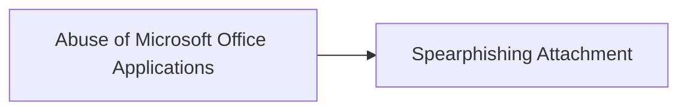

# Abuse of Microsoft Office Applications

## Metadata

- **UUID**: `b663b684-a80f-4570-89b6-2f7faa16fece`
- **Schema**: `threat::1.0`
- **TLP**: clear

## Description
An employee named receives an email that appears to be from a trusted business 
partner or colleague. The email contains an office document. The end-user clic on it.

The attached file, is a macro-enabled Word document. It usually pops-up with 
the following message :
"This document was created in an earlier version of Microsoft Word. 
Please click 'Enable Content' above to view the full document."

This message is designed to entice end-user to enable macros or active content, 
which is disabled by default for security reasons.

By clicking ont it, it allows the embedded macro, written in 
Visual Basic for Applications (VBA), to execute without further prompts.

Once executed, the macro initiates a hidden process that launches Windows PowerShell, 
which run:

- Run silently without displaying a window to the user.
- Bypass execution policies that normally restrict script running.
- Connect to an external server controlled by the attacker.
- Download and execute additional malicious code or a payload.

Threat actors may also modify Windows Registry settings related to 
Microsoft Office security.

- Disabling the COM Kill Bit: This involves changing registry values 
that control the activation of certain COM objects or ActiveX controls 
within Office applications. By disabling the "kill bit," the threat actor 
re-enables outdated or vulnerable components that can be exploited.

- Altering Macro Security Settings: Changing registry keys to lower the 
macro security level, allowing macros to run without prompts in the future.

To maintain long-term access to the compromised system, 
the attacker may target Microsoft Outlook.

- Embedding Malicious Code in Outlook's VBA Project:
- The attacker adds VBA code to Outlook's VbaProject.otm file.
This code executes every time Outlook starts, performing actions without the user's knowledge.

## Techniques
- T1059.005
- T1204.002
- T1137
- T1203

## Chaining

