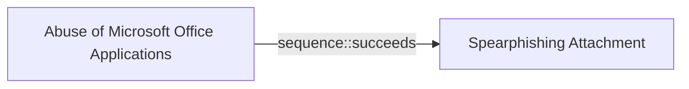

# Abuse of Microsoft Office Applications

## Metadata

- **UUID**: `b663b684-a80f-4570-89b6-2f7faa16fece`
- **Schema**: `threat::1.0`
- **Version**: `1`
- **Created**: `2024-10-31`
- **Modified**: `2024-10-31`
- **TLP**: clear (`TLP:CLEAR`)
- **Organisation**: EC DIGIT CSOC (`56b0a0f0-b0bc-47d9-bb46-02f80ae2065a`)

## Description
An employee named receives an email that appears to be from a trusted business 
partner or colleague. The email contains an office document. The end-user clic on it.

The attached file, is a macro-enabled Word document. It usually pops-up with 
the following message :
"This document was created in an earlier version of Microsoft Word. 
Please click 'Enable Content' above to view the full document."

This message is designed to entice end-user to enable macros or active content, 
which is disabled by default for security reasons.

By clicking ont it, it allows the embedded macro, written in 
Visual Basic for Applications (VBA), to execute without further prompts.

Once executed, the macro initiates a hidden process that launches Windows PowerShell, 
which run:

- Run silently without displaying a window to the user.
- Bypass execution policies that normally restrict script running.
- Connect to an external server controlled by the attacker.
- Download and execute additional malicious code or a payload.

Threat actors may also modify Windows Registry settings related to 
Microsoft Office security.

- Disabling the COM Kill Bit: This involves changing registry values 
that control the activation of certain COM objects or ActiveX controls 
within Office applications. By disabling the "kill bit," the threat actor 
re-enables outdated or vulnerable components that can be exploited.

- Altering Macro Security Settings: Changing registry keys to lower the 
macro security level, allowing macros to run without prompts in the future.

To maintain long-term access to the compromised system, 
the attacker may target Microsoft Outlook.

- Embedding Malicious Code in Outlook's VBA Project:
- The attacker adds VBA code to Outlook's VbaProject.otm file.
This code executes every time Outlook starts, performing actions without the user's knowledge.

## Criticality
**Medium** - A Medium priority incident may affect public health or safety, national security, economic security, foreign relations, civil liberties, or public confidence.

## Terrain
> **Target systems must have Microsoft Office applications installed with macros 
enabled or be susceptible to social engineering tactics that prompt users 
to enable macros or execute malicious content.

Domains: Enterprise
Targets: Email Platform, Desktop, Laptop, Critical Documents, Personal Information, Workstations
Platforms: Windows, Office 365, Microsoft SharePoint, Outlook Web Access**

## Threat Assessment
| Dimension | Assessment | Description |
| --- | --- | --- |
| Severity | Moderate incident | A cyber attack on a small organisation, or which poses a considerable risk to a medium-sized organisation, or preliminary indications of cyber activity against a large organisation or the government. |
| Impact | Data Breach; IP Loss; Identity Theft; Business disruption | - |
| Leverage | Spoofing; Tampering; Information Disclosure; Elevation of privilege; Software installation | - |
| Viability | Very Likely | Highly probable - 80-95% |
| Kill Chain | Execution | Techniques that result in execution of attacker-controlled code on a local or remote system. |

## Actors
| Actor | ID | Source | Description |
| --- | --- | --- | --- |
| [[Enterprise] APT28](https://attack.mitre.org/groups/G0007) | `att&ck::G0007` | ('att&ck',) | [APT28](https://attack.mitre.org/groups/G0007) is a threat group that has been attributed to Russia's General Staff Main Intelligence Directorate (GRU) 85th Main Special Service Center (GTsSS) military unit 26165.(Citation: NSA/FBI Drovorub August 2020)(Citation: Cybersecurity Advisory GRU Brute Force Campaign July 2021) This group has been active since at least 2004.(Citation: DOJ GRU Indictment Jul 2018)(Citation: Ars Technica GRU indictment Jul 2018)(Citation: Crowdstrike DNC June 2016)(Citation: FireEye APT28)(Citation: SecureWorks TG-4127)(Citation: FireEye APT28 January 2017)(Citation: GRIZZLY STEPPE JAR)(Citation: Sofacy DealersChoice)(Citation: Palo Alto Sofacy 06-2018)(Citation: Symantec APT28 Oct 2018)(Citation: ESET Zebrocy May 2019)  [APT28](https://attack.mitre.org/groups/G0007) reportedly compromised the Hillary Clinton campaign, the Democratic National Committee, and the Democratic Congressional Campaign Committee in 2016 in an attempt to interfere with the U.S. presidential election.(Citation: Crowdstrike DNC June 2016) In 2018, the US indicted five GRU Unit 26165 officers associated with [APT28](https://attack.mitre.org/groups/G0007) for cyber operations (including close-access operations) conducted between 2014 and 2018 against the World Anti-Doping Agency (WADA), the US Anti-Doping Agency, a US nuclear facility, the Organization for the Prohibition of Chemical Weapons (OPCW), the Spiez Swiss Chemicals Laboratory, and other organizations.(Citation: US District Court Indictment GRU Oct 2018) Some of these were conducted with the assistance of GRU Unit 74455, which is also referred to as [Sandworm Team](https://attack.mitre.org/groups/G0034). |
| APT28 | `misp::5b4ee3ea-eee3-4c8e-8323-85ae32658754` | ('misp',) | The Sofacy Group (also known as APT28, Pawn Storm, Fancy Bear and Sednit) is a cyber espionage group believed to have ties to the Russian government. Likely operating since 2007, the group is known to target government, military, and security organizations. It has been characterized as an advanced persistent threat. |
| [[Enterprise] APT29](https://attack.mitre.org/groups/G0016) | `att&ck::G0016` | ('att&ck',) | [APT29](https://attack.mitre.org/groups/G0016) is threat group that has been attributed to Russia's Foreign Intelligence Service (SVR).(Citation: White House Imposing Costs RU Gov April 2021)(Citation: UK Gov Malign RIS Activity April 2021) They have operated since at least 2008, often targeting government networks in Europe and NATO member countries, research institutes, and think tanks. [APT29](https://attack.mitre.org/groups/G0016) reportedly compromised the Democratic National Committee starting in the summer of 2015.(Citation: F-Secure The Dukes)(Citation: GRIZZLY STEPPE JAR)(Citation: Crowdstrike DNC June 2016)(Citation: UK Gov UK Exposes Russia SolarWinds April 2021)  In April 2021, the US and UK governments attributed the [SolarWinds Compromise](https://attack.mitre.org/campaigns/C0024) to the SVR; public statements included citations to [APT29](https://attack.mitre.org/groups/G0016), Cozy Bear, and The Dukes.(Citation: NSA Joint Advisory SVR SolarWinds April 2021)(Citation: UK NSCS Russia SolarWinds April 2021) Industry reporting also referred to the actors involved in this campaign as UNC2452, NOBELIUM, StellarParticle, Dark Halo, and SolarStorm.(Citation: FireEye SUNBURST Backdoor December 2020)(Citation: MSTIC NOBELIUM Mar 2021)(Citation: CrowdStrike SUNSPOT Implant January 2021)(Citation: Volexity SolarWinds)(Citation: Cybersecurity Advisory SVR TTP May 2021)(Citation: Unit 42 SolarStorm December 2020) |
| UNC2452 | `misp::2ee5ed7a-c4d0-40be-a837-20817474a15b` | ('misp',) | Reporting regarding activity related to the SolarWinds supply chain injection has grown quickly since initial disclosure on 13 December 2020. A significant amount of press reporting has focused on the identification of the actor(s) involved, victim organizations, possible campaign timeline, and potential impact. The US Government and cyber community have also provided detailed information on how the campaign was likely conducted and some of the malware used.  MITRE’s ATT&CK team — with the assistance of contributors — has been mapping techniques used by the actor group, referred to as UNC2452/Dark Halo by FireEye and Volexity respectively, as well as SUNBURST and TEARDROP malware. |
| [[Enterprise] FIN7](https://attack.mitre.org/groups/G0046) | `att&ck::G0046` | ('att&ck',) | [FIN7](https://attack.mitre.org/groups/G0046) is a financially-motivated threat group that has been active since 2013. [FIN7](https://attack.mitre.org/groups/G0046) has primarily targeted the retail, restaurant, hospitality, software, consulting, financial services, medical equipment, cloud services, media, food and beverage, transportation, and utilities industries in the U.S. A portion of [FIN7](https://attack.mitre.org/groups/G0046) was run out of a front company called Combi Security and often used point-of-sale malware for targeting efforts. Since 2020, [FIN7](https://attack.mitre.org/groups/G0046) shifted operations to a big game hunting (BGH) approach including use of [REvil](https://attack.mitre.org/software/S0496) ransomware and their own Ransomware as a Service (RaaS), Darkside. FIN7 may be linked to the [Carbanak](https://attack.mitre.org/groups/G0008) Group, but there appears to be several groups using [Carbanak](https://attack.mitre.org/software/S0030) malware and are therefore tracked separately.(Citation: FireEye FIN7 March 2017)(Citation: FireEye FIN7 April 2017)(Citation: FireEye CARBANAK June 2017)(Citation: FireEye FIN7 Aug 2018)(Citation: CrowdStrike Carbon Spider August 2021)(Citation: Mandiant FIN7 Apr 2022) |
| FIN7 | `misp::00220228-a5a4-4032-a30d-826bb55aa3fb` | ('misp',) | Groups targeting financial organizations or people with significant financial assets. |
| [[Enterprise] TA505](https://attack.mitre.org/groups/G0092) | `att&ck::G0092` | ('att&ck',) | [TA505](https://attack.mitre.org/groups/G0092) is a cyber criminal group that has been active since at least 2014. [TA505](https://attack.mitre.org/groups/G0092) is known for frequently changing malware, driving global trends in criminal malware distribution, and ransomware campaigns involving [Clop](https://attack.mitre.org/software/S0611).(Citation: Proofpoint TA505 Sep 2017)(Citation: Proofpoint TA505 June 2018)(Citation: Proofpoint TA505 Jan 2019)(Citation: NCC Group TA505)(Citation: Korean FSI TA505 2020) |
| TA505 | `misp::03c80674-35f8-4fe0-be2b-226ed0fcd69f` | ('misp',) | TA505, the name given by Proofpoint, has been in the cybercrime business for at least four years. This is the group behind the infamous Dridex banking trojan and Locky ransomware, delivered through malicious email campaigns via Necurs botnet. Other malware associated with TA505 include Philadelphia and GlobeImposter ransomware families. |
| [[Enterprise] Wizard Spider](https://attack.mitre.org/groups/G0102) | `att&ck::G0102` | ('att&ck',) | [Wizard Spider](https://attack.mitre.org/groups/G0102) is a Russia-based financially motivated threat group originally known for the creation and deployment of [TrickBot](https://attack.mitre.org/software/S0266) since at least 2016. [Wizard Spider](https://attack.mitre.org/groups/G0102) possesses a diverse arsenal of tools and has conducted ransomware campaigns against a variety of organizations, ranging from major corporations to hospitals.(Citation: CrowdStrike Ryuk January 2019)(Citation: DHS/CISA Ransomware Targeting Healthcare October 2020)(Citation: CrowdStrike Wizard Spider October 2020) |
| UNC1878 | `misp::3c2bb7d7-a085-4594-adc7-4a20cf724abb` | ('misp',) | UNC1878 is a financially motivated threat actor that monetizes network access via the deployment of RYUK ransomware. Earlier this year, Mandiant published a blog on a fast-moving adversary deploying RYUK ransomware, UNC1878. Shortly after its release, there was a significant decrease in observed UNC1878 intrusions and RYUK activity overall almost completely vanishing over the summer. But beginning in early fall, Mandiant has seen a resurgence of RYUK along with TTP overlaps indicating that UNC1878 has returned from the grave and resumed their operations. |

## ATT&CK Techniques
| Technique | Name | Description |
| --- | --- | --- |
| `T1059.005` | [Command and Scripting Interpreter: Visual Basic](https://attack.mitre.org/techniques/T1059/005) | Adversaries may abuse Visual Basic (VB) for execution. VB is a programming language created by Microsoft with interoperability with many Windows technologies such as [Component Object Model](https://attack.mitre.org/techniques/T1559/001) and the [Native API](https://attack.mitre.org/techniques/T1106) through the Windows API. Although tagged as legacy with no planned future evolutions, VB is integrated and supported in the .NET Framework and cross-platform .NET Core.(Citation: VB .NET Mar 2020)(Citation: VB Microsoft)  Derivative languages based on VB have also been created, such as Visual Basic for Applications (VBA) and VBScript. VBA is an event-driven programming language built into Microsoft Office, as well as several third-party applications.(Citation: Microsoft VBA)(Citation: Wikipedia VBA) VBA enables documents to contain macros used to automate the execution of tasks and other functionality on the host. VBScript is a default scripting language on Windows hosts and can also be used in place of [JavaScript](https://attack.mitre.org/techniques/T1059/007) on HTML Application (HTA) webpages served to Internet Explorer (though most modern browsers do not come with VBScript support).(Citation: Microsoft VBScript)  Adversaries may use VB payloads to execute malicious commands. Common malicious usage includes automating execution of behaviors with VBScript or embedding VBA content into [Spearphishing Attachment](https://attack.mitre.org/techniques/T1566/001) payloads (which may also involve [Mark-of-the-Web Bypass](https://attack.mitre.org/techniques/T1553/005) to enable execution).(Citation: Default VBS macros Blocking ) |
| `T1204.002` | [User Execution: Malicious File](https://attack.mitre.org/techniques/T1204/002) | An adversary may rely upon a user opening a malicious file in order to gain execution. Users may be subjected to social engineering to get them to open a file that will lead to code execution. This user action will typically be observed as follow-on behavior from [Spearphishing Attachment](https://attack.mitre.org/techniques/T1566/001). Adversaries may use several types of files that require a user to execute them, including .doc, .pdf, .xls, .rtf, .scr, .exe, .lnk, .pif, .cpl, and .reg.  Adversaries may employ various forms of [Masquerading](https://attack.mitre.org/techniques/T1036) and [Obfuscated Files or Information](https://attack.mitre.org/techniques/T1027) to increase the likelihood that a user will open and successfully execute a malicious file. These methods may include using a familiar naming convention and/or password protecting the file and supplying instructions to a user on how to open it.(Citation: Password Protected Word Docs)   While [Malicious File](https://attack.mitre.org/techniques/T1204/002) frequently occurs shortly after Initial Access it may occur at other phases of an intrusion, such as when an adversary places a file in a shared directory or on a user's desktop hoping that a user will click on it. This activity may also be seen shortly after [Internal Spearphishing](https://attack.mitre.org/techniques/T1534). |
| `T1137` | [Office Application Startup](https://attack.mitre.org/techniques/T1137) | Adversaries may leverage Microsoft Office-based applications for persistence between startups. Microsoft Office is a fairly common application suite on Windows-based operating systems within an enterprise network. There are multiple mechanisms that can be used with Office for persistence when an Office-based application is started; this can include the use of Office Template Macros and add-ins.  A variety of features have been discovered in Outlook that can be abused to obtain persistence, such as Outlook rules, forms, and Home Page.(Citation: SensePost Ruler GitHub) These persistence mechanisms can work within Outlook or be used through Office 365.(Citation: TechNet O365 Outlook Rules) |
| `T1203` | [Exploitation for Client Execution](https://attack.mitre.org/techniques/T1203) | Adversaries may exploit software vulnerabilities in client applications to execute code. Vulnerabilities can exist in software due to unsecure coding practices that can lead to unanticipated behavior. Adversaries can take advantage of certain vulnerabilities through targeted exploitation for the purpose of arbitrary code execution. Oftentimes the most valuable exploits to an offensive toolkit are those that can be used to obtain code execution on a remote system because they can be used to gain access to that system. Users will expect to see files related to the applications they commonly used to do work, so they are a useful target for exploit research and development because of their high utility.  Several types exist:  ### Browser-based Exploitation  Web browsers are a common target through [Drive-by Compromise](https://attack.mitre.org/techniques/T1189) and [Spearphishing Link](https://attack.mitre.org/techniques/T1566/002). Endpoint systems may be compromised through normal web browsing or from certain users being targeted by links in spearphishing emails to adversary controlled sites used to exploit the web browser. These often do not require an action by the user for the exploit to be executed.  ### Office Applications  Common office and productivity applications such as Microsoft Office are also targeted through [Phishing](https://attack.mitre.org/techniques/T1566). Malicious files will be transmitted directly as attachments or through links to download them. These require the user to open the document or file for the exploit to run.  ### Common Third-party Applications  Other applications that are commonly seen or are part of the software deployed in a target network may also be used for exploitation. Applications such as Adobe Reader and Flash, which are common in enterprise environments, have been routinely targeted by adversaries attempting to gain access to systems. Depending on the software and nature of the vulnerability, some may be exploited in the browser or require the user to open a file. For instance, some Flash exploits have been delivered as objects within Microsoft Office documents. |

## Chaining

### Chaining details
#### succeeds -> Spearphishing Attachment (`sequence::succeeds`)
Most of malware comes from email attachment and can be executed afterwards

- **Target UUID**: `dd5d942c-bac4-4000-b9a6-ca4fef6cfb84`
