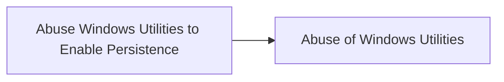

# Abuse Windows Utilities to Enable Persistence

## Metadata

- **UUID**: `66277f27-d57b-47f8-bc9c-b024c7cd1313`
- **Schema**: `threat::1.0`
- **TLP**: clear

## Description
1. Msdeploy.exe\
**Description**: The Microsoft Web Deployment Tool used for syncing content
and configurations. Threat actors can deploy web shells or 
malicious applications to servers.

Examples:

```python
msdeploy.exe -verb:sync -source:contentPath=C:\malicious_site -dest:contentPath="Default Web Site"
```
This command synchronizes the contents from the local directory C:\malicious_site 
to the IIS web application named "Default Web Site". It deploys or updates the web 
content of the default website with the files from C:\malicious_site.

```python
Msdeploy.exe -verb:sync -source:runCommand="cmd /c start malicious.exe" -dest:auto,computerName=target-server
```
This command uses Msdeploy.exe to run a command on a remote server (target-server)
that starts a malicious executable (malicious.exe), allowing the attacker to maintain
persistence and execute code under the guise of a legitimate process.

2. Shadow.exe\
**Description**: A Terminal Services command that monitors or controls 
Remote Desktop sessions. Threat actors can hijack sessions 
to maintain persistence or spy on users.

Example:

```python
shadow.exe 1 /server:target-server
```
Using shadow.exe, an attacker can connect to an active RDP session on target-server, 
potentially allowing them to observe or control the session without the user's knowledge. 
This can be used to capture sensitive information or further compromise the system.

## Techniques
- T1547.001
- T1218

## Chaining

