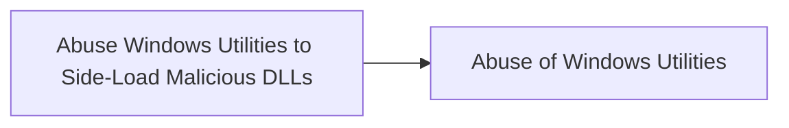

# Abuse Windows Utilities to Side-Load Malicious DLLs

## Metadata

- **UUID**: `86f62c3a-6556-4a64-a9f5-a79168ad42d9`
- **Schema**: `threat::1.0`
- **TLP**: clear

## Description
### 1. Squirrel.exe

**Description**: Associated with the Squirrel installation/update framework. 
Threat actors can perform DLL side-loading by placing a malicious DLL 
that squirrel.exe loads during execution.

Example:

> Attackers place a malicious DLL named Squirrel.dll in the same directory as squirrel.exe.

```
C:\Program Files\App\Squirrel.exe
C:\Program Files\App\Squirrel.dll  (malicious)
```

### 2. Tracker.exe

**Description**: A Windows process related to search indexing. 
It can be abused for DLL side-loading.

Example:

> An attacker places a malicious DLL named tracker.dll in the same directory as tracker.exe.

```
C:\Windows\System32\tracker.exe
C:\Windows\System32\tracker.dll  (malicious)
```

### 3. Tttracer.exe and Ttdinject.exe

**Description**: Part of the Windows Time Travel Tracing toolset. 
Threat actors can inject code into processes or load malicious DLLs.

Example:

```
ttdinject.exe -p <PID> -l C:\path\to\malicious.dll
```

## 4. Wmiprvse.exe\

**Description**: stands for Windows Management Instrumentation Provider Service
Threat actors can exploit wmiprvse.exe for DLL side-loading by placing malicious WMI provider 
DLLs that wmiprvse.exe loads during execution.

Example:

```
C:\Windows\System32\wbem\wmiprvse.exe
C:\Windows\System32\wbem\malicious_provider.dll  (malicious)
```

### 5. InstallUtil.exe\

**Description**: A command-line utility that allows for the installation 
and uninstallation of resources by executing installer components specified 
in .NET assemblies. Threat actors can run malicious code by passing a crafted assembly.

Example:

```
InstallUtil.exe /logfile= /LogToConsole=false /U C:\path\to\malicious.dll
```

### 6. Odbcconf.exe\

**Description**: Configures ODBC drivers and data source names. Can be used to execute DLLs.

Example:

```
odbcconf.exe /S /A {REGSVR C:\path\to\malicious.dll}
```

## Techniques
- T1574.001

## Chaining

