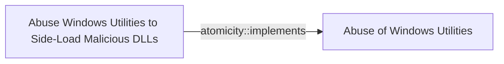

# Abuse Windows Utilities to Side-Load Malicious DLLs

## Metadata

- **UUID**: `86f62c3a-6556-4a64-a9f5-a79168ad42d9`
- **Schema**: `threat::1.0`
- **Version**: `1`
- **Created**: `2024-11-05`
- **Modified**: `2024-11-05`
- **TLP**: clear (`TLP:CLEAR`)
- **Organisation**: EC DIGIT CSOC (`56b0a0f0-b0bc-47d9-bb46-02f80ae2065a`)

## Description
### 1. Squirrel.exe

**Description**: Associated with the Squirrel installation/update framework. 
Threat actors can perform DLL side-loading by placing a malicious DLL 
that squirrel.exe loads during execution.

Example:

> Attackers place a malicious DLL named Squirrel.dll in the same directory as squirrel.exe.

```
C:\Program Files\App\Squirrel.exe
C:\Program Files\App\Squirrel.dll  (malicious)
```

### 2. Tracker.exe

**Description**: A Windows process related to search indexing. 
It can be abused for DLL side-loading.

Example:

> An attacker places a malicious DLL named tracker.dll in the same directory as tracker.exe.

```
C:\Windows\System32\tracker.exe
C:\Windows\System32\tracker.dll  (malicious)
```

### 3. Tttracer.exe and Ttdinject.exe

**Description**: Part of the Windows Time Travel Tracing toolset. 
Threat actors can inject code into processes or load malicious DLLs.

Example:

```
ttdinject.exe -p <PID> -l C:\path\to\malicious.dll
```

## 4. Wmiprvse.exe\

**Description**: stands for Windows Management Instrumentation Provider Service
Threat actors can exploit wmiprvse.exe for DLL side-loading by placing malicious WMI provider 
DLLs that wmiprvse.exe loads during execution.

Example:

```
C:\Windows\System32\wbem\wmiprvse.exe
C:\Windows\System32\wbem\malicious_provider.dll  (malicious)
```

### 5. InstallUtil.exe\

**Description**: A command-line utility that allows for the installation 
and uninstallation of resources by executing installer components specified 
in .NET assemblies. Threat actors can run malicious code by passing a crafted assembly.

Example:

```
InstallUtil.exe /logfile= /LogToConsole=false /U C:\path\to\malicious.dll
```

### 6. Odbcconf.exe\

**Description**: Configures ODBC drivers and data source names. Can be used to execute DLLs.

Example:

```
odbcconf.exe /S /A {REGSVR C:\path\to\malicious.dll}
```

## Criticality
**Medium** - A Medium priority incident may affect public health or safety, national security, economic security, foreign relations, civil liberties, or public confidence.

## Terrain
> **The targeted Windows systems must have applications that improperly handle DLL loading, 
allowing unsigned or malicious DLLs to be loaded without proper validation. 
This often involves software that looks for DLLs in directories writable 
by non-administrative users

Domains: Enterprise
Targets: Laptop, Workstations, Virtual Machines
Platforms: Windows, PowerShell**

## Threat Assessment
| Dimension | Assessment | Description |
| --- | --- | --- |
| Severity | Significant incident | A cyber attack which has a serious impact on a large organisation or on wider / local government, or which poses a considerable risk to central government or (inter)national essential services. |
| Impact | Data Breach; Business disruption; Reputational Damages; Legal and regulatory | - |
| Leverage | Elevation of privilege; Tampering; Spoofing | - |
| Viability | Likely | Probable (probably) - 55-80% |
| Kill Chain | Execution | Techniques that result in execution of attacker-controlled code on a local or remote system. |

## Actors
| Actor | ID | Source | Description |
| --- | --- | --- | --- |
| [[Enterprise] FIN7](https://attack.mitre.org/groups/G0046) | `att&ck::G0046` | ('att&ck',) | [FIN7](https://attack.mitre.org/groups/G0046) is a financially-motivated threat group that has been active since 2013. [FIN7](https://attack.mitre.org/groups/G0046) has primarily targeted the retail, restaurant, hospitality, software, consulting, financial services, medical equipment, cloud services, media, food and beverage, transportation, and utilities industries in the U.S. A portion of [FIN7](https://attack.mitre.org/groups/G0046) was run out of a front company called Combi Security and often used point-of-sale malware for targeting efforts. Since 2020, [FIN7](https://attack.mitre.org/groups/G0046) shifted operations to a big game hunting (BGH) approach including use of [REvil](https://attack.mitre.org/software/S0496) ransomware and their own Ransomware as a Service (RaaS), Darkside. FIN7 may be linked to the [Carbanak](https://attack.mitre.org/groups/G0008) Group, but there appears to be several groups using [Carbanak](https://attack.mitre.org/software/S0030) malware and are therefore tracked separately.(Citation: FireEye FIN7 March 2017)(Citation: FireEye FIN7 April 2017)(Citation: FireEye CARBANAK June 2017)(Citation: FireEye FIN7 Aug 2018)(Citation: CrowdStrike Carbon Spider August 2021)(Citation: Mandiant FIN7 Apr 2022) |
| FIN7 | `misp::00220228-a5a4-4032-a30d-826bb55aa3fb` | ('misp',) | Groups targeting financial organizations or people with significant financial assets. |
| [[Enterprise] APT38](https://attack.mitre.org/groups/G0082) | `att&ck::G0082` | ('att&ck',) | [APT38](https://attack.mitre.org/groups/G0082) is a North Korean state-sponsored threat group that specializes in financial cyber operations; it has been attributed to the Reconnaissance General Bureau.(Citation: CISA AA20-239A BeagleBoyz August 2020) Active since at least 2014, [APT38](https://attack.mitre.org/groups/G0082) has targeted banks, financial institutions, casinos, cryptocurrency exchanges, SWIFT system endpoints, and ATMs in at least 38 countries worldwide. Significant operations include the 2016 Bank of Bangladesh heist, during which [APT38](https://attack.mitre.org/groups/G0082) stole $81 million, as well as attacks against Bancomext (Citation: FireEye APT38 Oct 2018) and Banco de Chile (Citation: FireEye APT38 Oct 2018); some of their attacks have been destructive.(Citation: CISA AA20-239A BeagleBoyz August 2020)(Citation: FireEye APT38 Oct 2018)(Citation: DOJ North Korea Indictment Feb 2021)(Citation: Kaspersky Lazarus Under The Hood Blog 2017)  North Korean group definitions are known to have significant overlap, and some security researchers report all North Korean state-sponsored cyber activity under the name [Lazarus Group](https://attack.mitre.org/groups/G0032) instead of tracking clusters or subgroups. |
| Lazarus Group | `misp::68391641-859f-4a9a-9a1e-3e5cf71ec376` | ('misp',) | Since 2009, HIDDEN COBRA actors have leveraged their capabilities to target and compromise a range of victims; some intrusions have resulted in the exfiltration of data while others have been disruptive in nature. Commercial reporting has referred to this activity as Lazarus Group and Guardians of Peace. Tools and capabilities used by HIDDEN COBRA actors include DDoS botnets, keyloggers, remote access tools (RATs), and wiper malware. Variants of malware and tools used by HIDDEN COBRA actors include Destover, Duuzer, and Hangman. |
| [[Enterprise] APT29](https://attack.mitre.org/groups/G0016) | `att&ck::G0016` | ('att&ck',) | [APT29](https://attack.mitre.org/groups/G0016) is threat group that has been attributed to Russia's Foreign Intelligence Service (SVR).(Citation: White House Imposing Costs RU Gov April 2021)(Citation: UK Gov Malign RIS Activity April 2021) They have operated since at least 2008, often targeting government networks in Europe and NATO member countries, research institutes, and think tanks. [APT29](https://attack.mitre.org/groups/G0016) reportedly compromised the Democratic National Committee starting in the summer of 2015.(Citation: F-Secure The Dukes)(Citation: GRIZZLY STEPPE JAR)(Citation: Crowdstrike DNC June 2016)(Citation: UK Gov UK Exposes Russia SolarWinds April 2021)  In April 2021, the US and UK governments attributed the [SolarWinds Compromise](https://attack.mitre.org/campaigns/C0024) to the SVR; public statements included citations to [APT29](https://attack.mitre.org/groups/G0016), Cozy Bear, and The Dukes.(Citation: NSA Joint Advisory SVR SolarWinds April 2021)(Citation: UK NSCS Russia SolarWinds April 2021) Industry reporting also referred to the actors involved in this campaign as UNC2452, NOBELIUM, StellarParticle, Dark Halo, and SolarStorm.(Citation: FireEye SUNBURST Backdoor December 2020)(Citation: MSTIC NOBELIUM Mar 2021)(Citation: CrowdStrike SUNSPOT Implant January 2021)(Citation: Volexity SolarWinds)(Citation: Cybersecurity Advisory SVR TTP May 2021)(Citation: Unit 42 SolarStorm December 2020) |
| UNC2452 | `misp::2ee5ed7a-c4d0-40be-a837-20817474a15b` | ('misp',) | Reporting regarding activity related to the SolarWinds supply chain injection has grown quickly since initial disclosure on 13 December 2020. A significant amount of press reporting has focused on the identification of the actor(s) involved, victim organizations, possible campaign timeline, and potential impact. The US Government and cyber community have also provided detailed information on how the campaign was likely conducted and some of the malware used.  MITRE’s ATT&CK team — with the assistance of contributors — has been mapping techniques used by the actor group, referred to as UNC2452/Dark Halo by FireEye and Volexity respectively, as well as SUNBURST and TEARDROP malware. |

## ATT&CK Techniques
| Technique | Name | Description |
| --- | --- | --- |
| `T1574.001` | [Hijack Execution Flow: DLL](https://attack.mitre.org/techniques/T1574/001) | Adversaries may abuse dynamic-link library files (DLLs) in order to achieve persistence, escalate privileges, and evade defenses. DLLs are libraries that contain code and data that can be simultaneously utilized by multiple programs. While DLLs are not malicious by nature, they can be abused through mechanisms such as side-loading, hijacking search order, and phantom DLL hijacking.(Citation: unit 42)  Specific ways DLLs are abused by adversaries include:  ### DLL Sideloading Adversaries may execute their own malicious payloads by side-loading DLLs. Side-loading involves hijacking which DLL a program loads by planting and then invoking a legitimate application that executes their payload(s).  Side-loading positions both the victim application and malicious payload(s) alongside each other. Adversaries likely use side-loading as a means of masking actions they perform under a legitimate, trusted, and potentially elevated system or software process. Benign executables used to side-load payloads may not be flagged during delivery and/or execution. Adversary payloads may also be encrypted/packed or otherwise obfuscated until loaded into the memory of the trusted process.  Adversaries may also side-load other packages, such as BPLs (Borland Package Library).(Citation: kroll bpl)  ### DLL Search Order Hijacking Adversaries may execute their own malicious payloads by hijacking the search order that Windows uses to load DLLs. This search order is a sequence of special and standard search locations that a program checks when loading a DLL. An adversary can plant a trojan DLL in a directory that will be prioritized by the DLL search order over the location of a legitimate library. This will cause Windows to load the malicious DLL when it is called for by the victim program.(Citation: unit 42)  ### DLL Redirection Adversaries may directly modify the search order via DLL redirection, which after being enabled (in the Registry or via the creation of a redirection file) may cause a program to load a DLL from a different location.(Citation: Microsoft redirection)(Citation: Microsoft - manifests/assembly)  ### Phantom DLL Hijacking Adversaries may leverage phantom DLL hijacking by targeting references to non-existent DLL files. They may be able to load their own malicious DLL by planting it with the correct name in the location of the missing module.(Citation: Hexacorn DLL Hijacking)(Citation: Hijack DLLs CrowdStrike)  ### DLL Substitution Adversaries may target existing, valid DLL files and substitute them with their own malicious DLLs, planting them with the same name and in the same location as the valid DLL file.(Citation: Wietze Beukema DLL Hijacking)  Programs that fall victim to DLL hijacking may appear to behave normally because malicious DLLs may be configured to also load the legitimate DLLs they were meant to replace, evading defenses.  Remote DLL hijacking can occur when a program sets its current directory to a remote location, such as a Web share, before loading a DLL.(Citation: dll pre load owasp)(Citation: microsoft remote preloading)  If a valid DLL is configured to run at a higher privilege level, then the adversary-controlled DLL that is loaded will also be executed at the higher level. In this case, the technique could be used for privilege escalation. |

## Chaining

### Chaining details
#### implements -> Abuse of Windows Utilities (`atomicity::implements`)
This TVM is implementing the bigger TVM : Abuse of Windows Utilities

- **Target UUID**: `d5039f2c-9fcc-4ba3-ad6a-da8c891ba745`
