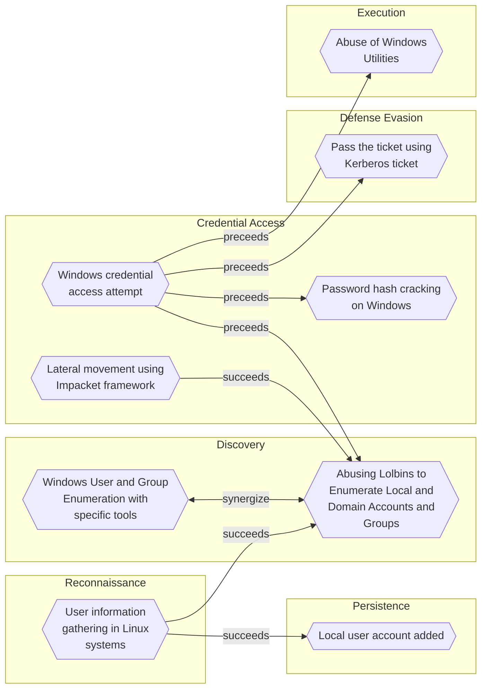

# Abusing Lolbins to Enumerate Local and Domain Accounts and Groups

## Metadata
| Field | Value |
| --- | --- |
| UUID | `3b1026c6-7d04-4b91-ba6f-abc68e993616` |
| Schema | `threat::1.0` |
| Version | `5` |
| Created | `2022-11-10` |
| Modified | `2025-10-01` |
| TLP | clear (`TLP:CLEAR`) |
| Organisation | EC DIGIT CSOC (`56b0a0f0-b0bc-47d9-bb46-02f80ae2065a`) |

## References
### Public
- **1**: [https://attack.mitre.org/techniques/T1087/001/](https://attack.mitre.org/techniques/T1087/001/)
- **2**: [https://attack.mitre.org/software/S0039/](https://attack.mitre.org/software/S0039/)
- **3**: [https://www.nextofwindows.com/the-net-command-line-to-list-local-users-and-groups](https://www.nextofwindows.com/the-net-command-line-to-list-local-users-and-groups)

## Description
Adversaries may attempt to enumerate the environment and list all
local system and domain accounts or groups.  
To achieve this purpose, they can use variety of tools and techniques.  
Their goal is reconnaissance, gathering of user's account information on 
the system or in the domain and further usage of accounts with higher 
privilege access.

### For Windows OS:

On Windows platforms threat actors can use the net utility or dsquery,
as examples as lolbins. Net utility commands, as examples, are executed
with additional parameters like "net localgroup", "net user" for
administrators and guest accounts. For domain users and groups net
utility commands are used with the parameter /domain.  

Examples:   

- net user /domain
- net group /domain
- net localgroup on localhost
- net user on localhost
- net localgroup "Administrators" on localhost

Executable files net.exe or net1.exe are indicators for accounts enumeration.
"Net1.exe" resides in "C:\Windows\System32" like "net.exe" and indicates process 
known as Net Command or Application Installer. These .exe files are usually related 
to run applications, batch files, and scripts that call Net utility.  

Threat actors may enumerate currently or previously connected users, or a subset
of users as for example administrative users.  

### For Linux OS (including Windows Subsystem for Linux):

Here some example of commands typically used for discovery on accounts 
and groups.

- whoami        #current user (often used in legitimate scripts)
- hostname      #show or set the system's host name
- id            #print real and effective user and group IDs
- uname         #print system information
- arp
- users
- netdiscover
- ifconfig	  #configure a network interface
- nmap
- ps            #report a snapshot of the current processes
- netstat
- uname
- issue
- groups
- tcpdump
- sudo -l
- cat /etc/shadow
- cat /etc/passwd # other command could be used to list the content of the file ex: 'less', 'more' etc.
- cat /etc/group  # Groups
- cat /etc/sudoers # File that allocate system rights to users
- last            # most recent login sessions
- ldapsearch      # Get information from LDAP server
- rpcclient       # Command-line utility used to interact with Microsoft RPC protocol. Could be used to enumerate AD
- finger          #  user information lookup command

## Criticality
**High** - A High priority incident is likely to result in a demonstrable impact to public health or safety, national security, economic security, foreign relations, civil liberties, or public confidence.

## Terrain
Adversaries can take advantage of already compromised system (Windows or 
Linux OS or OSX) to run commands.

## Surface
> **AWS::Compute::EC2**
> Amazon Elastic Compute Cloud (virtual servers)

> **AWS::Compute::ECS**
> Amazon Elastic Container Service

> **AWS::Compute::EKS**
> Amazon Elastic Kubernetes Service

> **Linux**
> Linux-based operating systems (all distributions)

> **macOS**
> Apple macOS operating systems (all versions)

> **Windows**
> Microsoft Windows operating systems (all versions)

> **Windows::Desktop**
> Microsoft Windows desktop editions

> **Active Directory**
> Microsoft Active Directory on-premises directory services

> **Firewalls**
> Network firewall appliances and software

> **Web Servers**
> HTTP servers and reverse proxies

## Threat Assessment
| Dimension | Assessment | Description |
| --- | --- | --- |
| Severity | Moderate incident | A cyber attack on a small organisation, or which poses a considerable risk to a medium-sized organisation, or preliminary indications of cyber activity against a large organisation or the government. |
| Impact | Identity Theft Nuisance Reputational Damages | Acquisition of sufficient information and privileges to profess as a given individual, for the purpose of abusing and deceiving human trust relationships. Small and mostly inconsequential to day to day operations, but noticed. Damages to the organization public view may be achieved by using directly the access gained, or indirectly with data gathered. |
| Leverage | Information Disclosure | Threat action intending to read a file that one was not granted access to, or to read data in transit. |
| Viability | Likely | Probable (probably) - 55-80% |
| Kill Chain | Discovery | Techniques that allow an attacker to gain knowledge about a system and its network environment. |

## Actors
| Actor | ID | Source | Description |
| --- | --- | --- | --- |
| [[Enterprise] APT29](https://attack.mitre.org/groups/G0016) | `att&ck::G0016` | ('att&ck',) | [APT29](https://attack.mitre.org/groups/G0016) is threat group that has been attributed to Russia's Foreign Intelligence Service (SVR).(Citation: White House Imposing Costs RU Gov April 2021)(Citation: UK Gov Malign RIS Activity April 2021) They have operated since at least 2008, often targeting government networks in Europe and NATO member countries, research institutes, and think tanks. [APT29](https://attack.mitre.org/groups/G0016) reportedly compromised the Democratic National Committee starting in the summer of 2015.(Citation: F-Secure The Dukes)(Citation: GRIZZLY STEPPE JAR)(Citation: Crowdstrike DNC June 2016)(Citation: UK Gov UK Exposes Russia SolarWinds April 2021)  In April 2021, the US and UK governments attributed the [SolarWinds Compromise](https://attack.mitre.org/campaigns/C0024) to the SVR; public statements included citations to [APT29](https://attack.mitre.org/groups/G0016), Cozy Bear, and The Dukes.(Citation: NSA Joint Advisory SVR SolarWinds April 2021)(Citation: UK NSCS Russia SolarWinds April 2021) Industry reporting also referred to the actors involved in this campaign as UNC2452, NOBELIUM, StellarParticle, Dark Halo, and SolarStorm.(Citation: FireEye SUNBURST Backdoor December 2020)(Citation: MSTIC NOBELIUM Mar 2021)(Citation: CrowdStrike SUNSPOT Implant January 2021)(Citation: Volexity SolarWinds)(Citation: Cybersecurity Advisory SVR TTP May 2021)(Citation: Unit 42 SolarStorm December 2020) |
| UNC2452 | `misp::2ee5ed7a-c4d0-40be-a837-20817474a15b` | ('misp',) | Reporting regarding activity related to the SolarWinds supply chain injection has grown quickly since initial disclosure on 13 December 2020. A significant amount of press reporting has focused on the identification of the actor(s) involved, victim organizations, possible campaign timeline, and potential impact. The US Government and cyber community have also provided detailed information on how the campaign was likely conducted and some of the malware used.  MITRE’s ATT&CK team — with the assistance of contributors — has been mapping techniques used by the actor group, referred to as UNC2452/Dark Halo by FireEye and Volexity respectively, as well as SUNBURST and TEARDROP malware. |
| [[Enterprise] APT1](https://attack.mitre.org/groups/G0006) | `att&ck::G0006` | ('att&ck',) | [APT1](https://attack.mitre.org/groups/G0006) is a Chinese threat group that has been attributed to the 2nd Bureau of the People’s Liberation Army (PLA) General Staff Department’s (GSD) 3rd Department, commonly known by its Military Unit Cover Designator (MUCD) as Unit 61398. (Citation: Mandiant APT1) |
| APT1 | `misp::1cb7e1cc-d695-42b1-92f4-fd0112a3c9be` | ('misp',) | PLA Unit 61398 (Chinese: 61398部队, Pinyin: 61398 bùduì) is the Military Unit Cover Designator (MUCD)[1] of a People's Liberation Army advanced persistent threat unit that has been alleged to be a source of Chinese computer hacking attacks |
| [[Enterprise] Chimera](https://attack.mitre.org/groups/G0114) | `att&ck::G0114` | ('att&ck',) | [Chimera](https://attack.mitre.org/groups/G0114) is a suspected China-based threat group that has been active since at least 2018 targeting the semiconductor industry in Taiwan as well as data from the airline industry.(Citation: Cycraft Chimera April 2020)(Citation: NCC Group Chimera January 2021) |
| [[Enterprise] APT32](https://attack.mitre.org/groups/G0050) | `att&ck::G0050` | ('att&ck',) | [APT32](https://attack.mitre.org/groups/G0050) is a suspected Vietnam-based threat group that has been active since at least 2014. The group has targeted multiple private sector industries as well as foreign governments, dissidents, and journalists with a strong focus on Southeast Asian countries like Vietnam, the Philippines, Laos, and Cambodia. They have extensively used strategic web compromises to compromise victims.(Citation: FireEye APT32 May 2017)(Citation: Volexity OceanLotus Nov 2017)(Citation: ESET OceanLotus) |
| APT32 | `misp::aa29ae56-e54b-47a2-ad16-d3ab0242d5d7` | ('misp',) | Cyber espionage actors, now designated by FireEye as APT32 (OceanLotus Group), are carrying out intrusions into private sector companies across multiple industries and have also targeted foreign governments, dissidents, and journalists. FireEye assesses that APT32 leverages a unique suite of fully-featured malware, in conjunction with commercially-available tools, to conduct targeted operations that are aligned with Vietnamese state interests. |
| [[Enterprise] Ke3chang](https://attack.mitre.org/groups/G0004) | `att&ck::G0004` | ('att&ck',) | [Ke3chang](https://attack.mitre.org/groups/G0004) is a threat group attributed to actors operating out of China. [Ke3chang](https://attack.mitre.org/groups/G0004) has targeted oil, government, diplomatic, military, and NGOs in Central and South America, the Caribbean, Europe, and North America since at least 2010.(Citation: Mandiant Operation Ke3chang November 2014)(Citation: NCC Group APT15 Alive and Strong)(Citation: APT15 Intezer June 2018)(Citation: Microsoft NICKEL December 2021) |
| APT15 | `misp::3501fbf2-098f-47e7-be6a-6b0ff5742ce8` | ('misp',) | This threat actor uses phishing techniques to compromise the networks of foreign ministries of European countries for espionage purposes. |

## ATT&CK Techniques
| Technique | Name | Description |
| --- | --- | --- |
| `T1087.001` | [Account Discovery: Local Account](https://attack.mitre.org/techniques/T1087/001) | Adversaries may attempt to get a listing of local system accounts. This information can help adversaries determine which local accounts exist on a system to aid in follow-on behavior.  Commands such as <code>net user</code> and <code>net localgroup</code> of the [Net](https://attack.mitre.org/software/S0039) utility and <code>id</code> and <code>groups</code> on macOS and Linux can list local users and groups.(Citation: Mandiant APT1)(Citation: id man page)(Citation: groups man page) On Linux, local users can also be enumerated through the use of the <code>/etc/passwd</code> file. On macOS, the <code>dscl . list /Users</code> command can be used to enumerate local accounts. On ESXi servers, the `esxcli system account list` command can list local user accounts.(Citation: Crowdstrike Hypervisor Jackpotting Pt 2 2021) |
| `T1087.002` | [Account Discovery: Domain Account](https://attack.mitre.org/techniques/T1087/002) | Adversaries may attempt to get a listing of domain accounts. This information can help adversaries determine which domain accounts exist to aid in follow-on behavior such as targeting specific accounts which possess particular privileges.  Commands such as <code>net user /domain</code> and <code>net group /domain</code> of the [Net](https://attack.mitre.org/software/S0039) utility, <code>dscacheutil -q group</code> on macOS, and <code>ldapsearch</code> on Linux can list domain users and groups. [PowerShell](https://attack.mitre.org/techniques/T1059/001) cmdlets including <code>Get-ADUser</code> and <code>Get-ADGroupMember</code> may enumerate members of Active Directory groups.(Citation: CrowdStrike StellarParticle January 2022) |
| `T1069.001` | [Permission Groups Discovery: Local Groups](https://attack.mitre.org/techniques/T1069/001) | Adversaries may attempt to find local system groups and permission settings. The knowledge of local system permission groups can help adversaries determine which groups exist and which users belong to a particular group. Adversaries may use this information to determine which users have elevated permissions, such as the users found within the local administrators group.  Commands such as <code>net localgroup</code> of the [Net](https://attack.mitre.org/software/S0039) utility, <code>dscl . -list /Groups</code> on macOS, and <code>groups</code> on Linux can list local groups. |
| `T1069.002` | [Permission Groups Discovery: Domain Groups](https://attack.mitre.org/techniques/T1069/002) | Adversaries may attempt to find domain-level groups and permission settings. The knowledge of domain-level permission groups can help adversaries determine which groups exist and which users belong to a particular group. Adversaries may use this information to determine which users have elevated permissions, such as domain administrators.  Commands such as <code>net group /domain</code> of the [Net](https://attack.mitre.org/software/S0039) utility,  <code>dscacheutil -q group</code> on macOS, and <code>ldapsearch</code> on Linux can list domain-level groups. |

## Chaining

