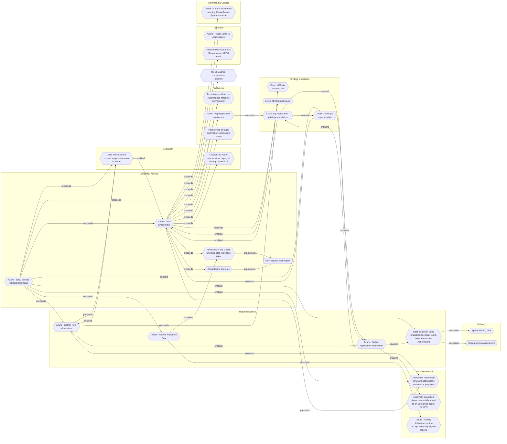

# Addition of credentials to OAuth applications and service principals

## Metadata
| Field | Value |
| --- | --- |
| UUID | `a8c7b250-a2d4-4a0d-82f8-23dc99c77d7b` |
| Schema | `threat::1.0` |
| Version | `4` |
| Created | `2022-02-21` |
| Modified | `2025-01-01` |
| TLP | clear (`TLP:CLEAR`) |
| Organisation | EC DIGIT CSOC (`56b0a0f0-b0bc-47d9-bb46-02f80ae2065a`) |

## References
### Public
- **1**: [https://msrc-blog.microsoft.com/2020/12/13/customer-guidance-on-recent-nation-state-cyber-attacks/](https://msrc-blog.microsoft.com/2020/12/13/customer-guidance-on-recent-nation-state-cyber-attacks/)

## Description
The actor has been observed adding credentials (x509 keys or password
credentials) to one or more legitimate OAuth Applications or Service
Principals, usually with existing Mail.Read or Mail.ReadWrite permissions,
which grants the ability to read mail content from Exchange Online via
Microsoft Graph or Outlook REST. Examples include mail archiving
applications. Permissions are usually, but not always, AppOnly.

The actor may use their administrator privileges to grant additional
permissions to the target Application or Service Principal (e.g.  Mail.Read,
Mail.ReadWrite).

## Criticality
**Emergency** - An Emergency priority incident poses an imminent threat to the provision of wide-scale critical infrastructure services, national government stability, or human lives.

## Terrain
Adversaries need to have gained a sufficient foothold in the  on-premises environment before starting to modify Azure  Active Directory.

## Surface
> **Azure::Security::Entra ID**
> Microsoft Entra ID in Azure (cloud identity)

> **Entra ID**
> Microsoft Entra ID (formerly Azure Active Directory)

## Threat Assessment
| Dimension | Assessment | Description |
| --- | --- | --- |
| Severity | Highly significant incident | A cyber attack which has a serious impact on central government, (inter)national essential services, a large proportion of the (inter)national population, or the (inter)national economy. |
| Impact | Identity Theft Data Breach Impairement IP Loss | Acquisition of sufficient information and privileges to profess as a given individual, for the purpose of abusing and deceiving human trust relationships. Non-public information has been accessed from the outside, and successfully extracted. Incapacitation of a particular key system that will cause disruptions in day-to-day operations, and eventually service delivery. Particular, key data, information and blueprint conducive to the organization capability to gain and retain a commercial or geopolitical advantage has been accessed, and their content potentially used by competitors or other adversaries. |
| Leverage | Dwelling Denial of Service | Active or passive extended presence in the target, which performs adversarial operations continuously. Threat action attempting to deny access to valid users, such as by making a web server temporarily unavailable or unusable. |
| Viability | Very Likely | Highly probable - 80-95% |
| Kill Chain | Lateral Movement | Techniques that enable an adversary to horizontally access and control other remote systems. |

## Actors
| Actor | ID | Source | Description |
| --- | --- | --- | --- |
| [[Enterprise] APT29](https://attack.mitre.org/groups/G0016) | `att&ck::G0016` | ('att&ck',) | [APT29](https://attack.mitre.org/groups/G0016) is threat group that has been attributed to Russia's Foreign Intelligence Service (SVR).(Citation: White House Imposing Costs RU Gov April 2021)(Citation: UK Gov Malign RIS Activity April 2021) They have operated since at least 2008, often targeting government networks in Europe and NATO member countries, research institutes, and think tanks. [APT29](https://attack.mitre.org/groups/G0016) reportedly compromised the Democratic National Committee starting in the summer of 2015.(Citation: F-Secure The Dukes)(Citation: GRIZZLY STEPPE JAR)(Citation: Crowdstrike DNC June 2016)(Citation: UK Gov UK Exposes Russia SolarWinds April 2021)  In April 2021, the US and UK governments attributed the [SolarWinds Compromise](https://attack.mitre.org/campaigns/C0024) to the SVR; public statements included citations to [APT29](https://attack.mitre.org/groups/G0016), Cozy Bear, and The Dukes.(Citation: NSA Joint Advisory SVR SolarWinds April 2021)(Citation: UK NSCS Russia SolarWinds April 2021) Industry reporting also referred to the actors involved in this campaign as UNC2452, NOBELIUM, StellarParticle, Dark Halo, and SolarStorm.(Citation: FireEye SUNBURST Backdoor December 2020)(Citation: MSTIC NOBELIUM Mar 2021)(Citation: CrowdStrike SUNSPOT Implant January 2021)(Citation: Volexity SolarWinds)(Citation: Cybersecurity Advisory SVR TTP May 2021)(Citation: Unit 42 SolarStorm December 2020) |
| UNC2452 | `misp::2ee5ed7a-c4d0-40be-a837-20817474a15b` | ('misp',) | Reporting regarding activity related to the SolarWinds supply chain injection has grown quickly since initial disclosure on 13 December 2020. A significant amount of press reporting has focused on the identification of the actor(s) involved, victim organizations, possible campaign timeline, and potential impact. The US Government and cyber community have also provided detailed information on how the campaign was likely conducted and some of the malware used.  MITRE’s ATT&CK team — with the assistance of contributors — has been mapping techniques used by the actor group, referred to as UNC2452/Dark Halo by FireEye and Volexity respectively, as well as SUNBURST and TEARDROP malware. |

## ATT&CK Techniques
| Technique | Name | Description |
| --- | --- | --- |
| `T1098.001` | [Account Manipulation: Additional Cloud Credentials](https://attack.mitre.org/techniques/T1098/001) | Adversaries may add adversary-controlled credentials to a cloud account to maintain persistent access to victim accounts and instances within the environment.  For example, adversaries may add credentials for Service Principals and Applications in addition to existing legitimate credentials in Azure / Entra ID.(Citation: Microsoft SolarWinds Customer Guidance)(Citation: Blue Cloud of Death)(Citation: Blue Cloud of Death Video) These credentials include both x509 keys and passwords.(Citation: Microsoft SolarWinds Customer Guidance) With sufficient permissions, there are a variety of ways to add credentials including the Azure Portal, Azure command line interface, and Azure or Az PowerShell modules.(Citation: Demystifying Azure AD Service Principals)  In infrastructure-as-a-service (IaaS) environments, after gaining access through [Cloud Accounts](https://attack.mitre.org/techniques/T1078/004), adversaries may generate or import their own SSH keys using either the <code>CreateKeyPair</code> or <code>ImportKeyPair</code> API in AWS or the <code>gcloud compute os-login ssh-keys add</code> command in GCP.(Citation: GCP SSH Key Add) This allows persistent access to instances within the cloud environment without further usage of the compromised cloud accounts.(Citation: Expel IO Evil in AWS)(Citation: Expel Behind the Scenes)  Adversaries may also use the <code>CreateAccessKey</code> API in AWS or the <code>gcloud iam service-accounts keys create</code> command in GCP to add access keys to an account. Alternatively, they may use the <code>CreateLoginProfile</code> API in AWS to add a password that can be used to log into the AWS Management Console for [Cloud Service Dashboard](https://attack.mitre.org/techniques/T1538).(Citation: Permiso Scattered Spider 2023)(Citation: Lacework AI Resource Hijacking 2024) If the target account has different permissions from the requesting account, the adversary may also be able to escalate their privileges in the environment (i.e. [Cloud Accounts](https://attack.mitre.org/techniques/T1078/004)).(Citation: Rhino Security Labs AWS Privilege Escalation)(Citation: Sysdig ScarletEel 2.0) For example, in Entra ID environments, an adversary with the Application Administrator role can add a new set of credentials to their application's service principal. In doing so the adversary would be able to access the service principal’s roles and permissions, which may be different from those of the Application Administrator.(Citation: SpecterOps Azure Privilege Escalation)   In AWS environments, adversaries with the appropriate permissions may also use the `sts:GetFederationToken` API call to create a temporary set of credentials to [Forge Web Credentials](https://attack.mitre.org/techniques/T1606) tied to the permissions of the original user account. These temporary credentials may remain valid for the duration of their lifetime even if the original account’s API credentials are deactivated. (Citation: Crowdstrike AWS User Federation Persistence)  In Entra ID environments with the app password feature enabled, adversaries may be able to add an app password to a user account.(Citation: Mandiant APT42 Operations 2024) As app passwords are intended to be used with legacy devices that do not support multi-factor authentication (MFA), adding an app password can allow an adversary to bypass MFA requirements. Additionally, app passwords may remain valid even if the user’s primary password is reset.(Citation: Microsoft Entra ID App Passwords) |

## Chaining

