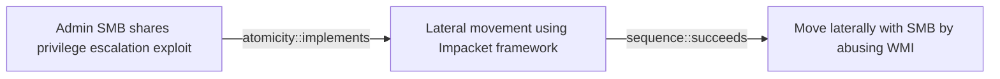

# Admin SMB shares privilege escalation exploit

## Metadata

- **UUID**: `02810748-52b5-4d3a-a788-29a948538cd2`
- **Schema**: `threat::1.0`
- **Version**: `1`
- **Created**: `2025-07-29`
- **Modified**: `2025-08-26`
- **TLP**: clear (`TLP:CLEAR`)
- **Organisation**: EC DIGIT CSOC (`56b0a0f0-b0bc-47d9-bb46-02f80ae2065a`)

## References
### Public
- **1**: [https://redcanary.com/threat-detection-report/techniques/windows-admin-shares](https://redcanary.com/threat-detection-report/techniques/windows-admin-shares)
- **2**: [https://www.pentesting.org/file-sharing-attacks/](https://www.pentesting.org/file-sharing-attacks/)
- **3**: [https://www.cayosoft.com/smb-vulnerability](https://www.cayosoft.com/smb-vulnerability)
- **4**: [https://securityonline.info/windows-smb-flaw-cve-2025-33073-system-privilege-escalation-via-kerberos-poc-available](https://securityonline.info/windows-smb-flaw-cve-2025-33073-system-privilege-escalation-via-kerberos-poc-available)
- **5**: [https://windowsforum.com/threads/cve-2025-33073-critical-windows-smb-privilege-escalation-vulnerability-explained.369790](https://windowsforum.com/threads/cve-2025-33073-critical-windows-smb-privilege-escalation-vulnerability-explained.369790)
- **6**: [https://www.thehackacademy.com/news/microsoft-issues-emergency-fix-for-severe-windows-smb-vulnerability-update-now](https://www.thehackacademy.com/news/microsoft-issues-emergency-fix-for-severe-windows-smb-vulnerability-update-now)
- **7**: [https://www.security.com/threat-intelligence/chafer-latest-attacks-reveal-heightened-ambitions](https://www.security.com/threat-intelligence/chafer-latest-attacks-reveal-heightened-ambitions)

## Description
One of the most common ways adversaries leverage SMB and Windows Admin
Shares is in conjunction with another technique, T1570: Lateral Tool
Transfer. In other words, they move payloads from one endpoint to another
and execute them. Adversaries do this with native utilities like net.exe or
through functionality provided by command and control (C2) frameworks - to
name just a couple of the many options available. Additionally, adversaries
can use Admin Shares for privilege escalation using tools like PsExec, a 
Sysinternals tool that enables remote system management.

### Possible patterns of malicious activity

- Remote file copy and retrieval - attackers can use tools such as SMBexec to 
create a temporary share to copy files to and then remotely parse their 
contents. An adversary could accomplish this similarly by leveraging tools 
like WMIexec or MMCexec.

- Lateral movement and privilege escalation - Most C2 Frameworks provide 
built-in functionality for lateral movement or privilege escalation utilizing 
PsExec-like functionality. In the case of Cobalt Strike, beacons leverage the 
Service Control Manager to copy a binary to the ADMIN$ share on the target 
endpoint and leverage a service for execution.

Common offensive and dual-use tools that leverage SMB/Windows Admin Shares 
include:

- PsExec
- Impacket's SMBexec and WMIexec
- `net.exe`
- Probably all C2 frameworks (commercial and open source)

## Criticality
**Medium** - A Medium priority incident may affect public health or safety, national security, economic security, foreign relations, civil liberties, or public confidence.

## Terrain
> **A threat actor needs to have initial access to a machine that has remote or 
local SMB share connectivity.

Domains: Enterprise
Cve: CVE-2025-33073
Targets: Public-Facing Servers, Workstations, Web Application Servers
Platforms: Windows**

## Threat Assessment
| Dimension | Assessment | Description |
| --- | --- | --- |
| Severity | Moderate incident | A cyber attack on a small organisation, or which poses a considerable risk to a medium-sized organisation, or preliminary indications of cyber activity against a large organisation or the government. |
| Impact | Data Breach; Impairement | - |
| Leverage | Elevation of privilege; Infrastructure Compromise; Information Disclosure | - |
| Viability | Likely | Probable (probably) - 55-80% |
| Kill Chain | Privilege Escalation | The result of techniques that provide an attacker with higher permissions on a system or network. |

## Actors
| Actor | ID | Source | Description |
| --- | --- | --- | --- |
| [[Enterprise] APT39](https://attack.mitre.org/groups/G0087) | `att&ck::G0087` | ('att&ck',) | [APT39](https://attack.mitre.org/groups/G0087) is one of several names for cyber espionage activity conducted by the Iranian Ministry of Intelligence and Security (MOIS) through the front company Rana Intelligence Computing since at least 2014. [APT39](https://attack.mitre.org/groups/G0087) has primarily targeted the travel, hospitality, academic, and telecommunications industries in Iran and across Asia, Africa, Europe, and North America to track individuals and entities considered to be a threat by the MOIS.(Citation: FireEye APT39 Jan 2019)(Citation: Symantec Chafer Dec 2015)(Citation: FBI FLASH APT39 September 2020)(Citation: Dept. of Treasury Iran Sanctions September 2020)(Citation: DOJ Iran Indictments September 2020) |
| APT39 | `misp::c2c64bd3-a325-446f-91a8-b4c0f173a30b` | ('misp',) | APT39 was created to bring together previous activities and methods used by this actor, and its activities largely align with a group publicly referred to as "Chafer." However, there are differences in what has been publicly reported due to the variances in how organizations track activity. APT39 primarily leverages the SEAWEED and CACHEMONEY backdoors along with a specific variant of the POWBAT backdoor. While APT39's targeting scope is global, its activities are concentrated in the Middle East. APT39 has prioritized the telecommunications sector, with additional targeting of the travel industry and IT firms that support it and the high-tech industry. |

## ATT&CK Techniques
| Technique | Name | Description |
| --- | --- | --- |
| `T1210` | [Exploitation of Remote Services](https://attack.mitre.org/techniques/T1210) | Adversaries may exploit remote services to gain unauthorized access to internal systems once inside of a network. Exploitation of a software vulnerability occurs when an adversary takes advantage of a programming error in a program, service, or within the operating system software or kernel itself to execute adversary-controlled code.xa0A common goal for post-compromise exploitation of remote services is for lateral movement to enable access to a remote system.  An adversary may need to determine if the remote system is in a vulnerable state, which may be done through [Network Service Discovery](https://attack.mitre.org/techniques/T1046) or other Discovery methods looking for common, vulnerable software that may be deployed in the network, the lack of certain patches that may indicate vulnerabilities,  or security software that may be used to detect or contain remote exploitation. Servers are likely a high value target for lateral movement exploitation, but endpoint systems may also be at risk if they provide an advantage or access to additional resources.  There are several well-known vulnerabilities that exist in common services such as SMB(Citation: CIS Multiple SMB Vulnerabilities) and RDP(Citation: NVD CVE-2017-0176) as well as applications that may be used within internal networks such as MySQL(Citation: NVD CVE-2016-6662) and web server services.(Citation: NVD CVE-2014-7169)(Citation: Ars Technica VMWare Code Execution Vulnerability 2021) Additionally, there have been a number of vulnerabilities in VMware vCenter installations, which may enable threat actors to move laterally from the compromised vCenter server to virtual machines or even to ESXi hypervisors.(Citation: Broadcom VMSA-2024-0019)  Depending on the permissions level of the vulnerable remote service an adversary may achieve [Exploitation for Privilege Escalation](https://attack.mitre.org/techniques/T1068) as a result of lateral movement exploitation as well. |
| `T1078` | [Valid Accounts](https://attack.mitre.org/techniques/T1078) | Adversaries may obtain and abuse credentials of existing accounts as a means of gaining Initial Access, Persistence, Privilege Escalation, or Defense Evasion. Compromised credentials may be used to bypass access controls placed on various resources on systems within the network and may even be used for persistent access to remote systems and externally available services, such as VPNs, Outlook Web Access, network devices, and remote desktop.(Citation: volexity_0day_sophos_FW) Compromised credentials may also grant an adversary increased privilege to specific systems or access to restricted areas of the network. Adversaries may choose not to use malware or tools in conjunction with the legitimate access those credentials provide to make it harder to detect their presence.  In some cases, adversaries may abuse inactive accounts: for example, those belonging to individuals who are no longer part of an organization. Using these accounts may allow the adversary to evade detection, as the original account user will not be present to identify any anomalous activity taking place on their account.(Citation: CISA MFA PrintNightmare)  The overlap of permissions for local, domain, and cloud accounts across a network of systems is of concern because the adversary may be able to pivot across accounts and systems to reach a high level of access (i.e., domain or enterprise administrator) to bypass access controls set within the enterprise.(Citation: TechNet Credential Theft) |
| `T1021.002` | [Remote Services: SMB/Windows Admin Shares](https://attack.mitre.org/techniques/T1021/002) | Adversaries may use [Valid Accounts](https://attack.mitre.org/techniques/T1078) to interact with a remote network share using Server Message Block (SMB). The adversary may then perform actions as the logged-on user.  SMB is a file, printer, and serial port sharing protocol for Windows machines on the same network or domain. Adversaries may use SMB to interact with file shares, allowing them to move laterally throughout a network. Linux and macOS implementations of SMB typically use Samba.  Windows systems have hidden network shares that are accessible only to administrators and provide the ability for remote file copy and other administrative functions. Example network shares include `C$`, `ADMIN$`, and `IPC$`. Adversaries may use this technique in conjunction with administrator-level [Valid Accounts](https://attack.mitre.org/techniques/T1078) to remotely access a networked system over SMB,(Citation: Wikipedia Server Message Block) to interact with systems using remote procedure calls (RPCs),(Citation: TechNet RPC) transfer files, and run transferred binaries through remote Execution. Example execution techniques that rely on authenticated sessions over SMB/RPC are [Scheduled Task/Job](https://attack.mitre.org/techniques/T1053), [Service Execution](https://attack.mitre.org/techniques/T1569/002), and [Windows Management Instrumentation](https://attack.mitre.org/techniques/T1047). Adversaries can also use NTLM hashes to access administrator shares on systems with [Pass the Hash](https://attack.mitre.org/techniques/T1550/002) and certain configuration and patch levels.(Citation: Microsoft Admin Shares) |
| `T1570` | [Lateral Tool Transfer](https://attack.mitre.org/techniques/T1570) | Adversaries may transfer tools or other files between systems in a compromised environment. Once brought into the victim environment (i.e., [Ingress Tool Transfer](https://attack.mitre.org/techniques/T1105)) files may then be copied from one system to another to stage adversary tools or other files over the course of an operation.  Adversaries may copy files between internal victim systems to support lateral movement using inherent file sharing protocols such as file sharing over [SMB/Windows Admin Shares](https://attack.mitre.org/techniques/T1021/002) to connected network shares or with authenticated connections via [Remote Desktop Protocol](https://attack.mitre.org/techniques/T1021/001).(Citation: Unit42 LockerGoga 2019)  Files can also be transferred using native or otherwise present tools on the victim system, such as scp, rsync, curl, sftp, and [ftp](https://attack.mitre.org/software/S0095). In some cases, adversaries may be able to leverage [Web Service](https://attack.mitre.org/techniques/T1102)s such as Dropbox or OneDrive to copy files from one machine to another via shared, automatically synced folders.(Citation: Dropbox Malware Sync) |

## Chaining

### Chaining details
#### implements -> Lateral movement using Impacket framework (`atomicity::implements`)
A threat actor can use offensive tools, for example Impacket, WMIexec
or others to leverage and gain hiher access privileges like SMB Share
Admin.

- **Target UUID**: `75415bc5-6615-487e-a69c-7a4ffc196996`
#### succeeds -> Move laterally with SMB by abusing WMI (`sequence::succeeds`)
Threat actors can use a lateral movement technique in the environment
after exploitation of an SMB share.

- **Target UUID**: `f33a693b-04cd-476e-9067-9deab561e55a`
