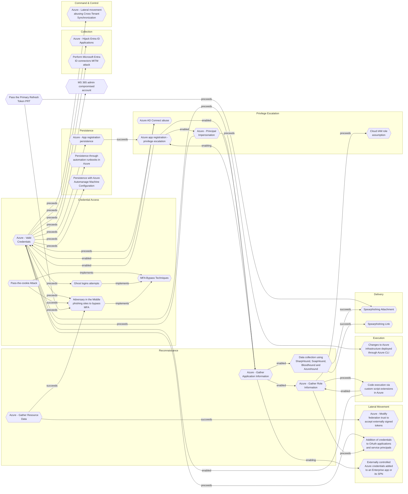

# Adversary in the Middle phishing sites to bypass MFA

## Metadata
| Field | Value |
| --- | --- |
| UUID | `66aafb61-9a46-4287-8b40-4785b42b77a3` |
| Schema | `threat::1.0` |
| Version | `5` |
| Created | `2022-07-13` |
| Modified | `2024-11-11` |
| TLP | clear (`TLP:CLEAR`) |
| Organisation | EC DIGIT CSOC (`56b0a0f0-b0bc-47d9-bb46-02f80ae2065a`) |

## References
### Public
- **1**: [https://www.microsoft.com/security/blog/2022/07/12/from-cookie-theft-to-bec-attackers-use-aitm-phishing-sites-as-entry-point-to-further-financial-fraud/](https://www.microsoft.com/security/blog/2022/07/12/from-cookie-theft-to-bec-attackers-use-aitm-phishing-sites-as-entry-point-to-further-financial-fraud/)

## Description
Threat actors use malicious attachments to send the users 
to redirection site, which hosts a fake MFA login page.
The MitM page completes the authentication flow by interfacing
with the legitimate IdP, and captures valid accounts

## Criticality
**Medium** - A Medium priority incident may affect public health or safety, national security, economic security, foreign relations, civil liberties, or public confidence.

## Terrain
An adversary needs to target companies and contacts 
to distribute the malware, it's used a massive distrigution 
technique on a random principle.

## Surface
> **Microsoft::Microsoft 365**
> Microsoft 365 cloud-based productivity suite (formerly Office 365)

> **Windows::Desktop**
> Microsoft Windows desktop editions

## Threat Assessment
| Dimension | Assessment | Description |
| --- | --- | --- |
| Severity | Significant incident | A cyber attack which has a serious impact on a large organisation or on wider / local government, or which poses a considerable risk to central government or (inter)national essential services. |
| Impact | Identity Theft Business disruption Impairement Monetary Loss | Acquisition of sufficient information and privileges to profess as a given individual, for the purpose of abusing and deceiving human trust relationships. Business disruption Incapacitation of a particular key system that will cause disruptions in day-to-day operations, and eventually service delivery. The vector will directly conduct to loss of value directly impacting the bottom line. |
| Leverage | Dwelling Information Disclosure Elevation of privilege Spoofing | Active or passive extended presence in the target, which performs adversarial operations continuously. Threat action intending to read a file that one was not granted access to, or to read data in transit. Capacity to augment leverage over the target system by upgrading the compromised access rights Threat action aimed at accessing and use of another user’s credentials, such as username and password. |
| Viability | Likely | Probable (probably) - 55-80% |
| Kill Chain | Credential Access | Techniques resulting in the access of, or control over, system, service or domain credentials. |

## Actors
| Actor | ID | Source | Description |
| --- | --- | --- | --- |
| Storm-0829 | `misp::3e595289-05b8-43fc-bd88-f8650436447f` | ('misp',) | Nwgen is a group that focuses on data exfiltration and ransomware activities. They have been found to share techniques with other threat groups such as Karakurt, Lapsus$, and Yanluowang. Nwgen has been observed carrying out attacks and deploying ransomware, encrypting files and demanding a ransom of $150,000 in Monero cryptocurrency for the decryption software. |

## ATT&CK Techniques
| Technique | Name | Description |
| --- | --- | --- |
| `T1566.002` | [Phishing: Spearphishing Link](https://attack.mitre.org/techniques/T1566/002) | Adversaries may send spearphishing emails with a malicious link in an attempt to gain access to victim systems. Spearphishing with a link is a specific variant of spearphishing. It is different from other forms of spearphishing in that it employs the use of links to download malware contained in email, instead of attaching malicious files to the email itself, to avoid defenses that may inspect email attachments. Spearphishing may also involve social engineering techniques, such as posing as a trusted source.  All forms of spearphishing are electronically delivered social engineering targeted at a specific individual, company, or industry. In this case, the malicious emails contain links. Generally, the links will be accompanied by social engineering text and require the user to actively click or copy and paste a URL into a browser, leveraging [User Execution](https://attack.mitre.org/techniques/T1204). The visited website may compromise the web browser using an exploit, or the user will be prompted to download applications, documents, zip files, or even executables depending on the pretext for the email in the first place.  Adversaries may also include links that are intended to interact directly with an email reader, including embedded images intended to exploit the end system directly. Additionally, adversaries may use seemingly benign links that abuse special characters to mimic legitimate websites (known as an "IDN homograph attack").(Citation: CISA IDN ST05-016) URLs may also be obfuscated by taking advantage of quirks in the URL schema, such as the acceptance of integer- or hexadecimal-based hostname formats and the automatic discarding of text before an “@” symbol: for example, `hxxp://google.com@1157586937`.(Citation: Mandiant URL Obfuscation 2023)  Adversaries may also utilize links to perform consent phishing, typically with OAuth 2.0 request URLs that when accepted by the user provide permissions/access for malicious applications, allowing adversaries to  [Steal Application Access Token](https://attack.mitre.org/techniques/T1528)s.(Citation: Trend Micro Pawn Storm OAuth 2017) These stolen access tokens allow the adversary to perform various actions on behalf of the user via API calls. (Citation: Microsoft OAuth 2.0 Consent Phishing 2021)  Adversaries may also utilize spearphishing links to [Steal Application Access Token](https://attack.mitre.org/techniques/T1528)s that grant immediate access to the victim environment. For example, a user may be lured through “consent phishing” into granting adversaries permissions/access via a malicious OAuth 2.0 request URL .(Citation: Trend Micro Pawn Storm OAuth 2017)(Citation: Microsoft OAuth 2.0 Consent Phishing 2021)  Similarly, malicious links may also target device-based authorization, such as OAuth 2.0 device authorization grant flow which is typically used to authenticate devices without UIs/browsers. Known as “device code phishing,” an adversary may send a link that directs the victim to a malicious authorization page where the user is tricked into entering a code/credentials that produces a device token.(Citation: SecureWorks Device Code Phishing 2021)(Citation: Netskope Device Code Phishing 2021)(Citation: Optiv Device Code Phishing 2021) |
| `T1557` | [Adversary-in-the-Middle](https://attack.mitre.org/techniques/T1557) | Adversaries may attempt to position themselves between two or more networked devices using an adversary-in-the-middle (AiTM) technique to support follow-on behaviors such as [Network Sniffing](https://attack.mitre.org/techniques/T1040), [Transmitted Data Manipulation](https://attack.mitre.org/techniques/T1565/002), or replay attacks ([Exploitation for Credential Access](https://attack.mitre.org/techniques/T1212)). By abusing features of common networking protocols that can determine the flow of network traffic (e.g. ARP, DNS, LLMNR, etc.), adversaries may force a device to communicate through an adversary controlled system so they can collect information or perform additional actions.(Citation: Rapid7 MiTM Basics)  For example, adversaries may manipulate victim DNS settings to enable other malicious activities such as preventing/redirecting users from accessing legitimate sites and/or pushing additional malware.(Citation: ttint_rat)(Citation: dns_changer_trojans)(Citation: ad_blocker_with_miner) Adversaries may also manipulate DNS and leverage their position in order to intercept user credentials, including access tokens ([Steal Application Access Token](https://attack.mitre.org/techniques/T1528)) and session cookies ([Steal Web Session Cookie](https://attack.mitre.org/techniques/T1539)).(Citation: volexity_0day_sophos_FW)(Citation: Token tactics) [Downgrade Attack](https://attack.mitre.org/techniques/T1562/010)s can also be used to establish an AiTM position, such as by negotiating a less secure, deprecated, or weaker version of communication protocol (SSL/TLS) or encryption algorithm.(Citation: mitm_tls_downgrade_att)(Citation: taxonomy_downgrade_att_tls)(Citation: tlseminar_downgrade_att)  Adversaries may also leverage the AiTM position to attempt to monitor and/or modify traffic, such as in [Transmitted Data Manipulation](https://attack.mitre.org/techniques/T1565/002). Adversaries can setup a position similar to AiTM to prevent traffic from flowing to the appropriate destination, potentially to [Impair Defenses](https://attack.mitre.org/techniques/T1562) and/or in support of a [Network Denial of Service](https://attack.mitre.org/techniques/T1498). |
| `T1539` | [Steal Web Session Cookie](https://attack.mitre.org/techniques/T1539) | An adversary may steal web application or service session cookies and use them to gain access to web applications or Internet services as an authenticated user without needing credentials. Web applications and services often use session cookies as an authentication token after a user has authenticated to a website.  Cookies are often valid for an extended period of time, even if the web application is not actively used. Cookies can be found on disk, in the process memory of the browser, and in network traffic to remote systems. Additionally, other applications on the targets machine might store sensitive authentication cookies in memory (e.g. apps which authenticate to cloud services). Session cookies can be used to bypasses some multi-factor authentication protocols.(Citation: Pass The Cookie)  There are several examples of malware targeting cookies from web browsers on the local system.(Citation: Kaspersky TajMahal April 2019)(Citation: Unit 42 Mac Crypto Cookies January 2019) Adversaries may also steal cookies by injecting malicious JavaScript content into websites or relying on [User Execution](https://attack.mitre.org/techniques/T1204) by tricking victims into running malicious JavaScript in their browser.(Citation: Talos Roblox Scam 2023)(Citation: Krebs Discord Bookmarks 2023)  There are also open source frameworks such as `Evilginx2` and `Muraena` that can gather session cookies through a malicious proxy (e.g., [Adversary-in-the-Middle](https://attack.mitre.org/techniques/T1557)) that can be set up by an adversary and used in phishing campaigns.(Citation: Github evilginx2)(Citation: GitHub Mauraena)  After an adversary acquires a valid cookie, they can then perform a [Web Session Cookie](https://attack.mitre.org/techniques/T1550/004) technique to login to the corresponding web application. |
| `T1556` | [Modify Authentication Process](https://attack.mitre.org/techniques/T1556) | Adversaries may modify authentication mechanisms and processes to access user credentials or enable otherwise unwarranted access to accounts. The authentication process is handled by mechanisms, such as the Local Security Authentication Server (LSASS) process and the Security Accounts Manager (SAM) on Windows, pluggable authentication modules (PAM) on Unix-based systems, and authorization plugins on MacOS systems, responsible for gathering, storing, and validating credentials. By modifying an authentication process, an adversary may be able to authenticate to a service or system without using [Valid Accounts](https://attack.mitre.org/techniques/T1078).  Adversaries may maliciously modify a part of this process to either reveal credentials or bypass authentication mechanisms. Compromised credentials or access may be used to bypass access controls placed on various resources on systems within the network and may even be used for persistent access to remote systems and externally available services, such as VPNs, Outlook Web Access and remote desktop. |
| `T1078.004` | [Valid Accounts: Cloud Accounts](https://attack.mitre.org/techniques/T1078/004) | Valid accounts in cloud environments may allow adversaries to perform actions to achieve Initial Access, Persistence, Privilege Escalation, or Defense Evasion. Cloud accounts are those created and configured by an organization for use by users, remote support, services, or for administration of resources within a cloud service provider or SaaS application. Cloud Accounts can exist solely in the cloud; alternatively, they may be hybrid-joined between on-premises systems and the cloud through syncing or federation with other identity sources such as Windows Active Directory.(Citation: AWS Identity Federation)(Citation: Google Federating GC)(Citation: Microsoft Deploying AD Federation)  Service or user accounts may be targeted by adversaries through [Brute Force](https://attack.mitre.org/techniques/T1110), [Phishing](https://attack.mitre.org/techniques/T1566), or various other means to gain access to the environment. Federated or synced accounts may be a pathway for the adversary to affect both on-premises systems and cloud environments - for example, by leveraging shared credentials to log onto [Remote Services](https://attack.mitre.org/techniques/T1021). High privileged cloud accounts, whether federated, synced, or cloud-only, may also allow pivoting to on-premises environments by leveraging SaaS-based [Software Deployment Tools](https://attack.mitre.org/techniques/T1072) to run commands on hybrid-joined devices.  An adversary may create long lasting [Additional Cloud Credentials](https://attack.mitre.org/techniques/T1098/001) on a compromised cloud account to maintain persistence in the environment. Such credentials may also be used to bypass security controls such as multi-factor authentication.   Cloud accounts may also be able to assume [Temporary Elevated Cloud Access](https://attack.mitre.org/techniques/T1548/005) or other privileges through various means within the environment. Misconfigurations in role assignments or role assumption policies may allow an adversary to use these mechanisms to leverage permissions outside the intended scope of the account. Such over privileged accounts may be used to harvest sensitive data from online storage accounts and databases through [Cloud API](https://attack.mitre.org/techniques/T1059/009) or other methods. For example, in Azure environments, adversaries may target Azure Managed Identities, which allow associated Azure resources to request access tokens. By compromising a resource with an attached Managed Identity, such as an Azure VM, adversaries may be able to [Steal Application Access Token](https://attack.mitre.org/techniques/T1528)s to move laterally across the cloud environment.(Citation: SpecterOps Managed Identity 2022) |

## Chaining

### Chaining details
#### implements -> [MFA Bypass Techniques](mfa-bypass-techniques.md) (`4a807ac4-f764-41b1-ae6f-94239041d349`) (`atomicity::implements`)
MFA bypass technique

- **Target UUID**: `4a807ac4-f764-41b1-ae6f-94239041d349`
