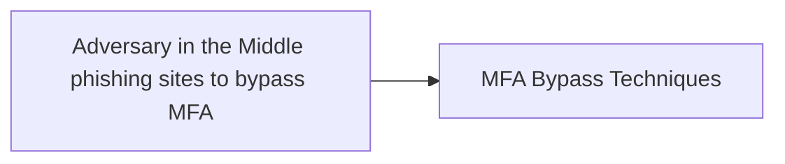

# Adversary in the Middle phishing sites to bypass MFA

## Metadata

- **UUID**: `66aafb61-9a46-4287-8b40-4785b42b77a3`
- **Schema**: `threat::1.0`
- **TLP**: clear

## Description
Threat actors use malicious attachments to send the users 
to redirection site, which hosts a fake MFA login page.
The MitM page completes the authentication flow by interfacing
with the legitimate IdP, and captures valid accounts

## Techniques
- T1566.002
- T1557
- T1539
- T1556
- T1078.004

## Chaining

