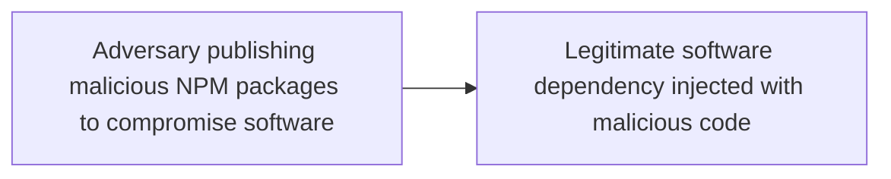

# Adversary publishing malicious NPM packages to compromise software

## Metadata

- **UUID**: `d24f2b4a-80fc-4ee7-9293-3f6e9e3bbbe4`
- **Schema**: `threat::1.0`
- **TLP**: clear

## Description
Threat actors use a technique which includes updating of NPM packages
with malicious code to deceive a developer or an end-user to download
and install them. This attack vector is used to steal profile and
system data from the developer's systems.    

In one of the threat actor's campaigns was observed that multiple
cryptocurrency-related packages are targeted, and the popular
country-currency-map package was downloaded thousands of times
a week. The malicious code is found in two heavily obfuscated
scripts, "/scripts/launch.js" and "/scripts/diagnostic-report.js,"
which execute upon the package installation ref [1].    

The threat actor steals the device's environment variables and sends
them to a remote host. The threat actor's groups are targeting environment
variables as they can contain API keys, database credentials, cloud
credentials, and encryption keys, which can be used for further attacks.

## Techniques
- T1195
- T1082
- T1546.016
- T1036

## Chaining

