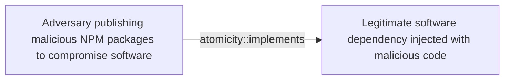

# Adversary publishing malicious NPM packages to compromise software

## Metadata

- **UUID**: `d24f2b4a-80fc-4ee7-9293-3f6e9e3bbbe4`
- **Schema**: `threat::1.0`
- **Version**: `1`
- **Created**: `2025-04-09`
- **Modified**: `2025-04-24`
- **TLP**: clear (`TLP:CLEAR`)
- **Organisation**: EC DIGIT CSOC (`56b0a0f0-b0bc-47d9-bb46-02f80ae2065a`)

## References
### Public
- **1**: [https://www.bleepingcomputer.com/news/security/infostealer-campaign-compromises-10-npm-packages-targets-devs/](https://www.bleepingcomputer.com/news/security/infostealer-campaign-compromises-10-npm-packages-targets-devs/)
- **2**: [https://github.blog/security/vulnerability-research/security-alert-social-engineering-campaign-targets-technology-industry-employees/#indicators](https://github.blog/security/vulnerability-research/security-alert-social-engineering-campaign-targets-technology-industry-employees/#indicators)
- **3**: [https://www.sonatype.com/blog/multiple-crypto-packages-hijacked-turned-into-info-stealers](https://www.sonatype.com/blog/multiple-crypto-packages-hijacked-turned-into-info-stealers)
- **4**: [https://www.reversinglabs.com/blog/malicious-npm-patch-delivers-reverse-shell](https://www.reversinglabs.com/blog/malicious-npm-patch-delivers-reverse-shell)
- **5**: [https://www.crowdstrike.com/en-us/blog/crowdstrike-customers-protected-from-compromised-npm-package-in-supply-chain-attack/](https://www.crowdstrike.com/en-us/blog/crowdstrike-customers-protected-from-compromised-npm-package-in-supply-chain-attack/)
- **6**: [https://thehackernews.com/2025/04/malicious-npm-package-targets-atomic.html](https://thehackernews.com/2025/04/malicious-npm-package-targets-atomic.html)

## Description
Threat actors use a technique which includes updating of NPM packages
with malicious code to deceive a developer or an end-user to download
and install them. This attack vector is used to steal profile and
system data from the developer's systems.    

In one of the threat actor's campaigns was observed that multiple
cryptocurrency-related packages are targeted, and the popular
country-currency-map package was downloaded thousands of times
a week. The malicious code is found in two heavily obfuscated
scripts, "/scripts/launch.js" and "/scripts/diagnostic-report.js,"
which execute upon the package installation ref [1].    

The threat actor steals the device's environment variables and sends
them to a remote host. The threat actor's groups are targeting environment
variables as they can contain API keys, database credentials, cloud
credentials, and encryption keys, which can be used for further attacks.

## Criticality
**Low** - A Low priority incident is unlikely to affect public health or safety, national security, economic security, foreign relations, civil liberties, or public confidence.

## Terrain
> **Adversary publishing malicious NPM packages to compromise software.

Domains: Enterprise, Industrial, Mobile
Targets: End-user, Developer, Laptop, Customer, Other, API Endpoints
Platforms: Windows, Linux, macOS**

## Threat Assessment
| Dimension | Assessment | Description |
| --- | --- | --- |
| Severity | Moderate incident | A cyber attack on a small organisation, or which poses a considerable risk to a medium-sized organisation, or preliminary indications of cyber activity against a large organisation or the government. |
| Impact | Identity Theft; Impairement; Lose Capabilities | - |
| Leverage | Infrastructure Compromise; Information Disclosure; Tampering | - |
| Viability | Likely | Probable (probably) - 55-80% |
| Kill Chain | Exploitation | Techniques to exploit vulnerabilities in systems that may, amongst others, result in code execution. |

## Actors
| Actor | ID | Source | Description |
| --- | --- | --- | --- |
| TraderTraitor | `misp::825abfd9-7238-4438-a9e7-c08791f4df4e` | ('misp',) | TraderTraitor targets blockchain companies through spear-phishing messages. The group sends these messages to employees, particularly those in system administration or software development roles, on various communication platforms, intended to gain access to these start-up and high-tech companies. TraderTraitor may be the work of operators previously responsible for APT38 activity. |
| Lazarus Group | `misp::68391641-859f-4a9a-9a1e-3e5cf71ec376` | ('misp',) | Since 2009, HIDDEN COBRA actors have leveraged their capabilities to target and compromise a range of victims; some intrusions have resulted in the exfiltration of data while others have been disruptive in nature. Commercial reporting has referred to this activity as Lazarus Group and Guardians of Peace. Tools and capabilities used by HIDDEN COBRA actors include DDoS botnets, keyloggers, remote access tools (RATs), and wiper malware. Variants of malware and tools used by HIDDEN COBRA actors include Destover, Duuzer, and Hangman. |

## ATT&CK Techniques
| Technique | Name | Description |
| --- | --- | --- |
| `T1195` | [Supply Chain Compromise](https://attack.mitre.org/techniques/T1195) | Adversaries may manipulate products or product delivery mechanisms prior to receipt by a final consumer for the purpose of data or system compromise.  Supply chain compromise can take place at any stage of the supply chain including:  * Manipulation of development tools * Manipulation of a development environment * Manipulation of source code repositories (public or private) * Manipulation of source code in open-source dependencies * Manipulation of software update/distribution mechanisms * Compromised/infected system images (multiple cases of removable media infected at the factory)(Citation: IBM Storwize)(Citation: Schneider Electric USB Malware)  * Replacement of legitimate software with modified versions * Sales of modified/counterfeit products to legitimate distributors * Shipment interdiction  While supply chain compromise can impact any component of hardware or software, adversaries looking to gain execution have often focused on malicious additions to legitimate software in software distribution or update channels.(Citation: Avast CCleaner3 2018)(Citation: Microsoft Dofoil 2018)(Citation: Command Five SK 2011) Targeting may be specific to a desired victim set or malicious software may be distributed to a broad set of consumers but only move on to additional tactics on specific victims.(Citation: Symantec Elderwood Sept 2012)(Citation: Avast CCleaner3 2018)(Citation: Command Five SK 2011) Popular open source projects that are used as dependencies in many applications may also be targeted as a means to add malicious code to users of the dependency.(Citation: Trendmicro NPM Compromise) |
| `T1082` | [System Information Discovery](https://attack.mitre.org/techniques/T1082) | An adversary may attempt to get detailed information about the operating system and hardware, including version, patches, hotfixes, service packs, and architecture. Adversaries may use the information from [System Information Discovery](https://attack.mitre.org/techniques/T1082) during automated discovery to shape follow-on behaviors, including whether or not the adversary fully infects the target and/or attempts specific actions.  Tools such as [Systeminfo](https://attack.mitre.org/software/S0096) can be used to gather detailed system information. If running with privileged access, a breakdown of system data can be gathered through the <code>systemsetup</code> configuration tool on macOS. As an example, adversaries with user-level access can execute the <code>df -aH</code> command to obtain currently mounted disks and associated freely available space. Adversaries may also leverage a [Network Device CLI](https://attack.mitre.org/techniques/T1059/008) on network devices to gather detailed system information (e.g. <code>show version</code>).(Citation: US-CERT-TA18-106A) On ESXi servers, threat actors may gather system information from various esxcli utilities, such as `system hostname get`, `system version get`, and `storage filesystem list` (to list storage volumes).(Citation: Crowdstrike Hypervisor Jackpotting Pt 2 2021)(Citation: Varonis)  Infrastructure as a Service (IaaS) cloud providers such as AWS, GCP, and Azure allow access to instance and virtual machine information via APIs. Successful authenticated API calls can return data such as the operating system platform and status of a particular instance or the model view of a virtual machine.(Citation: Amazon Describe Instance)(Citation: Google Instances Resource)(Citation: Microsoft Virutal Machine API)  [System Information Discovery](https://attack.mitre.org/techniques/T1082) combined with information gathered from other forms of discovery and reconnaissance can drive payload development and concealment.(Citation: OSX.FairyTale)(Citation: 20 macOS Common Tools and Techniques) |
| `T1546.016` | [Event Triggered Execution: Installer Packages](https://attack.mitre.org/techniques/T1546/016) | Adversaries may establish persistence and elevate privileges by using an installer to trigger the execution of malicious content. Installer packages are OS specific and contain the resources an operating system needs to install applications on a system. Installer packages can include scripts that run prior to installation as well as after installation is complete. Installer scripts may inherit elevated permissions when executed. Developers often use these scripts to prepare the environment for installation, check requirements, download dependencies, and remove files after installation.(Citation: Installer Package Scripting Rich Trouton)  Using legitimate applications, adversaries have distributed applications with modified installer scripts to execute malicious content. When a user installs the application, they may be required to grant administrative permissions to allow the installation. At the end of the installation process of the legitimate application, content such as macOS `postinstall` scripts can be executed with the inherited elevated permissions. Adversaries can use these scripts to execute a malicious executable or install other malicious components (such as a [Launch Daemon](https://attack.mitre.org/techniques/T1543/004)) with the elevated permissions.(Citation: Application Bundle Manipulation Brandon Dalton)(Citation: wardle evilquest parti)(Citation: Windows AppleJeus GReAT)(Citation: Debian Manual Maintainer Scripts)  Depending on the distribution, Linux versions of package installer scripts are sometimes called maintainer scripts or post installation scripts. These scripts can include `preinst`, `postinst`, `prerm`, `postrm` scripts and run as root when executed.  For Windows, the Microsoft Installer services uses `.msi` files to manage the installing, updating, and uninstalling of applications. These installation routines may also include instructions to perform additional actions that may be abused by adversaries.(Citation: Microsoft Installation Procedures) |
| `T1036` | [Masquerading](https://attack.mitre.org/techniques/T1036) | Adversaries may attempt to manipulate features of their artifacts to make them appear legitimate or benign to users and/or security tools. Masquerading occurs when the name or location of an object, legitimate or malicious, is manipulated or abused for the sake of evading defenses and observation. This may include manipulating file metadata, tricking users into misidentifying the file type, and giving legitimate task or service names.  Renaming abusable system utilities to evade security monitoring is also a form of [Masquerading](https://attack.mitre.org/techniques/T1036).(Citation: LOLBAS Main Site) |

## Chaining

### Chaining details
#### implements -> Legitimate software dependency injected with malicious code (`atomicity::implements`)
Threat actors use a technique to mimic legitimate software
packages in order to mislead the developers in downloading
and infecting their systems.

- **Target UUID**: `b6887f4b-eeae-462c-a2ac-7454efb5eabc`
