# AppLocker bypass

## Metadata

- **UUID**: `197c06c8-7959-4e28-9ede-b3e7b6f13442`
- **Schema**: `threat::1.0`
- **Version**: `2`
- **Created**: `2025-02-04`
- **Modified**: `2025-07-23`
- **TLP**: clear (`TLP:CLEAR`)
- **Organisation**: EC DIGIT CSOC (`56b0a0f0-b0bc-47d9-bb46-02f80ae2065a`)

## References
### Public
- **1**: [https://techyrick.com/applocker-bypass-windows-privilege-escalation/](https://techyrick.com/applocker-bypass-windows-privilege-escalation/)
- **2**: [https://github.com/api0cradle/UltimateAppLockerByPassList/blob/master/Generic-AppLockerbypasses.md](https://github.com/api0cradle/UltimateAppLockerByPassList/blob/master/Generic-AppLockerbypasses.md)
- **3**: [https://learn.microsoft.com/en-us/windows/security/application-security/application-control/app-control-for-business/applocker/applocker-technical-reference](https://learn.microsoft.com/en-us/windows/security/application-security/application-control/app-control-for-business/applocker/applocker-technical-reference)

## Description
### AppLocker rules types 

AppLocker can be found from within the Group Policy Management at _Local Computer Policy ->
Computer Configuration -> Windows Settings -> Security Settings -> Application Control Policies_.
Four rule types are available:  
- Executable rules: enforces the rules for executable files (`.exe`).
- Windows Installer rules: enforces the rules for windows installer files (`.msi`).
- Script rules: enforces the rules for PowerShell, JScript, VB and older file formats (`.cmd`, `.bat`).
- Package app rules: enforces the rules for packages that can be installed through Microsoft Store.

### Enumerating AppLocker policies

AppLocker policies can be enumerated using the registry query functionality, as show below:
`reg query HKEY_LOCAL_MACHINE\Software\Policies\Microsoft\Windows\SrpV2\`

## Several strategies are available:

### Bypassing leveraging trusted folders

There are several writable folders within `C:\WINDOWS` where standard users have write permissions by default.
`accesschk.exe` from Sysinternals Suite can be used to find folders that are writable and can be leveraged.
Furthermore, `icacls.exe` can be used to determine if we also have execute rights within the targeted folder.
By moving a binaryfile (for example) to the folder with execute rights, it is possible to execute the binary.

### Bypassing using DLLs

From the initial setup there was no option of blocking out DLLs by default, resulting in another way of bypassing
the application whitelisting. Note that AppLocker configuration can be further tweaked to restrict the usage of
DLLs by enabling DLL rule collection from within the AppLocker properties.

### Bypassing using Alternate Data Stream

Another method to bypass AppLocker involves embedding an executable into another file, known as an 
alternate data stream (ADS), and then executing the EXE from the ADS. AppLocker rules do not prevent executables
from running within an ADS.

### Bypassing using third parties

Third party tools or software can be used to bypass the AppLocker policy. However, this is conditional, as it
requires the system to have installed these tools on it. An example would be using Python or Perl.

## Criticality
**High** - A High priority incident is likely to result in a demonstrable impact to public health or safety, national security, economic security, foreign relations, civil liberties, or public confidence.

## Terrain
> **Adversary must have administrative privileges on Windows systems within 
the enterprise network.

Domains: Enterprise
Targets: Workstations, Laptop
Platforms: Active Directory, PowerShell, Windows**

## Threat Assessment
| Dimension | Assessment | Description |
| --- | --- | --- |
| Severity | Localised incident | A cyber attack on an individual, or preliminary indications of cyber activity against a small or medium-sized organisation. |
| Impact | Data Breach; Business disruption; Reputational Damages; Operating costs | - |
| Leverage | Modify configuration; Modify privileges; Software installation | - |
| Viability | Environment dependent | Depends |
| Kill Chain | Privilege Escalation | The result of techniques that provide an attacker with higher permissions on a system or network. |

## Actors
| Actor | ID | Source | Description |
| --- | --- | --- | --- |
| Lazarus Group | `misp::68391641-859f-4a9a-9a1e-3e5cf71ec376` | ('misp',) | Since 2009, HIDDEN COBRA actors have leveraged their capabilities to target and compromise a range of victims; some intrusions have resulted in the exfiltration of data while others have been disruptive in nature. Commercial reporting has referred to this activity as Lazarus Group and Guardians of Peace. Tools and capabilities used by HIDDEN COBRA actors include DDoS botnets, keyloggers, remote access tools (RATs), and wiper malware. Variants of malware and tools used by HIDDEN COBRA actors include Destover, Duuzer, and Hangman. |
| Volt Typhoon | `misp::f02679fa-5e85-4050-8eb5-c2677d93306f` | ('misp',) | [Microsoft] Volt Typhoon, a state-sponsored actor based in China that typically focuses on espionage and information gathering. Microsoft assesses with moderate confidence that this Volt Typhoon campaign is pursuing development of capabilities that could disrupt critical communications infrastructure between the United States and Asia region during future crises.  [Secureworks] BRONZE SILHOUETTE likely operates on behalf the PRC. The targeting of U.S. government and defense organizations for intelligence gain aligns with PRC requirements, and the tradecraft observed in these engagements overlap with other state-sponsored Chinese threat groups. |

## ATT&CK Techniques
| Technique | Name | Description |
| --- | --- | --- |
| `T1218` | [System Binary Proxy Execution](https://attack.mitre.org/techniques/T1218) | Adversaries may bypass process and/or signature-based defenses by proxying execution of malicious content with signed, or otherwise trusted, binaries. Binaries used in this technique are often Microsoft-signed files, indicating that they have been either downloaded from Microsoft or are already native in the operating system.(Citation: LOLBAS Project) Binaries signed with trusted digital certificates can typically execute on Windows systems protected by digital signature validation. Several Microsoft signed binaries that are default on Windows installations can be used to proxy execution of other files or commands.  Similarly, on Linux systems adversaries may abuse trusted binaries such as <code>split</code> to proxy execution of malicious commands.(Citation: split man page)(Citation: GTFO split) |

## Chaining

```mermaid
flowchart LR
197c06c8_7959_4e28_9ede_b3e7b6f13442["AppLocker bypass"]
9a1aeae5_912e_492c_b5d4_8bce91a95dae["AppLocker enumerating policy bypass"]
ff8c52ac_77d0_4bee_9f6d_e40fc6e0da63["AppLocker bypass using writable folders"]
a73c2506_8584_4c0b_bfdc_52e33c8bd229["AppLocker bypass using DLLs"]
197c06c8_7959_4e28_9ede_b3e7b6f13442 -->|atomicity::implemented| 9a1aeae5_912e_492c_b5d4_8bce91a95dae
9a1aeae5_912e_492c_b5d4_8bce91a95dae -->|atomicity::implemented| ff8c52ac_77d0_4bee_9f6d_e40fc6e0da63
ff8c52ac_77d0_4bee_9f6d_e40fc6e0da63 -->|atomicity::implemented| a73c2506_8584_4c0b_bfdc_52e33c8bd229
```

### Chaining details
#### implemented -> AppLocker enumerating policy bypass (`atomicity::implemented`)
One of the methods to bypass an Applocker is to enumerate AppLocker
policies. A vulnerability in these policies can lead to compromise
AppLocker defence mechanisms and unauthorised applications access.

- **Target UUID**: `9a1aeae5-912e-492c-b5d4-8bce91a95dae`
#### implemented -> AppLocker bypass using writable folders (`atomicity::implemented`)
A threat actor can place a malicious executable in a writable folder
that is not restricted by AppLocker. This technique is used to bypass
AppLocker controls.

- **Target UUID**: `ff8c52ac-77d0-4bee-9f6d-e40fc6e0da63`
#### implemented -> AppLocker bypass using DLLs (`atomicity::implemented`)
A malicious DLL can mimic a legitimate process, which is allowed to run
by AppLocker. A threat actor can use this technique to bypass AppLocker
protection mechanism and functionality.

- **Target UUID**: `a73c2506-8584-4c0b-bfdc-52e33c8bd229`
