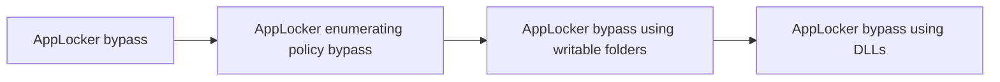

# AppLocker bypass

## Metadata

- **UUID**: `197c06c8-7959-4e28-9ede-b3e7b6f13442`
- **Schema**: `threat::1.0`
- **TLP**: clear

## Description
### AppLocker rules types 

AppLocker can be found from within the Group Policy Management at _Local Computer Policy ->
Computer Configuration -> Windows Settings -> Security Settings -> Application Control Policies_.
Four rule types are available:  
- Executable rules: enforces the rules for executable files (`.exe`).
- Windows Installer rules: enforces the rules for windows installer files (`.msi`).
- Script rules: enforces the rules for PowerShell, JScript, VB and older file formats (`.cmd`, `.bat`).
- Package app rules: enforces the rules for packages that can be installed through Microsoft Store.

### Enumerating AppLocker policies

AppLocker policies can be enumerated using the registry query functionality, as show below:
`reg query HKEY_LOCAL_MACHINE\Software\Policies\Microsoft\Windows\SrpV2\`

## Several strategies are available:

### Bypassing leveraging trusted folders

There are several writable folders within `C:\WINDOWS` where standard users have write permissions by default.
`accesschk.exe` from Sysinternals Suite can be used to find folders that are writable and can be leveraged.
Furthermore, `icacls.exe` can be used to determine if we also have execute rights within the targeted folder.
By moving a binaryfile (for example) to the folder with execute rights, it is possible to execute the binary.

### Bypassing using DLLs

From the initial setup there was no option of blocking out DLLs by default, resulting in another way of bypassing
the application whitelisting. Note that AppLocker configuration can be further tweaked to restrict the usage of
DLLs by enabling DLL rule collection from within the AppLocker properties.

### Bypassing using Alternate Data Stream

Another method to bypass AppLocker involves embedding an executable into another file, known as an 
alternate data stream (ADS), and then executing the EXE from the ADS. AppLocker rules do not prevent executables
from running within an ADS.

### Bypassing using third parties

Third party tools or software can be used to bypass the AppLocker policy. However, this is conditional, as it
requires the system to have installed these tools on it. An example would be using Python or Perl.

## Techniques
- T1218

## Chaining

