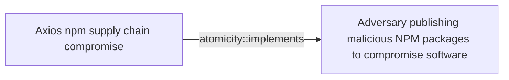
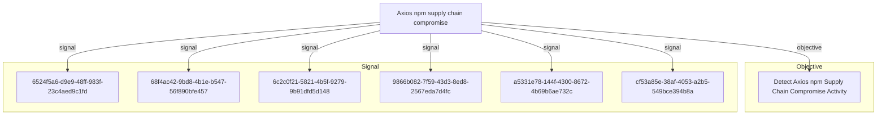

# Axios npm supply chain compromise

## Metadata

- **UUID**: `000790d9-06de-49af-893d-e4993abe6e38`
- **Schema**: `threat::1.0`
- **Version**: `1`
- **Created**: `2026-04-28`
- **Modified**: `2026-04-28`
- **TLP**: clear (`TLP:CLEAR`)
- **Organisation**: EC DIGIT CSOC (`56b0a0f0-b0bc-47d9-bb46-02f80ae2065a`)

## References
### Public
- **1**: [https://www.cisa.gov/news-events/alerts/2026/04/20/supply-chain-compromise-impacts-axios-node-package-manager](https://www.cisa.gov/news-events/alerts/2026/04/20/supply-chain-compromise-impacts-axios-node-package-manager)
- **2**: [https://www.microsoft.com/en-us/security/blog/2026/04/01/mitigating-the-axios-npm-supply-chain-compromise/](https://www.microsoft.com/en-us/security/blog/2026/04/01/mitigating-the-axios-npm-supply-chain-compromise/)
- **3**: [https://cloud.google.com/blog/topics/threat-intelligence/north-korea-threat-actor-targets-axios-npm-package](https://cloud.google.com/blog/topics/threat-intelligence/north-korea-threat-actor-targets-axios-npm-package)
- **4**: [https://www.aikido.dev/blog/axios-npm-compromised-maintainer-hijacked-rat](https://www.aikido.dev/blog/axios-npm-compromised-maintainer-hijacked-rat)
- **5**: [https://socprime.com/active-threats/supply-chain-attack-on-axios-pulls-malicious-dependency-from-npm/](https://socprime.com/active-threats/supply-chain-attack-on-axios-pulls-malicious-dependency-from-npm/)
- **6**: [https://www.huntress.com/blog/axios-npm-compromise](https://www.huntress.com/blog/axios-npm-compromise)
- **7**: [https://www.elastic.co/security-labs/axios-one-rat-to-rule-them-all](https://www.elastic.co/security-labs/axios-one-rat-to-rule-them-all)
- **8**: [https://www.picussecurity.com/resource/blog/axios-npm-supply-chain-attack-cross-platform-rat-delivery-via-compromised-maintainer-credentials](https://www.picussecurity.com/resource/blog/axios-npm-supply-chain-attack-cross-platform-rat-delivery-via-compromised-maintainer-credentials)
- **9**: [https://www.stepsecurity.io/blog/axios-compromised-on-npm-malicious-versions-drop-remote-access-trojan](https://www.stepsecurity.io/blog/axios-compromised-on-npm-malicious-versions-drop-remote-access-trojan)
- **10**: [https://socket.dev/blog/axios-npm-package-compromised](https://socket.dev/blog/axios-npm-package-compromised)
- **11**: [https://github.com/axios/axios/issues/10636](https://github.com/axios/axios/issues/10636)
- **12**: [https://www.airlockdigital.com/airlock-blog/the-axios-supply-chain-attack-why-detection-wasnt-enough](https://www.airlockdigital.com/airlock-blog/the-axios-supply-chain-attack-why-detection-wasnt-enough)

## Description
## Executive Summary

On 31 March 2026, the npm account of `jasonsaayman` - the lead
maintainer of the `axios` HTTP client (~100M weekly downloads on
the 1.x branch and ~83M on the 0.x branch) - was used to publish
two malicious releases: `axios@1.14.1` (tagged `latest`) and
`axios@0.30.4` (tagged `legacy`). The compromised versions were
live for roughly three hours before being unpublished by npm.
During that window, any default `npm install axios` resolved to a
backdoored package whose only modification - a single line in
`package.json` adding `"plain-crypto-js": "^4.2.1"` - pulled in a
pre-staged dropper that, via the npm postinstall lifecycle hook,
deployed a cross-platform Remote Access Trojan (tracked by Google
GTIG and Elastic Security Labs as `WAVESHAPER.V2`) on Windows,
macOS, and Linux hosts.

Google Threat Intelligence Group attributes the activity to
`UNC1069`, a financially motivated North Korea-nexus actor active
since at least 2018, based on malware lineage and infrastructure
overlap.

## Attack Timeline (UTC)

- **2026-03-30 05:57** - Attacker-controlled npm account `nrwise`
  (`nrwise@proton.me`) publishes a clean decoy package
  `plain-crypto-js@4.2.0` to seed registry history.
- **2026-03-30 23:59** - `nrwise` publishes
  `plain-crypto-js@4.2.1` carrying the malicious `setup.js`
  dropper wired into the `postinstall` hook.
- **2026-03-31 00:21** - The `jasonsaayman` npm account, with
  its registered email silently changed to `ifstap@proton.me`,
  publishes `axios@1.14.1` directly via CLI (no GitHub Actions
  OIDC, no SLSA provenance), declaring `plain-crypto-js@^4.2.1`
  as a dependency.
- **2026-03-31 ~01:00** - Same actor publishes `axios@0.30.4`
  with the identical malicious dependency, hitting the
  legacy 0.x branch.
- **2026-03-31 ~01:00** - First external detections by
  Socket / StepSecurity / Aikido automated supply-chain
  monitoring; community alerting begins.
- **2026-03-31 ~03:20** - Both compromised axios versions and
  `plain-crypto-js@4.2.1` are unpublished from the npm registry.
- **2026-04-02** - Maintainer publishes the public post-mortem
  (axios issue #10636) describing the social-engineering chain
  that compromised his workstation.

## Initial Access: Maintainer Account Takeover via Social Engineering

The attackers gained `npm publish` rights on `axios` not by
exploiting the registry or the source code, but by compromising
the maintainer's workstation. According to the maintainer's own
post-mortem and corroborating reporting:

1. Attackers approached the maintainer pretending to be the
   founder of a (plausibly branded) company and invited him to
   a private Slack workspace populated with realistic channels,
   team members, and posts.
2. They scheduled a Microsoft Teams call with what appeared to
   be several stakeholders.
3. During the call, the attackers told the maintainer that
   "something on his system was out of date" and prompted him
   to install a fix. The "fix" was a Remote Access Trojan.
4. With full RAT-grade control of the workstation, the attackers
   extracted a long-lived classic npm access token (2FA on the
   account did not block local `npm publish` because TOTP can
   be relayed by a RAT operator), changed the registered email
   on the npm account to `ifstap@proton.me`, and published the
   two malicious releases directly from the registry CLI -
   bypassing the GitHub Actions / OIDC / SLSA Trusted Publisher
   workflow that had signed every legitimate v1.x release since
   2023.

## Delivery: Pre-staged Transitive Dependency

The only change to the axios package itself, in both compromised
versions, was a single new entry under `dependencies` in
`package.json`:

```json
"plain-crypto-js": "^4.2.1"
```

`plain-crypto-js` is never imported anywhere in the axios source.
It exists solely to execute its `postinstall` hook on every
consumer. The dependency had been pre-staged ~18 hours earlier:
a clean `4.2.0` was published first to give the package
legitimate-looking registry history, then `4.2.1` was published
with the malicious `setup.js` dropper.

Because npm's standard resolution honours `^` semver ranges,
every downstream `npm install axios` during the exposure window
transparently pulled the malicious transitive dependency,
regardless of any explicit pinning at the application level.

## Execution: setup.js Dropper and WAVESHAPER.V2 Deployment

The `postinstall` hook of `plain-crypto-js@4.2.1` runs
`node setup.js`, an obfuscated Node.js dropper using a custom
Base64 + XOR string-table scheme. After deobfuscation it:

1. Calls `os.platform()` and branches into one of three
   OS-specific delivery routines.
2. Issues an HTTP POST to `http://sfrclak[.]com:8000/6202033`
   with a platform tag in the body
   (`packages.npm.org/product0` for macOS,
   `packages.npm.org/product1` for Windows,
   `packages.npm.org/product2` for Linux). The
   `packages.npm.org/` prefix in the body is a deliberate
   attempt to make outbound traffic look like benign npm
   registry chatter in network logs.
3. Receives the platform-specific stage-2 payload from the same
   endpoint and executes it.
4. Self-deletes (`setup.js` is removed and `package.json` is
   overwritten with a clean stub) to hide on-disk evidence.

### macOS chain
- Stage-2: compiled Mach-O binary saved to
  `/Library/Caches/com.apple.act.mond` (masquerading as an
  Apple system daemon).
- Permissions set with `chmod`, launched in the background
  via `nohup` / `/bin/bash`.

### Windows chain
- The dropper locates `powershell.exe` and copies it to
  `%PROGRAMDATA%\wt.exe` (masquerading as the Windows Terminal
  binary).
- Writes a transient VBScript at `%TEMP%\6202033.vbs`, executed
  via the renamed PowerShell, which fetches a PowerShell-based
  RAT script from C2 and executes it in memory.
- Transient artefacts: `%TEMP%\6202033.vbs`,
  `%TEMP%\6202033.ps1`.

### Linux chain
- The dropper uses Node.js `execSync` to fetch a Python RAT
  script, saved to `/tmp/ld.py` and launched in the background
  via `nohup` for terminal-session-independent persistence.

All three stage-2 payloads are functionally the same RAT
(`WAVESHAPER.V2`): identical C2 protocol, command set, and
operational behaviour across implementations.

## WAVESHAPER.V2 Operational Profile

- C2 transport: HTTP POST.
- Body encoding: Base64-encoded JSON.
- User-Agent: `mozilla/4.0 (compatible; msie 8.0; windows nt 5.1; trident/4.0)`
  (deliberately anachronistic, useful as a network detection
  signal).
- Beacon interval: ~60 seconds.
- Per-execution session UID: 16-character random alphanumeric.
- Outbound message types: `FirstInfo`, `BaseInfo`, `CmdResult`.
- Inbound command types: `kill`, `peinject`, `runscript`,
  `rundir`.
- Response command types: `rsp_kill`, `rsp_peinject`,
  `rsp_runscript`, `rsp_rundir`.

Capabilities observed across the three implementations include
system reconnaissance, in-memory script execution, payload
drop-and-run from a directory, PE injection (Windows), and
process termination.

## Indicators of Compromise (IOCs)

### Malicious npm packages
- `axios@1.14.1` - shasum
  `2553649f2322049666871cea80a5d0d6adc700ca` (compromised,
  tagged `latest` at time of discovery)
- `axios@0.30.4` - shasum
  `d6f3f62fd3b9f5432f5782b62d8cfd5247d5ee71` (compromised,
  tagged `legacy` at time of discovery)
- `plain-crypto-js@4.2.1` - shasum
  `07d889e2dadce6f3910dcbc253317d28ca61c766` (malicious dropper)
- `plain-crypto-js@4.2.0` (clean decoy used to seed registry
  history)

### Network indicators
- C2 domain: `sfrclak[.]com`
- C2 IP: `142.11.206.73`
- Suspected adjacent UNC1069 IP: `23.254.167.216`
- Full C2 URL: `http://sfrclak[.]com:8000/6202033`
- Campaign ID: `6202033`
- Distinctive User-Agent:
  `mozilla/4.0 (compatible; msie 8.0; windows nt 5.1; trident/4.0)`
- Suspicious POST body markers (decoy npm-looking strings):
  `packages.npm.org/product0`, `packages.npm.org/product1`,
  `packages.npm.org/product2`

### File system indicators
- macOS: `/Library/Caches/com.apple.act.mond`
  sha256 `92ff08773995ebc8d55ec4b8e1a225d0d1e51efa4ef88b8849d0071230c9645a`
- Windows: `%PROGRAMDATA%\wt.exe`,
  `%TEMP%\6202033.vbs`, `%TEMP%\6202033.ps1`
  (PowerShell stage-2 sha256
  `617b67a8e1210e4fc87c92d1d1da45a2f311c08d26e89b12307cf583c900d101`)
- Linux: `/tmp/ld.py`
  sha256 `fcb81618bb15edfdedfb638b4c08a2af9cac9ecfa551af135a8402bf980375cf`
- Presence of `node_modules/plain-crypto-js/` in any project
  tree is, on its own, a strong indicator that the dropper ran.

### Attacker accounts
- `jasonsaayman` (compromised legitimate maintainer; registered
  email silently flipped to `ifstap@proton.me`).
- `nrwise` (`nrwise@proton.me`) - attacker-created npm account
  used to publish `plain-crypto-js`.

## Mitigation Recommendations

1. **Immediate**
   - Pin to safe versions: `axios@1.14.0` (1.x branch) and
     `axios@0.30.3` (0.x branch). Add explicit `overrides` /
     `resolutions` in manifests to prevent transitive resolution
     to compromised versions.
   - Remove `plain-crypto-js` from `node_modules` and
     regenerate lockfiles from a clean state.
   - Treat any host that ran `npm install` resolving to
     `axios@1.14.1` or `axios@0.30.4` as fully compromised.
     Rotate every credential reachable from that host: npm
     tokens, GitHub PATs, AWS / Azure / GCP keys, SSH keys,
     CI/CD secrets, and `.env` values.
   - Block egress to `sfrclak[.]com` and `142.11.206.73`.
2. **Hardening**
   - Run `npm ci --ignore-scripts` in CI/CD as a default policy
     to neutralise `postinstall`-based supply chain attacks.
   - Configure managed npm registries / proxies to enforce a
     minimum package age (e.g. `npm config set min-release-age 3`
     days) so that packages published in a narrow attacker
     window are not pulled into builds before community
     detection.
   - Enforce GitHub Actions / OIDC Trusted Publishing and
     require SLSA provenance attestations on critical packages;
     monitor for regressions where a previously-attested package
     is suddenly published from a CLI without provenance.
   - Subscribe to malicious-package feeds (OpenSSF Malicious
     Packages, Aikido Intel, Socket, StepSecurity) and integrate
     them into pre-install gating.

## Key Takeaways

- The axios source code was never modified - the attack lived
  entirely in the npm publish pipeline and a single injected
  transitive dependency.
- 2FA on the maintainer account did not stop the attack; a RAT
  with interactive control of the workstation defeats software
  TOTP just as easily as it defeats a stored token.
- The same incident chained two human-targeted techniques (fake
  Slack / fake Teams call to install a "fix") with two
  ecosystem-targeted techniques (transitive dependency staging
  + maintainer account takeover) to reach hundreds of millions
  of consumers in a 3-hour window.
- WAVESHAPER.V2 is a single RAT specification implemented in
  three languages targeting three operating systems, all
  sharing the same C2 protocol. Detection should not focus on
  a single platform.

## Criticality
**Severe** - A Severe priority incident is likely to result in a significant impact to public health or safety, national security, economic security, foreign relations, or civil liberties.

## Terrain
> **Any organisation, developer workstation, or CI/CD pipeline that
resolved axios from the public npm registry between 2026-03-31
~00:21 UTC and ~03:20 UTC, where the resolved version was either
axios@1.14.1 (tagged latest) or axios@0.30.4 (tagged legacy).
During that ~3-hour window, a default `npm install axios` (or any
transitive resolution that floated to the latest minor) pulled in
the malicious plain-crypto-js@^4.2.1 dependency, whose postinstall
hook executed automatically on Windows, macOS, and Linux build
hosts and developer laptops. Affected populations explicitly
observed in the wild include developer endpoints, build agents,
and CI runners across multiple operating systems and sectors;
Huntress alone reported at least 135 endpoints communicating with
the attacker C2 during the exposure window. The attack does not
rely on any vulnerability in axios source code - the trust
boundary between maintainer credentials and the npm publish
pipeline is the actual vulnerable surface.

Surface: OS::Windows, OS::macOS, OS::Linux, Application::Development::Package Management::npm, Application::Development::CI/CD**

## Threat Assessment
| Dimension | Assessment | Description |
| --- | --- | --- |
| Severity | Highly significant incident | A cyber attack which has a serious impact on central government, (inter)national essential services, a large proportion of the (inter)national population, or the (inter)national economy. |
| Impact | Data Breach; Business disruption; Lose Capabilities; Reputational Damages; Operating costs | - |
| Leverage | Infrastructure Compromise; Tampering; Software installation; Information Gathering; Information Disclosure | - |
| Viability | Almost certain | Nearly certain - 95-99% |
| Kill Chain | Delivery | Techniques resulting in the transmission of a weaponized object to the targeted environment. |

## Actors
| Actor | ID | Source | Description |
| --- | --- | --- | --- |
| TraderTraitor | `misp::825abfd9-7238-4438-a9e7-c08791f4df4e` | ('misp',) | TraderTraitor targets blockchain companies through spear-phishing messages. The group sends these messages to employees, particularly those in system administration or software development roles, on various communication platforms, intended to gain access to these start-up and high-tech companies. TraderTraitor may be the work of operators previously responsible for APT38 activity. |
| Lazarus Group | `misp::68391641-859f-4a9a-9a1e-3e5cf71ec376` | ('misp',) | Since 2009, HIDDEN COBRA actors have leveraged their capabilities to target and compromise a range of victims; some intrusions have resulted in the exfiltration of data while others have been disruptive in nature. Commercial reporting has referred to this activity as Lazarus Group and Guardians of Peace. Tools and capabilities used by HIDDEN COBRA actors include DDoS botnets, keyloggers, remote access tools (RATs), and wiper malware. Variants of malware and tools used by HIDDEN COBRA actors include Destover, Duuzer, and Hangman. |

## ATT&CK Techniques
| Technique | Name | Description |
| --- | --- | --- |
| `T1195.001` | [Supply Chain Compromise: Compromise Software Dependencies and Development Tools](https://attack.mitre.org/techniques/T1195/001) | Adversaries may manipulate software dependencies and development tools prior to receipt by a final consumer for the purpose of data or system compromise. Applications often depend on external software to function properly. Popular open source projects that are used as dependencies in many applications may be targeted as a means to add malicious code to users of the dependency.(Citation: Trendmicro NPM Compromise)    Targeting may be specific to a desired victim set or may be distributed to a broad set of consumers but only move on to additional tactics on specific victims. |
| `T1195.002` | [Supply Chain Compromise: Compromise Software Supply Chain](https://attack.mitre.org/techniques/T1195/002) | Adversaries may manipulate application software prior to receipt by a final consumer for the purpose of data or system compromise. Supply chain compromise of software can take place in a number of ways, including manipulation of the application source code, manipulation of the update/distribution mechanism for that software, or replacing compiled releases with a modified version.  Targeting may be specific to a desired victim set or may be distributed to a broad set of consumers but only move on to additional tactics on specific victims.(Citation: Avast CCleaner3 2018)(Citation: Command Five SK 2011) |
| `T1546.016` | [Event Triggered Execution: Installer Packages](https://attack.mitre.org/techniques/T1546/016) | Adversaries may establish persistence and elevate privileges by using an installer to trigger the execution of malicious content. Installer packages are OS specific and contain the resources an operating system needs to install applications on a system. Installer packages can include scripts that run prior to installation as well as after installation is complete. Installer scripts may inherit elevated permissions when executed. Developers often use these scripts to prepare the environment for installation, check requirements, download dependencies, and remove files after installation.(Citation: Installer Package Scripting Rich Trouton)  Using legitimate applications, adversaries have distributed applications with modified installer scripts to execute malicious content. When a user installs the application, they may be required to grant administrative permissions to allow the installation. At the end of the installation process of the legitimate application, content such as macOS `postinstall` scripts can be executed with the inherited elevated permissions. Adversaries can use these scripts to execute a malicious executable or install other malicious components (such as a [Launch Daemon](https://attack.mitre.org/techniques/T1543/004)) with the elevated permissions.(Citation: Application Bundle Manipulation Brandon Dalton)(Citation: wardle evilquest parti)(Citation: Windows AppleJeus GReAT)(Citation: Debian Manual Maintainer Scripts)  Depending on the distribution, Linux versions of package installer scripts are sometimes called maintainer scripts or post installation scripts. These scripts can include `preinst`, `postinst`, `prerm`, `postrm` scripts and run as root when executed.  For Windows, the Microsoft Installer services uses `.msi` files to manage the installing, updating, and uninstalling of applications. These installation routines may also include instructions to perform additional actions that may be abused by adversaries.(Citation: Microsoft Installation Procedures) |
| `T1078` | [Valid Accounts](https://attack.mitre.org/techniques/T1078) | Adversaries may obtain and abuse credentials of existing accounts as a means of gaining Initial Access, Persistence, Privilege Escalation, or Defense Evasion. Compromised credentials may be used to bypass access controls placed on various resources on systems within the network and may even be used for persistent access to remote systems and externally available services, such as VPNs, Outlook Web Access, network devices, and remote desktop.(Citation: volexity_0day_sophos_FW) Compromised credentials may also grant an adversary increased privilege to specific systems or access to restricted areas of the network. Adversaries may choose not to use malware or tools in conjunction with the legitimate access those credentials provide to make it harder to detect their presence.  In some cases, adversaries may abuse inactive accounts: for example, those belonging to individuals who are no longer part of an organization. Using these accounts may allow the adversary to evade detection, as the original account user will not be present to identify any anomalous activity taking place on their account.(Citation: CISA MFA PrintNightmare)  The overlap of permissions for local, domain, and cloud accounts across a network of systems is of concern because the adversary may be able to pivot across accounts and systems to reach a high level of access (i.e., domain or enterprise administrator) to bypass access controls set within the enterprise.(Citation: TechNet Credential Theft) |
| `T1566.004` | [Phishing: Spearphishing Voice](https://attack.mitre.org/techniques/T1566/004) | Adversaries may use voice communications to ultimately gain access to victim systems. Spearphishing voice is a specific variant of spearphishing. It is different from other forms of spearphishing in that is employs the use of manipulating a user into providing access to systems through a phone call or other forms of voice communications. Spearphishing frequently involves social engineering techniques, such as posing as a trusted source (ex: [Impersonation](https://attack.mitre.org/techniques/T1656)) and/or creating a sense of urgency or alarm for the recipient.  All forms of phishing are electronically delivered social engineering. In this scenario, adversaries are not directly sending malware to a victim vice relying on [User Execution](https://attack.mitre.org/techniques/T1204) for delivery and execution. For example, victims may receive phishing messages that instruct them to call a phone number where they are directed to visit a malicious URL, download malware,(Citation: sygnia Luna Month)(Citation: CISA Remote Monitoring and Management Software) or install adversary-accessible remote management tools ([Remote Access Tools](https://attack.mitre.org/techniques/T1219)) onto their computer.(Citation: Unit42 Luna Moth)  Adversaries may also combine voice phishing with [Multi-Factor Authentication Request Generation](https://attack.mitre.org/techniques/T1621) in order to trick users into divulging MFA credentials or accepting authentication prompts.(Citation: Proofpoint Vishing) |
| `T1027.014` | [Obfuscated Files or Information: Polymorphic Code](https://attack.mitre.org/techniques/T1027/014) | Adversaries may utilize polymorphic code (also known as metamorphic or mutating code) to evade detection. Polymorphic code is a type of software capable of changing its runtime footprint during code execution.(Citation: polymorphic-blackberry) With each execution of the software, the code is mutated into a different version of itself that achieves the same purpose or objective as the original. This functionality enables the malware to evade traditional signature-based defenses, such as antivirus and antimalware tools.(Citation: polymorphic-sentinelone)  Other obfuscation techniques can be used in conjunction with polymorphic code to accomplish the intended effects, including using mutation engines to conduct actions such as [Software Packing](https://attack.mitre.org/techniques/T1027/002), [Command Obfuscation](https://attack.mitre.org/techniques/T1027/010), or [Encrypted/Encoded File](https://attack.mitre.org/techniques/T1027/013).(Citation: polymorphic-linkedin)(Citation: polymorphic-medium) |
| `T1059.001` | [Command and Scripting Interpreter: PowerShell](https://attack.mitre.org/techniques/T1059/001) | Adversaries may abuse PowerShell commands and scripts for execution. PowerShell is a powerful interactive command-line interface and scripting environment included in the Windows operating system.(Citation: TechNet PowerShell) Adversaries can use PowerShell to perform a number of actions, including discovery of information and execution of code. Examples include the <code>Start-Process</code> cmdlet which can be used to run an executable and the <code>Invoke-Command</code> cmdlet which runs a command locally or on a remote computer (though administrator permissions are required to use PowerShell to connect to remote systems).  PowerShell may also be used to download and run executables from the Internet, which can be executed from disk or in memory without touching disk.  A number of PowerShell-based offensive testing tools are available, including [Empire](https://attack.mitre.org/software/S0363),  [PowerSploit](https://attack.mitre.org/software/S0194), [PoshC2](https://attack.mitre.org/software/S0378), and PSAttack.(Citation: Github PSAttack)  PowerShell commands/scripts can also be executed without directly invoking the <code>powershell.exe</code> binary through interfaces to PowerShell's underlying <code>System.Management.Automation</code> assembly DLL exposed through the .NET framework and Windows Common Language Interface (CLI).(Citation: Sixdub PowerPick Jan 2016)(Citation: SilentBreak Offensive PS Dec 2015)(Citation: Microsoft PSfromCsharp APR 2014) |
| `T1059.005` | [Command and Scripting Interpreter: Visual Basic](https://attack.mitre.org/techniques/T1059/005) | Adversaries may abuse Visual Basic (VB) for execution. VB is a programming language created by Microsoft with interoperability with many Windows technologies such as [Component Object Model](https://attack.mitre.org/techniques/T1559/001) and the [Native API](https://attack.mitre.org/techniques/T1106) through the Windows API. Although tagged as legacy with no planned future evolutions, VB is integrated and supported in the .NET Framework and cross-platform .NET Core.(Citation: VB .NET Mar 2020)(Citation: VB Microsoft)  Derivative languages based on VB have also been created, such as Visual Basic for Applications (VBA) and VBScript. VBA is an event-driven programming language built into Microsoft Office, as well as several third-party applications.(Citation: Microsoft VBA)(Citation: Wikipedia VBA) VBA enables documents to contain macros used to automate the execution of tasks and other functionality on the host. VBScript is a default scripting language on Windows hosts and can also be used in place of [JavaScript](https://attack.mitre.org/techniques/T1059/007) on HTML Application (HTA) webpages served to Internet Explorer (though most modern browsers do not come with VBScript support).(Citation: Microsoft VBScript)  Adversaries may use VB payloads to execute malicious commands. Common malicious usage includes automating execution of behaviors with VBScript or embedding VBA content into [Spearphishing Attachment](https://attack.mitre.org/techniques/T1566/001) payloads (which may also involve [Mark-of-the-Web Bypass](https://attack.mitre.org/techniques/T1553/005) to enable execution).(Citation: Default VBS macros Blocking ) |
| `T1059.006` | [Command and Scripting Interpreter: Python](https://attack.mitre.org/techniques/T1059/006) | Adversaries may abuse Python commands and scripts for execution. Python is a very popular scripting/programming language, with capabilities to perform many functions. Python can be executed interactively from the command-line (via the <code>python.exe</code> interpreter) or via scripts (.py) that can be written and distributed to different systems. Python code can also be compiled into binary executables.(Citation: Zscaler APT31 Covid-19 October 2020)  Python comes with many built-in packages to interact with the underlying system, such as file operations and device I/O. Adversaries can use these libraries to download and execute commands or other scripts as well as perform various malicious behaviors. |
| `T1059.004` | [Command and Scripting Interpreter: Unix Shell](https://attack.mitre.org/techniques/T1059/004) | Adversaries may abuse Unix shell commands and scripts for execution. Unix shells are the primary command prompt on Linux, macOS, and ESXi systems, though many variations of the Unix shell exist (e.g. sh, ash, bash, zsh, etc.) depending on the specific OS or distribution.(Citation: DieNet Bash)(Citation: Apple ZShell) Unix shells can control every aspect of a system, with certain commands requiring elevated privileges.  Unix shells also support scripts that enable sequential execution of commands as well as other typical programming operations such as conditionals and loops. Common uses of shell scripts include long or repetitive tasks, or the need to run the same set of commands on multiple systems.  Adversaries may abuse Unix shells to execute various commands or payloads. Interactive shells may be accessed through command and control channels or during lateral movement such as with [SSH](https://attack.mitre.org/techniques/T1021/004). Adversaries may also leverage shell scripts to deliver and execute multiple commands on victims or as part of payloads used for persistence.  Some systems, such as embedded devices, lightweight Linux distributions, and ESXi servers, may leverage stripped-down Unix shells via Busybox, a small executable that contains a variety of tools, including a simple shell. |
| `T1036.003` | [Masquerading: Rename Legitimate Utilities](https://attack.mitre.org/techniques/T1036/003) | Adversaries may rename legitimate / system utilities to try to evade security mechanisms concerning the usage of those utilities. Security monitoring and control mechanisms may be in place for legitimate utilities adversaries are capable of abusing, including both built-in binaries and tools such as PSExec, AutoHotKey, and IronPython.(Citation: LOLBAS Main Site)(Citation: Huntress Python Malware 2025)(Citation: The DFIR Report AutoHotKey 2023)(Citation: Splunk Detect Renamed PSExec) It may be possible to bypass those security mechanisms by renaming the utility prior to utilization (ex: rename <code>rundll32.exe</code>).(Citation: Elastic Masquerade Ball) An alternative case occurs when a legitimate utility is copied or moved to a different directory and renamed to avoid detections based on these utilities executing from non-standard paths.(Citation: F-Secure CozyDuke) |
| `T1036.005` | [Masquerading: Match Legitimate Resource Name or Location](https://attack.mitre.org/techniques/T1036/005) | Adversaries may match or approximate the name or location of legitimate files, Registry keys, or other resources when naming/placing them. This is done for the sake of evading defenses and observation.   This may be done by placing an executable in a commonly trusted directory (ex: under System32) or giving it the name of a legitimate, trusted program (ex: `svchost.exe`). Alternatively, a Windows Registry key may be given a close approximation to a key used by a legitimate program. In containerized environments, a threat actor may create a resource in a trusted namespace or one that matches the naming convention of a container pod or cluster.(Citation: Aquasec Kubernetes Backdoor 2023) |
| `T1070.004` | [Indicator Removal: File Deletion](https://attack.mitre.org/techniques/T1070/004) | Adversaries may delete files left behind by the actions of their intrusion activity. Malware, tools, or other non-native files dropped or created on a system by an adversary (ex: [Ingress Tool Transfer](https://attack.mitre.org/techniques/T1105)) may leave traces to indicate to what was done within a network and how. Removal of these files can occur during an intrusion, or as part of a post-intrusion process to minimize the adversary's footprint.  There are tools available from the host operating system to perform cleanup, but adversaries may use other tools as well.(Citation: Microsoft SDelete July 2016) Examples of built-in [Command and Scripting Interpreter](https://attack.mitre.org/techniques/T1059) functions include <code>del</code> on Windows, <code>rm</code> or <code>unlink</code> on Linux and macOS, and `rm` on ESXi. |
| `T1071.001` | [Application Layer Protocol: Web Protocols](https://attack.mitre.org/techniques/T1071/001) | Adversaries may communicate using application layer protocols associated with web traffic to avoid detection/network filtering by blending in with existing traffic. Commands to the remote system, and often the results of those commands, will be embedded within the protocol traffic between the client and server.   Protocols such as HTTP/S(Citation: CrowdStrike Putter Panda) and WebSocket(Citation: Brazking-Websockets) that carry web traffic may be very common in environments. HTTP/S packets have many fields and headers in which data can be concealed. An adversary may abuse these protocols to communicate with systems under their control within a victim network while also mimicking normal, expected traffic. |
| `T1082` | [System Information Discovery](https://attack.mitre.org/techniques/T1082) | An adversary may attempt to get detailed information about the operating system and hardware, including version, patches, hotfixes, service packs, and architecture. Adversaries may use the information from [System Information Discovery](https://attack.mitre.org/techniques/T1082) during automated discovery to shape follow-on behaviors, including whether or not the adversary fully infects the target and/or attempts specific actions.  Tools such as [Systeminfo](https://attack.mitre.org/software/S0096) can be used to gather detailed system information. If running with privileged access, a breakdown of system data can be gathered through the <code>systemsetup</code> configuration tool on macOS. As an example, adversaries with user-level access can execute the <code>df -aH</code> command to obtain currently mounted disks and associated freely available space. Adversaries may also leverage a [Network Device CLI](https://attack.mitre.org/techniques/T1059/008) on network devices to gather detailed system information (e.g. <code>show version</code>).(Citation: US-CERT-TA18-106A) On ESXi servers, threat actors may gather system information from various esxcli utilities, such as `system hostname get`, `system version get`, and `storage filesystem list` (to list storage volumes).(Citation: Crowdstrike Hypervisor Jackpotting Pt 2 2021)(Citation: Varonis)  Infrastructure as a Service (IaaS) cloud providers such as AWS, GCP, and Azure allow access to instance and virtual machine information via APIs. Successful authenticated API calls can return data such as the operating system platform and status of a particular instance or the model view of a virtual machine.(Citation: Amazon Describe Instance)(Citation: Google Instances Resource)(Citation: Microsoft Virutal Machine API)  [System Information Discovery](https://attack.mitre.org/techniques/T1082) combined with information gathered from other forms of discovery and reconnaissance can drive payload development and concealment.(Citation: OSX.FairyTale)(Citation: 20 macOS Common Tools and Techniques) |
| `T1102.002` | [Web Service: Bidirectional Communication](https://attack.mitre.org/techniques/T1102/002) | Adversaries may use an existing, legitimate external Web service as a means for sending commands to and receiving output from a compromised system over the Web service channel. Compromised systems may leverage popular websites and social media to host command and control (C2) instructions. Those infected systems can then send the output from those commands back over that Web service channel. The return traffic may occur in a variety of ways, depending on the Web service being utilized. For example, the return traffic may take the form of the compromised system posting a comment on a forum, issuing a pull request to development project, updating a document hosted on a Web service, or by sending a Tweet.   Popular websites and social media acting as a mechanism for C2 may give a significant amount of cover due to the likelihood that hosts within a network are already communicating with them prior to a compromise. Using common services, such as those offered by Google or Twitter, makes it easier for adversaries to hide in expected noise. Web service providers commonly use SSL/TLS encryption, giving adversaries an added level of protection. |
| `T1219` | [Remote Access Tools](https://attack.mitre.org/techniques/T1219) | An adversary may use legitimate remote access tools to establish an interactive command and control channel within a network. Remote access tools create a session between two trusted hosts through a graphical interface, a command line interaction, a protocol tunnel via development or management software, or hardware-level access such as KVM (Keyboard, Video, Mouse) over IP solutions. Desktop support software (usually graphical interface) and remote management software (typically command line interface) allow a user to control a computer remotely as if they are a local user inheriting the user or software permissions. This software is commonly used for troubleshooting, software installation, and system management.(Citation: Symantec Living off the Land)(Citation: CrowdStrike 2015 Global Threat Report)(Citation: CrySyS Blog TeamSpy) Adversaries may similarly abuse response features included in EDR and other defensive tools that enable remote access.  Remote access tools may be installed and used post-compromise as an alternate communications channel for redundant access or to establish an interactive remote desktop session with the target system. It may also be used as a malware component to establish a reverse connection or back-connect to a service or adversary-controlled system.  Installation of many remote access tools may also include persistence (e.g., the software's installation routine creates a [Windows Service](https://attack.mitre.org/techniques/T1543/003)). Remote access modules/features may also exist as part of otherwise existing software (e.g., Google Chrome’s Remote Desktop).(Citation: Google Chrome Remote Desktop)(Citation: Chrome Remote Desktop) |

## Chaining

### Chaining details
#### implements -> Adversary publishing malicious NPM packages to compromise software (`atomicity::implements`)
The Axios npm supply chain compromise is a concrete, named
instance of the broader pattern of adversaries publishing
malicious npm packages to compromise downstream software.
It implements that generic vector via maintainer account
takeover (rather than typosquatting or new-package attacks)
and abuses the npm postinstall lifecycle hook on a transitive
dependency to deliver a cross-platform RAT.

- **Target UUID**: `d24f2b4a-80fc-4ee7-9293-3f6e9e3bbbe4`

## Relations

