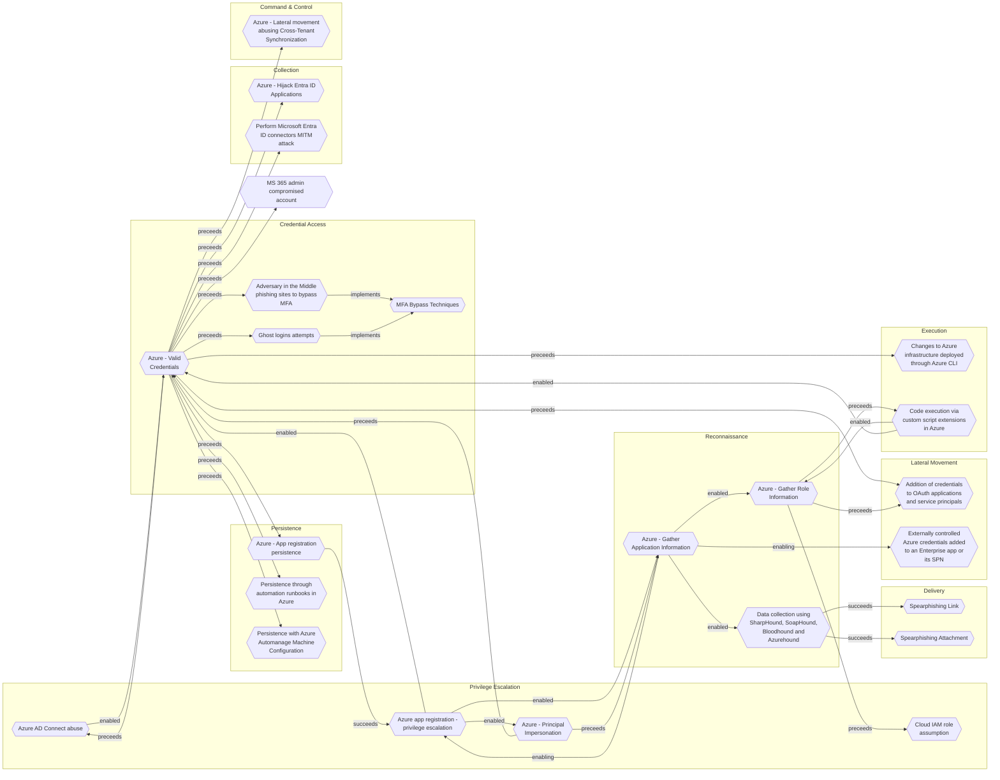

# Azure AD Connect abuse

## Metadata
| Field | Value |
| --- | --- |
| UUID | `c698fc79-3ed6-44a7-a9d7-bc447600e4c3` |
| Schema | `threat::1.0` |
| Version | `3` |
| Created | `2025-06-26` |
| Modified | `2025-09-08` |
| TLP | clear (`TLP:CLEAR`) |
| Organisation | EC DIGIT CSOC (`56b0a0f0-b0bc-47d9-bb46-02f80ae2065a`) |

## References
### Public
- **1**: [https://www.sygnia.co/blog/guarding-the-bridge-new-attack-vectors-in-azure-ad-connect/](https://www.sygnia.co/blog/guarding-the-bridge-new-attack-vectors-in-azure-ad-connect/)
- **2**: [https://www.threatngsecurity.com/glossary/azure-ad-connect-attacks](https://www.threatngsecurity.com/glossary/azure-ad-connect-attacks)
- **3**: [https://cloudbrothers.info/en/azure-attack-paths/](https://cloudbrothers.info/en/azure-attack-paths/)
- **4**: [https://www.tevora.com/threat-blog/targeting-msol-accounts-to-compromise-internal-networks/](https://www.tevora.com/threat-blog/targeting-msol-accounts-to-compromise-internal-networks/)

## Description
Azure Active Directory (Azure AD) Connect abuse represents a critical threat vector 
in hybrid identity environments, enabling attackers to pivot from on-premises Active 
Directory to cloud environments. Below is a comprehensive analysis of the attack 
methods, techniques, and implications based on current research.    

### Attack Vectors 

**1. Credential Interception via MITM**  
Attackers can perform man-in-the-middle (MITM) attacks against Azure AD Connect's 
Password Hash Sync mechanism. By installing a rogue root CA certificate on the server 
and proxying traffic, they intercept Azure AD Connector credentials sent to `login.microsoftonline.com`. 
This enables extraction of NT hashes for domain users.  

**2. Server Compromise and Malicious Synchronization**  
Compromising the Azure AD Connect server (e.g., via phishing or exploits) allows attackers to:  
- Synchronize malicious objects (e.g., privileged user accounts) to Azure AD.  
- Elevate privileges in the cloud environment, gaining access to sensitive data 
and configurations.    

**3. Password Writeback Misconfiguration**  
Misconfigured Password Writeback permissions (e.g., granting reset rights to privileged 
on-premises accounts like Domain Admins) enables attackers to:  
- Reset passwords of high-privilege accounts via Azure AD.  
- Gain unauthorized access to on-premises resources (CVE-2017-8613).    

**4. Pass-through Authentication (PTA) Abuse**  
Attackers with access to the PTA agent server can:  
- Use tools like **AADInternals** to intercept authentication requests.  
- Register rogue PTA agents with compromised global admin credentials, harvesting 
credentials during authentication.    

**5. AZUREADSSOACC$ Account Exploitation**  
Threat actors leverage the `AZUREADSSOACC$` account's NTLM hash to:  
- Forge Kerberos tickets for synced users.  
- Pivot to Azure AD, especially when synced Global Administrator accounts exist and 
MFA is lax.    

**6. MSOL Account Abuse**  
The 'MSOL_[hash]' service account (used by Azure AD Connect) is a high-value target because it:  
- Has extensive on-premises and cloud permissions (e.g., password reset, DCSync capabilities).  
- Can reset passwords of synced admin accounts, leading to cloud and on-premises compromise.

## Criticality
**High** - A High priority incident is likely to result in a demonstrable impact to public health or safety, national security, economic security, foreign relations, civil liberties, or public confidence.

## Terrain
Adversaries need local administrative access to the Azure AD Connect server.

## Surface
> **Azure**
> Microsoft Azure cloud platform

> **Azure::Security::Entra ID**
> Microsoft Entra ID in Azure (cloud identity)

> **Microsoft::Microsoft 365**
> Microsoft 365 cloud-based productivity suite (formerly Office 365)

> **Entra ID**
> Microsoft Entra ID (formerly Azure Active Directory)

> **AWS::Storage**
> AWS storage services

> **Windows::Desktop**
> Microsoft Windows desktop editions

> **Azure::Compute::Virtual Machines**
> Azure Virtual Machines

> **Application Layer::HTTP**
> Hypertext Transfer Protocol

> **Kerberos**
> Kerberos network authentication protocol

> **Active Directory**
> Microsoft Active Directory on-premises directory services

> **Log Management**
> Dedicated log management and log aggregation solutions

## Threat Assessment
| Dimension | Assessment | Description |
| --- | --- | --- |
| Severity | Significant incident | A cyber attack which has a serious impact on a large organisation or on wider / local government, or which poses a considerable risk to central government or (inter)national essential services. |
| Impact | Data Breach IP Loss Reputational Damages Lose Capabilities Business disruption Operating costs | Non-public information has been accessed from the outside, and successfully extracted. Particular, key data, information and blueprint conducive to the organization capability to gain and retain a commercial or geopolitical advantage has been accessed, and their content potentially used by competitors or other adversaries. Damages to the organization public view may be achieved by using directly the access gained, or indirectly with data gathered. Vector execution will remove key functions to the organization, which will not be easily circumvented. Most day-to-day is heavily impaired, but processes can reorganize at a loss. Business disruption Increased operating costs |
| Leverage | Spoofing Tampering Repudiation Information Disclosure Elevation of privilege Modify configuration | Threat action aimed at accessing and use of another user’s credentials, such as username and password. Threat action intending to maliciously change or modify persistent data, such as records in a database, and the alteration of data in transit between two computers over an open network, such as the Internet. Threat action aimed at performing prohibited operations in a system that lacks the ability to trace the operations. Threat action intending to read a file that one was not granted access to, or to read data in transit. Capacity to augment leverage over the target system by upgrading the compromised access rights Modify configuration or services |
| Viability | Likely | Probable (probably) - 55-80% |
| Kill Chain | Privilege Escalation | The result of techniques that provide an attacker with higher permissions on a system or network. |

## ATT&CK Techniques
| Technique | Name | Description |
| --- | --- | --- |
| `T1556.007` | [Modify Authentication Process: Hybrid Identity](https://attack.mitre.org/techniques/T1556/007) | Adversaries may patch, modify, or otherwise backdoor cloud authentication processes that are tied to on-premises user identities in order to bypass typical authentication mechanisms, access credentials, and enable persistent access to accounts.    Many organizations maintain hybrid user and device identities that are shared between on-premises and cloud-based environments. These can be maintained in a number of ways. For example, Microsoft Entra ID includes three options for synchronizing identities between Active Directory and Entra ID(Citation: Azure AD Hybrid Identity):  * Password Hash Synchronization (PHS), in which a privileged on-premises account synchronizes user password hashes between Active Directory and Entra ID, allowing authentication to Entra ID to take place entirely in the cloud  * Pass Through Authentication (PTA), in which Entra ID authentication attempts are forwarded to an on-premises PTA agent, which validates the credentials against Active Directory  * Active Directory Federation Services (AD FS), in which a trust relationship is established between Active Directory and Entra ID   AD FS can also be used with other SaaS and cloud platforms such as AWS and GCP, which will hand off the authentication process to AD FS and receive a token containing the hybrid users’ identity and privileges.   By modifying authentication processes tied to hybrid identities, an adversary may be able to establish persistent privileged access to cloud resources. For example, adversaries who compromise an on-premises server running a PTA agent may inject a malicious DLL into the `AzureADConnectAuthenticationAgentService` process that authorizes all attempts to authenticate to Entra ID, as well as records user credentials.(Citation: Azure AD Connect for Read Teamers)(Citation: AADInternals Azure AD On-Prem to Cloud) In environments using AD FS, an adversary may edit the `Microsoft.IdentityServer.Servicehost` configuration file to load a malicious DLL that generates authentication tokens for any user with any set of claims, thereby bypassing multi-factor authentication and defined AD FS policies.(Citation: MagicWeb)  In some cases, adversaries may be able to modify the hybrid identity authentication process from the cloud. For example, adversaries who compromise a Global Administrator account in an Entra ID tenant may be able to register a new PTA agent via the web console, similarly allowing them to harvest credentials and log into the Entra ID environment as any user.(Citation: Mandiant Azure AD Backdoors) |
| `T1098.001` | [Account Manipulation: Additional Cloud Credentials](https://attack.mitre.org/techniques/T1098/001) | Adversaries may add adversary-controlled credentials to a cloud account to maintain persistent access to victim accounts and instances within the environment.  For example, adversaries may add credentials for Service Principals and Applications in addition to existing legitimate credentials in Azure / Entra ID.(Citation: Microsoft SolarWinds Customer Guidance)(Citation: Blue Cloud of Death)(Citation: Blue Cloud of Death Video) These credentials include both x509 keys and passwords.(Citation: Microsoft SolarWinds Customer Guidance) With sufficient permissions, there are a variety of ways to add credentials including the Azure Portal, Azure command line interface, and Azure or Az PowerShell modules.(Citation: Demystifying Azure AD Service Principals)  In infrastructure-as-a-service (IaaS) environments, after gaining access through [Cloud Accounts](https://attack.mitre.org/techniques/T1078/004), adversaries may generate or import their own SSH keys using either the <code>CreateKeyPair</code> or <code>ImportKeyPair</code> API in AWS or the <code>gcloud compute os-login ssh-keys add</code> command in GCP.(Citation: GCP SSH Key Add) This allows persistent access to instances within the cloud environment without further usage of the compromised cloud accounts.(Citation: Expel IO Evil in AWS)(Citation: Expel Behind the Scenes)  Adversaries may also use the <code>CreateAccessKey</code> API in AWS or the <code>gcloud iam service-accounts keys create</code> command in GCP to add access keys to an account. Alternatively, they may use the <code>CreateLoginProfile</code> API in AWS to add a password that can be used to log into the AWS Management Console for [Cloud Service Dashboard](https://attack.mitre.org/techniques/T1538).(Citation: Permiso Scattered Spider 2023)(Citation: Lacework AI Resource Hijacking 2024) If the target account has different permissions from the requesting account, the adversary may also be able to escalate their privileges in the environment (i.e. [Cloud Accounts](https://attack.mitre.org/techniques/T1078/004)).(Citation: Rhino Security Labs AWS Privilege Escalation)(Citation: Sysdig ScarletEel 2.0) For example, in Entra ID environments, an adversary with the Application Administrator role can add a new set of credentials to their application's service principal. In doing so the adversary would be able to access the service principal’s roles and permissions, which may be different from those of the Application Administrator.(Citation: SpecterOps Azure Privilege Escalation)   In AWS environments, adversaries with the appropriate permissions may also use the `sts:GetFederationToken` API call to create a temporary set of credentials to [Forge Web Credentials](https://attack.mitre.org/techniques/T1606) tied to the permissions of the original user account. These temporary credentials may remain valid for the duration of their lifetime even if the original account’s API credentials are deactivated. (Citation: Crowdstrike AWS User Federation Persistence)  In Entra ID environments with the app password feature enabled, adversaries may be able to add an app password to a user account.(Citation: Mandiant APT42 Operations 2024) As app passwords are intended to be used with legacy devices that do not support multi-factor authentication (MFA), adding an app password can allow an adversary to bypass MFA requirements. Additionally, app passwords may remain valid even if the user’s primary password is reset.(Citation: Microsoft Entra ID App Passwords) |
| `T1078.004` | [Valid Accounts: Cloud Accounts](https://attack.mitre.org/techniques/T1078/004) | Valid accounts in cloud environments may allow adversaries to perform actions to achieve Initial Access, Persistence, Privilege Escalation, or Defense Evasion. Cloud accounts are those created and configured by an organization for use by users, remote support, services, or for administration of resources within a cloud service provider or SaaS application. Cloud Accounts can exist solely in the cloud; alternatively, they may be hybrid-joined between on-premises systems and the cloud through syncing or federation with other identity sources such as Windows Active Directory.(Citation: AWS Identity Federation)(Citation: Google Federating GC)(Citation: Microsoft Deploying AD Federation)  Service or user accounts may be targeted by adversaries through [Brute Force](https://attack.mitre.org/techniques/T1110), [Phishing](https://attack.mitre.org/techniques/T1566), or various other means to gain access to the environment. Federated or synced accounts may be a pathway for the adversary to affect both on-premises systems and cloud environments - for example, by leveraging shared credentials to log onto [Remote Services](https://attack.mitre.org/techniques/T1021). High privileged cloud accounts, whether federated, synced, or cloud-only, may also allow pivoting to on-premises environments by leveraging SaaS-based [Software Deployment Tools](https://attack.mitre.org/techniques/T1072) to run commands on hybrid-joined devices.  An adversary may create long lasting [Additional Cloud Credentials](https://attack.mitre.org/techniques/T1098/001) on a compromised cloud account to maintain persistence in the environment. Such credentials may also be used to bypass security controls such as multi-factor authentication.   Cloud accounts may also be able to assume [Temporary Elevated Cloud Access](https://attack.mitre.org/techniques/T1548/005) or other privileges through various means within the environment. Misconfigurations in role assignments or role assumption policies may allow an adversary to use these mechanisms to leverage permissions outside the intended scope of the account. Such over privileged accounts may be used to harvest sensitive data from online storage accounts and databases through [Cloud API](https://attack.mitre.org/techniques/T1059/009) or other methods. For example, in Azure environments, adversaries may target Azure Managed Identities, which allow associated Azure resources to request access tokens. By compromising a resource with an attached Managed Identity, such as an Azure VM, adversaries may be able to [Steal Application Access Token](https://attack.mitre.org/techniques/T1528)s to move laterally across the cloud environment.(Citation: SpecterOps Managed Identity 2022) |

## Chaining

### Chaining details
#### enabled -> [Azure - Valid Credentials](azure-valid-credentials.md) (`2743bf18-3b86-4721-bf3e-153dcda0b149`) (`support::enabled`)
Adversaries obtain the username and password of an AzureAD user either through phishing, 
password spraying, brute-force attacks, or credentials leaked online.

- **Target UUID**: `2743bf18-3b86-4721-bf3e-153dcda0b149`
