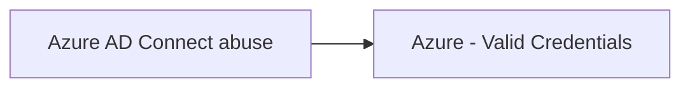

# Azure AD Connect abuse

## Metadata

- **UUID**: `c698fc79-3ed6-44a7-a9d7-bc447600e4c3`
- **Schema**: `threat::1.0`
- **TLP**: clear

## Description
Azure Active Directory (Azure AD) Connect abuse represents a critical threat vector 
in hybrid identity environments, enabling attackers to pivot from on-premises Active 
Directory to cloud environments. Below is a comprehensive analysis of the attack 
methods, techniques, and implications based on current research.    

### Attack Vectors 

**1. Credential Interception via MITM**  
Attackers can perform man-in-the-middle (MITM) attacks against Azure AD Connect's 
Password Hash Sync mechanism. By installing a rogue root CA certificate on the server 
and proxying traffic, they intercept Azure AD Connector credentials sent to `login.microsoftonline.com`. 
This enables extraction of NT hashes for domain users.  

**2. Server Compromise and Malicious Synchronization**  
Compromising the Azure AD Connect server (e.g., via phishing or exploits) allows attackers to:  
- Synchronize malicious objects (e.g., privileged user accounts) to Azure AD.  
- Elevate privileges in the cloud environment, gaining access to sensitive data 
and configurations.    

**3. Password Writeback Misconfiguration**  
Misconfigured Password Writeback permissions (e.g., granting reset rights to privileged 
on-premises accounts like Domain Admins) enables attackers to:  
- Reset passwords of high-privilege accounts via Azure AD.  
- Gain unauthorized access to on-premises resources (CVE-2017-8613).    

**4. Pass-through Authentication (PTA) Abuse**  
Attackers with access to the PTA agent server can:  
- Use tools like **AADInternals** to intercept authentication requests.  
- Register rogue PTA agents with compromised global admin credentials, harvesting 
credentials during authentication.    

**5. AZUREADSSOACC$ Account Exploitation**  
Threat actors leverage the `AZUREADSSOACC$` account's NTLM hash to:  
- Forge Kerberos tickets for synced users.  
- Pivot to Azure AD, especially when synced Global Administrator accounts exist and 
MFA is lax.    

**6. MSOL Account Abuse**  
The 'MSOL_[hash]' service account (used by Azure AD Connect) is a high-value target because it:  
- Has extensive on-premises and cloud permissions (e.g., password reset, DCSync capabilities).  
- Can reset passwords of synced admin accounts, leading to cloud and on-premises compromise.

## Techniques
- T1556.007
- T1098.001
- T1078.004

## Chaining

