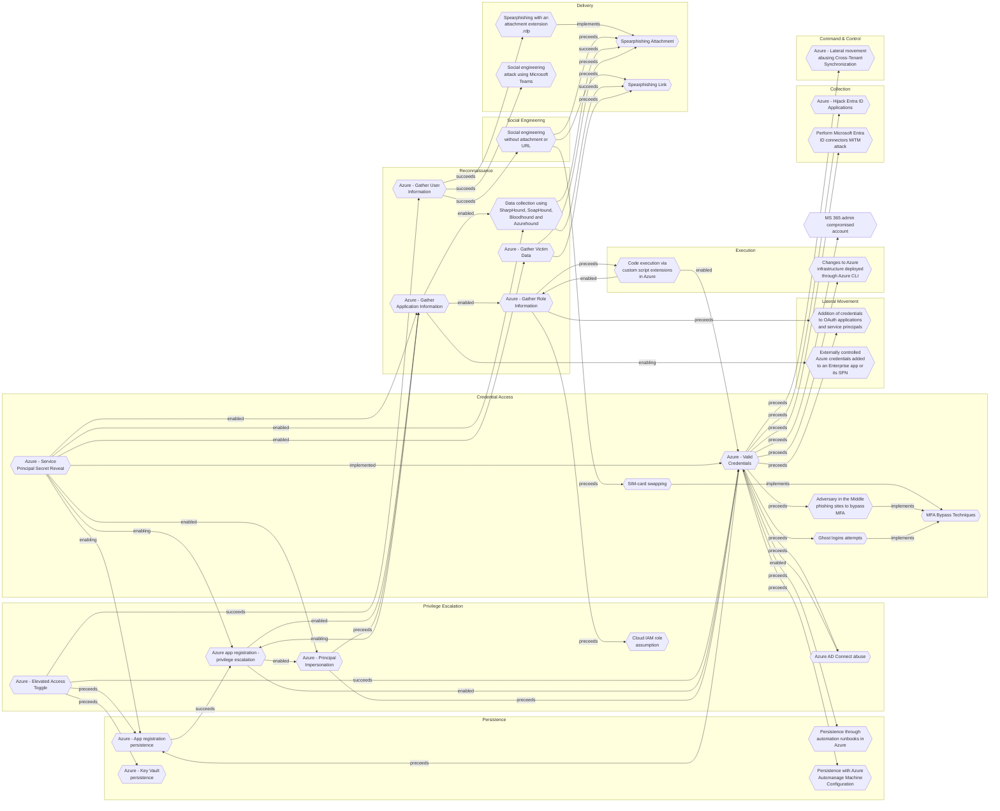

# Azure - App registration persistence

## Metadata
| Field | Value |
| --- | --- |
| UUID | `5d43ef75-4637-4a75-b1ed-6716052cff0e` |
| Schema | `threat::1.0` |
| Version | `2` |
| Created | `2025-06-02` |
| Modified | `2025-09-04` |
| TLP | clear (`TLP:CLEAR`) |
| Organisation | EC DIGIT CSOC (`56b0a0f0-b0bc-47d9-bb46-02f80ae2065a`) |

## References
### Public
- **1**: [https://www.microsoft.com/en-us/security/blog/2023/12/12/threat-actors-misuse-oauth-applications-to-automate-financially-driven-attacks/](https://www.microsoft.com/en-us/security/blog/2023/12/12/threat-actors-misuse-oauth-applications-to-automate-financially-driven-attacks/)
- **2**: [https://www.truesec.com/hub/blog/using-a-legitimate-application-to-create-persistence-and-initiate-email-campaigns](https://www.truesec.com/hub/blog/using-a-legitimate-application-to-create-persistence-and-initiate-email-campaigns)
- **3**: [https://www.secureworks.com/research/abusing-azure-application-credentials-to-attack-supply-chains](https://www.secureworks.com/research/abusing-azure-application-credentials-to-attack-supply-chains)

## Description
Azure app registration persistence is a technique where adversaries exploit Azure 
Active Directory (Azure AD) app registration and OAuth application features to maintain 
long-term, often covert, access to a cloud environment. This threat vector is increasingly 
targeted due to the power and longevity of permissions granted to registered applications, 
and the often-overlooked persistence such registrations can provide—even after the 
original user or use case is no longer present.

## How the Threat Works

- **App Registration**: In Azure AD, app registration allows third-party or custom 
applications to integrate with Microsoft 365 or Azure resources. These apps can 
be granted permissions—sometimes highly privileged—to access data, send emails, 
or even manage resources.
- **Persistence Mechanism**: Once an app is registered and consented to (either by a user or administrator), 
it can retain its permissions indefinitely, unless specifically revoked. Attackers 
exploit this by registering their own applications or adding malicious credentials 
to existing ones, ensuring continued access even if user passwords are reset or 
accounts are disabled.
- **Credential Abuse**: Attackers can add new secrets or certificates to an app 
registration (service principal), allowing them to authenticate as the app without 
needing to compromise user credentials again.

## Attack Scenarios

- **Compromising a User or Admin Account**: Attackers first compromise a user or 
administrator account, often via phishing, password spraying, or MFA fatigue attacks.
- **Registering or Manipulating an App**: With access, they either register a new 
OAuth application or add credentials to an existing one. They may grant the app 
excessive permissions, such as the ability to read emails, access files, or manage 
resources.
- **Maintaining Access**: Even if the original compromised account is remediated, 
the attacker’s app can continue to operate using its own credentials, providing 
a persistent backdoor into the environment.
- **Abuse Examples**:
  - Deploying resources (e.g., virtual machines for cryptomining) and incurring 
  significant costs for the victim.
  - Exfiltrating sensitive data from SharePoint, OneDrive, or mailboxes.
  - Launching internal phishing or malware campaigns using the victim’s cloud infrastructure.

## Real-World Examples

- **Storm-1283 Campaign**: Microsoft observed threat actors using compromised accounts 
to register OAuth apps, grant them Contributor roles, and deploy virtual machines 
for cryptomining. The attackers added secrets to both new and existing applications, 
maintaining access and causing substantial financial damage.
- **Supply Chain Attacks**: Attackers with administrator access to a publisher tenant 
can add malicious credentials to legitimate multi-tenant applications, enabling 
unauthorised access to customer environments even if the original administrator 
is removed.
- **Internal Phishing**: Attackers have registered apps to upload and share malicious 
files internally, leveraging default consent settings to spread laterally within 
organisations.

## Criticality
**High** - A High priority incident is likely to result in a demonstrable impact to public health or safety, national security, economic security, foreign relations, civil liberties, or public confidence.

## Terrain
Adversaries need to compromise user or administrator credentials that have permissions 
to register or modify applications within Microsoft Entra ID (Azure AD).

## Surface
> **Azure**
> Microsoft Azure cloud platform

> **Azure::Security::Entra ID**
> Microsoft Entra ID in Azure (cloud identity)

> **AWS::Storage**
> AWS storage services

> **Entra ID**
> Microsoft Entra ID (formerly Azure Active Directory)

> **Orchestration::Kubernetes**
> Kubernetes container orchestration platform

> **Web Servers**
> HTTP servers and reverse proxies

> **Azure::Compute::Virtual Machines**
> Azure Virtual Machines

> **Serverless**
> Cloud-agnostic serverless compute (when not provider-specific)

> **Email**
> Email infrastructure and services

> **Application Layer::HTTP**
> Hypertext Transfer Protocol

> **Database Management::PostgreSQL**
> PostgreSQL open-source relational database

> **Database Management::MongoDB**
> MongoDB NoSQL document database

> **SAML**
> Security Assertion Markup Language federation protocol

## Threat Assessment
| Dimension | Assessment | Description |
| --- | --- | --- |
| Severity | Significant incident | A cyber attack which has a serious impact on a large organisation or on wider / local government, or which poses a considerable risk to central government or (inter)national essential services. |
| Impact | Data Breach IP Loss Reputational Damages Identity Theft | Non-public information has been accessed from the outside, and successfully extracted. Particular, key data, information and blueprint conducive to the organization capability to gain and retain a commercial or geopolitical advantage has been accessed, and their content potentially used by competitors or other adversaries. Damages to the organization public view may be achieved by using directly the access gained, or indirectly with data gathered. Acquisition of sufficient information and privileges to profess as a given individual, for the purpose of abusing and deceiving human trust relationships. |
| Leverage | Spoofing Tampering Repudiation Infrastructure Compromise Information Disclosure Elevation of privilege Modify configuration Modify privileges Modify data | Threat action aimed at accessing and use of another user’s credentials, such as username and password. Threat action intending to maliciously change or modify persistent data, such as records in a database, and the alteration of data in transit between two computers over an open network, such as the Internet. Threat action aimed at performing prohibited operations in a system that lacks the ability to trace the operations. The compromised target is likely to be used to further expand the sphere of influence of the attacker and allow more potent vectors to be executed. Threat action intending to read a file that one was not granted access to, or to read data in transit. Capacity to augment leverage over the target system by upgrading the compromised access rights Modify configuration or services Modify privileges or permissions Modify stored data or content |
| Viability | Likely | Probable (probably) - 55-80% |
| Kill Chain | Persistence | Any access, action or change to a system that gives an attacker persistent presence on the system. |

## ATT&CK Techniques
| Technique | Name | Description |
| --- | --- | --- |
| `T1098` | [Account Manipulation](https://attack.mitre.org/techniques/T1098) | Adversaries may manipulate accounts to maintain and/or elevate access to victim systems. Account manipulation may consist of any action that preserves or modifies adversary access to a compromised account, such as modifying credentials or permission groups.(Citation: FireEye SMOKEDHAM June 2021) These actions could also include account activity designed to subvert security policies, such as performing iterative password updates to bypass password duration policies and preserve the life of compromised credentials.   In order to create or manipulate accounts, the adversary must already have sufficient permissions on systems or the domain. However, account manipulation may also lead to privilege escalation where modifications grant access to additional roles, permissions, or higher-privileged [Valid Accounts](https://attack.mitre.org/techniques/T1078). |
| `T1566.003` | [Phishing: Spearphishing via Service](https://attack.mitre.org/techniques/T1566/003) | Adversaries may send spearphishing messages via third-party services in an attempt to gain access to victim systems. Spearphishing via service is a specific variant of spearphishing. It is different from other forms of spearphishing in that it employs the use of third party services rather than directly via enterprise email channels.   All forms of spearphishing are electronically delivered social engineering targeted at a specific individual, company, or industry. In this scenario, adversaries send messages through various social media services, personal webmail, and other non-enterprise controlled services.(Citation: Lookout Dark Caracal Jan 2018) These services are more likely to have a less-strict security policy than an enterprise. As with most kinds of spearphishing, the goal is to generate rapport with the target or get the target's interest in some way. Adversaries will create fake social media accounts and message employees for potential job opportunities. Doing so allows a plausible reason for asking about services, policies, and software that's running in an environment. The adversary can then send malicious links or attachments through these services.  A common example is to build rapport with a target via social media, then send content to a personal webmail service that the target uses on their work computer. This allows an adversary to bypass some email restrictions on the work account, and the target is more likely to open the file since it's something they were expecting. If the payload doesn't work as expected, the adversary can continue normal communications and troubleshoot with the target on how to get it working. |

## Chaining

### Chaining details
#### succeeds -> [Azure app registration - privilege escalation](azure-app-registration-privilege-escalation.md) (`c7e260d8-d391-41eb-be1a-7f276c99b383`) (`sequence::succeeds`)
Adversaries need access to an identity (user account or service principal) with 
sufficient permissions to create, modify, or assign roles to app registrations or 
service principals.

- **Target UUID**: `c7e260d8-d391-41eb-be1a-7f276c99b383`
