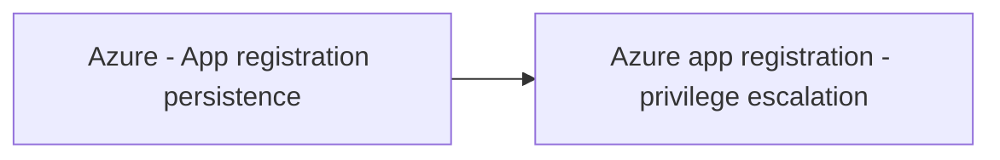

# Azure - App registration persistence

## Metadata

- **UUID**: `5d43ef75-4637-4a75-b1ed-6716052cff0e`
- **Schema**: `threat::1.0`
- **TLP**: clear

## Description
Azure app registration persistence is a technique where adversaries exploit Azure 
Active Directory (Azure AD) app registration and OAuth application features to maintain 
long-term, often covert, access to a cloud environment. This threat vector is increasingly 
targeted due to the power and longevity of permissions granted to registered applications, 
and the often-overlooked persistence such registrations can provide—even after the 
original user or use case is no longer present.

## How the Threat Works

- **App Registration**: In Azure AD, app registration allows third-party or custom 
applications to integrate with Microsoft 365 or Azure resources. These apps can 
be granted permissions—sometimes highly privileged—to access data, send emails, 
or even manage resources.
- **Persistence Mechanism**: Once an app is registered and consented to (either by a user or administrator), 
it can retain its permissions indefinitely, unless specifically revoked. Attackers 
exploit this by registering their own applications or adding malicious credentials 
to existing ones, ensuring continued access even if user passwords are reset or 
accounts are disabled.
- **Credential Abuse**: Attackers can add new secrets or certificates to an app 
registration (service principal), allowing them to authenticate as the app without 
needing to compromise user credentials again.

## Attack Scenarios

- **Compromising a User or Admin Account**: Attackers first compromise a user or 
administrator account, often via phishing, password spraying, or MFA fatigue attacks.
- **Registering or Manipulating an App**: With access, they either register a new 
OAuth application or add credentials to an existing one. They may grant the app 
excessive permissions, such as the ability to read emails, access files, or manage 
resources.
- **Maintaining Access**: Even if the original compromised account is remediated, 
the attacker’s app can continue to operate using its own credentials, providing 
a persistent backdoor into the environment.
- **Abuse Examples**:
  - Deploying resources (e.g., virtual machines for cryptomining) and incurring 
  significant costs for the victim.
  - Exfiltrating sensitive data from SharePoint, OneDrive, or mailboxes.
  - Launching internal phishing or malware campaigns using the victim’s cloud infrastructure.

## Real-World Examples

- **Storm-1283 Campaign**: Microsoft observed threat actors using compromised accounts 
to register OAuth apps, grant them Contributor roles, and deploy virtual machines 
for cryptomining. The attackers added secrets to both new and existing applications, 
maintaining access and causing substantial financial damage.
- **Supply Chain Attacks**: Attackers with administrator access to a publisher tenant 
can add malicious credentials to legitimate multi-tenant applications, enabling 
unauthorised access to customer environments even if the original administrator 
is removed.
- **Internal Phishing**: Attackers have registered apps to upload and share malicious 
files internally, leveraging default consent settings to spread laterally within 
organisations.

## Techniques
- T1098
- T1566.003

## Chaining

