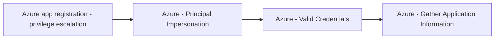

# Azure app registration - privilege escalation

## Metadata

- **UUID**: `c7e260d8-d391-41eb-be1a-7f276c99b383`
- **Schema**: `threat::1.0`
- **TLP**: clear

## Description
Azure app registration privilege escalation is a significant threat vector where 
attackers exploit misconfigured or compromised application registrations to gain 
elevated access in Azure environments. This occurs when attackers leverage excessive 
permissions associated with service principals or app registrations to bypass role-based 
access controls (RBAC).

### Key Attack Vectors  
**1. Service Principal Ownership Abuse**  
Owners of Azure applications can modify service principal permissions. For example, 
a user with **Reader** role but ownership of an application could execute commands like:  
```bash
az role assignment create --assignee "[email protected]" --role "Owner" --scope "/subscriptions/Production"
```
This grants **Owner** privileges, enabling resource creation/deletion and further 
role assignments.  

**2. Dangerous API Permissions**  
App registrations with high-privilege Microsoft Graph API permissions pose critical risks:  
- **AppRoleAssignment.ReadWrite.All**: Allows granting admin consent and assigning 
roles like **RoleManagement.ReadWrite.Directory** (enables Global Admin escalation).  
- **Directory.ReadWrite.All**: Permits modifying Azure AD group memberships.  
- **User.ReadWrite.All**: Enables password resets and profile modifications.  

**3. Phishing-Driven Attacks**  
Attackers with a compromised standard user account can:  
1. Register an app with "Accounts in any organizational directory" and phishing redirect URIs.  
2. Configure high-risk Graph API permissions (e.g., *Mail.Read*, *User.Read.All*).  
3. Send phishing links to victims, capturing access tokens via a malicious OAuth server.  

### Exploitation Workflow  
- **Step 1**: Compromise a low-privileged account.  
- **Step 2**: Create or modify an app registration to include dangerous permissions.  
- **Step 3**: Use the app’s client ID/secret to authenticate and execute privileged 
operations (e.g., adding users to admin groups).  
- **Step 4**: Escalate to **Global Admin** via *RoleManagement.ReadWrite.Directory*.

## Techniques
- T1098
- T1068

## Chaining

