# Azure app registration - privilege escalation

## Metadata

- **UUID**: `c7e260d8-d391-41eb-be1a-7f276c99b383`
- **Schema**: `threat::1.0`
- **Version**: `3`
- **Created**: `2025-05-23`
- **Modified**: `2025-09-08`
- **TLP**: clear (`TLP:CLEAR`)
- **Organisation**: EC DIGIT CSOC (`56b0a0f0-b0bc-47d9-bb46-02f80ae2065a`)

## References
### Public
- **1**: [https://laythchebbi.com/privilege-escalation-using-azure-service-principal/](https://laythchebbi.com/privilege-escalation-using-azure-service-principal/)
- **2**: [https://www.pimwiddershoven.nl/entry/privilege-escalation-azure-app-registration-microsoft-graph/](https://www.pimwiddershoven.nl/entry/privilege-escalation-azure-app-registration-microsoft-graph/)
- **3**: [https://www.secura.com/blog/compromising-azure-cloud-through-sensitive-api-permissions](https://www.secura.com/blog/compromising-azure-cloud-through-sensitive-api-permissions)

## Description
Azure app registration privilege escalation is a significant threat vector where 
attackers exploit misconfigured or compromised application registrations to gain 
elevated access in Azure environments. This occurs when attackers leverage excessive 
permissions associated with service principals or app registrations to bypass role-based 
access controls (RBAC).

### Key Attack Vectors  
**1. Service Principal Ownership Abuse**  
Owners of Azure applications can modify service principal permissions. For example, 
a user with **Reader** role but ownership of an application could execute commands like:  
```bash
az role assignment create --assignee "[email protected]" --role "Owner" --scope "/subscriptions/Production"
```
This grants **Owner** privileges, enabling resource creation/deletion and further 
role assignments.  

**2. Dangerous API Permissions**  
App registrations with high-privilege Microsoft Graph API permissions pose critical risks:  
- **AppRoleAssignment.ReadWrite.All**: Allows granting admin consent and assigning 
roles like **RoleManagement.ReadWrite.Directory** (enables Global Admin escalation).  
- **Directory.ReadWrite.All**: Permits modifying Azure AD group memberships.  
- **User.ReadWrite.All**: Enables password resets and profile modifications.  

**3. Phishing-Driven Attacks**  
Attackers with a compromised standard user account can:  
1. Register an app with "Accounts in any organizational directory" and phishing redirect URIs.  
2. Configure high-risk Graph API permissions (e.g., *Mail.Read*, *User.Read.All*).  
3. Send phishing links to victims, capturing access tokens via a malicious OAuth server.  

### Exploitation Workflow  
- **Step 1**: Compromise a low-privileged account.  
- **Step 2**: Create or modify an app registration to include dangerous permissions.  
- **Step 3**: Use the app’s client ID/secret to authenticate and execute privileged 
operations (e.g., adding users to admin groups).  
- **Step 4**: Escalate to **Global Admin** via *RoleManagement.ReadWrite.Directory*.

## Criticality
**High** - A High priority incident is likely to result in a demonstrable impact to public health or safety, national security, economic security, foreign relations, civil liberties, or public confidence.

## Terrain
> **Adversaries need access to an identity (user account or service principal) with 
sufficient permissions to create, modify, or assign roles to app registrations or 
service principals.

Domains: Public Cloud
Targets: Cloud Storage Accounts, Identity Services, Public-Facing Servers, API Endpoints, Cloud Portal, Serverless
Platforms: Azure, Azure AD**

## Threat Assessment
| Dimension | Assessment | Description |
| --- | --- | --- |
| Severity | Significant incident | A cyber attack which has a serious impact on a large organisation or on wider / local government, or which poses a considerable risk to central government or (inter)national essential services. |
| Impact | Data Breach; IP Loss; Reputational Damages; Identity Theft; Monetary Loss; Lose Capabilities | - |
| Leverage | Elevation of privilege; Spoofing; Tampering; Information Disclosure | - |
| Viability | Very Likely | Highly probable - 80-95% |
| Kill Chain | Privilege Escalation | The result of techniques that provide an attacker with higher permissions on a system or network. |

## ATT&CK Techniques
| Technique | Name | Description |
| --- | --- | --- |
| `T1098` | [Account Manipulation](https://attack.mitre.org/techniques/T1098) | Adversaries may manipulate accounts to maintain and/or elevate access to victim systems. Account manipulation may consist of any action that preserves or modifies adversary access to a compromised account, such as modifying credentials or permission groups.(Citation: FireEye SMOKEDHAM June 2021) These actions could also include account activity designed to subvert security policies, such as performing iterative password updates to bypass password duration policies and preserve the life of compromised credentials.   In order to create or manipulate accounts, the adversary must already have sufficient permissions on systems or the domain. However, account manipulation may also lead to privilege escalation where modifications grant access to additional roles, permissions, or higher-privileged [Valid Accounts](https://attack.mitre.org/techniques/T1078). |
| `T1068` | [Exploitation for Privilege Escalation](https://attack.mitre.org/techniques/T1068) | Adversaries may exploit software vulnerabilities in an attempt to elevate privileges. Exploitation of a software vulnerability occurs when an adversary takes advantage of a programming error in a program, service, or within the operating system software or kernel itself to execute adversary-controlled code. Security constructs such as permission levels will often hinder access to information and use of certain techniques, so adversaries will likely need to perform privilege escalation to include use of software exploitation to circumvent those restrictions.  When initially gaining access to a system, an adversary may be operating within a lower privileged process which will prevent them from accessing certain resources on the system. Vulnerabilities may exist, usually in operating system components and software commonly running at higher permissions, that can be exploited to gain higher levels of access on the system. This could enable someone to move from unprivileged or user level permissions to SYSTEM or root permissions depending on the component that is vulnerable. This could also enable an adversary to move from a virtualized environment, such as within a virtual machine or container, onto the underlying host. This may be a necessary step for an adversary compromising an endpoint system that has been properly configured and limits other privilege escalation methods.  Adversaries may bring a signed vulnerable driver onto a compromised machine so that they can exploit the vulnerability to execute code in kernel mode. This process is sometimes referred to as Bring Your Own Vulnerable Driver (BYOVD).(Citation: ESET InvisiMole June 2020)(Citation: Unit42 AcidBox June 2020) Adversaries may include the vulnerable driver with files delivered during Initial Access or download it to a compromised system via [Ingress Tool Transfer](https://attack.mitre.org/techniques/T1105) or [Lateral Tool Transfer](https://attack.mitre.org/techniques/T1570). |

## Chaining

```mermaid
flowchart LR
c7e260d8_d391_41eb_be1a_7f276c99b383["Azure app registration - privilege escalation"]
bb2501d5_99c7_44a6_ac5a_9510102d6611["Azure - Principal Impersonation"]
2743bf18_3b86_4721_bf3e_153dcda0b149["Azure - Valid Credentials"]
fe6827f2_efb4_43b3_9ca3_b7d417111b32["Azure - Gather Application Information"]
c7e260d8_d391_41eb_be1a_7f276c99b383 -->|support::enabled| bb2501d5_99c7_44a6_ac5a_9510102d6611
bb2501d5_99c7_44a6_ac5a_9510102d6611 -->|support::enabled| 2743bf18_3b86_4721_bf3e_153dcda0b149
2743bf18_3b86_4721_bf3e_153dcda0b149 -->|support::enabled| fe6827f2_efb4_43b3_9ca3_b7d417111b32
```

### Chaining details
#### enabled -> Azure - Principal Impersonation (`support::enabled`)
Adversaries gains access via phishing, credential stuffing, or exploiting misconfigurations 
allowing access to an account with application management permissions or to a pipeline 
that exposes service principal credentials.

- **Target UUID**: `bb2501d5-99c7-44a6-ac5a-9510102d6611`
#### enabled -> Azure - Valid Credentials (`support::enabled`)
Adversaries obtain the username and password of an AzureAD user either through phishing, 
password spraying, brute-force attacks, or credentials leaked online.

- **Target UUID**: `2743bf18-3b86-4721-bf3e-153dcda0b149`
#### enabled -> Azure - Gather Application Information (`support::enabled`)
Adversaries obtain minimal access (often as a standard user or via an external account) 
in the target Azure AD tenant, then utilizes API endpoints and tools, such as Azure CLI, 
PowerShell modules (e.g., MSOnline, Microsoft.Graph), or custom scripts, to list 
all registered applications.

- **Target UUID**: `fe6827f2-efb4-43b3-9ca3-b7d417111b32`
