# Azure - Backup Delete

## Metadata

- **UUID**: `2c6058fb-21db-47fe-99bc-a07cb70c53e4`
- **Schema**: `threat::1.0`
- **TLP**: clear

## Description
The following threat vector involves adversaries deleting backup data from Recovery 
Services Vaults, potentially crippling recovery efforts after a compromise. 

## Example Attack Scenario
Adversaries enumerates available Recovery Services Vaults, discover active backup 
items (e.g., VMs, databases), and execute a "Stop Protection and Delete Backup Data" 
operation. If soft delete is not enabled, or the feature is disabled (potentially 
by compromising Resource Guard or Multi-User Authorization controls), all backup 
data is permanently deleted, leaving no recourse for recovery. In more advanced 
attacks, the attacker may seek to disable soft delete or reduce retention windows 
before initiating full backup deletion to maximize the impact.

## Attack Goals and Impact
- **Goals:** The primary goal is to **destroy backup copies** so that critical systems 
and data cannot be restored after ransomware encryption, destructive attacks, or 
other forms of compromise.
- The attacker may use this method to put added pressure in ransomware attempts, 
making recovery impossible unless a ransom is paid.
- Organizations are left without operational recovery points, leading to prolonged 
outages, potential data loss, financial impact, and reputational harm.
- Disabling "soft delete" or tampering with backup retention extends the risk, as 
it eliminates the safety buffer against accidental or malicious deletion.

## Attack Flow and Methodology

1. List all Recovery Services Vaults and enumerate protected items (VMs, SQL databases, 
file shares, etc.) in the Azure environment.
2. Elevate privileges if needed to gain backup operator or owner roles, sometimes 
by disabling RBAC/MFA controls.
3. - Attempt to disable or reduce protection features such as "Soft Delete" or retention 
  policies—sometimes by also compromising Resource Guard if Multi-User Authorization 
  is used.
  - Review or manipulate policies to enable immediate deletion.
4. - Execute "Stop Protection and Delete Backup Data" commands via the Azure portal, 
CLI, PowerShell, REST API, or through automation scripts.
  - If soft delete is active, data only moves into a soft-delete state (usually 
  14 days retention) and can be restored within that time.
5. Attempt to remove items from even the soft-delete state if possible. Some attacks 
target disabling soft delete (if accessible); after the retention period, deleted 
data is permanently lost.
6. All recovery points are lost, blocking simple system and data restores and maximizing 
the attack impact. The victim organization must resort to slower, less effective, 
or non-existent recovery measures.

## Techniques
- T1485
- T1485.001
- T1561

## Chaining

```mermaid
flowchart LR
2c6058fb_21db_47fe_99bc_a07cb70c53e4["Azure - Backup Delete"]
b1593e0b_1b3b_462d_9ab6_21d1c136469d["Azure - Gather Resource Data"]
140907eb_c9fb_4330_9d71_656422388b2b["Azure - Gather Role Information"]
2900d389_3098_49d3_8166_5b2612d03576["Azure - Gather User Information"]
10a89280_d42e_446d_9f8d_840b1218f532["Azure - Elevated Access Toggle"]
2c6058fb_21db_47fe_99bc_a07cb70c53e4 --> b1593e0b_1b3b_462d_9ab6_21d1c136469d
b1593e0b_1b3b_462d_9ab6_21d1c136469d --> 140907eb_c9fb_4330_9d71_656422388b2b
140907eb_c9fb_4330_9d71_656422388b2b --> 2900d389_3098_49d3_8166_5b2612d03576
2900d389_3098_49d3_8166_5b2612d03576 --> 10a89280_d42e_446d_9f8d_840b1218f532
```

