# Azure - Backup Delete

## Metadata

- **UUID**: `2c6058fb-21db-47fe-99bc-a07cb70c53e4`
- **Schema**: `threat::1.0`
- **Version**: `1`
- **Created**: `2025-09-04`
- **Modified**: `2025-09-04`
- **TLP**: clear (`TLP:CLEAR`)
- **Organisation**: EC DIGIT CSOC (`56b0a0f0-b0bc-47d9-bb46-02f80ae2065a`)

## References
### Public
- **1**: [https://microsoft.github.io/Azure-Threat-Research-Matrix/Impact/AZT705/AZT705/](https://microsoft.github.io/Azure-Threat-Research-Matrix/Impact/AZT705/AZT705/)
- **2**: [https://docs.azure.cn/en-us/backup/protect-backups-from-ransomware-faq](https://docs.azure.cn/en-us/backup/protect-backups-from-ransomware-faq)
- **3**: [https://n2ws.com/blog/azure-soft-delete-ransomware-defense](https://n2ws.com/blog/azure-soft-delete-ransomware-defense)

## Description
The following threat vector involves adversaries deleting backup data from Recovery 
Services Vaults, potentially crippling recovery efforts after a compromise. 

## Example Attack Scenario
Adversaries enumerates available Recovery Services Vaults, discover active backup 
items (e.g., VMs, databases), and execute a "Stop Protection and Delete Backup Data" 
operation. If soft delete is not enabled, or the feature is disabled (potentially 
by compromising Resource Guard or Multi-User Authorization controls), all backup 
data is permanently deleted, leaving no recourse for recovery. In more advanced 
attacks, the attacker may seek to disable soft delete or reduce retention windows 
before initiating full backup deletion to maximize the impact.

## Attack Goals and Impact
- **Goals:** The primary goal is to **destroy backup copies** so that critical systems 
and data cannot be restored after ransomware encryption, destructive attacks, or 
other forms of compromise.
- The attacker may use this method to put added pressure in ransomware attempts, 
making recovery impossible unless a ransom is paid.
- Organizations are left without operational recovery points, leading to prolonged 
outages, potential data loss, financial impact, and reputational harm.
- Disabling "soft delete" or tampering with backup retention extends the risk, as 
it eliminates the safety buffer against accidental or malicious deletion.

## Attack Flow and Methodology

1. List all Recovery Services Vaults and enumerate protected items (VMs, SQL databases, 
file shares, etc.) in the Azure environment.
2. Elevate privileges if needed to gain backup operator or owner roles, sometimes 
by disabling RBAC/MFA controls.
3. - Attempt to disable or reduce protection features such as "Soft Delete" or retention 
  policies—sometimes by also compromising Resource Guard if Multi-User Authorization 
  is used.
  - Review or manipulate policies to enable immediate deletion.
4. - Execute "Stop Protection and Delete Backup Data" commands via the Azure portal, 
CLI, PowerShell, REST API, or through automation scripts.
  - If soft delete is active, data only moves into a soft-delete state (usually 
  14 days retention) and can be restored within that time.
5. Attempt to remove items from even the soft-delete state if possible. Some attacks 
target disabling soft delete (if accessible); after the retention period, deleted 
data is permanently lost.
6. All recovery points are lost, blocking simple system and data restores and maximizing 
the attack impact. The victim organization must resort to slower, less effective, 
or non-existent recovery measures.

## Criticality
**High** - A High priority incident is likely to result in a demonstrable impact to public health or safety, national security, economic security, foreign relations, civil liberties, or public confidence.

## Terrain
> **Adversaries gain privileged access to an Azure environment, often through phishing, 
credential theft, or exploitation of misconfigurations, to compromise a global administrator 
or backup operator account.

Domains: Public Cloud
Targets: Cloud Storage Accounts, Virtual Machines, Server Backup
Platforms: Azure, Azure AD**

## Threat Assessment
| Dimension | Assessment | Description |
| --- | --- | --- |
| Severity | Significant incident | A cyber attack which has a serious impact on a large organisation or on wider / local government, or which poses a considerable risk to central government or (inter)national essential services. |
| Impact | Data Breach; IP Loss; Reputational Damages; Monetary Loss; Lose Capabilities; Business disruption | - |
| Leverage | Tampering; Information Disclosure; Denial of Service; Elevation of privilege; Modify configuration; Modify data | - |
| Viability | Likely | Probable (probably) - 55-80% |
| Kill Chain | Impact | Techniques aimed at manipulating, interrupting or destroying the target system or data. |

## Actors
| Actor | ID | Source | Description |
| --- | --- | --- | --- |
| WIZARD SPIDER | `misp::bdf4fe4f-af8a-495f-a719-cf175cecda1f` | ('misp',) | Wizard Spider is reportedly associated with Grim Spider and Lunar Spider. The WIZARD SPIDER threat group is the Russia-based operator of the TrickBot banking malware. This group represents a growing criminal enterprise of which GRIM SPIDER appears to be a subset. The LUNAR SPIDER threat group is the Eastern European-based operator and developer of the commodity banking malware called BokBot (aka IcedID), which was first observed in April 2017. The BokBot malware provides LUNAR SPIDER affiliates with a variety of capabilities to enable credential theft and wire fraud, through the use of webinjects and a malware distribution function. GRIM SPIDER is a sophisticated eCrime group that has been operating the Ryuk ransomware since August 2018, targeting large organizations for a high-ransom return. This methodology, known as “big game hunting,” signals a shift in operations for WIZARD SPIDER, a criminal enterprise of which GRIM SPIDER appears to be a cell. The WIZARD SPIDER threat group, known as the Russia-based operator of the TrickBot banking malware, had focused primarily on wire fraud in the past. |
| Sandworm | `misp::f512de42-f76b-40d2-9923-59e7dbdfec35` | ('misp',) | This threat actor targets industrial control systems, using a tool called Black Energy, associated with electricity and power generation for espionage, denial of service, and data destruction purposes. Some believe that the threat actor is linked to the 2015 compromise of the Ukrainian electrical grid and a distributed denial of service prior to the Russian invasion of Georgia. Believed to be responsible for the 2008 DDoS attacks in Georgia and the 2015 Ukraine power grid outage |
| [[Enterprise] BlackByte](https://attack.mitre.org/groups/G1043) | `att&ck::G1043` | ('att&ck',) | [BlackByte](https://attack.mitre.org/groups/G1043) is a ransomware threat actor operating since at least 2021. [BlackByte](https://attack.mitre.org/groups/G1043) is associated with several versions of ransomware also labeled [BlackByte Ransomware](https://attack.mitre.org/software/S1180). [BlackByte](https://attack.mitre.org/groups/G1043) ransomware operations initially used a common encryption key allowing for the development of a universal decryptor, but subsequent versions such as [BlackByte 2.0 Ransomware](https://attack.mitre.org/software/S1181) use more robust encryption mechanisms. [BlackByte](https://attack.mitre.org/groups/G1043) is notable for operations targeting critical infrastructure entities among other targets across North America.(Citation: FBI BlackByte 2022)(Citation: Picus BlackByte 2022)(Citation: Symantec BlackByte 2022)(Citation: Microsoft BlackByte 2023)(Citation: Cisco BlackByte 2024) |

## ATT&CK Techniques
| Technique | Name | Description |
| --- | --- | --- |
| `T1485` | [Data Destruction](https://attack.mitre.org/techniques/T1485) | Adversaries may destroy data and files on specific systems or in large numbers on a network to interrupt availability to systems, services, and network resources. Data destruction is likely to render stored data irrecoverable by forensic techniques through overwriting files or data on local and remote drives.(Citation: Symantec Shamoon 2012)(Citation: FireEye Shamoon Nov 2016)(Citation: Palo Alto Shamoon Nov 2016)(Citation: Kaspersky StoneDrill 2017)(Citation: Unit 42 Shamoon3 2018)(Citation: Talos Olympic Destroyer 2018) Common operating system file deletion commands such as <code>del</code> and <code>rm</code> often only remove pointers to files without wiping the contents of the files themselves, making the files recoverable by proper forensic methodology. This behavior is distinct from [Disk Content Wipe](https://attack.mitre.org/techniques/T1561/001) and [Disk Structure Wipe](https://attack.mitre.org/techniques/T1561/002) because individual files are destroyed rather than sections of a storage disk or the disk's logical structure.  Adversaries may attempt to overwrite files and directories with randomly generated data to make it irrecoverable.(Citation: Kaspersky StoneDrill 2017)(Citation: Unit 42 Shamoon3 2018) In some cases politically oriented image files have been used to overwrite data.(Citation: FireEye Shamoon Nov 2016)(Citation: Palo Alto Shamoon Nov 2016)(Citation: Kaspersky StoneDrill 2017)  To maximize impact on the target organization in operations where network-wide availability interruption is the goal, malware designed for destroying data may have worm-like features to propagate across a network by leveraging additional techniques like [Valid Accounts](https://attack.mitre.org/techniques/T1078), [OS Credential Dumping](https://attack.mitre.org/techniques/T1003), and [SMB/Windows Admin Shares](https://attack.mitre.org/techniques/T1021/002).(Citation: Symantec Shamoon 2012)(Citation: FireEye Shamoon Nov 2016)(Citation: Palo Alto Shamoon Nov 2016)(Citation: Kaspersky StoneDrill 2017)(Citation: Talos Olympic Destroyer 2018).  In cloud environments, adversaries may leverage access to delete cloud storage objects, machine images, database instances, and other infrastructure crucial to operations to damage an organization or their customers.(Citation: Data Destruction - Threat Post)(Citation: DOJ  - Cisco Insider) Similarly, they may delete virtual machines from on-prem virtualized environments. |
| `T1485.001` | [Data Destruction: Lifecycle-Triggered Deletion](https://attack.mitre.org/techniques/T1485/001) | Adversaries may modify the lifecycle policies of a cloud storage bucket to destroy all objects stored within.    Cloud storage buckets often allow users to set lifecycle policies to automate the migration, archival, or deletion of objects after a set period of time.(Citation: AWS Storage Lifecycles)(Citation: GCP Storage Lifecycles)(Citation: Azure Storage Lifecycles) If a threat actor has sufficient permissions to modify these policies, they may be able to delete all objects at once.   For example, in AWS environments, an adversary with the `PutLifecycleConfiguration` permission may use the `PutBucketLifecycle` API call to apply a lifecycle policy to an S3 bucket that deletes all objects in the bucket after one day.(Citation: Palo Alto Cloud Ransomware)(Citation: Halcyon AWS Ransomware 2025) In addition to destroying data for purposes of extortion and [Financial Theft](https://attack.mitre.org/techniques/T1657), adversaries may also perform this action on buckets storing cloud logs for [Indicator Removal](https://attack.mitre.org/techniques/T1070).(Citation: Datadog S3 Lifecycle CloudTrail Logs) |
| `T1561` | [Disk Wipe](https://attack.mitre.org/techniques/T1561) | Adversaries may wipe or corrupt raw disk data on specific systems or in large numbers in a network to interrupt availability to system and network resources. With direct write access to a disk, adversaries may attempt to overwrite portions of disk data. Adversaries may opt to wipe arbitrary portions of disk data and/or wipe disk structures like the master boot record (MBR). A complete wipe of all disk sectors may be attempted.  To maximize impact on the target organization in operations where network-wide availability interruption is the goal, malware used for wiping disks may have worm-like features to propagate across a network by leveraging additional techniques like [Valid Accounts](https://attack.mitre.org/techniques/T1078), [OS Credential Dumping](https://attack.mitre.org/techniques/T1003), and [SMB/Windows Admin Shares](https://attack.mitre.org/techniques/T1021/002).(Citation: Novetta Blockbuster Destructive Malware)  On network devices, adversaries may wipe configuration files and other data from the device using [Network Device CLI](https://attack.mitre.org/techniques/T1059/008) commands such as `erase`.(Citation: erase_cmd_cisco) |

## Chaining

```mermaid
flowchart LR
2c6058fb_21db_47fe_99bc_a07cb70c53e4["Azure - Backup Delete"]
b1593e0b_1b3b_462d_9ab6_21d1c136469d["Azure - Gather Resource Data"]
140907eb_c9fb_4330_9d71_656422388b2b["Azure - Gather Role Information"]
2900d389_3098_49d3_8166_5b2612d03576["Azure - Gather User Information"]
10a89280_d42e_446d_9f8d_840b1218f532["Azure - Elevated Access Toggle"]
2c6058fb_21db_47fe_99bc_a07cb70c53e4 -->|support::enabled| b1593e0b_1b3b_462d_9ab6_21d1c136469d
b1593e0b_1b3b_462d_9ab6_21d1c136469d -->|support::enabled| 140907eb_c9fb_4330_9d71_656422388b2b
140907eb_c9fb_4330_9d71_656422388b2b -->|support::enabled| 2900d389_3098_49d3_8166_5b2612d03576
2900d389_3098_49d3_8166_5b2612d03576 -->|support::enabled| 10a89280_d42e_446d_9f8d_840b1218f532
```

### Chaining details
#### enabled -> Azure - Gather Resource Data (`support::enabled`)
The attacker obtains credentials (via phishing, password spray, leaked keys) granting 
at least Reader access to the target Azure tenant.

- **Target UUID**: `b1593e0b-1b3b-462d-9ab6-21d1c136469d`
#### enabled -> Azure - Gather Role Information (`support::enabled`)
Adversaries need to identify privileged accounts and misconfigured role assignments 
that can be exploited for privilege escalation.

- **Target UUID**: `140907eb-c9fb-4330-9d71-656422388b2b`
#### enabled -> Azure - Gather User Information (`support::enabled`)
Adversaries use publicly accessible endpoints, misconfigured applications, or phishing 
emails to harvest user names, email addresses, job titles, and group memberships.

- **Target UUID**: `2900d389-3098-49d3-8166-5b2612d03576`
#### enabled -> Azure - Elevated Access Toggle (`support::enabled`)
Adversaries successfully compromise a Global Administrator account in
Entra ID (Azure AD), either via phishing, credential theft, or session hijacking.

- **Target UUID**: `10a89280-d42e-446d-9f8d-840b1218f532`
