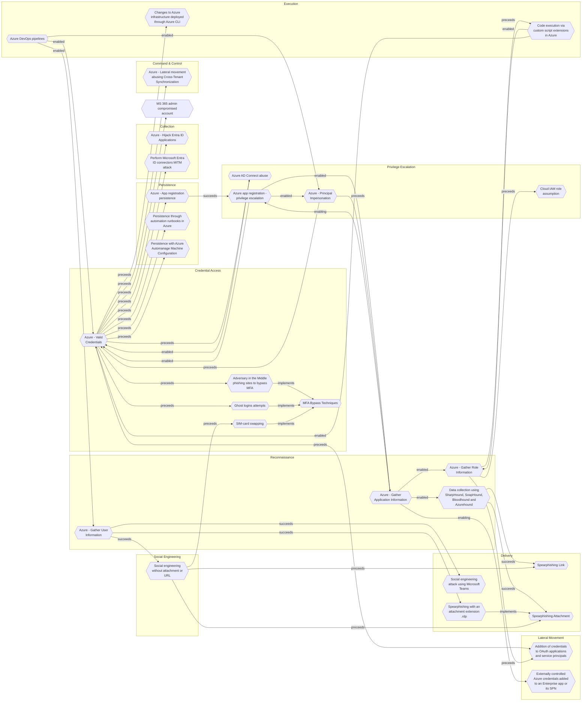

# Azure DevOps pipelines

## Metadata
| Field | Value |
| --- | --- |
| UUID | `490a5d5d-5880-45bd-a05d-176878e0ae24` |
| Schema | `threat::1.0` |
| Version | `3` |
| Created | `2025-06-19` |
| Modified | `2025-09-08` |
| TLP | clear (`TLP:CLEAR`) |
| Organisation | EC DIGIT CSOC (`56b0a0f0-b0bc-47d9-bb46-02f80ae2065a`) |

## References
### Public
- **1**: [https://learn.microsoft.com/en-us/azure/devops/pipelines/security/overview?view=azure-devops](https://learn.microsoft.com/en-us/azure/devops/pipelines/security/overview?view=azure-devops)
- **2**: [https://statusneo.com/best-practices-for-securing-azure-devops-pipelines/](https://statusneo.com/best-practices-for-securing-azure-devops-pipelines/)
- **3**: [https://learn.microsoft.com/bs-latn-ba/azure/devops/pipelines/security/overview?view=azure-devops&toc=%2Fazure%2Fdevops%2Forganizations%2Ftoc.json](https://learn.microsoft.com/bs-latn-ba/azure/devops/pipelines/security/overview?view=azure-devops&toc=%2Fazure%2Fdevops%2Forganizations%2Ftoc.json)

## Description
Azure DevOps pipelines are a critical component in modern software development but 
also present significant attack surfaces for threat actors. Key threats include 
supply chain compromises, insider attacks, privilege escalation vulnerabilities, 
and misconfigurations that can lead to unauthorized access, data breaches, and malicious 
code execution.

## Comprehensive Threat Vectors for Azure DevOps Pipelines

### Supply Chain Attacks
- **Malicious Extensions and Tasks:** Attackers may upload harmful extensions to 
the Azure DevOps Marketplace, which can execute arbitrary code if installed and 
run in pipelines.
- **Compromised Build Agents:** Outdated or unpatched build agents can be exploited 
to gain persistent access or execute malicious code within pipelines.
- **Dependency Poisoning:** Malicious code can be injected into package dependencies 
(e.g., NuGet, npm, Maven), which are then pulled and executed during pipeline builds.
- **Third-Party Tool Integrations:** Compromised integrations or plugins can introduce 
vulnerabilities into the pipeline execution environment.

### Insider Threats
- **Unauthorized Pipeline Modifications:** Users with access can alter pipeline 
YAML files or scripts to introduce malicious code, especially if branch protections 
are weak or absent.
- **Token Abuse:** Attackers can abuse pipeline job tokens (e.g., swapping short-term 
for persistent tokens via vulnerabilities like CVE-2025-29813) to escalate privileges 
or access sensitive resources.
- **Malicious Code Injection:** Insiders might inject malicious scripts or commands 
during pipeline runs, potentially bypassing code reviews if pull requests are not 
enforced.

### Credential and Secret Exposure
- **Hardcoded Secrets:** Storing API keys, passwords, or tokens directly in pipeline 
scripts or configuration files can lead to exposure if logs are not properly secured.
- **Leaked Logs:** Pipeline logs may inadvertently contain sensitive information 
if proper masking and filtering are not enforced.
- **Forked Repositories:** Secrets in pipelines can be exposed if pipelines run 
on forked repositories, especially if pull requests are not properly secured.
- **Insufficient Secret Rotation:** Failing to regularly rotate secrets increases 
the risk of exploitation if credentials are compromised.

### Network and Access Control Weaknesses
- **Unrestricted Network Access:** Lack of IP allowlisting or network security groups 
(NSGs) can allow attackers to access pipeline resources from untrusted locations.
- **Weak Authentication:** Using personal access tokens (PATs) instead of OAuth 
or managed identities can increase the risk of credential theft.
- **Insufficient Role-Based Access Control (RBAC):** Overprivileged users or service 
accounts can lead to unauthorized actions or data exfiltration.
- **Lack of Isolation:** Pipelines not isolated from each other or from sensitive 
resources can enable lateral movement within the environment.

## Criticality
**High** - A High priority incident is likely to result in a demonstrable impact to public health or safety, national security, economic security, foreign relations, civil liberties, or public confidence.

## Terrain
Adversaries may gain access by stealing user credentials, including personal access 
tokens (PATs) or Azure Active Directory (AAD) tokens, often through phishing or 
credential theft.

## Surface
> **Azure**
> Microsoft Azure cloud platform

> **Azure::Security::Entra ID**
> Microsoft Entra ID in Azure (cloud identity)

> **Microsoft::Microsoft 365**
> Microsoft 365 cloud-based productivity suite (formerly Office 365)

> **Windows**
> Microsoft Windows operating systems (all versions)

> **Linux**
> Linux-based operating systems (all distributions)

> **Container Runtime::Docker**
> Docker Engine container runtime

> **Orchestration::Kubernetes**
> Kubernetes container orchestration platform

> **Azure::Compute::Kubernetes Service**
> Azure Kubernetes Service (AKS)

> **AWS::Storage**
> AWS storage services

> **Azure::Security::Key Vault**
> Azure Key Vault secrets and key management

> **Windows::Desktop**
> Microsoft Windows desktop editions

> **Web Servers**
> HTTP servers and reverse proxies

> **Application Layer::HTTP**
> Hypertext Transfer Protocol

> **Development**
> Software development tools and platforms

> **Code Repositories**
> Source code hosting and version control platforms

> **Development::CI/CD**
> Continuous integration and continuous delivery platforms

> **Serverless**
> Cloud-agnostic serverless compute (when not provider-specific)

> **Azure::Compute::Virtual Machines**
> Azure Virtual Machines

> **AWS::Compute::EC2**
> Amazon Elastic Compute Cloud (virtual servers)

> **Database Management::PostgreSQL**
> PostgreSQL open-source relational database

> **Database Management::MongoDB**
> MongoDB NoSQL document database

> **SAML**
> Security Assertion Markup Language federation protocol

## Threat Assessment
| Dimension | Assessment | Description |
| --- | --- | --- |
| Severity | Significant incident | A cyber attack which has a serious impact on a large organisation or on wider / local government, or which poses a considerable risk to central government or (inter)national essential services. |
| Impact | Data Breach IP Loss Reputational Damages Identity Theft Monetary Loss Lose Capabilities Business disruption Operating costs Competitive disadvantage | Non-public information has been accessed from the outside, and successfully extracted. Particular, key data, information and blueprint conducive to the organization capability to gain and retain a commercial or geopolitical advantage has been accessed, and their content potentially used by competitors or other adversaries. Damages to the organization public view may be achieved by using directly the access gained, or indirectly with data gathered. Acquisition of sufficient information and privileges to profess as a given individual, for the purpose of abusing and deceiving human trust relationships. The vector will directly conduct to loss of value directly impacting the bottom line. Vector execution will remove key functions to the organization, which will not be easily circumvented. Most day-to-day is heavily impaired, but processes can reorganize at a loss. Business disruption Increased operating costs Loss of competitive advantage |
| Leverage | Spoofing Tampering Repudiation Infrastructure Compromise Information Disclosure Elevation of privilege New Accounts Modify configuration Modify privileges Modify data Software installation | Threat action aimed at accessing and use of another user’s credentials, such as username and password. Threat action intending to maliciously change or modify persistent data, such as records in a database, and the alteration of data in transit between two computers over an open network, such as the Internet. Threat action aimed at performing prohibited operations in a system that lacks the ability to trace the operations. The compromised target is likely to be used to further expand the sphere of influence of the attacker and allow more potent vectors to be executed. Threat action intending to read a file that one was not granted access to, or to read data in transit. Capacity to augment leverage over the target system by upgrading the compromised access rights Ability to create new arbitrary user accounts. Modify configuration or services Modify privileges or permissions Modify stored data or content Software installation or code modification |
| Viability | Likely | Probable (probably) - 55-80% |
| Kill Chain | Execution | Techniques that result in execution of attacker-controlled code on a local or remote system. |

## ATT&CK Techniques
| Technique | Name | Description |
| --- | --- | --- |
| `T1190` | [Exploit Public-Facing Application](https://attack.mitre.org/techniques/T1190) | Adversaries may attempt to exploit a weakness in an Internet-facing host or system to initially access a network. The weakness in the system can be a software bug, a temporary glitch, or a misconfiguration.  Exploited applications are often websites/web servers, but can also include databases (like SQL), standard services (like SMB or SSH), network device administration and management protocols (like SNMP and Smart Install), and any other system with Internet-accessible open sockets.(Citation: NVD CVE-2016-6662)(Citation: CIS Multiple SMB Vulnerabilities)(Citation: US-CERT TA18-106A Network Infrastructure Devices 2018)(Citation: Cisco Blog Legacy Device Attacks)(Citation: NVD CVE-2014-7169) On ESXi infrastructure, adversaries may exploit exposed OpenSLP services; they may alternatively exploit exposed VMware vCenter servers.(Citation: Recorded Future ESXiArgs Ransomware 2023)(Citation: Ars Technica VMWare Code Execution Vulnerability 2021) Depending on the flaw being exploited, this may also involve [Exploitation for Defense Evasion](https://attack.mitre.org/techniques/T1211) or [Exploitation for Client Execution](https://attack.mitre.org/techniques/T1203).  If an application is hosted on cloud-based infrastructure and/or is containerized, then exploiting it may lead to compromise of the underlying instance or container. This can allow an adversary a path to access the cloud or container APIs (e.g., via the [Cloud Instance Metadata API](https://attack.mitre.org/techniques/T1552/005)), exploit container host access via [Escape to Host](https://attack.mitre.org/techniques/T1611), or take advantage of weak identity and access management policies.  Adversaries may also exploit edge network infrastructure and related appliances, specifically targeting devices that do not support robust host-based defenses.(Citation: Mandiant Fortinet Zero Day)(Citation: Wired Russia Cyberwar)  For websites and databases, the OWASP top 10 and CWE top 25 highlight the most common web-based vulnerabilities.(Citation: OWASP Top 10)(Citation: CWE top 25) |
| `T1528` | [Steal Application Access Token](https://attack.mitre.org/techniques/T1528) | Adversaries can steal application access tokens as a means of acquiring credentials to access remote systems and resources.  Application access tokens are used to make authorized API requests on behalf of a user or service and are commonly used as a way to access resources in cloud and container-based applications and software-as-a-service (SaaS).(Citation: Auth0 - Why You Should Always Use Access Tokens to Secure APIs Sept 2019)  Adversaries who steal account API tokens in cloud and containerized environments may be able to access data and perform actions with the permissions of these accounts, which can lead to privilege escalation and further compromise of the environment.  For example, in Kubernetes environments, processes running inside a container may communicate with the Kubernetes API server using service account tokens. If a container is compromised, an adversary may be able to steal the container’s token and thereby gain access to Kubernetes API commands.(Citation: Kubernetes Service Accounts)    Similarly, instances within continuous-development / continuous-integration (CI/CD) pipelines will often use API tokens to authenticate to other services for testing and deployment.(Citation: Cider Security Top 10 CICD Security Risks) If these pipelines are compromised, adversaries may be able to steal these tokens and leverage their privileges.   In Azure, an adversary who compromises a resource with an attached Managed Identity, such as an Azure VM, can request short-lived tokens through the Azure Instance Metadata Service (IMDS). These tokens can then facilitate unauthorized actions or further access to other Azure services, bypassing typical credential-based authentication.(Citation: Entra Managed Identities 2025)(Citation: SpecterOps Managed Identity 2022)  Token theft can also occur through social engineering, in which case user action may be required to grant access. OAuth is one commonly implemented framework that issues tokens to users for access to systems. An application desiring access to cloud-based services or protected APIs can gain entry using OAuth 2.0 through a variety of authorization protocols. An example commonly-used sequence is Microsoft's Authorization Code Grant flow.(Citation: Microsoft Identity Platform Protocols May 2019)(Citation: Microsoft - OAuth Code Authorization flow - June 2019) An OAuth access token enables a third-party application to interact with resources containing user data in the ways requested by the application without obtaining user credentials.    Adversaries can leverage OAuth authorization by constructing a malicious application designed to be granted access to resources with the target user's OAuth token.(Citation: Amnesty OAuth Phishing Attacks, August 2019)(Citation: Trend Micro Pawn Storm OAuth 2017) The adversary will need to complete registration of their application with the authorization server, for example Microsoft Identity Platform using Azure Portal, the Visual Studio IDE, the command-line interface, PowerShell, or REST API calls.(Citation: Microsoft - Azure AD App Registration - May 2019) Then, they can send a [Spearphishing Link](https://attack.mitre.org/techniques/T1566/002) to the target user to entice them to grant access to the application. Once the OAuth access token is granted, the application can gain potentially long-term access to features of the user account through [Application Access Token](https://attack.mitre.org/techniques/T1550/001).(Citation: Microsoft - Azure AD Identity Tokens - Aug 2019)  Application access tokens may function within a limited lifetime, limiting how long an adversary can utilize the stolen token. However, in some cases, adversaries can also steal application refresh tokens(Citation: Auth0 Understanding Refresh Tokens), allowing them to obtain new access tokens without prompting the user. |
| `T1078` | [Valid Accounts](https://attack.mitre.org/techniques/T1078) | Adversaries may obtain and abuse credentials of existing accounts as a means of gaining Initial Access, Persistence, Privilege Escalation, or Defense Evasion. Compromised credentials may be used to bypass access controls placed on various resources on systems within the network and may even be used for persistent access to remote systems and externally available services, such as VPNs, Outlook Web Access, network devices, and remote desktop.(Citation: volexity_0day_sophos_FW) Compromised credentials may also grant an adversary increased privilege to specific systems or access to restricted areas of the network. Adversaries may choose not to use malware or tools in conjunction with the legitimate access those credentials provide to make it harder to detect their presence.  In some cases, adversaries may abuse inactive accounts: for example, those belonging to individuals who are no longer part of an organization. Using these accounts may allow the adversary to evade detection, as the original account user will not be present to identify any anomalous activity taking place on their account.(Citation: CISA MFA PrintNightmare)  The overlap of permissions for local, domain, and cloud accounts across a network of systems is of concern because the adversary may be able to pivot across accounts and systems to reach a high level of access (i.e., domain or enterprise administrator) to bypass access controls set within the enterprise.(Citation: TechNet Credential Theft) |
| `T1195.001` | [Supply Chain Compromise: Compromise Software Dependencies and Development Tools](https://attack.mitre.org/techniques/T1195/001) | Adversaries may manipulate software dependencies and development tools prior to receipt by a final consumer for the purpose of data or system compromise. Applications often depend on external software to function properly. Popular open source projects that are used as dependencies in many applications may be targeted as a means to add malicious code to users of the dependency.(Citation: Trendmicro NPM Compromise)    Targeting may be specific to a desired victim set or may be distributed to a broad set of consumers but only move on to additional tactics on specific victims. |

## Chaining

### Chaining details
#### enabled -> [Azure - Valid Credentials](azure-valid-credentials.md) (`2743bf18-3b86-4721-bf3e-153dcda0b149`) (`support::enabled`)
Adversaries obtain the username and password of an AzureAD user either through phishing, 
password spraying, brute-force attacks, or credentials leaked online.

- **Target UUID**: `2743bf18-3b86-4721-bf3e-153dcda0b149`
#### enabled -> [Azure - Gather User Information](azure-gather-user-information.md) (`2900d389-3098-49d3-8166-5b2612d03576`) (`support::enabled`)
Adversaries use publicly accessible endpoints, misconfigured applications, or phishing 
emails to harvest user names, email addresses, job titles, and group memberships.

- **Target UUID**: `2900d389-3098-49d3-8166-5b2612d03576`
#### enabled -> [Azure - Principal Impersonation](azure-principal-impersonation.md) (`bb2501d5-99c7-44a6-ac5a-9510102d6611`) (`support::enabled`)
Adversaries gains access via phishing, credential stuffing, or exploiting misconfigurations 
allowing access to an account with application management permissions or to a pipeline 
that exposes service principal credentials.

- **Target UUID**: `bb2501d5-99c7-44a6-ac5a-9510102d6611`
