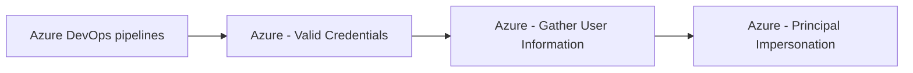

# Azure DevOps pipelines

## Metadata

- **UUID**: `490a5d5d-5880-45bd-a05d-176878e0ae24`
- **Schema**: `threat::1.0`
- **TLP**: clear

## Description
Azure DevOps pipelines are a critical component in modern software development but 
also present significant attack surfaces for threat actors. Key threats include 
supply chain compromises, insider attacks, privilege escalation vulnerabilities, 
and misconfigurations that can lead to unauthorized access, data breaches, and malicious 
code execution.

## Comprehensive Threat Vectors for Azure DevOps Pipelines

### Supply Chain Attacks
- **Malicious Extensions and Tasks:** Attackers may upload harmful extensions to 
the Azure DevOps Marketplace, which can execute arbitrary code if installed and 
run in pipelines.
- **Compromised Build Agents:** Outdated or unpatched build agents can be exploited 
to gain persistent access or execute malicious code within pipelines.
- **Dependency Poisoning:** Malicious code can be injected into package dependencies 
(e.g., NuGet, npm, Maven), which are then pulled and executed during pipeline builds.
- **Third-Party Tool Integrations:** Compromised integrations or plugins can introduce 
vulnerabilities into the pipeline execution environment.

### Insider Threats
- **Unauthorized Pipeline Modifications:** Users with access can alter pipeline 
YAML files or scripts to introduce malicious code, especially if branch protections 
are weak or absent.
- **Token Abuse:** Attackers can abuse pipeline job tokens (e.g., swapping short-term 
for persistent tokens via vulnerabilities like CVE-2025-29813) to escalate privileges 
or access sensitive resources.
- **Malicious Code Injection:** Insiders might inject malicious scripts or commands 
during pipeline runs, potentially bypassing code reviews if pull requests are not 
enforced.

### Credential and Secret Exposure
- **Hardcoded Secrets:** Storing API keys, passwords, or tokens directly in pipeline 
scripts or configuration files can lead to exposure if logs are not properly secured.
- **Leaked Logs:** Pipeline logs may inadvertently contain sensitive information 
if proper masking and filtering are not enforced.
- **Forked Repositories:** Secrets in pipelines can be exposed if pipelines run 
on forked repositories, especially if pull requests are not properly secured.
- **Insufficient Secret Rotation:** Failing to regularly rotate secrets increases 
the risk of exploitation if credentials are compromised.

### Network and Access Control Weaknesses
- **Unrestricted Network Access:** Lack of IP allowlisting or network security groups 
(NSGs) can allow attackers to access pipeline resources from untrusted locations.
- **Weak Authentication:** Using personal access tokens (PATs) instead of OAuth 
or managed identities can increase the risk of credential theft.
- **Insufficient Role-Based Access Control (RBAC):** Overprivileged users or service 
accounts can lead to unauthorized actions or data exfiltration.
- **Lack of Isolation:** Pipelines not isolated from each other or from sensitive 
resources can enable lateral movement within the environment.

## Techniques
- T1190
- T1528
- T1078
- T1195.001

## Chaining

