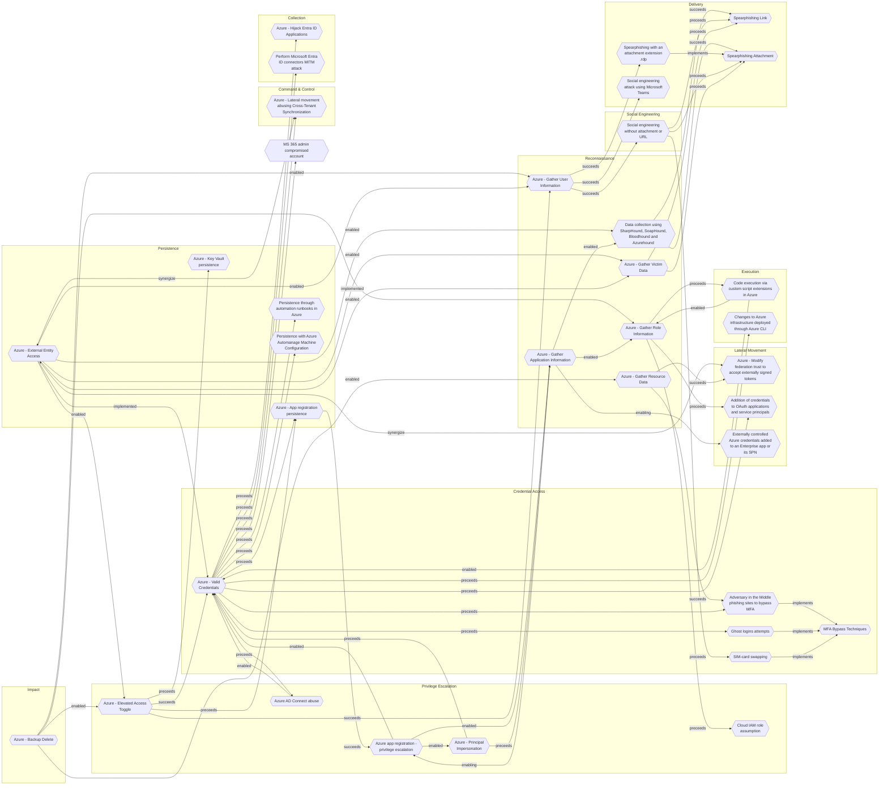

# Azure - Elevated Access Toggle

## Metadata
| Field | Value |
| --- | --- |
| UUID | `10a89280-d42e-446d-9f8d-840b1218f532` |
| Schema | `threat::1.0` |
| Version | `2` |
| Created | `2025-08-28` |
| Modified | `2025-09-04` |
| TLP | clear (`TLP:CLEAR`) |
| Organisation | EC DIGIT CSOC (`56b0a0f0-b0bc-47d9-bb46-02f80ae2065a`) |

## References
### Public
- **1**: [https://permiso.io/blog/azures-apex-permissions-elevate-access-the-logs-security-teams-overlook](https://permiso.io/blog/azures-apex-permissions-elevate-access-the-logs-security-teams-overlook)
- **2**: [https://microsoft.github.io/Azure-Threat-Research-Matrix/PrivilegeEscalation/AZT402/AZT402/](https://microsoft.github.io/Azure-Threat-Research-Matrix/PrivilegeEscalation/AZT402/AZT402/)

## Description
## Example Attack Scenario

Once inside, the attacker enables the **"Access management for Azure resources"** 
toggle in Entra ID properties. This action assigns the attacker the *User Access 
Administrator* role at the **root scope**, granting them permission to manage RBAC 
(Role-Based Access Control) assignments for every subscription and management group 
in the tenant. The attacker uses these elevated rights to create a new user and 
assigns it the *Owner* role at root, establishing durable persistence and full-control 
access throughout Azure resources.

## Attack Goals and Impact

The primary goal for adversaries is to escalate their privileges from Azure AD into 
all Azure subscriptions within the tenant. Impact includes:
- **Total control:** Complete administration of every Azure resource, service, management 
group, and subscription—akin to “God-mode” access.
- **Persistence:** Ability to create backdoor accounts or roles that will survive 
remediation attempts if defenders only remove the initially compromised account.
- **Disruption or exfiltration:** Attackers can shut down services, delete resources, 
steal sensitive data, or create new destructive attack paths.

## Attack Flow and Methodology

1. **Elevated Access Activation**
  - In the Entra ID portal, the adversary enables “Access management for Azure resources.” 
  This assigns the User Access Administrator role to their account at the Azure 
  *root scope* (`/`), above all subscriptions and management groups.
2. **Privilege Escalation and Persistence**
  - With root scope RBAC control, the attacker can grant themselves (or secondary 
  shadow accounts) *Owner* or similarly privileged roles across any and all Azure resources.
3. **Attack Expansion**
  - The attacker now has unrestricted access to create, modify, or delete resources 
  (VMs, networks, storage, etc.), read sensitive data, and assign permissions to 
  malicious applications for further exploitation.
  - May use automation (PowerShell, Azure CLI) for rapid propagation.
4. **Detection Evasion**
  - The activity of toggling Elevated Access is logged in the Directory Activity 
  log (AuditLogs), but is not always integrated with standard subscription or management 
  group logs, making it harder to detect through routine monitoring.

## Criticality
**High** - A High priority incident is likely to result in a demonstrable impact to public health or safety, national security, economic security, foreign relations, civil liberties, or public confidence.

## Terrain
Adversaries successfully compromise a Global Administrator account in
Entra ID (Azure AD), either via phishing, credential theft, or session hijacking.

## Surface
> **Azure**
> Microsoft Azure cloud platform

> **Azure::Security::Entra ID**
> Microsoft Entra ID in Azure (cloud identity)

> **AWS::Storage**
> AWS storage services

> **Azure::Compute::Virtual Machines**
> Azure Virtual Machines

## Threat Assessment
| Dimension | Assessment | Description |
| --- | --- | --- |
| Severity | Significant incident | A cyber attack which has a serious impact on a large organisation or on wider / local government, or which poses a considerable risk to central government or (inter)national essential services. |
| Impact | Data Breach IP Loss | Non-public information has been accessed from the outside, and successfully extracted. Particular, key data, information and blueprint conducive to the organization capability to gain and retain a commercial or geopolitical advantage has been accessed, and their content potentially used by competitors or other adversaries. |
| Leverage | Elevation of privilege Infrastructure Compromise Information Disclosure Modify configuration | Capacity to augment leverage over the target system by upgrading the compromised access rights The compromised target is likely to be used to further expand the sphere of influence of the attacker and allow more potent vectors to be executed. Threat action intending to read a file that one was not granted access to, or to read data in transit. Modify configuration or services |
| Viability | Likely | Probable (probably) - 55-80% |
| Kill Chain | Privilege Escalation | The result of techniques that provide an attacker with higher permissions on a system or network. |

## Actors
| Actor | ID | Source | Description |
| --- | --- | --- | --- |
| Scattered Spider | `misp::3b238f3a-c67a-4a9e-b474-dc3897e00129` | ('misp',) | Scattered Spider, a highly active hacking group, has made headlines by targeting more than 130 organizations, with the number of victims steadily increasing. |
| LAPSUS | `misp::d9e5be22-1a04-4956-af6c-37af02330980` | ('misp',) | An actor group conducting large-scale social engineering and extortion campaign against multiple organizations with some seeing evidence of destructive elements. |
| APT29 | `misp::b2056ff0-00b9-482e-b11c-c771daa5f28a` | ('misp',) | A 2015 report by F-Secure describe APT29 as: 'The Dukes are a well-resourced, highly dedicated and organized cyberespionage group that we believe has been working for the Russian Federation since at least 2008 to collect intelligence in support of foreign and security policy decision-making. The Dukes show unusual confidence in their ability to continue successfully compromising their targets, as well as in their ability to operate with impunity. The Dukes primarily target Western governments and related organizations, such as government ministries and agencies, political think tanks, and governmental subcontractors. Their targets have also included the governments of members of the Commonwealth of Independent States;Asian, African, and Middle Eastern governments;organizations associated with Chechen extremism;and Russian speakers engaged in the illicit trade of controlled substances and drugs. The Dukes are known to employ a vast arsenal of malware toolsets, which we identify as MiniDuke, CosmicDuke, OnionDuke, CozyDuke, CloudDuke, SeaDuke, HammerDuke, PinchDuke, and GeminiDuke. In recent years, the Dukes have engaged in apparently biannual large - scale spear - phishing campaigns against hundreds or even thousands of recipients associated with governmental institutions and affiliated organizations. These campaigns utilize a smash - and - grab approach involving a fast but noisy breakin followed by the rapid collection and exfiltration of as much data as possible.If the compromised target is discovered to be of value, the Dukes will quickly switch the toolset used and move to using stealthier tactics focused on persistent compromise and long - term intelligence gathering. This threat actor targets government ministries and agencies in the West, Central Asia, East Africa, and the Middle East; Chechen extremist groups; Russian organized crime; and think tanks. It is suspected to be behind the 2015 compromise of unclassified networks at the White House, Department of State, Pentagon, and the Joint Chiefs of Staff. The threat actor includes all of the Dukes tool sets, including MiniDuke, CosmicDuke, OnionDuke, CozyDuke, SeaDuke, CloudDuke (aka MiniDionis), and HammerDuke (aka Hammertoss). ' |

## ATT&CK Techniques
| Technique | Name | Description |
| --- | --- | --- |
| `T1078.004` | [Valid Accounts: Cloud Accounts](https://attack.mitre.org/techniques/T1078/004) | Valid accounts in cloud environments may allow adversaries to perform actions to achieve Initial Access, Persistence, Privilege Escalation, or Defense Evasion. Cloud accounts are those created and configured by an organization for use by users, remote support, services, or for administration of resources within a cloud service provider or SaaS application. Cloud Accounts can exist solely in the cloud; alternatively, they may be hybrid-joined between on-premises systems and the cloud through syncing or federation with other identity sources such as Windows Active Directory.(Citation: AWS Identity Federation)(Citation: Google Federating GC)(Citation: Microsoft Deploying AD Federation)  Service or user accounts may be targeted by adversaries through [Brute Force](https://attack.mitre.org/techniques/T1110), [Phishing](https://attack.mitre.org/techniques/T1566), or various other means to gain access to the environment. Federated or synced accounts may be a pathway for the adversary to affect both on-premises systems and cloud environments - for example, by leveraging shared credentials to log onto [Remote Services](https://attack.mitre.org/techniques/T1021). High privileged cloud accounts, whether federated, synced, or cloud-only, may also allow pivoting to on-premises environments by leveraging SaaS-based [Software Deployment Tools](https://attack.mitre.org/techniques/T1072) to run commands on hybrid-joined devices.  An adversary may create long lasting [Additional Cloud Credentials](https://attack.mitre.org/techniques/T1098/001) on a compromised cloud account to maintain persistence in the environment. Such credentials may also be used to bypass security controls such as multi-factor authentication.   Cloud accounts may also be able to assume [Temporary Elevated Cloud Access](https://attack.mitre.org/techniques/T1548/005) or other privileges through various means within the environment. Misconfigurations in role assignments or role assumption policies may allow an adversary to use these mechanisms to leverage permissions outside the intended scope of the account. Such over privileged accounts may be used to harvest sensitive data from online storage accounts and databases through [Cloud API](https://attack.mitre.org/techniques/T1059/009) or other methods. For example, in Azure environments, adversaries may target Azure Managed Identities, which allow associated Azure resources to request access tokens. By compromising a resource with an attached Managed Identity, such as an Azure VM, adversaries may be able to [Steal Application Access Token](https://attack.mitre.org/techniques/T1528)s to move laterally across the cloud environment.(Citation: SpecterOps Managed Identity 2022) |
| `T1098.003` | [Account Manipulation: Additional Cloud Roles](https://attack.mitre.org/techniques/T1098/003) | An adversary may add additional roles or permissions to an adversary-controlled cloud account to maintain persistent access to a tenant. For example, adversaries may update IAM policies in cloud-based environments or add a new global administrator in Office 365 environments.(Citation: AWS IAM Policies and Permissions)(Citation: Google Cloud IAM Policies)(Citation: Microsoft Support O365 Add Another Admin, October 2019)(Citation: Microsoft O365 Admin Roles) With sufficient permissions, a compromised account can gain almost unlimited access to data and settings (including the ability to reset the passwords of other admins).(Citation: Expel AWS Attacker) (Citation: Microsoft O365 Admin Roles)   This account modification may immediately follow [Create Account](https://attack.mitre.org/techniques/T1136) or other malicious account activity. Adversaries may also modify existing [Valid Accounts](https://attack.mitre.org/techniques/T1078) that they have compromised. This could lead to privilege escalation, particularly if the roles added allow for lateral movement to additional accounts.  For example, in AWS environments, an adversary with appropriate permissions may be able to use the <code>CreatePolicyVersion</code> API to define a new version of an IAM policy or the <code>AttachUserPolicy</code> API to attach an IAM policy with additional or distinct permissions to a compromised user account.(Citation: Rhino Security Labs AWS Privilege Escalation)  In some cases, adversaries may add roles to adversary-controlled accounts outside the victim cloud tenant. This allows these external accounts to perform actions inside the victim tenant without requiring the adversary to [Create Account](https://attack.mitre.org/techniques/T1136) or modify a victim-owned account.(Citation: Invictus IR DangerDev 2024) |
| `T1548.005` | [Abuse Elevation Control Mechanism: Temporary Elevated Cloud Access](https://attack.mitre.org/techniques/T1548/005) | Adversaries may abuse permission configurations that allow them to gain temporarily elevated access to cloud resources. Many cloud environments allow administrators to grant user or service accounts permission to request just-in-time access to roles, impersonate other accounts, pass roles onto resources and services, or otherwise gain short-term access to a set of privileges that may be distinct from their own.   Just-in-time access is a mechanism for granting additional roles to cloud accounts in a granular, temporary manner. This allows accounts to operate with only the permissions they need on a daily basis, and to request additional permissions as necessary. Sometimes just-in-time access requests are configured to require manual approval, while other times the desired permissions are automatically granted.(Citation: Azure Just in Time Access 2023)  Account impersonation allows user or service accounts to temporarily act with the permissions of another account. For example, in GCP users with the `iam.serviceAccountTokenCreator` role can create temporary access tokens or sign arbitrary payloads with the permissions of a service account, while service accounts with domain-wide delegation permission are permitted to impersonate Google Workspace accounts.(Citation: Google Cloud Service Account Authentication Roles)(Citation: Hunters Domain Wide Delegation Google Workspace 2023)(Citation: Google Cloud Just in Time Access 2023)(Citation: Palo Alto Unit 42 Google Workspace Domain Wide Delegation 2023) In Exchange Online, the `ApplicationImpersonation` role allows a service account to use the permissions associated with specified user accounts.(Citation: Microsoft Impersonation and EWS in Exchange)   Many cloud environments also include mechanisms for users to pass roles to resources that allow them to perform tasks and authenticate to other services. While the user that creates the resource does not directly assume the role they pass to it, they may still be able to take advantage of the role's access -- for example, by configuring the resource to perform certain actions with the permissions it has been granted. In AWS, users with the `PassRole` permission can allow a service they create to assume a given role, while in GCP, users with the `iam.serviceAccountUser` role can attach a service account to a resource.(Citation: AWS PassRole)(Citation: Google Cloud Service Account Authentication Roles)  While users require specific role assignments in order to use any of these features, cloud administrators may misconfigure permissions. This could result in escalation paths that allow adversaries to gain access to resources beyond what was originally intended.(Citation: Rhino Google Cloud Privilege Escalation)(Citation: Rhino Security Labs AWS Privilege Escalation)  **Note:** this technique is distinct from [Additional Cloud Roles](https://attack.mitre.org/techniques/T1098/003), which involves assigning permanent roles to accounts rather than abusing existing permissions structures to gain temporarily elevated access to resources. However, adversaries that compromise a sufficiently privileged account may grant another account they control [Additional Cloud Roles](https://attack.mitre.org/techniques/T1098/003) that would allow them to also abuse these features. This may also allow for greater stealth than would be had by directly using the highly privileged account, especially when logs do not clarify when role impersonation is taking place.(Citation: CrowdStrike StellarParticle January 2022) |

## Chaining

### Chaining details
#### succeeds -> [Azure - Gather User Information](azure-gather-user-information.md) (`2900d389-3098-49d3-8166-5b2612d03576`) (`sequence::succeeds`)
Adversaries use publicly accessible endpoints, misconfigured applications, or phishing 
emails to harvest user names, email addresses, job titles, and group memberships.

- **Target UUID**: `2900d389-3098-49d3-8166-5b2612d03576`
#### succeeds -> [Azure - Valid Credentials](azure-valid-credentials.md) (`2743bf18-3b86-4721-bf3e-153dcda0b149`) (`sequence::succeeds`)
Adversaries obtain the username and password of an AzureAD user either through phishing, 
password spraying, brute-force attacks, or credentials leaked online.

- **Target UUID**: `2743bf18-3b86-4721-bf3e-153dcda0b149`
#### preceeds -> [Azure - App registration persistence](azure-app-registration-persistence.md) (`5d43ef75-4637-4a75-b1ed-6716052cff0e`) (`sequence::preceeds`)
Adversaries need to compromise user or administrator credentials that have permissions 
to register or modify applications within Microsoft Entra ID.

- **Target UUID**: `5d43ef75-4637-4a75-b1ed-6716052cff0e`
#### preceeds -> [Azure - Key Vault persistence](azure-key-vault-persistence.md) (`bcf3bb96-ed97-4853-98ab-937c2d214f4e`) (`sequence::preceeds`)
Adversaries must first gain access to an Azure environment, typically through 
compromised user accounts, service principals, or managed identities.

- **Target UUID**: `bcf3bb96-ed97-4853-98ab-937c2d214f4e`
