# Azure - Elevated Access Toggle

## Metadata

- **UUID**: `10a89280-d42e-446d-9f8d-840b1218f532`
- **Schema**: `threat::1.0`
- **TLP**: clear

## Description
## Example Attack Scenario

Once inside, the attacker enables the **"Access management for Azure resources"** 
toggle in Entra ID properties. This action assigns the attacker the *User Access 
Administrator* role at the **root scope**, granting them permission to manage RBAC 
(Role-Based Access Control) assignments for every subscription and management group 
in the tenant. The attacker uses these elevated rights to create a new user and 
assigns it the *Owner* role at root, establishing durable persistence and full-control 
access throughout Azure resources.

## Attack Goals and Impact

The primary goal for adversaries is to escalate their privileges from Azure AD into 
all Azure subscriptions within the tenant. Impact includes:
- **Total control:** Complete administration of every Azure resource, service, management 
group, and subscription—akin to “God-mode” access.
- **Persistence:** Ability to create backdoor accounts or roles that will survive 
remediation attempts if defenders only remove the initially compromised account.
- **Disruption or exfiltration:** Attackers can shut down services, delete resources, 
steal sensitive data, or create new destructive attack paths.

## Attack Flow and Methodology

1. **Elevated Access Activation**
  - In the Entra ID portal, the adversary enables “Access management for Azure resources.” 
  This assigns the User Access Administrator role to their account at the Azure 
  *root scope* (`/`), above all subscriptions and management groups.
2. **Privilege Escalation and Persistence**
  - With root scope RBAC control, the attacker can grant themselves (or secondary 
  shadow accounts) *Owner* or similarly privileged roles across any and all Azure resources.
3. **Attack Expansion**
  - The attacker now has unrestricted access to create, modify, or delete resources 
  (VMs, networks, storage, etc.), read sensitive data, and assign permissions to 
  malicious applications for further exploitation.
  - May use automation (PowerShell, Azure CLI) for rapid propagation.
4. **Detection Evasion**
  - The activity of toggling Elevated Access is logged in the Directory Activity 
  log (AuditLogs), but is not always integrated with standard subscription or management 
  group logs, making it harder to detect through routine monitoring.

## Techniques
- T1078.004
- T1098.003
- T1548.005

## Chaining

```mermaid
flowchart LR
10a89280_d42e_446d_9f8d_840b1218f532["Azure - Elevated Access Toggle"]
2900d389_3098_49d3_8166_5b2612d03576["Azure - Gather User Information"]
2743bf18_3b86_4721_bf3e_153dcda0b149["Azure - Valid Credentials"]
5d43ef75_4637_4a75_b1ed_6716052cff0e["Azure - App registration persistence"]
bcf3bb96_ed97_4853_98ab_937c2d214f4e["Azure - Key Vault persistence"]
10a89280_d42e_446d_9f8d_840b1218f532 --> 2900d389_3098_49d3_8166_5b2612d03576
2900d389_3098_49d3_8166_5b2612d03576 --> 2743bf18_3b86_4721_bf3e_153dcda0b149
2743bf18_3b86_4721_bf3e_153dcda0b149 --> 5d43ef75_4637_4a75_b1ed_6716052cff0e
5d43ef75_4637_4a75_b1ed_6716052cff0e --> bcf3bb96_ed97_4853_98ab_937c2d214f4e
```

