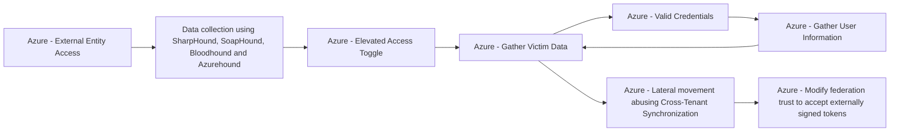

# Azure - External Entity Access

## Metadata

- **UUID**: `31e7f292-8370-4255-861d-edd68ed8b7b0`
- **Schema**: `threat::1.0`
- **TLP**: clear

## Description
The following threat vector refers to a set of persistence techniques where an adversary 
configures a target Azure tenant to be managed or accessed by external entities, 
such as another tenant, external users, or identity providers. This section provides 
in-depth coverage of this threat vector according to the Azure Threat Research Matrix, 
addressing scenario, goals, impact, and methodology.

### Example Attack Scenario

An attacker gains Global Administrator privileges in a compromised tenant and uses Azure 
Lighthouse to register an external, attacker-controlled tenant as a delegated administrator. 
This allows the attacker to manage resources and maintain persistence even if their 
initial account is detected and removed. Alternatively, the attacker might use Microsoft 
Partner Delegated Administrative Privileges, transfer a subscription (“subscription hijack”), 
or add a new federated domain or identity provider, creating hidden backdoors for 
future access.

- For example, after compromising credentials, an attacker uses Microsoft Graph 
API to modify tenant settings and register their own tenant as a manager via Azure Lighthouse.
- The administrator in the compromised tenant is unaware as delegated permissions 
silently persist, giving the attacker full control over resources and users.
- Even after password resets or removal of individual malicious accounts, the external 
entity persists via configuration and cannot be easily detected without deep audit 
review of resource assignments and domain trusts.

### Attack Goals and Impact

The main goal is to establish persistence inside the target Azure environment through 
external entity control.

- Maintain long-term, resilient access to cloud resources, regardless of changes 
in local credentials or account clean-ups.
- Allow management of resources remotely from attacker-controlled tenants.
- Facilitate lateral movement, data exfiltration, or further privilege escalation 
by leveraging cross-tenant capabilities and hidden delegated privileges.

The impact may include:

- Full compromise of cloud assets and data.
- Unnoticed attacker presence persisting through routine security hygiene (such as credential revocation).
- Increased difficulty for defenders to detect or remove persistent access mechanisms.

### Attack Flow and Methodology

The typical attack flow involves several steps:

1. Privilege abuse: The attacker uses available tools (including Microsoft Graph 
API, PowerShell modules, or Azure Portal) to grant management rights or delegated 
access to an external entity (such as Azure Lighthouse, Microsoft Partner delegation, 
or domain trust modification).
2. Configuration: The attacker registers their external tenant, sets up delegated 
access, or modifies domain trust/federation settings to establish a persistent link.
3. Stealthy persistence: Even if initial access accounts/credentials are remediated, 
the external entity retains management capabilities—allowing the attacker to create 
new accounts, manage resources, or harvest sensitive data.
4. Maintenance: The attacker periodically refreshes delegated permissions, adds 
new external users/entities, or modifies trust relationships as needed to maintain 
access and evade detection.

## Techniques
- T1133
- T1484.002
- T1078.004

## Chaining

